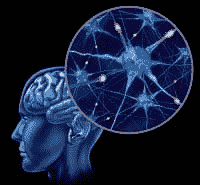
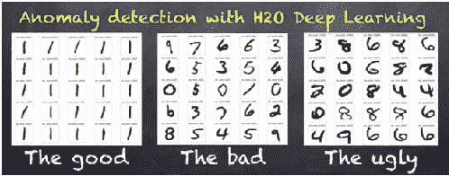
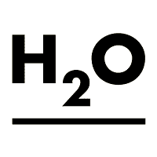
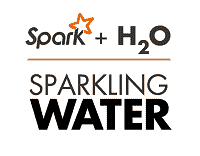
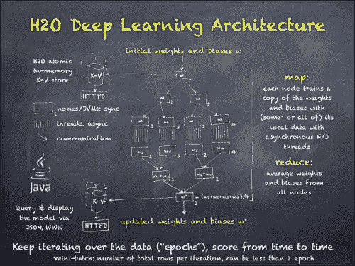

# 采访：阿尔诺·坎德，H2O.ai 谈深度学习基础

> 原文：[`www.kdnuggets.com/2015/01/interview-arno-candel-0xdata-deep-learning.html`](https://www.kdnuggets.com/2015/01/interview-arno-candel-0xdata-deep-learning.html)

是[**H2O.ai**](http://h2o.ai/)的物理学家和黑客。在此之前，他是 Skytree 的创始高级 MTS，负责设计和实施高性能机器学习算法。他拥有十多年高性能计算的经验，并曾作为 SLAC 国家加速器实验室的工作人员科学家，访问世界上最大的超级计算机，参与了美国能源部的科学计算计划，并与 CERN 合作。阿尔诺撰写了几十篇科学论文，是备受追捧的会议演讲者。

他在苏黎世联邦理工学院获得了物理学博士和硕士学位，并以优异成绩毕业。阿尔诺被《财富》杂志评选为[2014 年大数据全明星](http://fortune.com/2014/08/03/meet-fortunes-2014-big-data-all-stars/)。

这是我与他的采访：

**[安莫尔·拉吉普罗希特](http://www.linkedin.com/inviteFromProfile?from=profile&key=60636115&firstName=Anmol&lastName=Rajpurohit)**: Q1. 你如何定义深度学习？它与其他机器学习技术有何不同？

[**阿尔诺·坎德博士**](https://www.linkedin.com/in/candel): 深度学习方法使用多个非线性变换的组合来建模数据中的高级抽象。[多层前馈](https://en.wikipedia.org/wiki/Feedforward_neural_network) [人工神经网络](https://en.wikipedia.org/wiki/Feedforward_neural_network) 是一些最古老且最有用的技术。我们现在正在享受深度学习[60 年的发展成果](http://arxiv.org/abs/1404.7828)，这一过程始于 1950 年代末，当时首次提出了[*机器学习*](https://en.wikipedia.org/wiki/Machine_learning)这个术语。深度学习在过去十年的成功很大程度上归因于摩尔定律和计算机的指数加速，但也有许多算法突破使得深度学习者的训练更加稳健。

与诸如基于树的方法等更易解释的机器学习技术相比，传统的深度学习（使用[随机梯度下降](https://en.wikipedia.org/wiki/Stochastic_gradient_descent)和[反向传播](https://en.wikipedia.org/wiki/Backpropagation)）是一种相当“蛮力”的方法，它通过不断查看训练数据中的示例，从随机噪声开始优化大量的系数（这是一种*参数化*方法）。它遵循“（好的）实践使完美”的基本理念（类似于真实的大脑），但对模型质量没有强有力的保证。

> 现代典型的深度学习模型有数千个神经元，并学习数百万个自由参数（神经元之间的连接），但在神经元数量上（~100,000）甚至尚未能与果蝇的大脑相媲美。最先进的专用深度学习系统正在学习数十亿个参数，这仍然比人脑中的神经连接数量少约 10,000 倍。

然而，即使一些显著较小的深度学习模型已经在许多任务上超越了人类，因此人工智能的领域无疑变得更加有趣。

**AR: Q2\. 什么特征使得深度学习能够在标准机器学习问题上提供如此优越的结果？是否有特定的问题子集，其中深度学习比其他选项更有效？**

**AC:** 深度学习在[从原始输入特征中学习非线性派生特征](http://www.slideshare.net/0xdata/mlconfsfh2odeeplearningarnocandel111414/21)方面非常有效，这与线性或基于树的方法等标准机器学习方法不同。例如，如果年龄和收入是预测支出的两个特征，那么线性模型将极大受益于[手动分割](https://www.kaggle.com/c/avazu-ctr-prediction/forums/t/10821/beat-the-benchmark-with-h2o-lb-0-4033703)年龄和收入范围为不同的组；而基于树的方法则会自动学习如何划分二维空间。

深度学习模型建立了（隐藏的）非线性特征的层次结构，这些特征组合起来可以以比其他方法少得多的努力来逼近任意函数，如 sqrt((*age-40)*²+0.3*log(*income+1)*-4)。传统上，数据科学家根据领域知识和经验[明确地执行这些转换](http://learn.h2o.ai/content/hands-on_training/tools.html)，但[深度学习已被证明](https://www.youtube.com/watch?v=1FWmd7LKUbk&index=33) [在](https://www.youtube.com/watch?v=1FWmd7LKUbk&index=33) [这些转换](https://www.youtube.com/watch?v=1FWmd7LKUbk&index=33) 上[极其](https://www.youtube.com/watch?v=1FWmd7LKUbk&index=33) [有效](https://www.youtube.com/watch?v=1FWmd7LKUbk&index=33)，通常比标准机器学习模型表现出更大的优势。

深度学习在[预测高基数类别成员](http://www.slideshare.net/0xdata/mlconfsfh2odeeplearningarnocandel111414/17)方面也表现出色，例如图像或语音识别问题，或预测推荐给用户的最佳项目。深度学习的另一个优势是它还可以用于无监督学习，其中它*仅仅*学习数据的内在结构而不做预测（还记得[Google 猫](https://static.googleusercontent.com/media/research.google.com/en/us/archive/unsupervised_icml2012.pdf)吗？）。这在没有训练标签的情况下，或用于各种其他用例，如[异常检测](http://learn.h2o.ai/content/hands-on_training/anomaly_detection.html)时很有用。

**AR: Q3\. H2O 架构的关键组件是什么？使用 H2O 进行深度学习有什么独特优势？**

**AC:** H2O 的独特之处在于它是[GitHub 上排名第一的基于 Java 的开源机器学习项目](https://github.com/search?l=Java&o=desc&q=machine+learning&ref=searchresults&s=stars&type=Repositories)（我们正在进行一个更[开发者友好的重写](https://github.com/h2oai/h2o-dev)的最后阶段）。它建立在一个分布式键值存储之上，该存储基于全球最快的非阻塞哈希表，由我们的首席技术官兼联合创始人[Cliff Click](http://www.infoq.com/presentations/api-memory-analytics)编写，他因对快速 Java HotSpot 编译器的贡献而闻名。

H2O 的设计旨在以 FORTRAN 速度处理大型数据集（例如，来自 HDFS、S3 或 NFS），使用[高效的（细粒度）内存中实现的著名 Mapreduce 范式，带有内置的无损列压缩](https://www.youtube.com/watch?v=WPGPiPGzVCs)（通常优于磁盘上的 gzip）。H2O 不需要 Hadoop，但可以通过 MRv1、YARN 或 Mesos 在 Hadoop 集群上[启动](https://www.youtube.com/watch?v=VHwJ117Nk9M)，以实现与 HDFS 的无缝数据摄取。

[Sparkling Water](https://databricks.com/blog/2014/06/30/sparkling-water-h20-spark.html)紧密集成了 Apache Spark 中的数据管道与 H2O。除了原生[Java](https://github.com/h2oai)和[Scala](https://github.com/h2oai/sparkling-water/tree/master/examples/src/main/scala/org/apache/spark/examples/h2o) API 外，H2O 还提供了一个强大的 REST API，可以通过[R](http://h2o.gitbooks.io/h2o-and-r/)、[Python](https://github.com/h2oai/h2o-dev/blob/master/h2o-py/src/main/py/deepLearningDemo.py)或[Tableau](https://www.youtube.com/watch?v=Mn8S0cTls9A)客户端进行连接。它还支持我们[易于使用的 Web API](http://0xdata.com/blog/2014/11/introducing-flow/)，用于互动探索 H2O 的功能。此外，还自动生成了 Java 代码，用于[将模型直接投入生产](http://learn.h2o.ai/content/demos/streaming_data.html)（例如，与 Storm 一起使用），这对于许多企业客户非常有用。

H2O 及其方法也得到了[风险投资](https://www.youtube.com/watch?v=rAK5f6c-wTI&list=PLNtMya54qvOFQhSZ4IKKXRbMkyLMn0caa&index=16)的支持，并且有一些机器学习领域最为知识渊博的专家：斯坦福大学教授[特雷弗·哈斯提](https://www.youtube.com/watch?v=wPqtzj5VZus&list=PLNtMya54qvOFQhSZ4IKKXRbMkyLMn0caa&index=15)、[罗布·提布希拉尼](http://statweb.stanford.edu/~tibs/)和[斯蒂文·博伊德](http://stanford.edu/~boyd/)。其他独立的导师包括 Java API 专家[乔什·布洛赫](https://www.youtube.com/watch?v=ege-kub1qtk&list=PLNtMya54qvOFQhSZ4IKKXRbMkyLMn0caa&index=23)以及 S 和 R-core 成员创始人[约翰·钱伯斯](https://www.youtube.com/watch?v=UBMCqwa4UEI&list=PLNtMya54qvOFQhSZ4IKKXRbMkyLMn0caa&index=26)。我们实际上花了好几天时间讨论算法、API 和代码，这是极大的荣誉和特权。当然，来自开源社区的客户和用户也在不断验证我们的算法。

对于 H2O 深度学习，我们将许多小技巧结合起来，使其成为一种开箱即用的非常强大的方法。例如，它具备自动自适应权重初始化、自动数据标准化、分类数据扩展、自动处理缺失值、自动自适应学习率、各种正则化技术、自动性能调优、负载均衡、网格搜索、N 折交叉验证、检查点和不同的分布式训练模式等功能。最棒的是，用户无需了解任何神经网络，[没有复杂的配置文件](https://www.youtube.com/watch?v=1FWmd7LKUbk&index=33&list=PLNtMya54qvOFQhSZ4IKKXRbMkyLMn0caa)。训练过程与随机森林一样简单，并且可以对监督回归或分类问题进行预测。对于高级用户，还有许多（文档齐全的）选项可以实现对学习过程的精细控制。默认情况下，[H2O 深度学习将充分利用整个集群的每一个 CPU 核心](https://twitter.com/arnocandel/status/499715893505454080)，并且[经过高度优化](https://github.com/h2oai/h2o/blob/master/src/main/java/hex/deeplearning/Neurons.java#L1090-L1112)以获得最佳性能。

我分享了我们首席执行官兼联合创始人[SriSatish Ambati](http://venturebeat.com/2014/11/07/h2o-funding/)的愿景，即这些最近的机器智能进展可以催生出一个智能应用的整体生态系统，并从根本上丰富我们的生活。

**访谈的第二部分**

**相关：**

+   阿尔诺·坎德尔谈如何快速启动 H2O 深度学习

+   阿尔诺·坎德尔谈从物理学到机器学习的旅程

+   研究领导者谈数据挖掘、数据科学和大数据的关键趋势、顶级论文

### 更多相关主题

+   [7 个适合初学者的项目帮助你入门 ChatGPT](https://www.kdnuggets.com/2023/08/7-beginnerfriendly-projects-get-started-chatgpt.html)

+   [联邦学习：协作机器学习教程……](https://www.kdnuggets.com/2021/12/federated-learning-collaborative-machine-learning-tutorial-get-started.html)

+   [为什么提升数据可视化技能很重要（以及如何入门）](https://www.kdnuggets.com/2022/07/sphere-upskilling-data-vis-matters.html)

+   [A/B 测试的 3 个好处（及入门指南）](https://www.kdnuggets.com/2022/08/sphere-3-benefits-ab-testing-get-started.html)

+   [10 门免费必修数据科学课程入门](https://www.kdnuggets.com/10-free-must-take-data-science-courses-to-get-started)

+   [你需要的唯一深度学习面试准备课程](https://www.kdnuggets.com/the-only-interview-prep-course-you-need-for-deep-learning)
