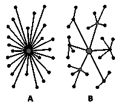
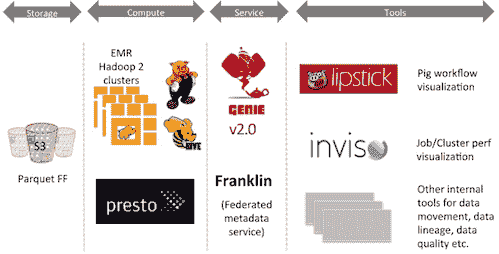

# 采访：Joseph Babcock，Netflix 谈及 Genie、Lipstick 及其他内部开发工具

> 原文：[`www.kdnuggets.com/2015/06/interview-joseph-babcock-netflix-in-house-developed-tools.html`](https://www.kdnuggets.com/2015/06/interview-joseph-babcock-netflix-in-house-developed-tools.html)

**Twitter 账号: [@hey_anmol](https://twitter.com/hey_anmol)**

目前是一名高级数据科学家，负责[**Netflix**](https://www.netflix.com/)的 Discovery & Personalization 算法和数据处理。

在 Netflix 之前，他在约翰霍普金斯大学医学院学习计算生物学，他的博士研究集中在神经科学系，利用机器学习模型预测药物的不良副作用。

他之前还在位于芝加哥的 Accretive Health 担任数据科学家，专注于与患者账单和转诊相关的数据。

**采访的第一部分**

这是我与他的采访的第二部分：

**[Anmol Rajpurohit](https://twitter.com/hey_anmol): Q5\. 数据科学如何帮助 Netflix 识别库存差距？Discovery & Personalization 团队是否向内容获取团队提供任何建议？**

[**Joseph Babcock**](https://www.linkedin.com/in/josephjbabcock): 从某种意义上说，内容获取既是一门科学，也是一门艺术。虽然很难准确确定什么使得一个节目成为热门，但我们广泛使用分析来检查用户正在观看的内容，从而确定未来我们可能要优先考虑的授权内容。例如，构建预测即将推出的标题的受欢迎程度的模型，使用专家标记为内容分配元数据标签，以及我们的消费者科学部门进行的定性访谈会，将这些实证发现与客户反馈联系起来。

我们还广泛跟踪我们原创节目的现场表现，并结合我们的市场营销工作不断优化 Netflix 制作内容的投放。

**AR: Q6\. Netflix 中管理大数据最常用的工具和技术是什么？**

**JB:** 我们的大数据基础设施主要建立在亚马逊网络服务（AWS）上，特别是支撑我们 Hadoop 集群的 Simple Storage Service（S3）文件系统。生产 ETL 任务主要用 Pig 编写，Hive 用于临时分析，Presto 用于互动分析。我们还维护一个 Teradata 云实例，这是许多报告工具（如 Microstrategy 和 Tableau）的后台。

Hadoop 作业提交是通过一个内部开发的服务 Genie 来管理的，该服务在用户提交作业时抽象了集群配置的细节（它类似于向 Web 服务器提交 POST 命令）。除了 Genie，你还可以在 Github 上找到许多我们其他的大数据工具，如 Inviso（用于可视化集群负载和调试作业性能的中央仪表板）、S3mper（S3 一致性监视器）、Lipstick（一个我们广泛使用的 Pig 的可视化界面，用于共享和分析这些作业的数据）、PigPen（Pig 的 Clojure 封装）以及 Surus（用于数据科学任务（如模型评分和异常检测）开发的用户定义函数（UDFs）集合）。

**AR: Q7\. 在 Netflix，数据科学家垂直对齐到业务的不同方面，而不是集中式模型（如分析卓越中心）。您认为这种组织结构有什么优缺点？**

**JB:** 我认为这种方法的优点在于能够在特定的数据类型上开发深厚的专业知识，无论是外部营销数据、服务器端印象数据、搜索点击还是播放日志。每种数据都有其自身的细微差别，理解这些细微差别在我们的算法中开发信号时往往变得很重要。

与任何形式的专业化一样，潜在的缺点是缺乏接触可能提供意外灵感的其他领域，但我认为我们定期的公司内部研讨会、全体员工会议和跨团队举措是有效的手段，可以在垂直领域之间传播这种学习。

**AR: Q8\. Netflix 现在有很多内部开发的软件已开源。您能描述一下开发 Genie、Lipstick 和 Quinto 的动机吗？**

**JB:** 动机在于通过自动化实现规模化和自我赋能。在 Genie 的情况下，将作业提交的细节从特定集群配置中抽象出来，使我们能够灵活地扩展资源，以在计算资源需求变化时在后台处理作业提交，同时也帮助将我们运行的越来越异质的任务（Hive、Pig、Spark、Presto 等）与通用架构结合起来。

在 Lipstick 和 Quinto 的案例中，这些工具使审计和调试 ETL 作业变得更加‘自助’，而在过去我们可能需要挖掘 Pig 日志文件或编写临时的数据质量检查。像这些工具这样的自动化和用户友好的界面提高了我们的生产力，以应对处理和理解数据中越来越困难的问题。

**采访的第三部分将很快发布。**

**相关：**

+   前 20 名 Python 机器学习开源项目

+   与 IBM 大数据产品副总裁 Anjul Bhambhri 的采访

+   最佳大数据、数据科学、数据挖掘和机器学习播客

### 更多相关话题

+   [AI for Ukraine 是 AI HOUSE 支持乌克兰科技社区的一个新教育项目](https://www.kdnuggets.com/2022/08/ai-house-ai-ukraine-new-educational-project-support-ukrainian-tech-community.html)

+   [数据掩码：确保 GDPR 及其他监管合规的核心](https://www.kdnuggets.com/2023/05/data-masking-core-ensuring-gdpr-regulatory-compliance-strategies.html)

+   [终极指南：Chat GPT 及其他缩略语](https://www.kdnuggets.com/2023/06/ultimate-guide-chat-gpt-abbreviations.html)

+   [数据科学家、数据工程师及其他数据职业解析](https://www.kdnuggets.com/2021/05/data-scientist-data-engineer-data-careers-explained.html)

+   [使数据科学家与其他职业区分开的 5 个因素](https://www.kdnuggets.com/2021/11/5-things-set-data-scientist-apart-other-professions.html)

+   [7 种使数据科学家与其他职业区分开的独特技能](https://www.kdnuggets.com/2022/05/7-unique-skills-set-data-scientists-apart-professions.html)
