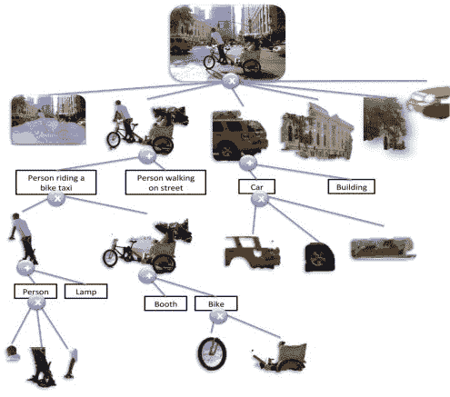

# 采访：Pedro Domingos：大师算法，新型深度学习，对年轻研究者的宝贵建议

> 原文：[`www.kdnuggets.com/2014/08/interview-pedro-domingos-master-algorithm-new-deep-learning.html`](https://www.kdnuggets.com/2014/08/interview-pedro-domingos-master-algorithm-new-deep-learning.html)

作者：**Gregory Piatetsky**，[**@kdnuggets**](https://twitter.com/kdnuggets)，2014 年 8 月 19 日。

这是我与 Pedro Domingos 教授的第二部分采访，他是机器学习和数据挖掘领域的领先研究者，获得了**ACM SIGKDD 2014 创新奖**，被广泛认为是数据挖掘/数据科学的“诺贝尔奖”。

这是第一部分：采访：Pedro Domingos，KDD 2014 数据挖掘/数据科学创新奖获奖者。

许多 Domingos 教授获奖的研究理念已经实现于可自由获取的软件中，包括

+   Alchemy: 统计关系 AI 的算法 [alchemy.cs.washington.edu](http://alchemy.cs.washington.edu)

+   VFML: 一个用于挖掘大数据源的工具包 [www.cs.washington.edu/dm/vfml/](http://www.cs.washington.edu/dm/vfml/)

+   NBE: 一个具有非常快推理速度的贝叶斯学习器 [www.cs.washington.edu/ai/nbe](http://www.cs.washington.edu/ai/nbe)

+   BVD: 用于零一损失的偏差-方差分解 [www.cs.washington.edu/homes/pedrod/bvd.c](http://www.cs.washington.edu/homes/pedrod/bvd.c)

+   RISE: 一个统一的规则和实例学习器 [www.cs.washington.edu/homes/pedrod/rise.c](http://www.cs.washington.edu/homes/pedrod/rise.c)

+   SPN: 用于可处理深度学习的和-积网络 [spn.cs.washington.edu](http://spn.cs.washington.edu)

要了解更多关于他研究的内容，可以查看他的一些被引用最多的论文，链接在[Google Scholar](https://scholar.google.com/scholar?q=pedro+domingos&hl=en&btnG=Search)和[Citeseerx](http://citeseerx.ist.psu.edu/search?q=pedro+domingos&t=doc&sort=cite)。

**Gregory Piatetsky: 问题 7。你发表了一篇非常好的文章 "机器学习中值得了解的几件事"，列出了 12 个关键观察点。你会为数据挖掘/数据科学添加几个额外的观察点吗？**

[**Pedro Domingos**](http://homes.cs.washington.edu/~pedrod/): 是的！

+   数据要么是经过整理的，要么是衰退的；关注数据的管理和挖掘同样重要。

+   每一个数字都有其故事，如果你不知道这个故事，就不能信任这个数字。

+   模型应覆盖整体，而不仅仅是部分，否则你可能会**错失重点**。

+   通过层次分解来驯服复杂性。

+   你的学习器的时间和空间需求应该取决于模型的大小，而不是数据的大小。

+   你应该首先自动化的工作是你自己的；然后你可以在你挖掘一个任务的时间里挖掘一千个任务。

还有许多内容，我将在我的 KDD-2014 奖项演讲中进一步讨论其中的一些。

**GP: Q8\. 当你在 2013 年访问 MIT CSAIL 实验室时，你正在撰写一本新书。你能告诉我们这本书的情况吗？你作为访问科学家还做了其他哪些工作？**

**PD**：这是一本关于机器学习和大数据的科普书籍，书名是*《大师算法：机器学习与大数据革命》*。

这本书几乎完成了，将在 2015 年出版。目标是为数据科学做一些类似于《混沌》对复杂性理论所做的事情，或者《自私的基因》对进化博弈理论所做的事情：以一种有趣和易于理解的方式向更广泛的受众介绍基本思想，并概述该领域丰富的历史、与其他领域的联系以及其影响。

现在大家都在使用机器学习和大数据，这些话题每天都出现在媒体上，我认为像这样的书籍是非常必要的。数据科学太重要了，不应只留给我们这些专家！每个人——市民、消费者、管理者、政策制定者——都应该对把数据转化为预测的神奇黑匣子内部运作有一个基本的了解。

 在 MIT，我与[Josh Tenenbaum](http://web.mit.edu/cocosci/josh.html)合作进行了一项联合研究项目。目标是能够从原始传感器数据出发，逐步获得对所处情况的高层次理解，马尔可夫逻辑作为将所有部分连接起来的粘合剂。Josh 是认知科学家，他在项目中的角色是带来心理学方面的想法。事实上，我休假的一个最有趣的部分是与计算机科学家、心理学家和神经科学家交流——从他们身上可以学到很多东西。

**GP: Q9\. 你目前正在研究哪些主要方向？**

**PD**：我正在研究一种新型的深度学习，称为[**求和-积网络**](http://alchemy.cs.washington.edu/spn/)。SPN 具有多个隐藏变量层，因此具有与深度架构（如 DBM 和 DBN）相同的能力，但有一个重大区别：**在 SPN 中，概率推断始终是可处理的；** 这只需通过网络进行一次传递，避免了像马尔可夫链蒙特卡罗和循环信念传播等近似方法的所有困难和不可预测性。因此，学习本身（在这些深度模型中，推断作为一个子例程使用）也变得更容易、更具可扩展性。

> **SPN 中的“秘密调料”是网络的结构与条件概率计算的结构同构，其中有一个求和节点用于求和，和一个乘积节点用于乘积。**

在其他深度模型中，推断是一个代价高昂的循环，你必须将其包裹在模型周围，这就是麻烦的开始。有趣的是，SPN 中的求和和乘积也对应于现实世界中的实际概念，这使得它们比传统的深度模型更具可解释性：求和节点表示类别的子类，乘积节点表示部分的子部分。因此，你可以查看一个用于识别人脸的 SPN，看看某个节点模型的是什么类型的鼻子，例如。

我还在继续研究马尔可夫逻辑网络，重点是将其扩展到大数据。我们的方法是使用可处理的马尔可夫逻辑子集，就像 SQL 是第一阶逻辑的可处理子集一样。

我们当前的一个项目是基于 Freebase、DBpedia 等数据，构建一个类似于 Google 知识图谱的东西，但更加丰富。我们称之为 TPKB - [可处理的概率知识库](http://csweb.cs.wfu.edu/~snataraj/StaRAI/Papers/1.pdf) - 它可以回答关于维基百科等中的实体和关系的问题。我们计划在网上发布一个演示版本，然后从用户的互动中学习。

**GP: Q10\. 大数据和机器学习是最热门的技术领域之一，许多数据挖掘和机器学习的研究者都参与了创业。你是否考虑过创业，为什么还没有创办公司？**

 **PD**：这正是我妻子不断问我的问题。说真的，我确实认为我的未来有一个创业机会。我还没有行动的原因有两个。首先，我想做一个基于我研究的创业项目，而在过去十年里，我的研究相当长期。这意味着直到它准备好部署还有较长的过程，但希望当它准备好时，其影响也会更大。

第二个相关原因，我想做一个至少有潜力改变世界的创业项目，而实现这一点需要许多条件的配合。我经常看到同事们创业时没有考虑到所有的非技术问题，这些问题比技术问题更为重要，这不是成功的秘诀。在数据科学领域，创业公司很少完全失败，因为公司被收购的价值很高，但如果最终仅仅如此，那么也许这并不是最好的时间利用方式。

**GP: Q11\. 对于“大数据”热潮，你的观点是什么？有多少是炒作，有多少是现实？现在是否存在机器学习的“热潮”？**（注：Gartner 最新的“Hype Cycle”报告将[“大数据”列在失望的低谷](http://www.gartner.com/newsroom/id/2819918)）。

**PD**：虽然有相当多的炒作，但从根本上说，大数据的热潮是非常真实的。我喜欢“蚂蚁军队”的比喻：并不是任何单一的大数据项目会极大地改变你的底线——尽管偶尔会发生——而是当你将所有数据分析能够带来改变的地方加起来时，它确实是具有变革性的。而且我们仍然只是触及了可以做的事情的表面。瓶颈确实是数据科学家的匮乏。

机器学习随着大数据的兴起而蓬勃发展，因为如果数据是燃料，计算是引擎，那么机器学习就是火花塞。

到目前为止，机器学习在行业或公众意识中还不如数据挖掘、数据科学、分析或大数据那样成为一种热门话题，但即便如此，这种情况也在改变。

> **我认为“机器学习”这个术语的生命周期比“数据科学”或“大数据”要长，这很好，因为在短期和长期都有进步的空间。**

**GP：Q12. 你会给对机器学习、数据挖掘、数据科学感兴趣的年轻研究者什么建议？**

 **PD**：

> **在你做的每一件事中都要尽全力；逐步的研究不值得你的时间。**

学习你能学到的一切，但不必完全相信其中的任何内容；你的工作是让这些东西变得过时。

**不要被教科书中的所有数学吓倒；在这个领域，数学是数据的仆人，而不是相反。**

听取数据——进行实验、分析结果、深入挖掘、跟进惊喜——是成功的途径。

**如果你大多数时间都不感到困惑和挣扎，那么你正在解决的问题可能太简单了。**

与来自多个公司或行业的人不断交谈，并尝试找出他们共同的问题。这样你就知道，如果你解决了其中一个问题，你会有很大的影响。

**广泛阅读，但要关注你关心的研究问题；最大的洞察力往往来自将之前分开的事物结合起来。**

以明天的计算能力为目标，而不是今天的。

**警惕黑客攻击；一个黑客的方案看起来聪明，但它正好是通用解决方案的对立面。**

**复杂性是你最大的敌人。一旦你觉得自己解决了一个问题，就抛弃这个解决方案，想出一个更简单的方案，然后再试一次。**

当然，要玩得开心——没有哪个领域比这个更具乐趣。

**GP：Q13. 在离开电脑的时候你喜欢做什么？最近读过什么书并喜欢它吗？**

**PD**：我喜欢读书和听音乐。我是一个电影迷，喜欢旅行。我的所有这些爱好都很杂乱无章。我还是一个游泳者和长跑运动员。最重要的是，我会花时间和家人在一起。

我最近读过的一本引人入胜的书是  由艾莉森·戈普尼克、安迪·梅尔佐夫和帕特·库尔合著。婴儿和幼儿经历了一系列惊人的学习阶段，一步步拼凑出我们成年人视作理所当然的意识。我不禁想到，许多机器学习问题的答案可能就在婴儿的心智中，只要我们能从戈普尼克及其团队总结的那些令人惊讶的实验观察中解码出来。

在虚构类书籍中，我最近读过的最好的书可能是 *《路》*，作者是科马克·麦卡锡。这本书讲述了一位父亲和他的儿子在后末日世界中挣扎求生的故事，书中充满了力量和难以忘怀的情感。

**简历：** [**佩德罗·多明戈斯**](http://homes.cs.washington.edu/~pedrod/) 是华盛顿大学计算机科学与工程系的教授。他的研究兴趣包括机器学习、人工智能和数据挖掘。他在加州大学欧文分校获得信息与计算机科学博士学位，并且是 200 多篇技术论文的作者或合著者。

他是《机器学习》期刊的编辑委员会成员，国际机器学习学会的共同创始人，以及 JAIR 的前副主编。他曾担任 KDD-2003 和 SRL-2009 的程序联合主席，并在多个程序委员会中任职。他是 SIGKDD 创新奖的获得者，这一奖项是数据挖掘领域的最高荣誉。他还是 AAAI 会士，获得过斯隆奖学金、NSF CAREER 奖、富布赖特奖学金、IBM 教员奖，并在几个领先会议上获得了最佳论文奖。

**相关：**

+   采访：佩德罗·多明戈斯，KDD 2014 数据挖掘/数据科学创新奖得主

+   数据挖掘/数据科学“诺贝尔奖”：ACM SIGKDD 2014 创新奖颁给佩德罗·多明戈斯

+   佩德罗·多明戈斯：关于机器学习你需要知道的一些有用知识

+   在哪里学习深度学习 - 课程、教程、软件

* * *

## 我们的前三个课程推荐

 1\. [谷歌网络安全证书](https://www.kdnuggets.com/google-cybersecurity) - 快速进入网络安全职业生涯。

 2\. [谷歌数据分析专业证书](https://www.kdnuggets.com/google-data-analytics) - 提升你的数据分析技能

 3\. [Google IT 支持专业证书](https://www.kdnuggets.com/google-itsupport) - 支持你的组织进行 IT 工作

* * *

### 更多相关话题

+   [I 型和 II 型错误：有什么区别？](https://www.kdnuggets.com/2022/08/type-type-ii-errors-difference.html)

+   [利用 AI 阅读心灵：研究人员将脑波翻译成图像](https://www.kdnuggets.com/2023/03/reading-minds-ai-researchers-translate-brain-waves-images.html)

+   [如何获得机器学习工作：来自 Meta、Google Brain 和 SAP 工程师的建议](https://www.kdnuggets.com/2022/08/corise-land-ml-job-advice-engineers-meta-google-brain-sap.html)

+   [为什么数据科学家对 Google Bard 的建议存有疑虑](https://www.kdnuggets.com/2023/02/data-scientists-expect-flawed-advice-google-bard.html)

+   [成为优秀数据科学家所需的 5 项关键技能](https://www.kdnuggets.com/2021/12/5-key-skills-needed-become-great-data-scientist.html)

+   [讲述精彩数据故事：可视化决策树](https://www.kdnuggets.com/2021/02/telling-great-data-story-visualization-decision-tree.html)
