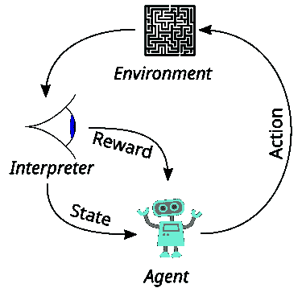
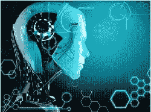

# 独家：对强化学习之父 Rich Sutton 的采访

> 原文：[`www.kdnuggets.com/2017/12/interview-rich-sutton-reinforcement-learning.html`](https://www.kdnuggets.com/2017/12/interview-rich-sutton-reinforcement-learning.html)

 评论 我在 1980 年代遇见了 Rich Sutton，那时他和我都是刚获得博士学位的新人，我们一起加入了位于波士顿地区的 GTE 实验室。我在研究智能数据库，而他则在强化学习部门工作，但我们的 GTE 实验室项目离实际应用还很远。我们经常下棋，我们大致平手，但在机器学习方面，Rich 远远领先于我。Rich 既是一个杰出的研究人员，也是一个非常友好和谦逊的人。他在下面的采访中提到，“强化学习”的想法很明显，但从有想法到发展成一个具有数学基础的实际理论之间还有很大的距离，而这正是 Rich 和 Andrew Barto（他的博士生导师）为强化学习所做的工作。强化学习在 AlphaGo Zero 的成功中扮演了重要角色，如果人工通用智能（AGI）在某个时点被开发出来，强化学习可能会在其中发挥重要作用。

 目前是 [计算机科学教授](https://www.ualberta.ca/science/about-us/contact-us/faculty-directory/rich-sutton)，担任艾伯塔大学的 iCORE 主席，并且是 DeepMind 的杰出研究科学家。他是 [强化学习](https://en.wikipedia.org/wiki/Reinforcement_learning)（RL）的创始人之一，强化学习在机器学习和人工智能中越来越重要。他在 RL 领域的重要贡献包括 [时间差分学习](https://en.wikipedia.org/wiki/Temporal_difference_learning) 和策略梯度方法。他是一本广受好评的书籍（与 Andrew Barto 合著） [《强化学习导论》](https://mitpress.mit.edu/books/reinforcement-learning) 的作者，该书被引用超过 25,000 次，第二版即将发布。

他在斯坦福大学获得心理学学士学位（1978 年），并在马萨诸塞大学阿默斯特分校获得计算机科学硕士（1980 年）和博士学位（1984 年）。他的博士论文题为“强化学习中的时间信用分配”，在论文中他引入了演员-评论家架构和“时间信用分配”。

从 1985 年到 1994 年，萨顿在 GTE 实验室担任技术员工首席成员。随后，他在 UMass Amherst 担任高级研究科学家 3 年，之后在 AT&T 香农实验室担任首席技术员工 5 年。自 2003 年起，他在阿尔伯塔大学计算科学系担任教授和 iCORE 主席，领导强化学习与人工智能实验室（RLAI）。自 2017 年 6 月起，萨顿还共同领导了[DeepMind 在阿尔伯塔的新办公室](https://deepmind.com/blog/deepmind-office-canada-edmonton/)。

Rich 还在[incompleteideas.net](http://incompleteideas.net/)上维护一个博客/个人页面。

**Gregory Piatetsky: 1\. 强化学习（RL）的主要思想是什么？它与监督学习有何不同？**

典型的 RL 场景是：一个代理在环境中采取行动，环境将这些行动解释为奖励和状态表示，这些奖励和状态表示反馈给代理。

来源：维基百科**Rich Sutton:** 强化学习是通过试错学习从奖励中获得知识，这与自然学习过程非常相似，而与监督学习不同，后者只在有监督或教学信号的特殊训练阶段进行学习，而这种信号在正常使用过程中是不可用的。

例如，语音识别目前通过监督学习完成，使用大量的语音样本及其正确的文字转录。这些转录是监督信号，在新的语音样本到来时无法获得。另一方面，游戏通常通过强化学习完成，使用游戏结果作为奖励。即使你玩一个新游戏，你也能看到自己是赢还是输，并可以利用强化学习算法来改进你的游戏表现。监督学习的方法则需要“正确”动作的示例，比如来自人类专家的示例。这当然是有用的，但在正常游戏中无法获得，并且会将学习系统的技能限制在专家的水平。强化学习则使用较少的信息性训练数据，这些数据更为丰富且不受监督者技能的限制。

**GP: 2\. 与安德鲁·巴托合著的经典书籍《强化学习：导论》的第二版即将出版（何时？）。第二版中涉及了哪些主要的进展？能否告诉我们关于强化学习与心理学（第十四章）和神经科学（第十五章）之间有趣联系的新章节？**

**RS:** 第二版的完整草稿目前已经完成。

在网络上可以找到。Andy Barto 和我正在做一些最后的修订：验证所有参考文献，等等。它将在明年初以纸质形式印刷。

自从第一版发布以来，强化学习在过去二十年中发生了很多变化。其中最重要的可能是强化学习思想对神经科学的巨大影响，现在标准的脑奖励系统理论认为它们是时间差学习的一个实例（强化学习的基本学习方法之一）。

目前的理论认为，多巴胺这种神经递质的主要作用是传递时间差错，也称为奖励预测误差。这是一个巨大的发展，有很多来源、影响和测试，我们在书中的处理只能做简要总结。这些和其他发展在第十五章中进行了介绍，第十四章总结了它们在心理学中的重要前身。

总的来说，第二版比第一版大约大了三分之二。现在有五章关于函数近似的内容，而不是一章。新增了两章关于心理学和神经科学的内容。还有一章关于强化学习的前沿，包括社会影响的一部分。书中的所有内容都得到了更新和扩展。例如，新应用章节涵盖了 Atari 游戏玩法和 AlphaGo Zero。

**GP: 3\. 什么是深度强化学习——它与强化学习有何不同？**

**RS:** 深度强化学习是深度学习和强化学习的结合。这两种学习方法解决了大相径庭的问题，并且结合得很好。简而言之，强化学习需要从数据中近似函数的方法来实现其所有组件——价值函数、策略、世界模型、状态更新器——而深度学习是最近开发的、最成功的函数近似器。我们的教科书主要介绍线性函数近似器，并给出了一般情况的方程。我们在应用章节和一个部分中介绍了神经网络，但要完全了解深度强化学习，还需补充如[深度学习书籍](http://www.deeplearningbook.org/) by Goodfellow, Bengio, and Courville 的内容。

**GP: 4\. RL 在游戏中取得了巨大成功，例如 AlphaGo Zero。你期待 RL 在其他哪些领域表现良好？**

**RS:** 嗯，当然我相信在某种意义上强化学习是人工智能的未来。强化学习最能代表一个智能系统必须能够自主学习，没有持续监督的想法。人工智能必须能够自己判断对错。只有这样，它才能扩展到真正大量的知识和通用技能。

**GP: 5\. Yann LeCun [评论](https://www.theverge.com/2017/10/26/16552056/a-intelligence-terminator-facebook-yann-lecun-interview)称 AlphaGo Zero 的成功很难推广到其他领域，因为它每天玩数百万场游戏，但你无法让现实世界的速度快于实时。当前强化学习不成功的地方（例如当反馈稀疏时）以及如何解决这个问题？**

**RS:** 正如 Yann 会立刻同意的那样，关键是从普通的无监督数据中学习。我和 Yann 也会同意，我认为，近期的重点将是关注**"预测学习"**。预测学习可能很快会成为一个热门词汇。它的意思正如你所想，即预测将发生什么，然后基于实际发生的事情进行学习。因为你从发生的事情中学习，所以不需要监督者告诉你应该预测什么。但因为你只是等待事情发生，你实际上有一个监督信号。预测学习就是无监督的监督学习。预测学习可能会在应用方面取得重大进展。

唯一的问题是你是否希望将预测学习更多地看作是监督学习或强化学习的衍生物。强化学习的学生知道强化学习有一个主要的子问题，称为“预测问题”，解决这个问题的效率是算法工作的重点。实际上，第一篇讨论时序差分学习的论文题为《通过时序差分方法学习预测》。

**GP: 6\. 当你在 1980 年代研究强化学习时，你是否认为它会取得如此成功？**

**RS:** 在 1980 年代，强化学习确实过时了。它基本上不存在作为一个科学或工程思想。但它仍然是一个显而易见的思想。对心理学家来说显而易见，对普通人来说也显而易见。因此，我认为它是值得研究的，并且最终会被认可。

**GP: 7\. 强化学习的下一步研究方向是什么？你现在在做什么？**

**RS**：除了预测学习，我认为下一步重大进展将是当我们拥有能够以学习到的世界模型进行规划的系统时。目前，我们有出色的规划算法，但仅在模型被提供时，如所有游戏系统中所见，模型由游戏规则（以及自我对弈）提供。然而，我们没有现实世界的游戏规则的类似物。我们需要物理定律，但我们还需要知道无数其他的事情，从如何走路和看东西到其他人如何回应我们的行为。我们教科书第八章中的 Dyna 系统描述了一个集成的规划和学习系统，但它在几个方面有限。第十七章概述了可能克服这些限制的方法。我将从那里开始。

**GP: 8. 强化学习可能是发展人工通用智能（AGI）的核心。你怎么看？研究人员会在可预见的未来开发出 AGI 吗？如果会，它会对人类带来巨大好处，还是像埃隆·马斯克警告的那样，对人类构成生存威胁？**

**RS**：我认为人工智能是通过创造类似人类的事物来理解人类思维的尝试。正如费曼所说，“我不能创造的，我无法理解”。在我看来，主要事件是我们即将第一次真正理解思维。这种理解本身将产生巨大影响。这将是我们时代，实际上是任何时代最大的科学成就。它也将是所有时代人文学科的最大成就——在深层次上理解我们自己。从这个角度来看，将其视为坏事是不可能的。确实具有挑战性，但不是坏事。我们将揭示真相。那些不希望这成为现实的人将把我们的工作视为坏事，就像科学摒弃了灵魂和精神的观念时，那些持有这些观念的人将其视为坏事一样。毫无疑问，我们今天所珍视的一些观念将在我们更深刻理解思维如何运作时面临类似的挑战。

关于人工智能对社会影响的更多信息，我建议读者查看我们教科书的最后一部分以及我在这个视频中的评论（https://www.youtube.com/watch?v=QqLcniN2VAk）

**GP: 9. 当你远离电脑和智能手机时喜欢做什么？最近读过并喜欢的书是什么？**

**RS**：我热爱自然，并且是哲学、经济学和科学中的思辨性思想的学生。我最近阅读并喜欢了尼尔·斯蒂芬森的《七个世界》、尤瓦尔·赫拉利的《人类简史》以及 G·爱德华·格里芬的《杰基尔岛的生物》。

**相关：**

+   [**机器学习算法：如何选择适合你问题的算法**](https://www.kdnuggets.com/2017/11/machine-learning-algorithms-choose-your-problem.html)

+   [**3 种不同类型的机器学习**](https://www.kdnuggets.com/2017/11/3-different-types-machine-learning.html)

+   [**AlphaGo Zero：人工智能领域最重要的研究进展**](https://www.kdnuggets.com/2017/10/alphago-zero-biggest-ai-advance.html)

### 更多相关话题

+   [庆祝 Devart 的第 26 个生日，独享 20% 折扣…](https://www.kdnuggets.com/2023/08/devart-celebrating-26th-birthday-exclusive-discount-data-connectivity-tools.html)

+   [数据科学面试指南 - 第二部分：面试资源](https://www.kdnuggets.com/2022/04/data-science-interview-guide-part-2-interview-resources.html)

+   [Interview Kickstart 数据科学面试课程——有什么特别之处…](https://www.kdnuggets.com/2022/10/interview-kickstart-data-science-interview-course-makes-different.html)

+   [实践强化学习课程，第三部分：SARSA](https://www.kdnuggets.com/2022/01/handson-reinforcement-learning-course-part-3-sarsa.html)

+   [实践强化学习课程，第一部分](https://www.kdnuggets.com/2021/12/hands-on-reinforcement-learning-course-part-1.html)

+   [实践强化学习课程，第二部分](https://www.kdnuggets.com/2021/12/hands-on-reinforcement-learning-part-2.html)
