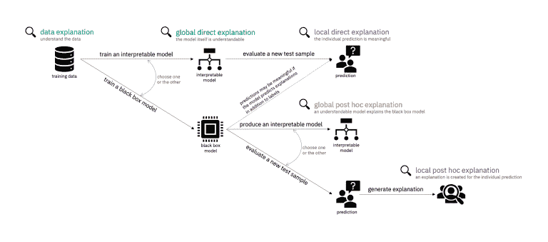
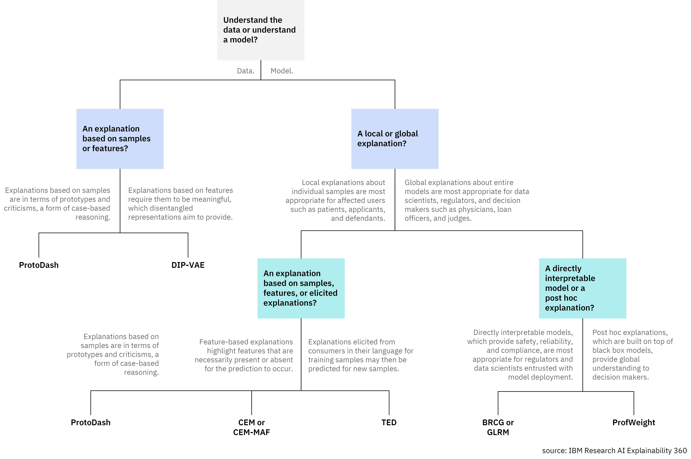

# 介绍 AI Explainability 360：帮助您理解机器学习模型正在做什么的新工具包

> 原文：[`www.kdnuggets.com/2019/08/introducing-ai-explainability-360-toolkit-understand-machine-learning-models.html`](https://www.kdnuggets.com/2019/08/introducing-ai-explainability-360-toolkit-understand-machine-learning-models.html)

 评论

可解释性是现代机器学习解决方案中最困难的挑战之一。虽然构建复杂的机器学习模型变得越来越容易，但理解模型如何发展知识并得出结论仍然是一个非常困难的挑战。通常，模型越准确，解释起来就越困难。最近，IBM 的 AI 研究人员开源了[AI Explainability 360](http://aix360.mybluemix.net/)，这是一个支持机器学习模型可解释性和说明性的最先进算法工具包。

* * *

## 我们的前三大课程推荐

 1\. [谷歌网络安全证书](https://www.kdnuggets.com/google-cybersecurity) - 快速进入网络安全职业道路

 2\. [谷歌数据分析专业证书](https://www.kdnuggets.com/google-data-analytics) - 提升您的数据分析能力

 3\. [谷歌 IT 支持专业证书](https://www.kdnuggets.com/google-itsupport) - 支持您的组织的 IT

* * *

AI Explainability 360 的发布是近年来在几十篇研究论文中概述的想法的首次实际实施。传统的软件应用程序通过引入监控代码来帮助运行时监控，机器学习模型也需要添加可解释性技术以便于调试、故障排除和版本控制。然而，解释机器学习模型的复杂性远高于传统软件应用程序。首先，我们对什么使机器学习模型具有可解释性了解非常有限。

### 可解释性的构建模块

几个月前，谷歌的研究人员发布了[一篇非常全面的论文，概述了可解释性的核心组成部分](https://distill.pub/2018/building-blocks/)。该论文提出了使模型可解释的四个基本挑战：

+   **理解隐层的功能：** 深度学习模型中的大部分知识是在隐层中形成的。了解不同隐层在宏观层面的功能对于解释深度学习模型至关重要。

+   **理解隐藏层的作用：** 深度学习模型中的大部分知识是在隐藏层中形成的。宏观上理解不同隐藏层的功能对于解释深度学习模型至关重要。

+   **理解节点如何被激活：** 解释能力的关键在于不是理解网络中单个神经元的功能，而是理解在相同空间位置上共同激活的相互连接的神经元组。通过按互联神经元组对网络进行分段，将提供一个更简单的抽象层次来理解其功能。

+   **理解概念是如何形成的：** 理解深度神经网络如何形成单个概念，然后将这些概念组装成最终输出，是解释性另一个关键组成部分。

另一个需要认识到的方面是，AI 模型的可解释性随着其复杂性的增加而减少。你关心的是获得最佳结果，还是关心如何获得这些结果？这就是解释性与准确性之间的矛盾的本质，它是每个机器学习场景的核心。许多深度学习技术本质上是复杂的，尽管它们在许多场景中结果非常准确，但它们可能变得难以解释。

为了应对解释性的挑战，机器学习模型需要将可解释的构建块作为一个重要组成部分。这就是 IBM 新工具包的目标。

### AI Explainability 360

AI Explainability 360 是一个开源工具包，用于简化可解释机器学习模型的实现。该工具包包括一系列可解释性算法，反映了该领域的最新研究成果，并具有直观的用户界面，有助于从不同角度理解机器学习模型。AI Explainability 360 的主要贡献之一是它不依赖于机器学习模型的单一解释形式。正如人类依赖丰富且富有表现力的解释来解读特定结果一样，机器学习模型的解释性也会因涉及的角色和上下文而有所不同。AI Explainability 360 为数据科学家或业务相关人员等不同角色生成不同的解释。

AI Explainability 360 生成的解释可以分为两大类，取决于它们是否基于数据或模型。

+   **数据：** 理解数据集的特征往往是可解释性的最短路径。这在依赖数据集构建相关知识的监督学习算法中尤其如此。有时，给定数据集中的特征对消费者有意义，但其他时候它们是纠缠在一起的，即多个有意义的属性组合在一个特征中。AI 可解释性 360 包含了几个专注于数据可解释性的算法。

+   **模型：** 模型的解释是任何机器学习可解释性的关键构建块。有几种方法可以使机器学习模型对消费者易于理解。第一种区分是直接可解释性与事后解释。直接可解释的模型是诸如决策树、布尔规则集和广义加性模型等模型格式，这些模型比较容易被人理解，并且可以直接从训练数据中学习。事后解释方法首先训练一个黑箱模型，然后在黑箱模型上构建另一个解释模型。第二种区分是全局解释与局部解释。全局解释针对整个模型，而局部解释则针对单个样本点。

全局可解释模型、全局和局部事后解释的区分是 AI 可解释性 360 的关键贡献之一。通常，全局可解释模型更适合需要完整且离散的模型解释路径的场景。这些场景包括安全性、可靠性或合规性等领域。全局事后解释对由机器学习模型支持的决策者角色非常有用。医生、法官和贷款官员可以对模型的整体工作方式有一个全面的了解，但黑箱模型和解释之间必然存在差距。局部事后解释与受模型结果影响的个人角色相关，例如患者、被告或申请人，他们需要从特定的视角理解解释。

开发人员可以通过使用工具包中包含的 API 来开始使用 AI 可解释性 360。此外，AI 可解释性 360 包含了[一系列演示和教程](https://github.com/IBM/AIX360/blob/master/examples/README.md)，可以帮助开发人员相对快速地入门。最后，该工具包提供了一个非常简单的用户界面，可用于入门机器学习可解释性的概念。

解释性是现代机器学习应用中最重要的构建块之一。AI 解释性 360 提供了最完整的堆栈之一，以简化机器学习程序的解释性，而无需成为该领域的专家。我们很可能会看到 AI 解释性 360 背后的某些理念被纳入主流深度学习框架和平台中。

[原文](https://towardsdatascience.com/introducing-ai-explainability-360-a-new-toolkit-to-help-you-understand-what-machine-learning-93438d734d04)。已获许可转载。

**相关：**

+   人工智能中的两个主要难点及一种应用解决方案

+   安德鲁·吴《机器学习的渴望》中 6 个关键概念

+   如何通过创建 AI 学习小组提升我的技能并获得工作

### 更多相关主题

+   [你在 2022 年计划增加哪些认证？](https://www.kdnuggets.com/2022/03/sas-certification-adding-toolkit-2022.html)

+   [关于可信图神经网络的全面调查：…](https://www.kdnuggets.com/2022/05/comprehensive-survey-trustworthy-graph-neural-networks-privacy-robustness-fairness-explainability.html)

+   [如何通过机器学习模型解释性加速人工智能的应用旅程](https://www.kdnuggets.com/2022/07/ml-model-explainability-accelerates-ai-adoption-journey-financial-services.html)

+   [介绍 John Snow Labs 的医疗保健专用大型语言模型](https://www.kdnuggets.com/2023/04/john-snow-introducing-healthcare-specific-large-language-models-john-snow-labs.html)

+   [介绍 TPU v4：谷歌的尖端超级计算机，用于大型…](https://www.kdnuggets.com/2023/04/introducing-tpu-v4-googles-cutting-edge-supercomputer-large-language-models.html)

+   [介绍 MPT-7B：一个新的开源大语言模型](https://www.kdnuggets.com/2023/05/introducing-mpt7b-new-opensource-llm.html)
