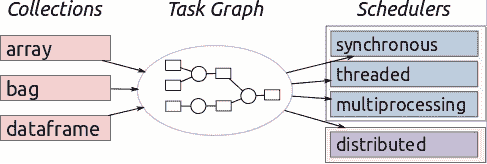
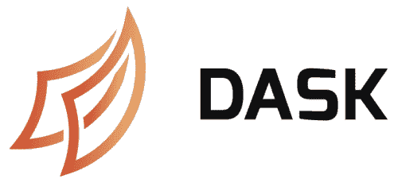

# 介绍 Dask 的并行编程：与项目首席开发人员的访谈

> 原文：[`www.kdnuggets.com/2016/09/introducing-dask-parallel-programming.html`](https://www.kdnuggets.com/2016/09/introducing-dask-parallel-programming.html)

在接下来的几周内，KDnuggets 计划分享一些关于 [Dask](https://github.com/dask/dask) 的信息和教程。

你问 Dask 是什么？根据它的 [文档](http://dask.pydata.org/en/latest/)：

> Dask 是一个用于分析的灵活并行计算库。

你的兴趣被激发了吗？如果你有兴趣了解一个为计算和互动数据科学而构建的软件项目，这可能会彻底改变你进行数据处理和并行化自己项目的方式，请阅读我与 Dask 首席开发人员马修·洛克林的讨论。

**马修·梅约：首先，你能给我们一个 Dask 的一句话概述吗？**

**马修·洛克林：** 哈，这很棘手。Dask 的使用方式非常不同，所以我们在这里需要比较笼统。

Dask 是一个用于并行编程的 Python 库，它利用任务调度来解决计算问题。

**很容易与其他表面上类似的项目进行比较。你认为 Dask 还与哪些开源项目竞争？**

Dask 跨越了两个不同的“竞争”项目组：

1.  动态任务调度器，如 AirFlow/Luigi/Celery

1.  “大数据”分析框架，如 Hadoop/Spark。

从本质上讲，Dask 看起来很像经过调整的 Airflow/Luigi/Celery。它有一个中央任务调度器，将作业（Python 函数）发送到同一台机器或集群中的许多工作进程：

*Worker A，请计算 x = f(1)，Worker B 请计算 y = g(2)。*

*Worker A，当 g(2) 完成后，请从 Worker B 获取 y 并计算 z = h(x, y)。*

Dask 的不同之处在于，虽然 Airflow/Luigi/Celery 主要用于较长时间的数据工程作业，但 Dask 是为了计算和互动数据科学而设计的。我们更关注于毫秒级的响应时间、工作进程间的数据共享、Jupyter notebook 集成等，而不是定期运行作业（如 Airflow）或与大量数据工程服务集成（如 Luigi）。我不会用 Dask 来进行每日数据的摄取，但我会用它来设计和运行算法以分析这些数据。

在这个任务调度器之上，我们构建了更高级的数组、数据框和列表接口，这些接口模仿了 NumPy、Pandas 和 Python 迭代器。这将 Dask 推向了流行的“大数据”框架空间，如 Hadoop 和 Spark。尤其是如今 Spark 的主导地位相当巨大，特别是在商业分析用例中（数据摄取、SQL 相关、一些轻量级机器学习）。大多数在这些用例中使用 Dask 的人要么是因为他们想留在 Python 中，要么是因为他们喜欢 Pandas，或者是因为他们在处理一些对 Spark 过于复杂的东西，如 N 维数组或一些更高级的 Pandas 时间序列功能。如果你已经在使用 Python，Dask 通常会感觉轻量一些。不过，Spark 的成熟度要高得多，确实做得非常好。

**Dask 比其他潜在解决方案更擅长什么？**

首先，Dask 做的很多事情比其他潜在解决方案要*差*。它不是要实现 SQL 或成为一个并行数据库。它不会在超级计算机上超越 MPI，也不会超越你手工优化的 C 代码。

其次，Dask 最常被使用的方式是怎样的。大多数用户使用 Dask.dataframe 或 Dask.bag 来分析 CSV 或 JSON 文件的目录。然而，如果 Dask 今天消失，这些用户也会没事，因为有很多软件项目在试图解决这个问题。

那么，剩下的是什么呢？实际上，有相当多的未被服务的领域。Dask 对于那些需要并行计算的自定义或不规则计算问题的用户来说，确实是个救星。这些用户包括科学家、量化分析师、算法开发者和不断增长的企业研究团队。这些人面临新颖的问题，需要构建自己的并行计算解决方案。Dask 的核心部分（看起来像 Airflow/Luigi/Celery）似乎很适合他们的需求。他们希望别人处理套接字/线程/弹性/数据局部性，但他们希望对其他所有事情保持相当细粒度的控制（比 map/reduce/groupby 更细）。

**Dask 的接口（例如，Dask DataFrame、Dask Array、Dask Bag）似乎非常直观。你认为 Dask 还有什么其他特点，使其对潜在用户具有吸引力？**

是的，正如你所建议的，复制 NumPy 和 Pandas 的接口确实降低了入门门槛。许多人都知道和喜爱 NumPy 和 Pandas。这听起来很傻，但这种选择也减少了 Dask 开发者在 API 上的焦虑和争论时间。

安装的简便性和可以立即在笔记本电脑上开始使用是一个很大的优势。Dask 作为一个纯 Python 库，可以通过标准 Python 包管理工具安装，且无需设置或配置文件，这对于广泛的用户群体都有帮助。

在人们的脑海中，从“仅仅是一个库”到“一个框架”存在一个大的飞跃。你可以像使用 Python 中的 multiprocessing 模块、Joblib 或 concurrent.futures 模块一样使用 Dask，感觉像是“仅仅是一个库”。Dask 设计成尽可能小的库，以补充现有的 PyData 生态系统中的并行处理。它从未设计成取代任何东西。许多其他库的核心开发人员似乎正是因为这个原因而接受了它。

最初，Dask 将其生命的第一年专注于单机并行处理。它满足了那些拥有“适中大数据”且希望充分利用笔记本电脑或重型工作站所有计算能力的人的需求。这个庞大的用户群体大多来自科学和金融领域，他们拥有“适中大数据”，并且不愿意处理将代码运行在集群上的复杂性。Dask 在这些用户中一开始就受到了极大的欢迎。此外，除了最大规模的问题外，单台重型工作站的性能和生产力几乎没有可比性。我们现在已经转向分布式系统，但单机并行处理今天仍然占据了大约 80%的使用比例。

**你能描述一个简单的 Dask 使用案例吗，以便给读者提供一些可视化的概念？**

我会给出两个例子，一个是任务调度（类似 Airflow），另一个是大数据集合（类似 Spark）。

一家汽车公司的假设质量保证团队正在使用收集的遥测数据（他们从每辆车的数百个传感器中收集数据）和关于他们认为汽车组件如何运作的工程模型来寻找故障。团队中的几个不同研究人员负责汽车的不同组件，并构建自定义的 Python 函数来建模这些组件在不同情况下的响应。其他负责集成这些组件的研究人员将前一层组件专注的研究人员创建的模型结合起来，形成一个复杂的关系树（汽车很复杂）。他们在来自数据的数百万种情况中运行这些模型。他们的聚合模型具有大量的并行性，但却非常混乱。他们将所有功能交给 Dask 处理，Dask 管理这些并行性，在原型设计期间运行在团队的笔记本电脑上，在需要处理完整数据集时运行在集群上。之后，他们生成视觉报告，并聚在一起查看结果。根据结果，各个部分的研究人员会离开并调整模型的各个部分，修改 Dask 图的某些小部分，只重新运行受影响的计算部分。

对于大数据集合（数组/数据框/列表），让我们来看一下气候科学。气候科学家拥有的数据类似于“地球每平方公里的温度、气压和风速，覆盖各种高度，追溯五十年。”他们希望筛选这些五维的密集数据立方体，对其进行分组、与其他数据集联接，并将其减少到有助于回答研究问题的汇总数据。他们使用流行的[XArray 项目](http://xarray.pydata.org/en/stable/)来管理他们的数据。XArray 在数据集较小且适合内存时（比如 1GB）使用 NumPy，但当数据集大于内存但仍适合存储（比如 10GB-100GB）时则切换到 Dask.array。在这些较大的数据集上，完整的计算可能需要一两分钟（磁盘有时较慢），但气候科学家很高兴，因为他们可以继续在笔记本电脑上工作，而无需切换到集群。他们现在可以查看分辨率更高、时间跨度更长的数据，而不必过于担心规模，一切都在他们的个人计算机上，并且使用之前在内存数据上使用的相同接口。

**你是怎么参与 Dask 开发的，Matthew？**

这实际上是我的全职工作。我在[Continuum Analytics](https://www.continuum.io/)工作，这是一个嵌入在开源数值 Python 生态系统中的营利性公司。它们有点像数值 Python 的 RedHat。公司有强烈的激励来保持开源 Python 生态系统的强大，因此他们构建填补感知空白的开源项目。Dask 就是这些项目之一，还有其他项目如[Conda](http://conda.pydata.org/docs/)、[Numba](http://numba.pydata.org/)和[Bokeh](http://bokeh.pydata.org/en/latest/)。

**如果有读者感兴趣，参与 Dask 开发的最佳方式是什么？**

文档是一个不错的开始：

[`dask.<wbr>readthedocs.io/en/latest/`](http://dask.readthedocs.io/en/latest/)

有一个带有初学者问题标签的问题跟踪器：

[`github.com/<wbr>dask/dask/issues`](https://github.com/dask/dask/issues)

我还建议尝试分布式调度器的快速入门，它更专注于 Airflow/Luigi 工作负载：

[`distributed.<wbr>readthedocs.io/en/latest/<wbr>quickstart.html`](http://distributed.readthedocs.io/en/latest/quickstart.html)

不过，目前 Dask 的核心部分感觉相当稳固。我认为现在最好的做法是将 Dask 应用于新问题，并看看它们如何突破。每次发生这种情况，我们都会学习如何更好地执行任务调度。

**我们还需要了解 Dask 的其他事项吗？**

是的，人们现在为这些东西付费，这真是疯狂。Dask 主要靠资助（感谢 DARPA 和 Moore！），但我现在开始经常收到公司发来的电子邮件，询问是否可以为某些开源功能的开发付费。*他们* 立刻就提出这个问题。不再需要说服他们开源工作对每个人都更好。如果你对开源软件感兴趣，你应该感到非常高兴。如果你是一家对 Python 中灵活的分布式计算系统感兴趣的公司，你知道如何联系我 :)

**感谢你抽出时间，Matthew。你的名字似乎与 Dask 开发在互联网上密不可分，我相信这让你忙碌。我们感谢你抽出时间与我们交谈。**

哈哈，那只是因为我声音最大 :)

还有其他几个人，如果没有他们，Dask 绝对不会发展到今天的水平。核心开发者包括 Jim Crist、Martin Durant、Erik Welch、Masakai Horikoshi、Blake Griffith 和大约 70 位其他人。还有其他 PyData 库的开发者，如 MinRK（Jupyter）、Stephan Hoyer（XArray、Pandas）、Jeff Reback（Pandas）、Stefan van der Walt（NumPy、SKImage）、Olivier Grisel（SKLearn、Joblib），他们紧密合作，确保 Dask 能够很好地与 Python 生态系统的其他部分集成。Continuum 内部的 Ben Zaitlen、Kris Overholt、Daniel Rodriguez 和 Christine Doig 确保系统运行顺畅，使开发能够快速进行。还有资助 Dask 开发的组织，如 DARPA XData 项目、Moore 基金会和私人公司。这些组织确保像我这样的开发者可以全职工作于 Dask 项目，这真的很棒！

我肯定在那个名单中忘记了几个很棒的人。

**相关**：

+   科学 Python 介绍（以及一些数学原理）— Matplotlib

+   白皮书：使用 Datashader 的大数据可视化

+   关于分析准备的思考

### 更多相关话题

+   [Python 中的大文件并行处理](https://www.kdnuggets.com/2022/07/parallel-processing-large-file-python.html)

+   [KDnuggets 新闻，7 月 20 日：机器学习算法解释…](https://www.kdnuggets.com/2022/n29.html)

+   [提示工程中的并行处理：思维骨架…](https://www.kdnuggets.com/parallel-processing-in-prompt-engineering-the-skeleton-of-thought-technique)

+   [介绍 Objectiv：开源产品分析基础设施](https://www.kdnuggets.com/2022/06/objectiv-introducing-objectiv-opensource-product-analytics-infrastructure.html)

+   [介绍 John Snow Labs 的医疗保健特定大型语言模型](https://www.kdnuggets.com/2023/04/john-snow-introducing-healthcare-specific-large-language-models-john-snow-labs.html)

+   [介绍 OpenChat：一个免费且简单的平台，用于在几分钟内构建自定义聊天机器人](https://www.kdnuggets.com/2023/06/introducing-openchat-free-simple-platform-building-custom-chatbots-minutes.html)
