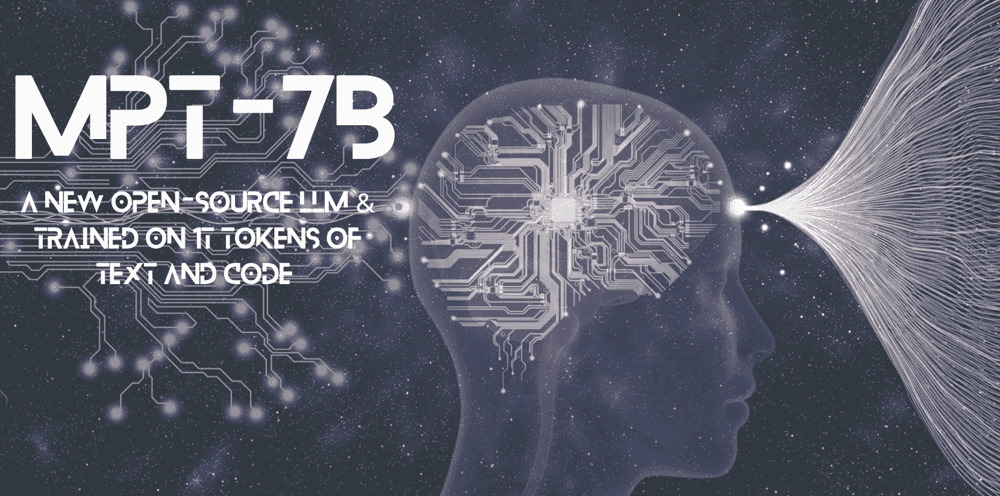
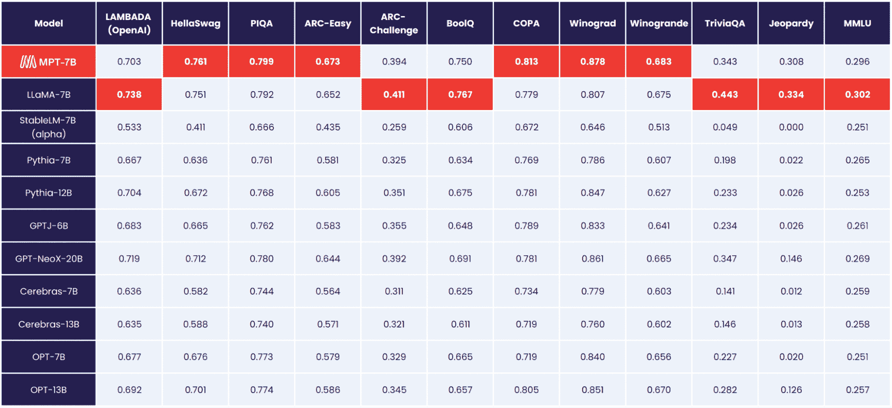

# 介绍 MPT-7B：一款全新的开源 LLM

> 原文：[`www.kdnuggets.com/2023/05/introducing-mpt7b-new-opensource-llm.html`](https://www.kdnuggets.com/2023/05/introducing-mpt7b-new-opensource-llm.html)

图片由作者提供

大型语言模型（LLM）目前正变得疯狂。然而，作为一个组织，如果没有合适的资源，可能很难跟上大型语言模型的潮流。训练和部署大型语言模型可能会很困难，你会突然感到被甩在了后面。开源 LLM，如 Meta 的 LLaMA 系列，使 LLM 资源变得可用。

另外，作为开源系列的最新补充是 [MosaicML Foundations](https://www.mosaicml.com/)' 最新款 [MPT-7B](https://huggingface.co/mosaicml/mpt-7b)。

# 什么是 MPT-7B？

MPT 代表 MosaicML 预训练变换器。MPT 模型是仅解码的 GPT 风格变换器，具有许多改进：

+   性能优化层实现

+   由于架构更改，训练稳定性更高

+   无上下文长度限制

MPT-7B 是一种转换器模型，使用 1T tokens 的文本和代码从头开始训练。是的，1 万亿！它在 MosaicML 平台上训练，耗时 9.5 天，完全没有人工干预。费用大约为 $200k。

它是开源的，可用于商业用途，这个工具将彻底改变企业和组织在预测分析和决策过程中的工作方式。

MPT-7B 的主要特点包括：

+   许可用于商业用途

+   训练数据量巨大（1T tokens）

+   可以处理极长的输入

+   针对快速训练和推理进行优化

+   高效的开源训练代码。

MPT-7B 是基础模型，已被证明优于其他开源 7B - 20B 模型。MPT-7B 的质量与 LLaMA-7B 相匹配。为了评估 MPT-7B 的质量，MosaicML Foundation 组织了 11 个开源基准，并以行业标准方式进行评估。

图片由 [MosaicML Foundation](https://www.mosaicml.com/blog/mpt-7b) 提供

MosaicML 基础模型也发布了三个额外微调的模型：

1.  MPT-7B-Instruct

1.  MPT-7B-Chat

1.  MPT-7B-StoryWriter-65k+

## MPT-7B-Instruct

[MPT-7B-Instruct](https://huggingface.co/mosaicml/mpt-7b-instruct) 模型用于短形式指令跟随。自 5 月 14 日以来，MPT-7B-Instruct 允许你提出快速简短的问题并立即获得回应。如果你有问题，想要一个简单的答案 - 使用 MPT-7B-Instruct。

为什么这如此出色？通常 LLMs 会根据提供的输入继续生成文本。然而，有些人希望 LLMs 将输入视为指令。指令微调使 LLMs 能够执行指令跟随输出。

## MPT-7B-Chat

是的，我们还有另一个聊天机器人。[MPT-7B-Chat](https://huggingface.co/mosaicml/mpt-7b-chat)生成对话。例如，如果您希望聊天机器人生成演讲稿，提供上下文，它将以对话的方式生成文本。或者，您可能想写一条推文，改写文章中的一段内容，它也可以为您生成对话！

为什么这如此出色？MPT-7B Chat 已经准备好并具备了进行各种对话任务的能力，能够为用户提供更无缝、更吸引人的多轮互动。

## MPT-7B-StoryWriter-65k+

这是给故事创作者的！对于那些想要编写长篇背景故事的人，[MPT-7B-StoryWriter-65k+](https://huggingface.co/mosaicml/mpt-7b-storywriter)是专门为此设计的模型。该模型通过对 MPT-7B 进行微调，拥有**65k tokens 的上下文长度**，并且可以超越 65k tokens 进行推断。MosaicML Foundation 在单节点 A100-80GB GPU 上成功生成了 84k tokens。

为什么这如此出色？因为大多数开源 LLMs 只能处理最多几千个 tokens 的序列。但只需在 MosaicML 平台上使用单节点 8xA100-80GB，您就可以微调 MPT-7B 以处理上下文长度高达 65k！

# 关于 MPT-7B 的更多构建细节

MosaicML 团队在仅仅几周内完成了这些模型的构建。他们在几周内处理了数据准备、训练、微调和部署。

数据来自各种来源，每个来源都有十亿个 tokens 可用。有效的 tokens 数量在每个来源中仍然保持在十亿！团队使用了[EleutherAI](https://www.eleuther.ai/)、[GPT-NeoX](https://aclanthology.org/2022.bigscience-1.9/)和[20B tokenizer](https://huggingface.co/docs/transformers/model_doc/gpt_neox)，使他们能够在多样化的数据上进行训练，应用一致的空格分隔符等。

所有 MPT-7B 模型都在[MosaicML 平台](https://www.mosaicml.com/training)上训练，使用了来自 Oracle Cloud 的 A100-40GB 和 A100-80GB GPU。

如果您想了解更多关于 MPT-7B 的工具和成本，请阅读：[MPT-7B 博客](https://www.mosaicml.com/blog/mpt-7b)。

# 总结

MosaicML 平台可以被视为组织建立自定义 LLMs 的最佳起点，无论是私有的、商业的还是社区相关的。拥有这一开源资源将使组织在使用这些工具以改善当前组织挑战时感到更加自由。

客户能够在任何计算提供商或数据源上训练 LLMs，同时保持效率、隐私和成本透明度。

你认为你将如何使用 MPT-7B？在下面的评论中告诉我们

**[Nisha Arya](https://www.linkedin.com/in/nisha-arya-ahmed/)** 是一名数据科学家、自由技术作家和 KDnuggets 的社区经理。她特别关注提供数据科学职业建议或教程，以及围绕数据科学的理论知识。她还希望探索人工智能如何有助于延长人类寿命。作为一名热衷于学习的人员，她寻求拓宽技术知识和写作技能，同时帮助指导他人。

* * *

## 我们的前三大课程推荐

 1\. [Google 网络安全证书](https://www.kdnuggets.com/google-cybersecurity) - 快速进入网络安全职业生涯

 2\. [Google 数据分析专业证书](https://www.kdnuggets.com/google-data-analytics) - 提升你的数据分析能力

 3\. [Google IT 支持专业证书](https://www.kdnuggets.com/google-itsupport) - 支持你的组织的 IT 需求

* * *

### 更多相关主题

+   [介绍 MetaGPT 的数据解释器：SOTA 开源 LLM 基础的…](https://www.kdnuggets.com/metagpt-data-interpreter-open-source-llm-based-data-solutions)

+   [Web LLM：将 LLM 聊天机器人带到浏览器](https://www.kdnuggets.com/2023/05/webllm-bring-llm-chatbots-browser.html)

+   [介绍自然语言处理的测试库](https://www.kdnuggets.com/2023/04/introducing-testing-library-natural-language-processing.html)

+   [来自 John Snow Labs 的医疗专用大型语言模型介绍](https://www.kdnuggets.com/2023/04/john-snow-introducing-healthcare-specific-large-language-models-john-snow-labs.html)

+   [介绍 OpenChat：一个免费的、简单的平台，用于构建…](https://www.kdnuggets.com/2023/06/introducing-openchat-free-simple-platform-building-custom-chatbots-minutes.html)

+   [介绍 OpenLLM：LLMs 的开源库](https://www.kdnuggets.com/2023/07/introducing-openllm-open-source-library-llms.html)
