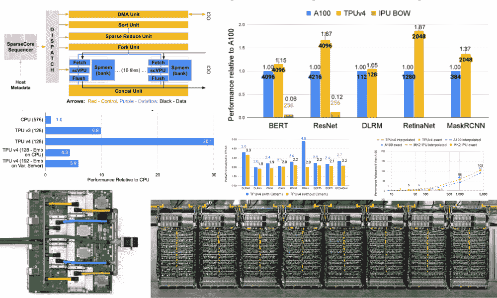
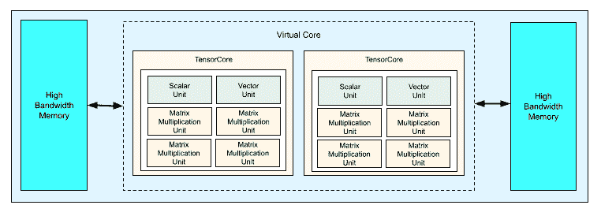
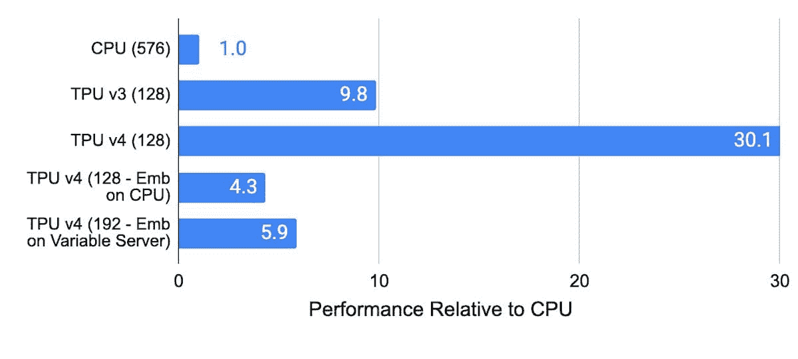
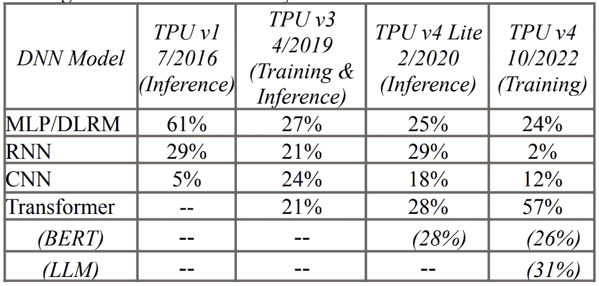

# 介绍 TPU v4: 谷歌前沿超级计算机用于大型语言模型

> 原文：[`www.kdnuggets.com/2023/04/introducing-tpu-v4-googles-cutting-edge-supercomputer-large-language-models.html`](https://www.kdnuggets.com/2023/04/introducing-tpu-v4-googles-cutting-edge-supercomputer-large-language-models.html)

图片来源：编辑

机器学习和人工智能似乎在以非常快的速度增长，以至于有些人甚至跟不上。随着这些机器学习模型的不断进步，它们将需要更好的基础设施和硬件支持来维持运行。机器学习的进步直接推动了计算性能的扩展。让我们进一步了解 TPU v4。

* * *

## 我们的三大课程推荐

 1\. [谷歌网络安全证书](https://www.kdnuggets.com/google-cybersecurity) - 快速进入网络安全职业生涯。

 2\. [谷歌数据分析专业证书](https://www.kdnuggets.com/google-data-analytics) - 提升您的数据分析技能

 3\. [谷歌 IT 支持专业证书](https://www.kdnuggets.com/google-itsupport) - 支持您的组织的 IT

* * *

# 什么是 TPU v4？

TPU 代表张量处理单元，它们被设计用于机器学习和深度学习应用。TPU 是谷歌发明的，构造方式使其能够处理机器学习和人工智能的高计算需求。

当谷歌设计 TPU 时，他们将其设计为特定领域架构，这意味着它被设计为矩阵处理器，而不是通用处理器，从而专注于神经网络工作负载。这解决了谷歌的内存访问问题，这一问题使得 GPU 和 CPU 的速度减慢，导致它们使用更多的处理能力。

那么，TPU v2、v3，现在是 v4。v2 到底是什么？

TPU v2 芯片包含两个 TensorCores、四个 MXUs、一个矢量单元和一个标量单元。见下图：

图片来源：[Google](https://cloud.google.com/tpu/docs/system-architecture-tpu-vm)

## 光学电路交换机（OCSes）

TPU v4 是首个部署可重构光学电路交换机的超级计算机。光学电路交换机（OCS）被认为更有效。它们减少了以前网络中的拥堵，因为它们在发生时进行传输。OCS 提高了可扩展性、可用性、模块化、部署、安全性、功率、性能等。

TPU v4 中的 OCS 和其他光学组件占 TPU v4 系统成本的不到 5%，系统功耗的不到 5%。

## SparseCores

TPU v4 也是首个具有硬件支持嵌入的超级计算机。神经网络在密集向量上训练效果良好，而嵌入是将类别特征值转换为密集向量的最有效方式。TPU v4 包含第三代 SparseCores，这些数据流处理器加速了依赖于嵌入的机器学习模型。

例如，嵌入函数可以将英文单词翻译为较小的密集空间，每个单词表示为 100 维向量。嵌入是深度学习推荐模型（DLRMs）的关键元素，它们存在于我们日常生活中，用于广告、搜索排名、YouTube 等。

下图展示了在 CPU、TPU v3、TPU v4（使用 SparseCore）和 TPU v4（在 CPU 内存中使用嵌入，不使用 SparseCore）上的推荐模型性能。可以看到，TPU v4 SparseCore 在推荐模型上比 TPU v3 快 3 倍，比使用 CPU 的系统快 5 到 30 倍。

图片由 [Google](https://cloud.google.com/blog/topics/systems/tpu-v4-enables-performance-energy-and-co2e-efficiency-gains) 提供

## 性能

TPU v4 的性能比 TPU v3 高 2.1 倍，性能/瓦特比提高了 2.7 倍。TPU v4 体积增大了 4 倍，达到 4096 个芯片，使其速度提高了 10 倍。OCS 的实现和灵活性也大大助力于大型语言模型。

TPU v4 超级计算机的性能和可用性正被广泛考虑用于改进大型语言模型，如 LaMDA、MUM 和 PaLM。540B 参数的 PaLM 模型在 TPU v4 上训练了超过 50 天，硬件浮点性能达到了令人惊叹的 57.8%。

TPU v4 还具有多维模型分区技术，使大型语言模型的低延迟、高吞吐量推理成为可能。

## 能效

随着全球公司为提升整体能效而制定更多法律法规，TPU v4 表现不俗。Google Cloud 中的 TPU v4 使用的能量比当代 DSA 少 ~2-6 倍，CO2e 排放量比典型的本地数据中心少 ~20 倍。

# 机器学习工作负载的变化

既然你对 TPU v4 了解更多了，你可能想知道机器学习工作负载在 TPU v4 上实际变化有多快。

下表展示了按深度神经网络模型类型的工作负载和使用的 TPU 百分比。Google 90%以上的训练在 TPU 上进行，这张表显示了 Google 生产工作负载的快速变化。

递归神经网络（RNN）的应用有所下降，因为 RNN 是一次性处理输入，而与之相比，变换模型在自然语言翻译和文本摘要方面更为出色。

要了解更多关于 TPU v4 能力的信息，请阅读研究论文 [TPU v4: 一种用于机器学习的光学可重构超级计算机，支持嵌入的硬件](https://arxiv.org/pdf/2304.01433.pdf)。

# 总结

去年，TPU v4 超级计算机在谷歌云的机器学习集群中向 AI 研究人员和开发者开放。该[论文](https://arxiv.org/pdf/2304.01433.pdf)的作者声称 TPU v4 比 Nvidia A100 更快且功耗更低。然而，由于 Nvidia H100 GPU 的有限供应和其 4nm 架构，他们尚未能将 TPU v4 与更新的 Nvidia H100 GPU 进行比较，而 TPU v4 采用的是 7nm 架构。

你认为 TPU v4 的能力是什么，它的局限性如何，它是否比 Nvidia A100 GPU 更好？

**[尼莎·阿亚](https://www.linkedin.com/in/nisha-arya-ahmed/)** 是一名数据科学家、自由职业技术写作者及 KDnuggets 的社区经理。她特别关注于提供数据科学职业建议或教程，以及围绕数据科学的理论知识。她还希望探索人工智能如何在延长人类寿命方面发挥作用。作为一个热衷学习者，她寻求拓宽技术知识和写作技能，同时帮助指导他人。

### 了解更多相关话题

+   [介绍 John Snow Labs 的医疗保健专用大型语言模型](https://www.kdnuggets.com/2023/04/john-snow-introducing-healthcare-specific-large-language-models-john-snow-labs.html)

+   [通过整合 Jupyter 和 KNIME 缩短实施时间](https://www.kdnuggets.com/2021/12/cutting-implementation-time-integrating-jupyter-knime.html)

+   [顶级开源大型语言模型](https://www.kdnuggets.com/2022/09/john-snow-top-open-source-large-language-models.html)

+   [了解大型语言模型](https://www.kdnuggets.com/2023/03/learn-large-language-models.html)

+   [什么是大型语言模型，它们是如何工作的？](https://www.kdnuggets.com/2023/05/large-language-models-work.html)

+   [AI: 大型语言和视觉模型](https://www.kdnuggets.com/2023/06/ai-large-language-visual-models.html)
