# 自编码器和变分自编码器（VAE）介绍

> 原文：[`www.kdnuggets.com/2021/10/introduction-autoencoder-variational-autoencoder-vae.html`](https://www.kdnuggets.com/2021/10/introduction-autoencoder-variational-autoencoder-vae.html)

评论

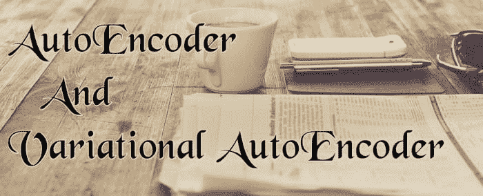

*[图片来源](https://www.quantilus.com/will-this-video-go-viral-explaining-and-predicting-the-popularity-of-youtube-videos/)*

* * *

## 我们的三大推荐课程

 1\. [谷歌网络安全证书](https://www.kdnuggets.com/google-cybersecurity) - 快速进入网络安全职业生涯。

 2\. [谷歌数据分析专业证书](https://www.kdnuggets.com/google-data-analytics) - 提升你的数据分析技能

 3\. [谷歌 IT 支持专业证书](https://www.kdnuggets.com/google-itsupport) - 支持你的组织的 IT

* * *

近年来，基于深度学习的生成模型因在人工智能（AI）领域取得的惊人进展而越来越受到关注。依靠大量的数据、精心设计的网络架构和智能训练技术，深度生成模型展示了生成各种高度逼真内容的惊人能力，例如图像、文本和声音。

在本文中，我们将深入探讨这些生成网络，特别是自编码器、变分自编码器（VAE）及其使用 Keras 的实现。

## 什么是自编码器？

自编码器（AE）是旨在将其输入复制到输出的神经网络。它们通过将输入压缩成潜在空间表示，然后从该表示重建输出。

自编码器由两个主要组件组成：

+   **编码器：** 学习将输入数据压缩（减少）成编码表示。

+   **解码器：** 学习从编码表示中重建原始数据，使其尽可能接近原始输入。

+   **瓶颈/潜在空间：** 包含输入数据压缩表示的层。

+   **重建损失：** 该方法测量解码器的表现，即衡量编码和解码向量之间的差异。差异越小越好。

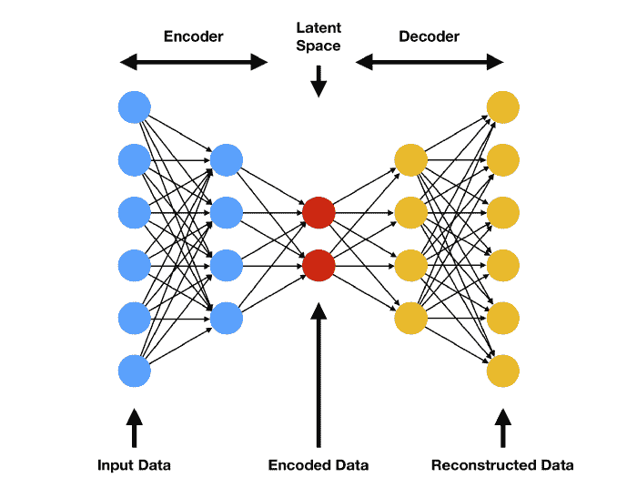

*[自编码器](https://www.compthree.com/blog/autoencoder/)。*

该模型涉及由**ϕ**参数化的编码函数**g**和由**θ**参数化的解码函数**f**。瓶颈层是：

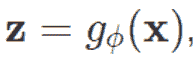

重建的输入：

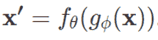

为了测量重建损失，我们可以使用交叉熵（当激活函数是 sigmoid 时）或基本的**均方误差（MSE）**：

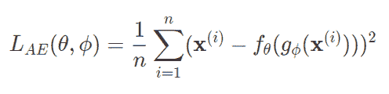

### 香草自编码器的类型

+   **欠完备自编码器：** 一个潜在空间小于输入维度的自编码器称为欠完备。学习一个欠完备的表示会迫使自编码器捕捉训练数据中最显著的特征。

+   **正则化自编码器：** 它们使用一个损失函数，鼓励模型除了具备将输入复制到输出的能力之外，还有其他属性。在实践中，我们通常会发现两种类型的正则化自编码器：稀疏自编码器和去噪自编码器。

+   **稀疏自编码器：** 稀疏自编码器通常用于学习另一任务的特征，比如分类。一个被正则化为稀疏的自编码器必须响应它训练过的数据集的独特统计特征，而不仅仅是作为一个恒等函数。这样，通过带有稀疏性惩罚的复制任务训练可以产生一个作为副产品学习到有用特征的模型。

+   **去噪自编码器：** 目标不再是重建输入数据。我们可以通过改变损失函数的重建误差项来获得一个学习有用东西的自编码器。这可以通过向输入图像添加一些噪声并让自编码器学习去除它来实现。这样，编码器将提取最重要的特征并学习数据的稳健表示。

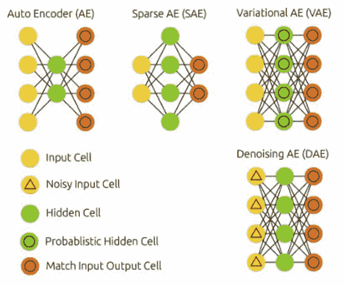

*不同类型的自编码器。*

### 自编码器的应用

传统自编码器主要有两个应用：

+   **噪声去除：** 如上所述，噪声去除是从图像中去除噪声的过程。音频和图像都有噪声减少技术。

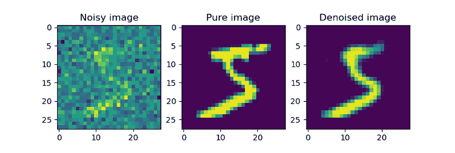

*[去噪图像](https://www.machinecurve.com/index.php/2019/12/20/building-an-image-denoiser-with-a-keras-autoencoder-neural-network/)。*

+   **降维：** 由于编码器部分学习输入数据的低维表示，当你希望进行降维时，自编码器的编码器部分很有用。这在例如主成分分析（PCA）不起作用时尤其有用，但你怀疑非线性降维（即，使用具有非线性激活函数的神经网络）有效。

+   **异常检测：** 通过学习在某些约束条件下复制训练数据中最显著的特征，模型被鼓励准确重现最频繁观察到的特征。当遇到异常时，模型的重构性能应会变差。在大多数情况下，仅使用正常实例的数据来训练自编码器。训练后，自编码器将准确重构“正常”数据，而无法处理不熟悉的异常数据。重构误差（原始数据与其低维重构之间的误差）被用作异常分数来检测异常。

+   **机器翻译：** 自编码器已被应用于机器翻译，这通常被称为神经机器翻译（NMT）。与传统自编码器不同，输出不与输入匹配——它是另一种语言。在 NMT 中，文本被视为要编码到学习过程中的序列，而在解码器一侧，则生成目标语言中的序列。

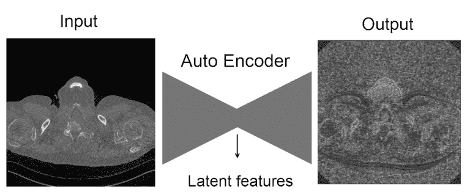

*[降维操作](https://www.kaggle.com/c/osic-pulmonary-fibrosis-progression/discussion/167025)。*

### Keras 自编码器实现

让我们使用著名的 MNIST 数据集并应用自编码器来重建它。MNIST 数据集由 70000 张 28 像素乘 28 像素的手写数字图像和 70000 个包含每个数字信息的向量组成。

```py
# We create a simple AE with a single fully-connected neural layer as encoder and as decoder:

import numpy as np
import keras
from keras import layers
from keras.datasets import mnist
import matplotlib.pyplot as plt

# This is the size of our encoded representations
encoding_dim = 32  # 32 floats -> compression of factor 24.5, assuming the input is 784 floats

# This is our input image
input_img = keras.Input(shape=(784,))

# "encoded" is the encoded representation of the input
encoded = layers.Dense(encoding_dim, activation='relu')(input_img)

# "decoded" is the lossy reconstruction of the input
decoded = layers.Dense(784, activation='sigmoid')(encoded)

# This model maps an input to its reconstruction
autoencoder = keras.Model(input_img, decoded)

# Let's also create a separate encoder model:
# This model maps an input to its encoded representation
encoder = keras.Model(input_img, encoded)

# As well as the decoder model:
# This is our encoded (32-dimensional) input
encoded_input = keras.Input(shape=(encoding_dim,))

# Retrieve the last layer of the autoencoder model
decoder_layer = autoencoder.layers[-1]

# Create the decoder model
decoder = keras.Model(encoded_input, decoder_layer(encoded_input))

# Now let's train our autoencoder to reconstruct MNIST digits.
# First, we'll configure our model to use a per-pixel binary crossentropy loss, and the Adam optimizer:

autoencoder.compile(optimizer='adam', loss='binary_crossentropy')

#Let's prepare our input data. We're using MNIST digits, and we're discarding the labels (since we're only interested in encoding/decoding the input images).

(x_train, _), (x_test, _) = mnist.load_data()

# We will normalize all values between 0 and 1 and we will flatten the 28x28 images into vectors of size 784.

x_train = x_train.astype('float32') / 255.
x_test = x_test.astype('float32') / 255.
x_train = x_train.reshape((len(x_train), np.prod(x_train.shape[1:])))
x_test = x_test.reshape((len(x_test), np.prod(x_test.shape[1:])))

# Now let's train our autoencoder for 50 epochs:
autoencoder.fit(x_train, x_train,
                epochs=50,
                batch_size=256,
                shuffle=True,
                validation_data=(x_test, x_test))

# After 50 epochs, the autoencoder seems to reach a stable train/validation loss value of about 0.09\. We can try to visualize the reconstructed inputs and the encoded representations. We will use Matplotlib.

# Encode and decode some digits
# Note that we take them from the *test* set

encoded_imgs = encoder.predict(x_test)
decoded_imgs = decoder.predict(encoded_imgs)
n = 10  # Number of digits to display
plt.figure(figsize=(20, 4))

for i in range(n):
    # Display original
    ax = plt.subplot(2, n, i + 1)
    plt.imshow(x_test[i].reshape(28, 28))
    plt.gray()
    ax.get_xaxis().set_visible(False)
    ax.get_yaxis().set_visible(False)

# Display reconstruction
    ax = plt.subplot(2, n, i + 1 + n)
    plt.imshow(decoded_imgs[i].reshape(28, 28))
    plt.gray()
    ax.get_xaxis().set_visible(False)
    ax.get_yaxis().set_visible(False)
plt.show()

```

这是我们得到的结果。顶部一排是原始数字，底部一排是重建的数字。使用这种基本方法，我们失去了相当多的细节。

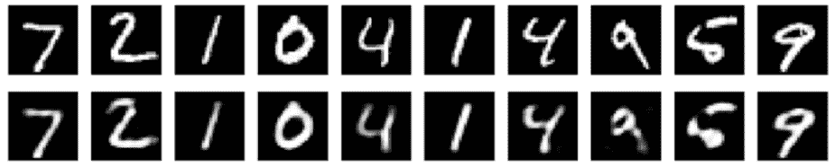

### 自编码器在内容生成中的局限性

训练自编码器之后，我们可能会考虑是否可以利用该模型生成新内容。特别地，我们可能会问，是否可以从那个潜在空间中随机生成一个点并解码以获得新内容？

答案是“是的”，但生成数据的质量和相关性取决于潜在空间的规则性。潜在空间规则性取决于初始数据的分布、潜在空间的维度以及编码器的架构。很难事先确保编码器会以与我提到的生成过程兼容的聪明方式组织潜在空间。没有正则化意味着过拟合，这会导致解码后某些点的内容无意义。

我们如何确保潜在空间的正则化程度足够？我们可以在训练过程中明确引入正则化。因此，我们引入了**变分自编码器**。

## 什么是变分自编码器（VAE）？

变分自编码器（VAE）是对自编码的一个稍微现代化且有趣的变体。

VAE 假设源数据具有某种潜在概率分布（例如高斯分布），然后尝试找到该分布的参数。实现变分自编码器比实现自编码器要复杂得多。变分自编码器的主要用途之一是生成与原始源数据相关的新数据。现在，确切地说这些额外数据有什么用处很难说明。变分自编码器是一个生成系统，类似于生成对抗网络（尽管 GAN 的工作方式大相径庭）。

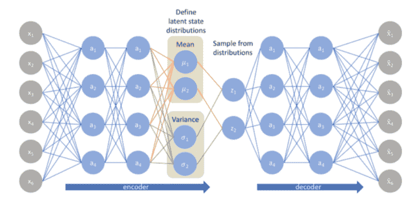

*[变分自编码器(VAE)](https://stats.stackexchange.com/questions/423758/variational-autoencoder-understanding-this-diagram)。*

### 变分自编码器（VAE）背后的数学

VAE 使用 [KL 散度](https://www.countbayesie.com/blog/2017/5/9/kullback-leibler-divergence-explained) 作为其损失函数。其目标是最小化假设分布与数据集原始分布之间的差异。

假设我们有一个分布 **z**，我们想从中生成观察值 **x**。换句话说，我们想计算：


我们可以通过以下方式实现：

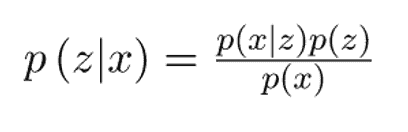

但是，**p(x)** 的计算可以通过积分完成，如下所示：

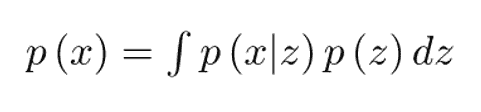

这通常使得它成为一个难以处理的分布（需要等于或更多的指数时间）。因此，我们需要将 **p(z|x)** 近似为 **q(z|x)** 以使其成为一个可处理的分布。为了更好地将 **p(z|x)** 近似为 **q(z|x)**，我们将最小化 **KL 散度** 损失，这样可以计算两个分布之间的相似性：

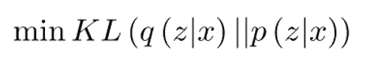

通过简化，上述最小化问题等同于以下最大化问题：

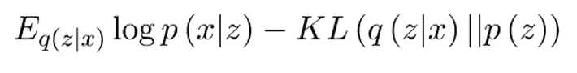

第一项表示重建似然性，另一项确保我们学习到的分布 **q** 与真实的先验分布 **p** 相似。

因此，我们的总损失由两个部分组成，一个是重建误差，另一个是 KL 散度损失：

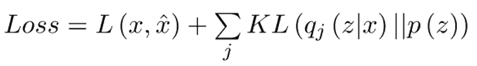

### 变分自编码器（VAE）的 Keras 实现

为了实现 VAE，首先，编码器网络将输入样本 **x** 转换为潜在空间中的两个参数，我们将其标记为 **z_mean** 和 **z_log_sigma**。然后，我们通过 **z = z_mean + exp(z_log_sigma) * epsilon** 从假设生成数据的潜在正态分布中随机采样相似点 z，其中 epsilon 是一个随机正态张量。

最终，解码器网络将这些潜在空间点映射回原始输入数据。

模型的参数通过两个损失函数进行训练：一个是**重建损失**，强制解码样本与初始输入匹配（就像在我们之前的自编码器中一样），另一个是**KL 散度**，用于表示学习到的潜在分布与先验分布之间的差异，作为正则化项。你实际上可以完全去掉这个后者的项，尽管它有助于学习良好的潜在空间并减少对训练数据的过拟合。

```py
# First, here's our encoder network, mapping inputs to our latent distribution parameters:
original_dim = 28 * 28
intermediate_dim = 64
latent_dim = 2

inputs = keras.Input(shape=(original_dim,))
h = layers.Dense(intermediate_dim, activation='relu')(inputs)
z_mean = layers.Dense(latent_dim)(h)
z_log_sigma = layers.Dense(latent_dim)(h)

# We can use these parameters to sample new similar points from the latent space:
from keras import backend as K

def sampling(args):
    z_mean, z_log_sigma = args
    epsilon = K.random_normal(shape=(K.shape(z_mean)[0], latent_dim), mean=0., stddev=0.1)
    return z_mean + K.exp(z_log_sigma) * epsilon

z = layers.Lambda(sampling)([z_mean, z_log_sigma])

# Finally, we can map these sampled latent points back to reconstructed inputs:
# Create encoder
encoder = keras.Model(inputs, [z_mean, z_log_sigma, z], name='encoder')

# Create decoder
latent_inputs = keras.Input(shape=(latent_dim,), name='z_sampling')
x = layers.Dense(intermediate_dim, activation='relu')(latent_inputs)
outputs = layers.Dense(original_dim, activation='sigmoid')(x)

decoder = keras.Model(latent_inputs, outputs, name='decoder')

# Instantiate VAE model
outputs = decoder(encoder(inputs)[2])

vae = keras.Model(inputs, outputs, name='vae_mlp')

# We train the model using the end-to-end model, with a custom loss function: the sum of a reconstruction term, and the KL divergence regularization term.

reconstruction_loss = keras.losses.binary_crossentropy(inputs, outputs)
reconstruction_loss *= original_dim
kl_loss = 1 + z_log_sigma - K.square(z_mean) - K.exp(z_log_sigma)
kl_loss = K.sum(kl_loss, axis=-1)
kl_loss *= -0.5
vae_loss = K.mean(reconstruction_loss + kl_loss)
vae.add_loss(vae_loss)

vae.compile(optimizer='adam')

(x_train, y_train), (x_test, y_test) = mnist.load_data()
x_train = x_train.astype('float32') / 255.
x_test = x_test.astype('float32') / 255.
x_train = x_train.reshape((len(x_train), np.prod(x_train.shape[1:])))
x_test = x_test.reshape((len(x_test), np.prod(x_test.shape[1:])))

# We train our VAE on MNIST digits:
vae.fit(x_train, x_train,
        epochs=100,
        batch_size=32,
        validation_data=(x_test, x_test))

```

现在，由于我们的潜在空间是二维的，可以做一些很棒的可视化。例如，可以观察潜在二维平面上不同类别的邻域：

```py
x_test_encoded = encoder.predict(x_test, batch_size=batch_size)
plt.figure(figsize=(6, 6))
plt.scatter(x_test_encoded[:, 0], x_test_encoded[:, 1], c=y_test)
plt.colorbar()
plt.show()

```

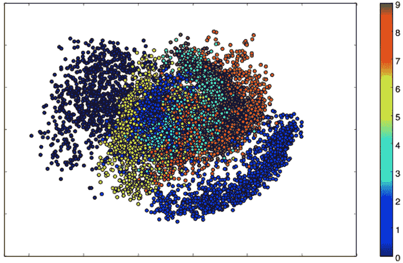

*潜在二维平面上的不同数字。*

每个这些彩色集群代表一种数字。在上面的图中，接近的集群是结构上相似的数字（即，在潜在空间中共享信息的数字）。

由于 VAE 是生成模型，我们还可以使用它生成新的数字！在这里，我们将扫描潜在平面，以规则的间隔采样潜在点，并为这些点生成相应的数字。这为我们提供了一个可视化的潜在流形，该流形“生成”MNIST 数字。

```py
# Display a 2D manifold of the digits
n = 15  # figure with 15x15 digits
digit_size = 28
figure = np.zeros((digit_size * n, digit_size * n))
# We will sample n points within [-15, 15] standard deviations
grid_x = np.linspace(-15, 15, n)
grid_y = np.linspace(-15, 15, n)
for i, yi in enumerate(grid_x):
    for j, xi in enumerate(grid_y):
        z_sample = np.array([[xi, yi]])
        x_decoded = decoder.predict(z_sample)
        digit = x_decoded[0].reshape(digit_size, digit_size)
        figure[i * digit_size: (i + 1) * digit_size,
               j * digit_size: (j + 1) * digit_size] = digit
plt.figure(figsize=(10, 10))
plt.imshow(figure)
plt.show()

```

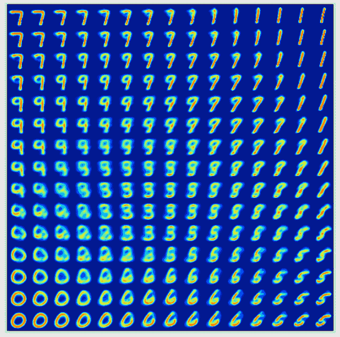

*使用 VAE 生成数字。*

## 变分自编码器（VAE）与生成对抗网络（GAN）

VAE 和 GAN 都是使用无监督学习来学习基础数据分布的非常激动人心的方法。与 VAE 相比，GAN 通常能获得更好的结果。

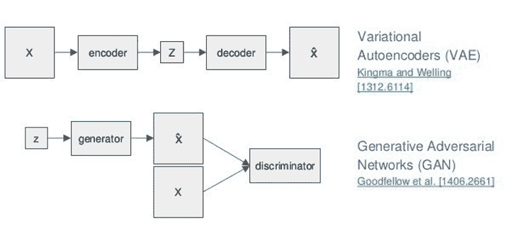

*[VAE 和 GAN 的网络架构](https://towardsdatascience.com/what-a-disentangled-net-we-weave-representation-learning-in-vaes-pt-1-9e5dbc205bd1)。*

GAN 的生成器从一个相对低维的随机变量中采样并生成图像。然后，判别器对该图像进行处理，预测该图像是否属于目标分布。一旦训练完成，我只需通过采样初始随机变量并将其传递通过生成器，就能生成各种图像。

VAE 的编码器从目标分布中获取一张图像，并将其压缩到低维潜在空间中。然后，解码器的任务是将该潜在空间表示转换回原始图像。一旦网络训练完成，我可以生成各种图像的潜在空间表示，并在这些表示之间进行插值，然后通过解码器生成新图像。

这两种技术不同，因为它们优化不同的目标函数。这并不是说其中一个会在所有情况下都获胜。它们在不同情况下会很有用。学习方法优化的目标函数应该理想地匹配我们希望应用它们的任务。从这个意义上说，理论表明：

+   GANs 应该在生成漂亮的样本方面表现最好——避免生成看起来不真实的样本，但可能会低估数据的熵。

+   VAEs 应该在压缩数据方面表现最佳，因为它们最大化（一个下界）似然性。也就是说，评估 VAE 模型中的似然性是不可处理的，因此不能非常直接地用于直接熵编码。

+   目前有许多模型可以计算似然性，如 pixel-RNNs、空间 LSTMs、RIDE、NADE、NICE 等。这些模型在压缩性能方面（无损熵编码下的最短平均码长）也应该表现最佳。

我推荐一篇比较 GANs 和 VAEs 模型的论文：[A Probe Towards Understanding GAN and VAE Models](https://arxiv.org/pdf/1812.05676.pdf)

## 结论

正如我们在本文中所见，自动编码器是一种神经网络架构，能够在数据中开创结构，以开发输入数据/图像的压缩表示。存在许多不同的自动编码器架构变体，其目标是确保压缩表示能够表示原始输入数据的显著特征；通常，使用自动编码器时最大的挑战是使模型真正学习到有意义和可泛化的潜在空间表示。

我们还研究了变分自动编码器在生成有意义表示方面的表现如何更好，并且它们也可以用作生成模型。此外，我们看到了 VAEs 与生成对抗网络（GANs）之间的不同。

***致谢：***

+   [`www.jeremyjordan.me/variational-autoencoders/`](https://www.jeremyjordan.me/variational-autoencoders/)

+   [`www.countbayesie.com/blog/2017/5/9/kullback-leibler-divergence-explained`](https://www.countbayesie.com/blog/2017/5/9/kullback-leibler-divergence-explained)

+   [`blog.keras.io/building-autoencoders-in-keras.html`](https://blog.keras.io/building-autoencoders-in-keras.html)

+   [`towardsdatascience.com/understanding-variational-autoencoders-vaes-f70510919f73`](https://towardsdatascience.com/understanding-variational-autoencoders-vaes-f70510919f73)

[原文](https://www.theaidream.com/post/an-introduction-to-autoencoder-and-variational-autoencoder-vae). 经许可转载。

**相关：**

+   [无监督学习在预测性维护中的应用：自动编码器](https://www.kdnuggets.com/2021/01/unsupervised-learning-predictive-maintenance-auto-encoders.html)

+   [神经网络 201：自动编码器全解](https://www.kdnuggets.com/2019/11/all-about-autoencoders.html)

+   [变分自动编码器详细解释](https://www.kdnuggets.com/2018/11/variational-autoencoders-explained.html)

### 更多相关主题

+   [停止学习数据科学以寻找目的，并寻找目的…](https://www.kdnuggets.com/2021/12/stop-learning-data-science-find-purpose.html)

+   [一个 $9B 的 AI 失败，经过审查](https://www.kdnuggets.com/2021/12/9b-ai-failure-examined.html)

+   [数据科学学习统计的顶级资源](https://www.kdnuggets.com/2021/12/springboard-top-resources-learn-data-science-statistics.html)

+   [成功数据科学家的 5 个特征](https://www.kdnuggets.com/2021/12/5-characteristics-successful-data-scientist.html)

+   [是什么使 Python 成为初创公司的理想编程语言](https://www.kdnuggets.com/2021/12/makes-python-ideal-programming-language-startups.html)

+   [每个数据科学家都应该知道的三个 R 库（即使你使用 Python）](https://www.kdnuggets.com/2021/12/three-r-libraries-every-data-scientist-know-even-python.html)
