# 使用 PyCaret 的二分类介绍

> 原文：[`www.kdnuggets.com/2021/12/introduction-binary-classification-pycaret.html`](https://www.kdnuggets.com/2021/12/introduction-binary-classification-pycaret.html)

评论

**作者 [Moez Ali](https://www.linkedin.com/in/profile-moez/)，PyCaret 创始人及作者**


图片由 [Mike U](https://unsplash.com/@roguewild?utm_source=medium&utm_medium=referral) 提供，来自 [Unsplash](https://unsplash.com/?utm_source=medium&utm_medium=referral)

* * *

## 我们的三大课程推荐

 1. [Google 网络安全证书](https://www.kdnuggets.com/google-cybersecurity) - 快速进入网络安全职业生涯。

 2. [Google 数据分析专业证书](https://www.kdnuggets.com/google-data-analytics) - 提升你的数据分析水平

 3. [Google IT 支持专业证书](https://www.kdnuggets.com/google-itsupport) - 支持你的组织的 IT

* * *

## 1.0 介绍

[PyCaret](https://www.pycaret.org/) 是一个开源的低代码机器学习库，旨在自动化机器学习工作流。它是一个端到端的机器学习和模型管理工具，能显著加快实验周期，提高生产力。

相较于其他开源机器学习库，PyCaret 是一个替代的低代码库，可以用少量代码替代数百行代码。这使得实验变得极快且高效。PyCaret 实质上是围绕多个机器学习库和框架（如 scikit-learn、XGBoost、LightGBM、CatBoost、spaCy、Optuna、Hyperopt、Ray 等）构建的 Python 封装库。

PyCaret 的设计和简洁性受到了公民数据科学家新兴角色的启发，这一术语最初由 Gartner 提出。公民数据科学家是那些可以执行简单和中等复杂度分析任务的高级用户，这些任务以前需要更多的技术专长。

要了解更多关于 PyCaret 的信息，可以查看官方 [网站](https://www.pycaret.org/) 或 [GitHub](https://www.github.com/pycaret/pycaret)。

## 2.0 教程目标

在本教程中，我们将学习：

+   **获取数据：** 如何从 PyCaret 库中导入数据

+   **环境设置：** 如何在 PyCaret 中设置实验并开始构建分类模型

+   **创建模型：** 如何创建模型，进行分层交叉验证并评估分类指标

+   **调整模型：** 如何自动调整分类模型的超参数

+   **绘图模型：** 如何使用各种图表分析模型性能

+   **确定模型：** 如何在实验结束时确定最佳模型

+   **预测模型：** 如何对未见数据进行预测

+   **保存/加载模型：** 如何保存/加载模型以备将来使用

## 3.0 安装 PyCaret

安装很简单，只需几分钟。PyCaret 从 pip 的默认安装仅安装`requirements.txt`文件中列出的硬依赖项。

```py
pip install pycaret
```

要安装完整版本：

```py
pip install pycaret[full] 
```

## 4.0 什么是二分类？

二分类是一种监督式机器学习技术，其目标是预测离散且无序的类别标签，如通过/失败、正面/负面、违约/未违约等。以下是一些分类的实际应用场景：

+   医疗测试以确定患者是否患有某种疾病——分类属性是疾病的存在。

+   一种“通过或不通过”的测试方法或工厂质量控制，即决定一个规范是否满足——一种“通过/不通过”分类。

+   信息检索，即决定某个页面或文章是否应该出现在搜索结果集中——分类属性是文章的相关性或对用户的有用性。

## 5.0 PyCaret 分类模块概述

PyCaret 的 [分类模块](https://pycaret.readthedocs.io/en/latest/api/classification.html)（`pycaret.classification`）是一个监督式机器学习模块，用于基于各种技术和算法将元素分类到二进制组中。一些常见的分类问题使用场景包括预测客户违约（是或否）、客户流失（客户会离开还是留下）、疾病发现（阳性或阴性）。

PyCaret 的分类模块可以用于二分类或多分类问题。它包含超过 18 种算法和 14 种图表，用于分析模型的性能。不论是超参数调整、集成，还是像堆叠这样的高级技术，PyCaret 的分类模块应有尽有。

## 6.0 教程数据集

本教程将使用来自 UCI 的数据集，称为 [**信用卡客户违约数据集**](https://archive.ics.uci.edu/ml/datasets/default+of+credit+card+clients)。该数据集包含有关违约支付、人口统计因素、信用数据、支付历史和信用卡客户账单的信 息，数据时间范围从 2005 年 4 月到 2005 年 9 月，共有 24,000 个样本和 25 个特征。每一列的简短描述如下：

+   **ID：** 每个客户的 ID

+   **信用额度：** 以新台币为单位的信用额度（包括个人和家庭/附加信用）

+   **性别：** 性别（1=男性，2=女性）

+   **教育背景：** （1=研究生院，2=大学，3=高中，4=其他，5=未知，6=未知）

+   **婚姻状况：** 婚姻状况（1=已婚，2=单身，3=其他）

+   **年龄：** 年龄（以年为单位）

+   **PAY_0 到 PAY_6：** 过去 n 个月的偿还状态（PAY_0 = 上个月 … PAY_6 = 6 个月前）（标签：-1=按时支付，1=延迟一个月付款，2=延迟两个月付款，… 8=延迟八个月付款，9=延迟九个月及以上）

+   **BILL_AMT1 到 BILL_AMT6：** 过去 n 个月的账单金额（BILL_AMT1 = 上个月 .. BILL_AMT6 = 6 个月前）

+   **PAY_AMT1 到 PAY_AMT6：** 过去 n 个月的支付金额（BILL_AMT1 = 上个月 .. BILL_AMT6 = 6 个月前）

+   **默认值：** 默认支付（1=是，0=否） `Target Column`

## 数据集致谢：

Lichman, M. (2013). UCI 机器学习库。加利福尼亚州欧文：加州大学信息与计算机科学学院。

## 7.0 获取数据

你可以从原始来源 [**找到这里**](https://archive.ics.uci.edu/ml/datasets/default+of+credit+card+clients) 下载数据，并使用 pandas [**（了解如何）**](https://pandas.pydata.org/pandas-docs/stable/reference/api/pandas.read_csv.html) 加载，或者你可以使用 PyCaret 的数据库，通过 `get_data()` 函数加载数据（这需要互联网连接）。

```py
**# loading the dataset** from pycaret.datasets import get_data
dataset = get_data('credit')
```

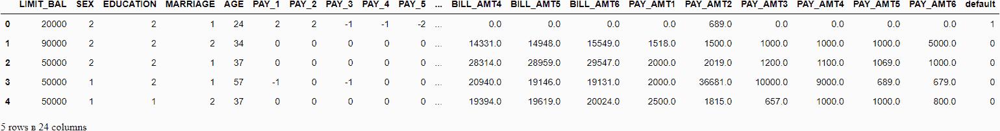

```py
**# check the shape of data** dataset.shape>>> (24000, 24)
```

为了演示 `predict_model` 函数在未见数据上的使用，从原始数据集中保留了 1200 条记录（约 5%）以便在最后进行预测。这不应与训练-测试-分割混淆，因为这种特定的分割是为了模拟实际场景。另一种理解方式是，这 1200 位客户在机器学习模型训练时并不可用。

```py
**# sample 5% of data to be used as unseen data**
data = dataset.sample(frac=0.95, random_state=786)
data_unseen = dataset.drop(data.index)
data.reset_index(inplace=True, drop=True)
data_unseen.reset_index(inplace=True, drop=True)**# print the revised shape** print('Data for Modeling: ' + str(data.shape))
print('Unseen Data For Predictions: ' + str(data_unseen.shape))>>> Data for Modeling: (22800, 24)
>>> Unseen Data For Predictions: (1200, 24)
```

## 8.0 在 PyCaret 中设置环境

PyCaret 中的 `setup` 函数初始化环境并创建用于建模和部署的转换管道。`setup` 必须在执行任何其他 pycaret 函数之前调用。它需要两个强制参数：一个 pandas 数据框和目标列的名称。所有其他参数都是可选的，可以用来定制预处理管道。

当 `setup` 执行时，PyCaret 的推断算法将根据某些属性自动推断所有特征的数据类型。数据类型应该被正确推断，但这并非总是如此。为了解决这个问题，PyCaret 会在执行 `setup` 后显示一个提示，要求确认数据类型。如果所有数据类型正确，你可以按 Enter 键，或输入 `quit` 退出设置。

确保数据类型正确在 PyCaret 中非常重要，因为它会自动执行多种特定类型的预处理任务，这对于机器学习模型至关重要。

另外，你还可以在 `setup` 中使用 `numeric_features` 和 `categorical_features` 参数来预定义数据类型。

```py
**# init setup** from pycaret.classification import *
s = setup(data = data, target = 'default', session_id=123)
```

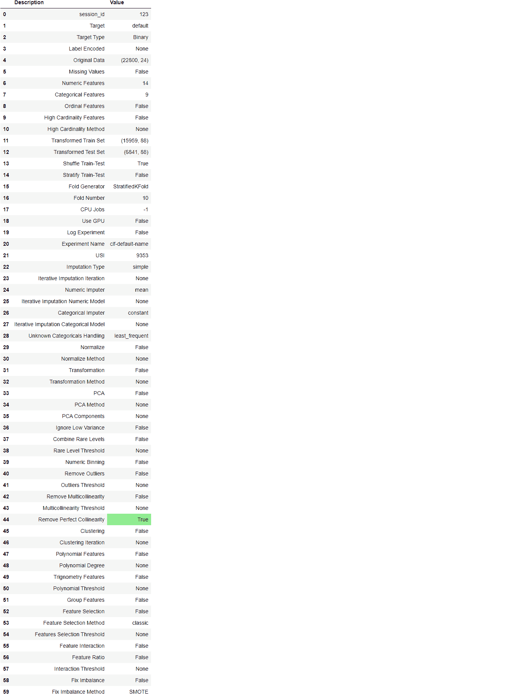

一旦设置成功执行，它会显示包含实验重要信息的信息网格。大部分信息与在执行`setup`时构建的预处理管道相关。大多数功能超出了本教程的范围，但需要注意一些重要的事项：

+   **session_id：** 作为种子分配到所有函数中的伪随机数，以便后续可重复性。如果未传递`session_id`，会自动生成一个随机数分配给所有函数。在本实验中，`session_id` 被设置为 `123` 以便后续可重复性。

+   **目标类型：** 二分类或多分类。目标类型会自动检测并显示。对于二分类或多分类问题，实验的执行没有区别。所有功能是相同的。

+   **标签编码：** 当目标变量是字符串类型（即 ‘Yes’ 或 ‘No’）时，而不是 1 或 0，它会自动将标签编码为 1 和 0，并显示映射（0: No, 1: Yes）以供参考。在这个实验中，由于目标变量是数字类型，因此不需要标签编码。

+   **原始数据：** 显示数据集的原始形状。在这个实验中，(22800, 24) 意味着 22,800 个样本和 24 个特征，包括目标列。

+   **缺失值：** 当原始数据中存在缺失值时，这将显示为 True。在本实验中，数据集中没有缺失值。

+   **数值特征：** 推断为数值的特征数量。在这个数据集中，24 个特征中有 14 个被推断为数值特征。

+   **分类特征：** 推断为分类的特征数量。在这个数据集中，24 个特征中有 9 个被推断为分类特征。

+   **变换后的训练集：** 显示了变换后的训练集的形状。注意到原始形状 (22800, 24) 被变换为 (15959, 91)，由于独热编码，特征数量从 24 增加到 91。

+   **变换后的测试集：** 显示了变换后的测试/保留集的形状。测试/保留集中有 6841 个样本。这个拆分是基于默认值 70/30，可以通过`train_size`参数在设置中更改。

注意，一些对建模至关重要的任务会被自动处理，如缺失值插补（在这种情况下训练数据中没有缺失值，但我们仍然需要插补器用于未见数据）、分类编码等。`setup`中的大部分参数是可选的，用于自定义预处理管道。这些参数超出了本教程的范围，但我们将在未来的教程中进行讲解。

## 9.0 比较所有模型

比较所有模型以评估性能是设置完成后建模的推荐起点（除非你确切知道需要什么类型的模型，这种情况往往不多）。此函数训练模型库中的所有模型，并使用分层交叉验证对指标进行评估。输出打印了一个得分网格，显示了折叠（默认 10 折）中的平均准确度、AUC、召回率、精度、F1、Kappa 和 MCC，以及训练时间。

```py
best_model = compare_models()
```

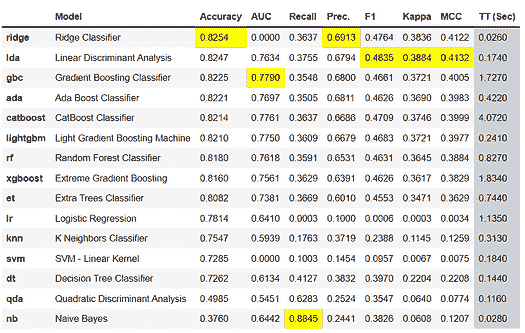

上面打印的得分网格仅用于比较目的，突出显示了表现最好的指标。网格默认按`Accuracy`（从高到低）排序，可以通过传递`sort`参数进行更改。例如，`compare_models(sort = 'Recall')`将按召回率而不是准确度对网格进行排序。

如果你想将折叠参数从默认值`10`更改为其他值，可以使用`fold`参数。例如，`compare_models(fold = 5)`将比较所有模型在 5 折交叉验证中的表现。减少折叠数将提高训练时间。默认情况下，`compare_models`根据默认排序顺序返回表现最佳的模型，但也可以通过使用`n_select`参数返回前 N 个模型的列表。

```py
print(best_model)**>>> OUTPUT**RidgeClassifier(alpha=1.0, class_weight=None, copy_X=True, fit_intercept=True,
                max_iter=None, normalize=False, random_state=123, solver='auto',
                tol=0.001)
```

## 10.0 创建模型

`create_model`是 PyCaret 中最基本的函数，通常是大多数 PyCaret 功能的基础。顾名思义，这个函数使用可以通过`fold`参数设置的交叉验证来训练和评估模型。输出打印了一个得分网格，显示了按折叠计算的准确度、AUC、召回率、精度、F1、Kappa 和 MCC。

在本教程的剩余部分，我们将使用下面的模型作为候选模型。选择仅为示例目的，并不一定意味着它们是最优或适合这种数据的模型。

+   决策树分类器（‘dt’）

+   K 近邻分类器（‘knn’）

+   随机森林分类器（‘rf’）

PyCaret 的模型库中提供了 18 种分类器。要查看所有分类器的列表，可以查看文档或使用`models`函数查看库。

```py
**# check available models** models()
```

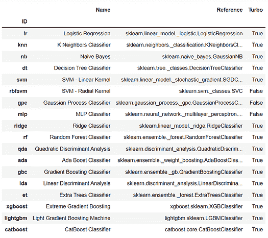

## 10.1 决策树分类器

```py
dt = create_model('dt')
```

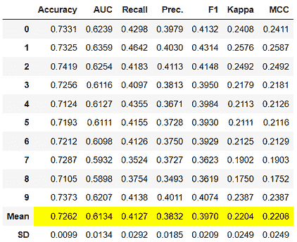

```py
**# trained model object is stored in the variable 'dt'.** 
print(dt)**>>> OUTPUT**DecisionTreeClassifier(ccp_alpha=0.0, class_weight=None, criterion='gini',
                       max_depth=None, max_features=None, max_leaf_nodes=None,
                       min_impurity_decrease=0.0, min_impurity_split=None,
                       min_samples_leaf=1, min_samples_split=2,
                       min_weight_fraction_leaf=0.0, presort='deprecated',
                       random_state=123, splitter='best')
```

## 10.2 K 近邻分类器

```py
knn = create_model('knn')
```

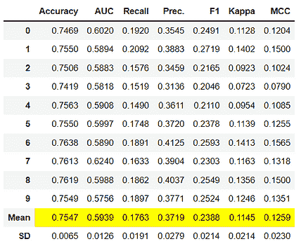

## 10.3 随机森林分类器

```py
rf = create_model('rf')
```

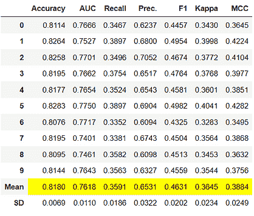

请注意，所有模型的平均得分与`compare_models`中打印的得分一致。这是因为在`compare_models`得分网格中打印的指标是所有 CV 折叠的平均得分。类似于`compare_models`，如果你想将折叠参数从默认值 10 更改为其他值，可以使用`fold`参数。例如：`create_model('dt', fold = 5)`将使用 5 折分层交叉验证创建一个决策树分类器。

## 11.0 调优模型

当使用`create_model`函数创建模型时，它使用默认的超参数来训练模型。为了调整超参数，使用`tune_model`函数。该函数使用预定义的搜索空间上的随机网格搜索自动调整模型的超参数。输出打印一个评分网格，显示了最佳模型的准确性、AUC、召回率、精确度、F1、Kappa 和 MCC。要使用自定义搜索网格，可以在`tune_model`函数中传递`custom_grid`参数（请参见下面的 11.2 KNN 调优）。

## 11.1 决策树分类器

```py
tuned_dt = tune_model(dt)
```

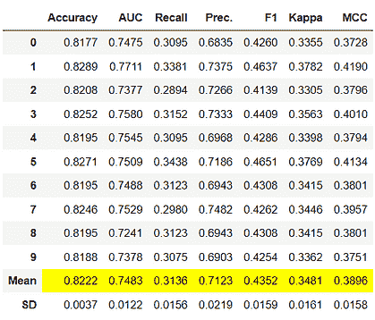

```py
**# tuned model object is stored in the variable 'tuned_dt'.** print(tuned_dt)**>>> OUTPUT**DecisionTreeClassifier(ccp_alpha=0.0, class_weight=None, criterion='entropy',
                       max_depth=6, max_features=1.0, max_leaf_nodes=None,
                       min_impurity_decrease=0.002, min_impurity_split=None,
                       min_samples_leaf=5, min_samples_split=5,
                       min_weight_fraction_leaf=0.0, presort='deprecated',
                       random_state=123, splitter='best')
```

## 11.2 K 最近邻分类器

```py
import numpy as np
tuned_knn = tune_model(knn, custom_grid = {'n_neighbors' : np.arange(0,50,1)})
```

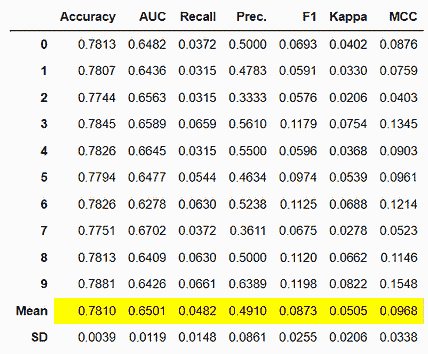

```py
print(tuned_knn)**>>> OUTPUT**KNeighborsClassifier(algorithm='auto', leaf_size=30, metric='minkowski',
                     metric_params=None, n_jobs=-1, n_neighbors=42, p=2,
                     weights='uniform')
```

## 11.3 随机森林分类器

```py
tuned_rf = tune_model(rf)
```

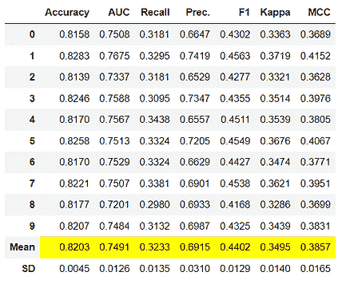

默认情况下，`tune_model`优化`Accuracy`，但这可以通过`optimize`参数进行更改。例如：`tune_model(dt, optimize = 'AUC')`将寻找使`AUC`最高的决策树分类器的超参数，而不是`Accuracy`。为了简化示例，我们仅使用了默认的`Accuracy`指标。通常，当数据集不平衡（如我们正在使用的信用数据集）时，`Accuracy`不是一个好的评估指标。选择正确的评估指标来评估分类器的方法超出了本教程的范围，但如果你想了解更多，可以[**点击这里**](https://medium.com/@MohammedS/performance-metrics-for-classification-problems-in-machine-learning-part-i-b085d432082b)阅读关于如何选择正确评估指标的文章。

仅依靠指标并不是确定生产中最佳模型的唯一标准。其他需要考虑的因素包括训练时间、k 折的标准偏差等。随着你在教程系列中的进展，我们将在中级和高级阶段详细讨论这些因素。现在，让我们继续考虑将调优后的随机森林分类器`tuned_rf`作为本教程剩余部分的最佳模型。

## 12.0 绘制模型

在模型最终确定之前，可以使用`plot_model`函数来分析不同方面的性能，例如 AUC、混淆矩阵、决策边界等。此函数接受一个训练好的模型对象，并基于测试集返回一个图表。

提供了 15 种不同的图表，请参见`plot_model`文档以获取可用图表的列表。

## 12.1 AUC 图

```py
plot_model(tuned_rf, plot = 'auc')
```

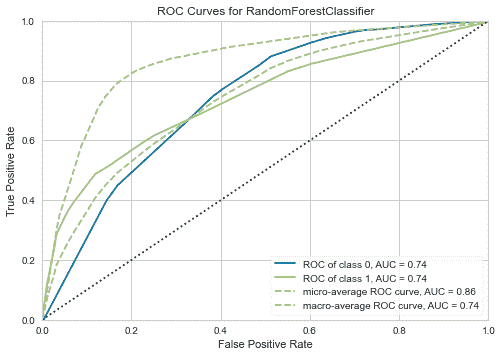

## 12.2 精确度-召回率曲线

```py
plot_model(tuned_rf, plot = 'pr')
```

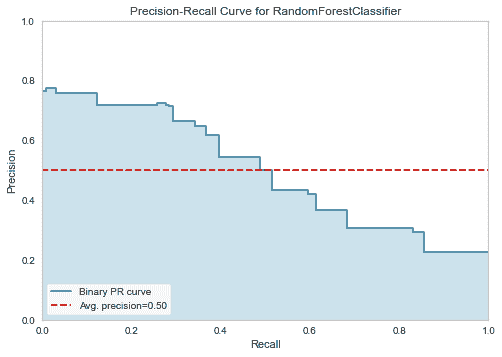

## 12.3 特征重要性图

```py
plot_model(tuned_rf, plot='feature')
```

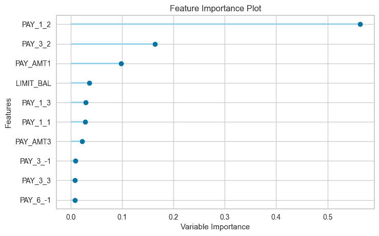

## 12.4 混淆矩阵

```py
plot_model(tuned_rf, plot = 'confusion_matrix')
```

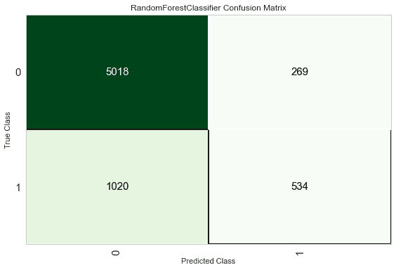

*另一种* 分析模型性能的方法是使用`evaluate_model()`函数，该函数显示了给定模型所有可用绘图的用户界面。它内部使用了`plot_model()`函数。

```py
evaluate_model(tuned_rf)
```

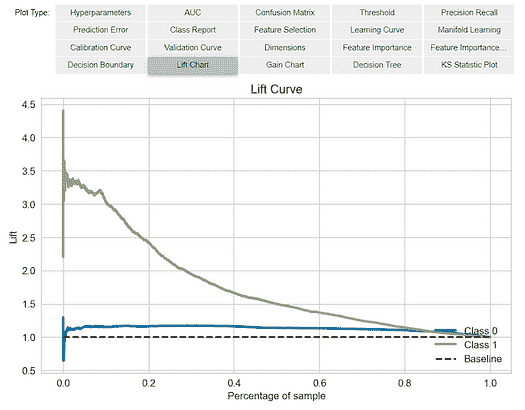

## 13.0 在测试/保留样本上预测

在最终化模型之前，建议通过预测测试/保留集并查看评估指标来进行最后的检查。如果你查看第八部分的信息网格，你会看到 30%（6,841 个样本）的数据已经被分离出来作为测试/保留样本。我们在上面看到的所有评估指标都是基于训练集（70%）的交叉验证结果。现在，使用我们存储在`tuned_rf`中的最终训练模型，我们将预测测试/保留样本并评估指标，以查看它们是否与 CV 结果有实质性差异。

```py
predict_model(tuned_rf);
```

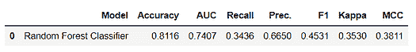

在测试/保留集上的准确率是`**0.8116**`，相比于在`tuned_rf` CV 结果中达到的`**0.8203**`（在第 11.3 节上）。这并不是一个显著的差异。如果测试/保留集和 CV 结果之间存在较大差异，这通常表明过拟合，但也可能由于其他几个因素，需要进一步调查。在这种情况下，我们将继续完成模型并对未见数据进行预测（即我们在开始时分离出的 5%，并且从未暴露于 PyCaret）。

（提示：使用`create_model`时，查看 CV 结果的标准差总是好的）

## 14.0 部署前的模型最终化

模型最终化是实验中的最后一步。PyCaret 中的正常机器学习工作流从`setup`开始，随后使用`compare_models`比较所有模型，并根据感兴趣的指标筛选出一些候选模型，以执行多个建模技术，如超参数调优、集成、堆叠等。这一工作流将最终引导你找到最佳模型，以用于对新数据和未见数据进行预测。`finalize_model`函数将模型拟合到包括测试/保留样本在内的完整数据集上（在这种情况下为 30%）。该函数的目的是在模型投入生产前在完整数据集上训练最终模型。（这是可选的，你可以选择是否使用 finalize_model）。

```py
**# finalize rf model**
final_rf = finalize_model(tuned_rf)**# print final model parameters**
print(final_rf)**>>> OUTPUT**RandomForestClassifier(bootstrap=False, ccp_alpha=0.0, class_weight={},
                       criterion='entropy', max_depth=5, max_features=1.0,
                       max_leaf_nodes=None, max_samples=None,
                       min_impurity_decrease=0.0002, min_impurity_split=None,
                       min_samples_leaf=5, min_samples_split=10,
                       min_weight_fraction_leaf=0.0, n_estimators=150,
                       n_jobs=-1, oob_score=False, random_state=123, verbose=0,
                       warm_start=False)
```

**警告：** 最后的警告。一旦模型完成，整个数据集，包括测试/保留集，都将用于训练。因此，如果在`finalize_model`之后使用模型对保留集进行预测，打印的信息网格将会误导，因为你尝试在用于建模的相同数据上进行预测。为了仅演示这一点，我们将在`predict_model`下使用`final_rf`来比较信息网格与第十三部分上面的网格。

```py
predict_model(final_rf);
```

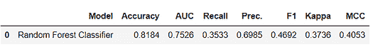

注意，即使模型相同，`final_rf`中的 AUC 也从`**0.7407**`提高到了`**0.7526**`。这是因为`final_rf`变量在包含测试/持出集的完整数据集上进行了训练。

## 15.0 对未见数据进行预测

`predict_model`函数也用于对未见数据集进行预测。与第十三部分的唯一区别在于这次我们将传递`data_unseen`。这是在本教程开始时创建的变量，包含了原始数据集中从未暴露给 PyCaret 的 5%（1200 个样本）。（见第七部分以获取解释）

```py
unseen_predictions = predict_model(final_rf, data=data_unseen)
unseen_predictions.head()
```

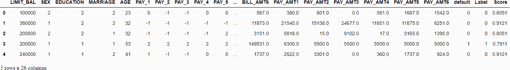

`Label`和`Score`列已添加到`data_unseen`数据集中。标签是预测结果，分数是预测的概率。请注意，预测结果已附加到原始数据集中，而所有转换都会在后台自动执行。你还可以检查这些指标，因为你有实际的目标列`default`可用。为此，我们将使用`pycaret.utils`模块。请看下面的示例：

```py
**# check metric on unseen data** from pycaret.utils import check_metric
check_metric(unseen_predictions['default'], unseen_predictions['Label'], metric = 'Accuracy')**>>> OUTPUT** 0.8167
```

## 16.0 保存模型

我们现在通过将` tuned_rf`模型最终化并存储在`final_rf`变量中来完成实验。我们还使用存储在`final_rf`中的模型对`data_unseen`进行了预测。这标志着我们的实验结束，但仍有一个问题需要询问：如果你有更多新数据需要预测怎么办？是否需要重新进行整个实验？答案是否定的，PyCaret 的内置函数`save_model()`允许你保存模型以及整个转换管道以供以后使用。

```py
**# saving the final model** save_model(final_rf,'Final RF Model 11Nov2020')>>> Transformation Pipeline and Model Successfully Saved
```

## 17.0 加载已保存的模型

要在将来某个日期在相同或其他环境中加载已保存的模型，我们将使用 PyCaret 的`load_model()`函数，然后轻松地将已保存的模型应用于新未见数据进行预测。

```py
**# loading the saved model**
saved_final_rf = load_model('Final RF Model 11Nov2020')>>> Transformation Pipeline and Model Successfully Loaded
```

一旦模型加载到环境中，你可以简单地使用相同的`predict_model()`函数对任何新数据进行预测。下面我们应用加载的模型来预测与第十三部分中相同的`data_unseen`。

```py
**# predict on new data** new_prediction = predict_model(saved_final_rf, data=data_unseen)
new_prediction.head()
```


请注意，`unseen_predictions`和`new_prediction`的结果是相同的。

```py
from pycaret.utils import check_metric
check_metric(new_prediction['default'], new_prediction['Label'], metric = 'Accuracy')>>> 0.8167
```

## 18.0 总结 / 下一步？

本教程涵盖了整个机器学习流程，从数据摄取、预处理、训练模型、超参数调优、预测到保存模型以供后续使用。我们在不到 10 个命令中完成了所有这些步骤，这些命令自然构建且非常直观，易于记忆，例如`create_model()`、`tune_model()`、`compare_models()`。如果没有 PyCaret，重新创建整个实验在大多数库中将需要超过 100 行代码。

我们只介绍了`pycaret.classification`的基础知识。在未来的教程中，我们将深入探讨高级预处理、集成方法、广义堆叠以及其他技术，这些技术能够让你完全自定义你的机器学习管道，是任何数据科学家必须掌握的。

感谢阅读 [????](https://emojipedia.org/folded-hands/)

## 重要链接

⭐ [教程](https://github.com/pycaret/pycaret/tree/master/tutorials) 刚接触 PyCaret？查看我们的官方笔记本！

???? [示例笔记本](https://github.com/pycaret/pycaret/tree/master/examples) 由社区创建。

???? [博客](https://github.com/pycaret/pycaret/tree/master/resources) 贡献者的教程和文章。

???? [文档](https://pycaret.readthedocs.io/en/latest/index.html) PyCaret 的详细 API 文档

???? [视频教程](https://www.youtube.com/channel/UCxA1YTYJ9BEeo50lxyI_B3g) 我们在各种活动中的视频教程。

???? [讨论](https://github.com/pycaret/pycaret/discussions) 有问题？与社区和贡献者互动。

????️ [更新日志](https://github.com/pycaret/pycaret/blob/master/CHANGELOG.md) 变更和版本历史。

???? [路线图](https://github.com/pycaret/pycaret/issues/1756) PyCaret 的软件和社区发展计划。

**简介: [Moez Ali](https://www.linkedin.com/in/profile-moez/)** 撰写关于 PyCaret 及其在现实世界中的应用。如果你想自动获取通知，可以关注 Moez 在 [Medium](https://medium.com/@moez-62905)、[LinkedIn](https://www.linkedin.com/in/profile-moez/) 和 [Twitter](https://twitter.com/moezpycaretorg1)。

[原文](https://towardsdatascience.com/introduction-to-binary-classification-with-pycaret-a37b3e89ad8d). 经许可转载。

**相关：**

+   新手指南：端到端的机器学习

+   PyCaret 2.3.5 已发布！了解新特性

+   使用 PyCaret 的新时间序列模块

### 更多相关主题

+   [Python 中使用 PyCaret 的聚类入门](https://www.kdnuggets.com/2021/12/introduction-clustering-python-pycaret.html)

+   [多标签分类：使用 Python 的 Scikit-Learn 入门](https://www.kdnuggets.com/2023/08/multilabel-classification-introduction-python-scikitlearn.html)

+   [宣布 PyCaret 3.0：开源、低代码的 Python 机器学习](https://www.kdnuggets.com/2023/03/announcing-pycaret-30-opensource-lowcode-machine-learning-python.html)

+   [PyCaret 入门](https://www.kdnuggets.com/2022/11/getting-started-pycaret.html)

+   [更多分类问题的性能评估指标](https://www.kdnuggets.com/2020/04/performance-evaluation-metrics-classification.html)

+   [使用 HuggingFace 微调 BERT 进行推文分类](https://www.kdnuggets.com/2022/01/finetuning-bert-tweets-classification-ft-hugging-face.html)
