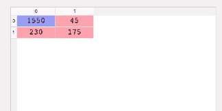

# 使用 Keras 深度学习简介

> 原文：[`www.kdnuggets.com/2018/10/introduction-deep-learning-keras.html/2`](https://www.kdnuggets.com/2018/10/introduction-deep-learning-keras.html/2)

 评论

### ****编译人工神经网络****

```py
*classifier.compile(optimizer= ‘adam’,
                  loss = ‘binary_crossentropy’,
                  metrics = [‘accuracy’])*
```

编译基本上是将随机梯度下降应用于整个神经网络。第一个参数是你想用来获得神经网络最佳权重集合的算法。这里使用的算法是随机梯度算法。这有很多变体，一种非常有效的是 adam。第二个参数是随机梯度算法中的损失函数。由于我们的类别是二元的，我们使用 *binary_crossentropy* 损失函数。否则我们会使用 *categorical_crossentropy*。最后一个参数是我们用来评估模型的标准。在这种情况下，我们使用准确率。

### ****将我们的人工神经网络拟合到训练集****

```py
*classifier.fit(X_train, y_train, batch_size = 10, epochs = 100)*
```

X_train 代表我们用来训练人工神经网络的自变量，而 y_train 代表我们要预测的列。Epochs 代表我们将数据集通过人工神经网络的次数。Batch_size 是更新权重后的一组观察值的数量。

### ****使用训练集进行预测****

```py
*y_pred = classifier.predict(X_test)*
```

这将展示索赔是欺诈性的概率。然后我们设定了一个 50% 的阈值来将索赔分类为欺诈性。这意味着任何概率为 0.5 或以上的索赔将被分类为欺诈性。

```py
*y_pred = (y_pred > 0.5)*
```

这样，保险公司可以首先跟踪那些不被怀疑的索赔，然后花更多时间评估被标记为欺诈的索赔。

### ****检查混淆矩阵****

```py
*from sklearn.metrics import confusion_matrix*

*cm = confusion_matrix(y_test, y_pred)*
```



混淆矩阵可以这样解释。在 2000 个观察值中，1550 + 175 个被正确预测，而 230 + 45 个被错误预测。你可以通过将正确预测的数量除以预测的总数来计算准确率。在这种情况下是 (1550+175) / 2000，结果是 86%。

### ****做出单一预测****

假设保险公司给你一个索赔，他们希望知道这个索赔是否是欺诈性的。你会怎么做来找出答案？

```py
*new_pred = classifier.predict(sc.transform(np.array([[a,b,c,d]])))*
```

其中 a、b、c、d 代表你拥有的特征。

```py
*new_pred = (new_prediction > 0.5)*
```

由于我们的分类器期望的是 numpy 数组，我们必须将单个观察值转换为 numpy 数组，并使用标准缩放器进行缩放。

### ****评估我们的人工神经网络****

训练模型一两次后，你会注意到准确度不断变化。这使得你不太确定哪一个是正确的。这引入了偏差方差权衡。本质上，我们试图训练一个模型，使其准确且在多次训练时不会有太大的准确度方差。为了解决这个问题，我们使用 K 折交叉验证，K 等于 10。这将把训练集分成 10 折。然后我们将在 9 折上训练模型，并在剩下的折上测试。由于我们有 10 折，我们将通过 10 种组合进行迭代。每次迭代都会给我们一个准确度。然后我们计算所有准确度的均值，并将其作为我们的模型准确度。我们还计算方差，以确保其最小。

Keras 有一个 scikit learn 的封装器（KerasClassifier），使我们可以在我们的 Keras 代码中包含 K 折交叉验证。

```py
*from keras.wrappers.scikit_learn import KerasClassifier*
```

接下来我们从 scikit_learn 导入 k 折交叉验证函数。

```py
*from sklearn.model_selection import cross_val_score*
```

KerasClassifier 期望其参数之一是一个函数，因此我们需要构建这个函数。这个函数的目的是建立我们的 ANN 架构。

这个函数将构建分类器并返回，以便在下一步中使用。我们在这里做的唯一事情就是将我们之前的 ANN 架构封装在一个函数中并返回分类器。

然后我们创建一个新的分类器，使用 K 折交叉验证，并将参数*build_fn*传递为我们刚刚创建的函数。接下来，我们传递批次大小和训练轮数，就像我们在之前的分类器中做的那样。

```py
*classiifier = KerasClassifier(build_fn = make_classifier,
                            batch_size=10, nb_epoch=100)*
```

要应用 k 折交叉验证函数，我们可以使用 scikit-learn 的*cross_val_score*函数。估算器是我们刚刚用*make_classifier*构建的分类器，n_jobs=-1 将利用所有可用的 CPU。cv 是折数，10 是一个典型的选择。*cross_val_score*将返回计算中使用的十个测试折的准确度。

```py
*accuracies = cross_val_score(estimator = classifier,
                             X = X_train,
                             y = y_train,
                             cv = 10,
                             n_jobs = -1)*
```

为了获得相对准确度，我们需要计算准确度的均值。

```py
*mean = accuracies.mean()*
```

方差可以按以下方式获得：

```py
*variance = accuracies.var()*
```

目标是使准确度之间的方差尽可能小。

### ****对抗过拟合****

在机器学习中，过拟合是指模型学习了训练集中的细节和噪声，从而在测试集上表现不佳。这可以通过测试集和训练集的准确度之间存在巨大差异，或在应用 k 折交叉验证时观察到高方差来发现。在人工神经网络中，我们使用一种叫做丢弃正则化的技术来对抗这一问题。丢弃正则化通过在每次训练迭代时随机禁用一些神经元，以防止它们过于依赖彼此。

在这种情况下，我们在第一个隐藏层和第二个隐藏层之后应用 dropout。使用 0.1 的比率意味着每次迭代时 1%的神经元将被禁用。建议从 0.1 的比率开始。然而，你绝不要超过 0.4，因为这会导致欠拟合。

### ****参数调优****

一旦获得准确率，你可以调整参数以获得更高的准确率。网格搜索使我们能够测试不同的参数，以获得最佳参数。

第一步是从 sklearn 中导入 *GridSearchCV *模块。

```py
*from sklearn.model_selection import GridSearchCV*
```

我们还需要按如下方式修改我们的 make_classifier 函数。我们创建一个名为 ***optimizer ***的新变量，以便在我们的 params 变量中添加多个优化器。

我们仍然使用 KerasClassifier，但不传递批量大小和迭代次数，因为这些是我们想要调优的参数。

```py
*classifier = KerasClassifier(build_fn = make_classifier)*
```

下一步是创建一个包含我们想要调优的参数的字典——在这个例子中是批量大小、迭代次数和优化器函数。我们仍然使用 adam 作为优化器，并添加一个名为 rmsprop 的新优化器。Keras 文档推荐在处理递归神经网络时使用 rmsprop。然而，我们可以尝试在这个人工神经网络中使用它，看是否能得到更好的结果。

```py
*params = {
    'batch_size':[20,35],*

 *'nb_epoch':[150,500],*

 *'Optimizer':['adam','rmsprop'**]
}*
```

然后我们使用网格搜索来测试这些参数。网格搜索函数期望我们的估算器、我们刚刚定义的参数、评分指标和折叠数。

```py
*grid_search = GridSearchCV(estimator=classifier,
                           param_grid=params,
                           scoring=’accuracy’,
                           cv=10)*
```

像以前的对象一样，我们需要对训练集进行拟合。

```py
*grid_search = grid_search.fit(X_train,y_train)*
```

我们可以使用*best_params*从网格搜索对象中获取最佳参数选择。同样，我们使用 best_score_ 来获取最佳分数。

```py
*best_param = grid_search.best_params_*

*best_accuracy = grid_search.best_score_*
```

需要注意的是，这个过程会花费一些时间，因为它会搜索最佳参数。

### **结论**

人工神经网络只是深度神经网络的一种。还有其他网络，例如递归神经网络（RNN）、卷积神经网络（CNN）和玻尔兹曼机。RNN 可以预测股票价格未来是上涨还是下跌。CNN 用于计算机视觉——例如识别图像中的猫和狗或识别脑部图像中的癌细胞。玻尔兹曼机用于编程推荐系统。也许我们可以在未来讨论这些神经网络中的某一个。

干杯。

**简介: [Derrick Mwiti](https://derrickmwiti.com/)** 是一位数据分析师、作家和导师。他致力于在每个任务中交付卓越的成果，并且是 Lapid Leaders Africa 的导师。

[原文](https://heartbeat.fritz.ai/introduction-to-deep-learning-with-keras-c7c3d14e1527)。经许可转载。

**相关：**

+   Keras 4 步工作流程

+   掌握 Keras 深度学习的 7 个步骤

+   初学者数据可视化与探索使用 Pandas

* * *

## 我们的前三大课程推荐

 1\. [Google 网络安全证书](https://www.kdnuggets.com/google-cybersecurity) - 快速开启网络安全职业生涯

 2\. [Google 数据分析专业证书](https://www.kdnuggets.com/google-data-analytics) - 提升你的数据分析能力

 3\. [Google IT 支持专业证书](https://www.kdnuggets.com/google-itsupport) - 支持你的组织的 IT 工作

* * *

### 更多相关内容

+   [使用 TensorFlow 和 Keras 构建和训练你的第一个神经网络](https://www.kdnuggets.com/2023/05/building-training-first-neural-network-tensorflow-keras.html)

+   [Keras 3.0：你需要知道的一切](https://www.kdnuggets.com/2023/07/keras-30-everything-need-know.html)

+   [深度学习库介绍：PyTorch 和 Lightning AI](https://www.kdnuggets.com/introduction-to-deep-learning-libraries-pytorch-and-lightning-ai)

+   [学习数据科学、机器学习和深度学习的实用计划](https://www.kdnuggets.com/2023/01/mwiti-solid-plan-learning-data-science-machine-learning-deep-learning.html)

+   [KDnuggets 新闻，4 月 27 日：简要介绍 Papers With Code；…](https://www.kdnuggets.com/2022/n17.html)

+   [统计学习导论，Python 版：免费图书](https://www.kdnuggets.com/2023/07/introduction-statistical-learning-python-edition-free-book.html)
