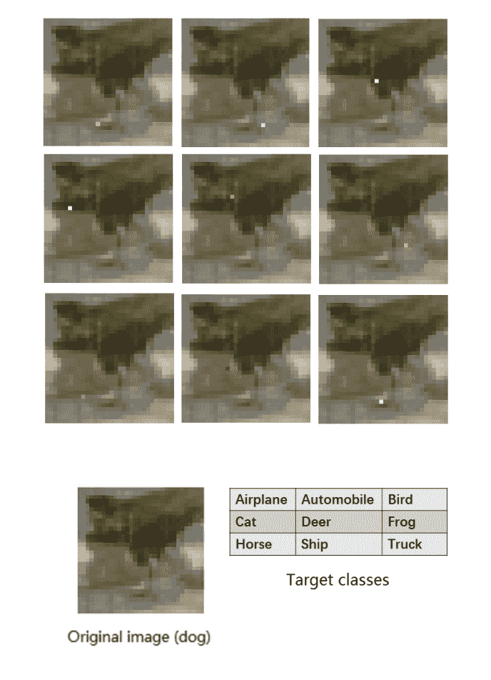
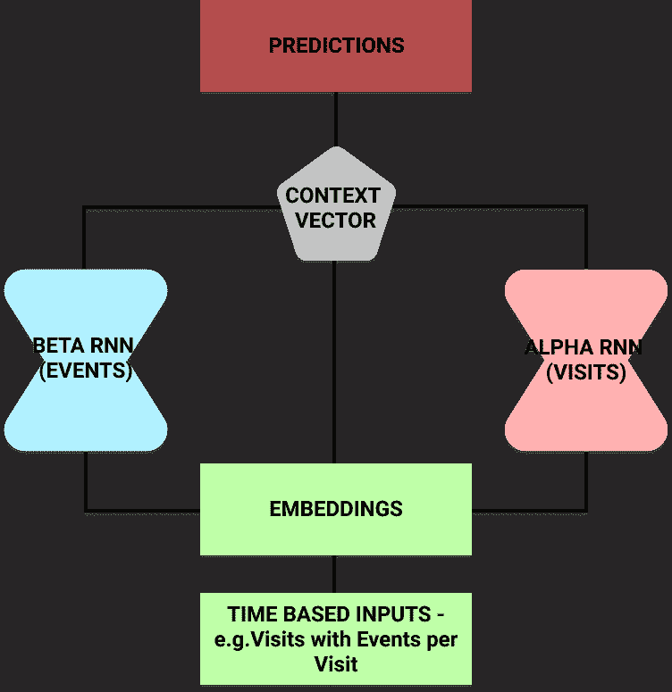
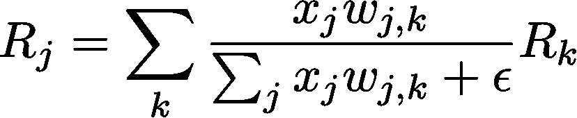

# 可解释人工智能简介，以及我们为何需要它

> 原文：[`www.kdnuggets.com/2019/04/introduction-explainable-ai.html`](https://www.kdnuggets.com/2019/04/introduction-explainable-ai.html)

 评论

**由 [Patrick Ferris](https://www.patrickferris.me/) 撰写**。

**黑箱 - 代表神经网络等函数的未知内部机制的隐喻**

神经网络（及其所有子类型）越来越多地用于构建能够在各种不同环境中进行预测和分类的程序。

示例包括使用递归神经网络的[机器翻译](https://arxiv.org/pdf/1806.08730.pdf)，以及使用卷积神经网络的[图像分类](https://papers.nips.cc/paper/4824-imagenet-classification-with-deep-convolutional-neural-networks.pdf)。谷歌 DeepMind 发布的研究引发了对[强化学习](https://arxiv.org/pdf/1312.5602.pdf)的兴趣。

所有这些方法都推动了许多领域的发展，并产生了可用于提高生产力和效率的模型。

然而，**我们真的不知道它们是如何工作的**。

我有幸参加了今年的[知识发现与数据挖掘](http://www.kdd.org/kdd2018/)（KDD）会议。在我参加的讲座中，有两个主要的研究领域似乎引起了很多人的关注：

+   首先，寻找有意义的图结构表示以供神经网络使用。[Oriol Vinyals](https://ai.google/research/people/OriolVinyals)来自 DeepMind 做了关于他们的[消息传递神经网络](https://arxiv.org/pdf/1704.01212.pdf)的讲座。

+   第二个领域，以及本文的重点，是可解释的人工智能模型。随着我们为神经网络生成更新、更具创新性的应用，“它们是如何工作的？”这个问题变得越来越重要。

**为何需要可解释模型？**

神经网络并非万无一失。

除了我们已经开发出许多工具（如 Dropout 或增加数据量）来对抗的过拟合和欠拟合问题之外，神经网络以一种不透明的方式操作。

我们实际上不知道它们为什么做出这些选择。随着模型变得越来越复杂，生成一个可解释的模型变得更加困难。

以[单像素攻击](https://arxiv.org/pdf/1710.08864.pdf)为例（请查看这里的[视频](https://www.youtube.com/watch?v=SA4YEAWVpbk)）。这是一种通过分析卷积神经网络（CNN）并应用差分进化（进化算法的一个成员）来实施的复杂方法。

与限制目标函数可微的其他优化策略不同，这种方法使用迭代进化算法来生成更好的解决方案。具体来说，对于这个单像素攻击，唯一需要的信息是类别标签的概率。

**来自[单像素攻击以欺骗深度神经网络](https://arxiv.org/pdf/1710.08864.pdf)的 Jiawei Su 等人**

欺骗这些神经网络的相对容易性令人担忧。在这背后存在一个更系统性的问题：信任神经网络。

最好的例子是在医学领域。假设你正在构建一个神经网络（或任何黑箱模型）来帮助预测根据患者记录的心脏病。

当你训练和测试模型时，你会获得良好的准确性和令人信服的正预测值。你把它交给临床医生，他们同意这似乎是一个强大的模型。

但他们会犹豫使用它，因为你（或模型）不能回答一个简单的问题：“你为什么预测这个人更可能发展成心脏病？”

缺乏透明度对希望了解模型工作方式以改善服务的临床医生来说是个问题。对患者来说，他们也希望有一个具体的预测理由。

从伦理角度来看，如果你的唯一理由是“黑箱告诉我如此”，是否正确告知患者他们有更高的疾病概率？医疗保健不仅关乎科学，也关乎对患者的同情。

可解释 AI 领域近年来不断发展，这一趋势似乎将继续。

接下来是一些有趣和创新的方向，研究人员和机器学习专家正在探索这些方向，以寻找不仅表现良好，而且能够解释其决策原因的模型。

#### 反向时间注意力模型（RETAIN）

RETAIN 模型由[Edward Choi et al.](https://arxiv.org/pdf/1608.05745.pdf)在乔治亚理工学院开发。它的推出旨在帮助医生理解为什么模型预测患者有心力衰竭的风险。

**RETAIN 递归神经网络模型利用注意力机制提高可解释性**

这个想法是，根据患者的住院记录以及访问事件，它们可以预测心力衰竭的风险。

研究人员将输入分成两个递归神经网络。这使他们能够对每个网络使用[注意力机制](http://www.wildml.com/2016/01/attention-and-memory-in-deep-learning-and-nlp/)以了解神经网络关注的重点。

一旦训练完成，模型可以预测患者的风险。但它也可以利用 alpha 和 beta 参数输出哪些住院记录（以及住院中的哪些事件）影响了它的选择。

**局部可解释模型无关解释（LIME）**

另一种已经变得相当常用的方法是[LIME](https://arxiv.org/pdf/1602.04938.pdf)。

这是一种事后模型——它在决策做出后提供解释。这意味着它不是一个从头到尾纯粹的‘玻璃箱’透明模型（如决策树）。

这种方法的主要优势之一是它对模型无关。可以应用于任何模型，以产生对其预测的解释。

这种方法的关键概念是扰动输入，并观察这样做如何影响模型的输出。这使我们能够建立起模型关注和利用哪些输入以进行预测的图像。

例如，假设一种用于图像分类的 CNN。使用 LIME 模型生成解释的主要步骤有四个：

+   从一张正常图像开始，使用黑箱模型生成类别的概率分布。

+   然后以某种方式扰动输入。对于图像来说，这可能是通过将像素遮挡成灰色来完成的。现在将这些输入通过黑箱模型运行，以观察原本预测的类别概率如何变化。

+   对这组扰动和概率数据集使用可解释的（通常是线性的）模型，如决策树，以提取解释变化的关键特征。模型是局部加权的——这意味着我们更关心那些与我们使用的原始图像最相似的扰动。

+   输出权重最大的特征（在我们的例子中是像素）作为我们的解释。

**层次相关传播（LRP）**

这个[方法](https://arxiv.org/pdf/1604.00825.pdf)利用了相关性重新分配和保留的思想。

我们从一个输入（例如，一张图像）及其分类概率开始。然后，向后推导，将这一概率重新分配给所有的输入（在这种情况下是像素）。

从一层到另一层的重新分配过程相当简单。

不要害怕——这个方程只是基于神经元激活和权重连接来加权相关性

在上述方程中，每一项代表以下思想：

+   x_j — 第*l*层中神经元*j*的激活值

+   w_j,k — 第*l*层中神经元*j*与第*l + 1*层中神经元*k*之间的连接权重

+   R_j — 第*l*层中每个神经元的相关性评分

+   R_k — 第*l+1*层中每个神经元的相关性评分

epsilon 只是一个小值，用于防止除以零。

正如你所看到的，我们可以向后推导以确定各个输入的相关性。此外，我们可以按相关性排序。这使我们能够提取出最有用或最强大的输入子集，以进行预测。

**接下来做什么？**

以上生成可解释模型的方法绝非穷尽。这些只是研究人员尝试过的一些方法的样本，用于从黑箱模型中生成可解释的预测。

希望这篇文章也能揭示为什么这是一个如此重要的研究领域。我们需要继续研究这些方法，并开发新的方法，以便机器学习能够以安全可靠的方式惠及尽可能多的领域。

如果你想阅读更多论文和领域，尝试以下一些。

+   [DeepMind](http://proceedings.mlr.press/v80/kim18d/kim18d.pdf)关于概念激活向量的研究，以及维多利亚·克拉科夫娜在神经信息处理系统（NIPS）会议上的[幻灯片](http://s.interpretable.ml/nips_interpretable_ml_2017_victoria_Krakovna.pdf)。

+   [Dung Huk Park 等人关于解释模型的测量数据集的论文](https://arxiv.org/pdf/1711.07373.pdf)。

+   [Finale Doshi-Velez](https://www.seas.harvard.edu/directory/finale) 和 [Been Kim](https://beenkim.github.io/) 关于该领域的[论文](https://arxiv.org/pdf/1702.08608.pdf)

人工智能不应该成为我们盲目追随的强大神明。但我们也不应该忘记它及其可能带来的有益洞察。理想情况下，我们将建立灵活且可解释的模型，与专家及其领域知识合作，为每个人提供一个更光明的未来。

**个人简介**: [Patrick Ferris](https://www.patrickferris.me/) 是一名十九岁的程序员、博客作者和全方位的技术爱好者，目前是剑桥黑客博客的主编。

[原文](https://medium.freecodecamp.org/an-introduction-to-explainable-ai-and-why-we-need-it-a326417dd000)。经许可转载。

**资源：**

+   [在线和基于网络的：分析、数据挖掘、数据科学、机器学习教育](https://www.kdnuggets.com/education/online.html)

+   [分析、数据科学、数据挖掘和机器学习的软件](https://www.kdnuggets.com/software/index.html)

**相关：**

+   [XAI – 数据科学家的发言人](https://www.kdnuggets.com/2019/04/xai-data-scientist.html)

+   [可解释的 AI 或在灾难前停止故障模型](https://www.kdnuggets.com/2019/03/explainable-ai.html)

+   [AI 黑箱解释问题](https://www.kdnuggets.com/2019/03/ai-black-box-explanation-problem.html)

* * *

## 我们的三大课程推荐

 1\. [谷歌网络安全证书](https://www.kdnuggets.com/google-cybersecurity) - 快速进入网络安全职业生涯。

 2\. [谷歌数据分析专业证书](https://www.kdnuggets.com/google-data-analytics) - 提升你的数据分析能力

 3\. [谷歌 IT 支持专业证书](https://www.kdnuggets.com/google-itsupport) - 支持你的组织在 IT 领域

* * *

### 更多相关主题

+   [最先进的深度学习技术下的可解释性预测与即时预测](https://www.kdnuggets.com/2021/12/sota-explainable-forecasting-and-nowcasting.html)

+   [合成数据的社区已经到来，这就是我们为何需要它](https://www.kdnuggets.com/2022/04/community-synthetic-data-need.html)

+   [关于数据管理你需要知道的 6 件事及其重要性……](https://www.kdnuggets.com/2022/05/6-things-need-know-data-management-matters-computer-vision.html)

+   [我们不需要数据科学家，我们需要数据工程师](https://www.kdnuggets.com/2021/02/dont-need-data-scientists-need-data-engineers.html)

+   [弥合人类理解与机器学习之间的差距：可解释 AI 解决方案](https://www.kdnuggets.com/2023/06/closing-gap-human-understanding-machine-learning-explainable-ai-solution.html)

+   [为什么你需要在 2022 年学习 Python](https://www.kdnuggets.com/2022/04/need-learn-python-2022.html)
