# K 均值聚类的图像分割介绍

> 原文：[`www.kdnuggets.com/2019/08/introduction-image-segmentation-k-means-clustering.html`](https://www.kdnuggets.com/2019/08/introduction-image-segmentation-k-means-clustering.html)

评论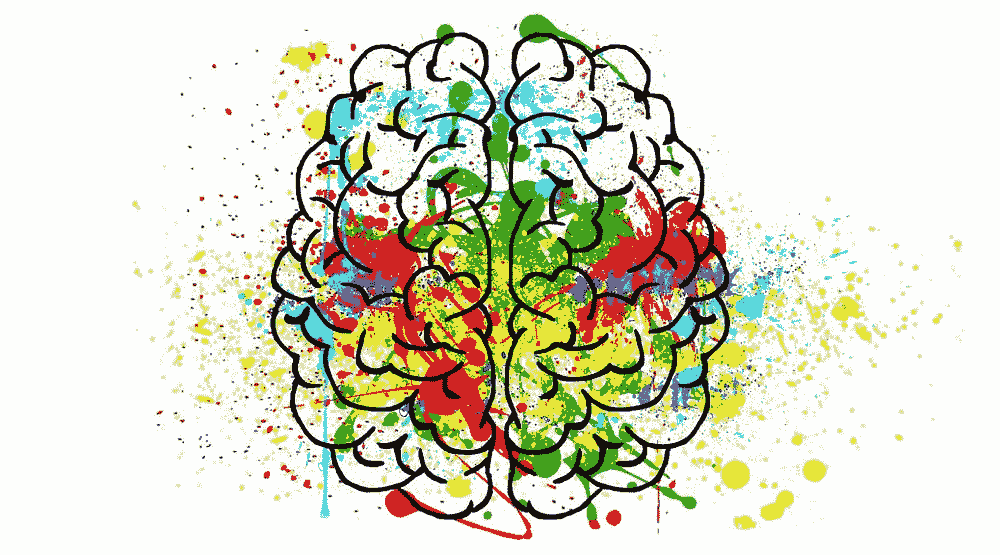

图片来源：[datastuff.tech](http://www.datastuff.tech/machine-learning/k-means-clustering-unsupervised-learning-for-recommender-systems/)

* * *

## 我们的前三个课程推荐

 1\. [Google 网络安全证书](https://www.kdnuggets.com/google-cybersecurity) - 快速进入网络安全职业生涯。

 2\. [Google 数据分析专业证书](https://www.kdnuggets.com/google-data-analytics) - 提升您的数据分析技能

 3\. [Google IT 支持专业证书](https://www.kdnuggets.com/google-itsupport) - 支持您的组织的 IT 需求

* * *

图像分割是图像处理中的一个重要步骤，如果我们想分析图像中的内容，它几乎无处不在。例如，如果我们要确定室内图像中是否有椅子或人，我们可能需要图像分割来分离对象，并单独分析每个对象以检查其性质。图像分割通常作为模式识别、特征提取和图像压缩的前处理步骤。

图像分割是将图像分类为不同组的过程。许多研究已经在使用聚类的图像分割领域展开。其中一种最受欢迎的方法是**K 均值聚类算法**。

在这篇文章中，我们将深入探讨一种读取图像并对图像的不同区域进行聚类的方法。但在此之前，让我们先讨论一下：

1.  图像分割

1.  图像分割如何工作

1.  K 均值聚类机器学习算法

1.  将 K 均值聚类算法与图像分割结合起来。

1.  Canny 边缘检测

### 图像分割

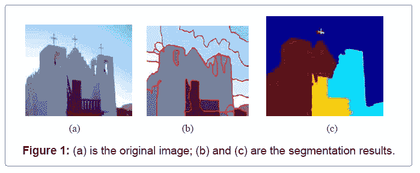

图片来源：[omicsonline.org](https://www.omicsonline.org/open-access/image-segmentation-by-using-linear-spectral-clustering-2167-0919-1000143.php?aid=81482&view=mobile)

图像分割是将数字图像划分为多个不同区域的过程，每个区域包含具有相似属性的像素（像素集，也称为超级像素）。

> 图像分割的目标是将图像的表示形式转换为更有意义、更易于分析的形式。

图像分割通常用于定位图像中的对象和[边界](https://en.wikipedia.org/wiki/Boundary_tracing)（线条、曲线等）。更准确地说，图像分割是将图像中的每个像素分配一个标签的过程，使得具有相同标签的像素共享某些特征。

当然，会出现一个常见的问题：

**为什么图像分割如此重要？**

以自主车辆为例，它们需要像相机、雷达和激光这样的传感器输入设备，以便让汽车感知周围的世界，创建数字地图。自主驾驶不可能实现物体检测，而物体检测本身涉及图像分类/分割。


自主车辆的物体检测和图像分类

其他例子涉及医疗行业，如果我们谈论癌症，即使在今天的技术进步时代，癌症仍然可能是致命的，如果我们不能在早期阶段识别它。尽快检测到癌细胞可以潜在地挽救数百万人的生命。癌细胞的形状在确定癌症的严重程度中起着至关重要的作用，这可以通过图像分类算法识别出来。

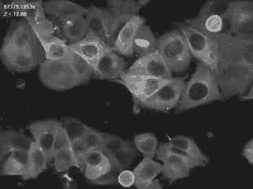

[乳腺癌细胞](https://imgur.com/gallery/QYbhkFH)

就像这样，多年来已经开发了多种图像分割算法和技术，利用领域特定的知识来有效解决该特定应用领域的分割问题，这些领域包括[医学影像](https://en.wikipedia.org/wiki/Medical_imaging)、[物体检测](https://en.wikipedia.org/wiki/Object_detection)、[虹膜识别](https://en.wikipedia.org/wiki/Iris_recognition)、[视频监控](https://en.wikipedia.org/wiki/Closed-circuit_television)、[机器视觉](https://en.wikipedia.org/wiki/Machine_vision)以及更多。

让我们使用 python matplotlib 库在 3D 空间中绘制图像。

下面是我们将在 3D 空间中绘制的图像，我们可以清楚地看到 3 种不同的颜色，这意味着应该生成 3 个簇/组。

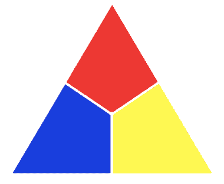

来源：[lightstalking.com](https://www.lightstalking.com/composing-with-color/)

```py
import matplotlib.pyplot as plt
from mpl_toolkits.mplot3d import Axes3D
import cv2img = cv2.imread("/Users/nageshsinghchauhan/Documents/images10.jpg")
img = cv2.cvtColor(img, cv2.COLOR_BGR2RGB)
r, g, b = cv2.split(img)
r = r.flatten()
g = g.flatten()
b = b.flatten()#plotting 
fig = plt.figure()
ax = Axes3D(fig)
ax.scatter(r, g, b)
plt.show()
```

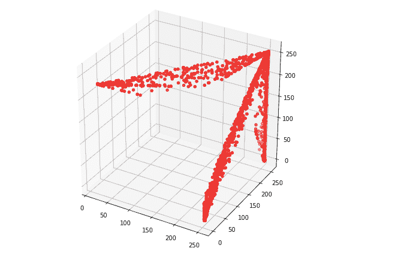

在 3D 空间中的图像绘制

从图中可以很容易地看到数据点正在形成组——图中的某些地方更密集，我们可以认为这是图像上不同颜色的主导作用。

### 图像分割的工作原理

图像分割涉及将图像转换为由掩模或标记图像表示的像素区域集合。通过将图像划分为多个段，你可以只处理图像中重要的段，而不是处理整个图像。

一种常见的技术是寻找像素值中的突变，这通常表示定义区域的边缘。

另一种常见的方法是检测图像区域中的相似性。一些遵循这种方法的技术包括区域生长、聚类和阈值处理。

多年来，已经开发出多种其他图像分割方法，这些方法利用领域特定的知识在特定应用领域有效地解决分割问题。

所以让我们从一种基于聚类的图像分割方法开始，即 K-均值聚类。

### K-均值聚类算法

好的，首先什么是机器学习中的聚类算法？

聚类算法是无监督算法，但它们与分类算法类似，只是基础不同。

在**聚类**中，你不知道自己在寻找什么，而是试图识别数据中的一些段落或簇。当你在数据集中使用聚类算法时，意想不到的结构、簇和分组可能会突然出现，而这些你之前可能从未想到过。

***K*-均值聚类**算法是一种无监督算法，用于从背景中分割兴趣区域。它基于 K-质心将给定数据划分成 K 个簇或部分。

当你有未标记的数据（即没有定义类别或组的数据）时，使用该算法。目标是根据数据中的某种相似性找到特定的组，这些组的数量由 K 表示。

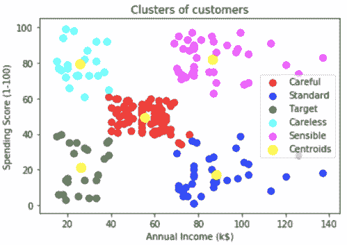

K-均值聚类示例

在上图中，购物中心的顾客根据收入和消费评分被分成了 5 个簇。黄色点表示每个簇的质心。

K-均值聚类的目标是最小化所有点与簇中心之间的平方距离之和。

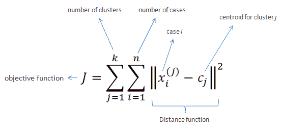

图片来源：[saedsayad.com](https://www.saedsayad.com/clustering_kmeans.htm)

**K-均值算法的步骤：**

1.  选择簇的数量 K。

1.  随机选择 K 个点作为质心（不一定来自数据集）。

1.  将每个数据点分配给最近的质心 → 这形成 K 个簇。

1.  计算并放置每个簇的新质心。

1.  将每个数据点重新分配到新的最近质心。如果发生了任何重新分配，请转到步骤 4，否则，模型已准备好。

**如何选择 K 的最佳值？**

对于某些类别的聚类算法（特别是 K-均值、K[-medoids](https://en.wikipedia.org/wiki/K-medoid)和[期望最大化](https://en.wikipedia.org/wiki/Expectation%E2%80%93maximization_algorithm)算法），有一个通常称为 K 的参数，它指定了要检测的簇的数量。其他算法，如[DBSCAN](https://en.wikipedia.org/wiki/DBSCAN)和[OPTICS 算法](https://en.wikipedia.org/wiki/OPTICS_algorithm)，不需要指定这个参数；[层次聚类](https://en.wikipedia.org/wiki/Hierarchical_clustering)完全避免了这个问题，但这超出了本文的范围。

如果谈到 K 均值，K 的正确选择通常是不明确的，解释取决于数据集中的点的分布形状和尺度以及用户所需的聚类分辨率。此外，增加 K 而不付出代价总会减少结果聚类中的误差，极端情况是每个数据点被视为自己的簇（即 K 等于数据点数*n*）。直观上，*K 的最佳选择将平衡最大化数据压缩和最大化准确度。*

如果从数据集的属性中没有明显的 K 值，则必须以某种方式选择。有几种方法来做出这一决策，**肘部法则**就是其中之一。

### 肘部法则

分区方法（如 K 均值聚类）的基本思想是定义簇，使得总的簇内变异或总的簇内平方和（WCSS）最小化。***总 WCSS 衡量了聚类的紧凑性，我们希望它尽可能小。***

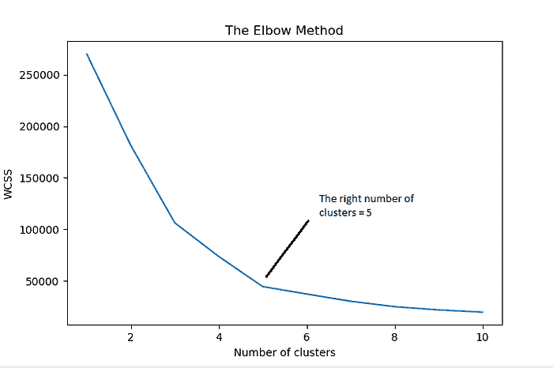

肘部法则将总 WCSS 视为簇数的函数：应选择一个簇数，使得添加另一个簇不会显著改善总 WCSS。

**选择最佳簇数 K 的步骤：（肘部法则）**

1.  对不同 K 值进行 K 均值聚类，将 K 从 1 变到 10。

1.  对于每个 K，计算簇内平方和总和（WCSS）。

1.  绘制 WCSS 与簇数 K 的曲线图。

1.  图中弯曲（膝部）的位置通常被视为适当簇数的指示。

有一个陷阱！

尽管 K 均值有许多优点，但由于质心的随机选择，有时会出现失败，这被称为**随机初始化陷阱**。

为解决此问题，我们有一种 K 均值的初始化程序，称为[**K 均值++**](https://en.wikipedia.org/wiki/K-means%2B%2B)（K 均值聚类初始值选择算法）。

在 K 均值++中，我们随机选择一个点作为第一个质心，然后根据与第一个点的距离选择下一个点，距离越远的点选择概率越大。

然后我们有两个质心，重复这个过程，每个点的概率基于它到最近质心的距离。现在，***这在算法初始化时引入了额外开销，但减少了糟糕初始化导致差聚类结果的概率。***

**K 均值聚类的可视化表示：** 从左侧的 4 个点开始。


[来源](http://shabal.in/visuals/kmeans/5.html): K-Means 聚类实际应用

说够了理论，接下来在实际场景中实现我们讨论的内容。

在这一部分，我们将探索一种方法，通过 **K-Means 聚类算法** 和 **OpenCV** 来读取图像并对图像的不同区域进行聚类。

基本上，我们将进行颜色聚类和 Canny 边缘检测。

**颜色聚类：**

加载所有必需的库：

```py
import numpy as np
import cv2
import matplotlib.pyplot as plt
```

下一步是加载 RGB 颜色空间中的图像

```py
original_image = cv2.imread("/Users/nageshsinghchauhan/Desktop/image1.jpg")
```

原始图像：


来源：unsplash

我们需要将图像从 RGB 颜色空间转换为 HSV 才能继续操作。

**但问题是为什么？？**

> 根据 [维基百科](https://en.wikipedia.org/wiki/HSL_and_HSV#Use_in_image_analysis)，数字图像中对象颜色的 R、G 和 B 组件与光线照射对象的量相关，因此彼此之间也是相关的，基于这些组件的图像描述使得对象辨别变得困难。基于色调/亮度/饱和度的描述通常更为相关。

如果你不将图像转换为 HSV，你的图像可能会像这样：

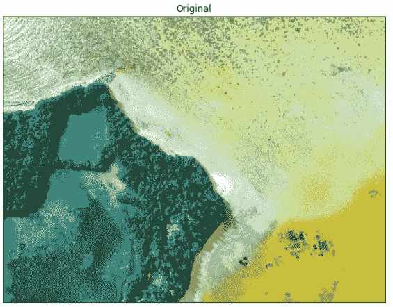

我们在 RGB 颜色空间中的原始图像

```py
img=cv2.cvtColor(original_image,cv2.COLOR_BGR2RGB)
```

接下来，将 MxNx3 图像转换为 Kx3 矩阵，其中 K=MxN，每一行现在是 RGB 三维空间中的一个向量。

```py
vectorized = img.reshape((-1,3))
```

我们将 unit8 值转换为 float，因为这是 OpenCV k-means 方法的要求。

```py
vectorized = np.float32(vectorized)
```

我们将使用 k = 3 进行聚类，因为如果你查看上面的图像，它有 3 种颜色：绿色的草地和森林，蓝色的海洋，以及青绿色的海岸线。

定义条件、聚类数 (K) 并应用 k-means()

```py
criteria = (cv2.TERM_CRITERIA_EPS + cv2.TERM_CRITERIA_MAX_ITER, 10, 1.0)
```

OpenCV 提供了 [**cv2.kmeans(**](https://docs.opencv.org/master/d5/d38/group__core__cluster.html#ga9a34dc06c6ec9460e90860f15bcd2f88)**samples, nclusters(K), criteria, attempts, flags**[**)**](https://docs.opencv.org/master/d5/d38/group__core__cluster.html#ga9a34dc06c6ec9460e90860f15bcd2f88) 函数用于颜色聚类。

**1\. samples:** 它应该是 **np.float32** 数据类型，并且每个特征应该放在单独的一列中。

**2\. nclusters(K)**: 最终所需的聚类数

**3\. criteria:** 这是迭代终止条件。当满足这个条件时，算法迭代停止。实际上，它应该是 3 个参数的元组。它们是 `( type, max_iter, epsilon )`：

终止条件类型。它有 3 个标志如下：

+   **cv.TERM_CRITERIA_EPS** — 当达到指定的精度，即 *epsilon* 时，停止算法迭代。

+   **cv.TERM_CRITERIA_MAX_ITER** — 在指定的迭代次数后停止算法，*max_iter*。

+   **cv.TERM_CRITERIA_EPS + cv.TERM_CRITERIA_MAX_ITER** — 当满足上述任意条件时，停止迭代。

**4\. 尝试次数：** 标志用于指定算法使用不同初始标签的执行次数。算法返回产生最佳紧凑性的标签。该紧凑性作为输出返回。

**5\. 标志：** 此标志用于指定如何选择初始中心。通常使用两个标志： [**cv.KMEANS_PP_CENTERS**](https://docs.opencv.org/master/d0/de1/group__core.html#gga276000efe55ee2756e0c471c7b270949a78ddd00a99cd51db10ed63c024eb1e62) 和 [**cv.KMEANS_RANDOM_CENTERS**](https://docs.opencv.org/master/d0/de1/group__core.html#gga276000efe55ee2756e0c471c7b270949adfa80a38dfc0aef0de888c3164f33faf)。

```py
K = 3
attempts=10
ret,label,center=cv2.kmeans(vectorized,K,None,criteria,attempts,cv2.KMEANS_PP_CENTERS)
```

现在转换回 uint8 格式。

```py
center = np.uint8(center)
```

接下来，我们需要访问标签以重新生成聚类图像

```py
res = center[label.flatten()]
result_image = res.reshape((img.shape))
```

`result_image` 是经过 k-means 聚类的帧结果。

现在让我们用 K=3 可视化输出结果

```py
figure_size = 15
plt.figure(figsize=(figure_size,figure_size))
plt.subplot(1,2,1),plt.imshow(img)
plt.title('Original Image'), plt.xticks([]), plt.yticks([])
plt.subplot(1,2,2),plt.imshow(result_image)
plt.title('Segmented Image when K = %i' % K), plt.xticks([]), plt.yticks([])
plt.show()
```

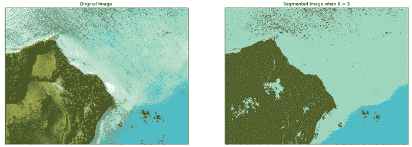

K=3 时的图像分割

所以该算法已经将我们的原始图像分类为三种主要颜色。

让我们看看当我们将 K 值改为 5 时会发生什么：

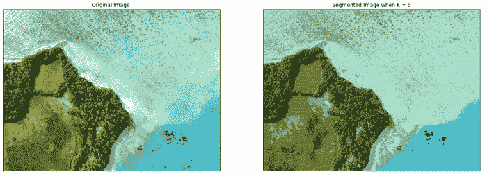

K=5 时的图像分割

将 K 值改为 7：

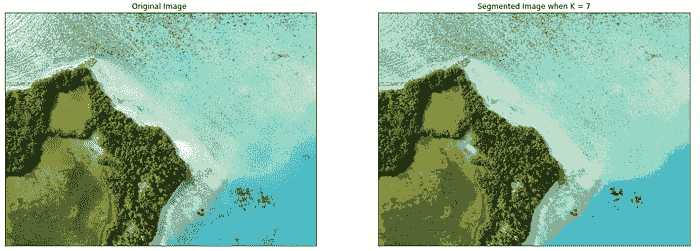

K=7 时的图像分割

如你所见，随着 K 值的增加，图像变得更清晰，因为 k-means 算法可以对更多的颜色类/簇进行分类。

我们可以尝试对不同的图像运行我们的代码：

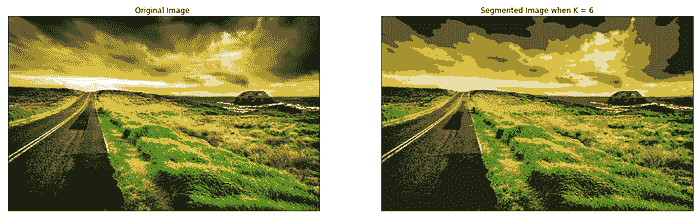

K=6 时的图像分割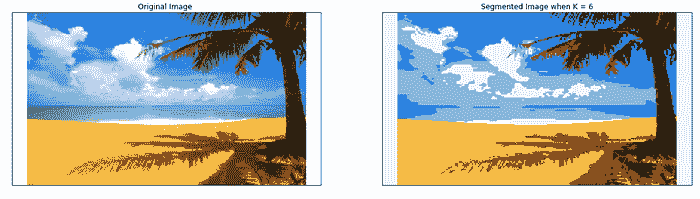

K=6 时的图像分割

让我们进入下一部分，即 Canny 边缘检测。

**Canny 边缘检测：** 这是一种图像处理方法，用于检测图像中的边缘，同时抑制噪声。

**Canny 边缘检测算法由 5 个步骤组成：**

1.  <noise reduction="">梯度计算</noise>

1.  非极大值抑制

1.  双重阈值

1.  通过滞后跟踪边缘

OpenCV 提供了**cv2.Canny(image, threshold1,threshold2)**函数用于边缘检测。

第一个参数是我们的输入图像。第二个和第三个参数分别是我们的最小和最大阈值。

该函数在输入图像（8 位输入图像）中找到边缘，并使用 Canny 算法在输出图中标记这些边缘。阈值 1 和阈值 2 之间的最小值用于边缘连接。最大值用于查找强边缘的初始片段。

```py
edges = cv2.Canny(img,150,200)
plt.figure(figsize=(figure_size,figure_size))
plt.subplot(1,2,1),plt.imshow(img)
plt.title('Original Image'), plt.xticks([]), plt.yticks([])
plt.subplot(1,2,2),plt.imshow(edges,cmap = 'gray')
plt.title('Edge Image'), plt.xticks([]), plt.yticks([])
plt.show()
```

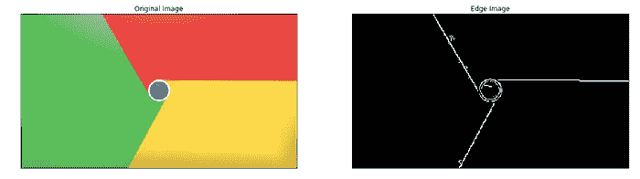

结果-1：使用 Canny 算法进行边缘检测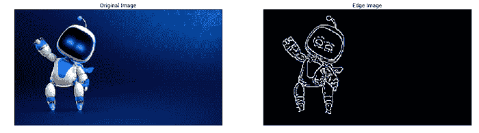

结果-2：使用 Canny 算法进行边缘检测

### 结论：未来的展望

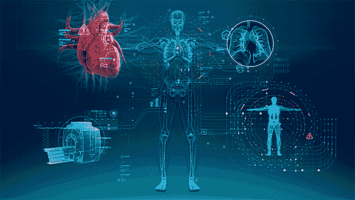

图片来源：[gehealthcare](http://newsroom.gehealthcare.com/is-the-ai-trend-why-doctors-of-the-future-may-know-code/)

由于图像处理、机器学习、人工智能及相关技术的进步，在未来几十年内，世界上将出现数百万台机器人，这将改变我们的日常生活方式。这些进步将包括语音命令、预测政府的信息需求、翻译语言、识别和跟踪人员和物品、诊断医疗条件、执行手术、修复人类 DNA 缺陷、无人驾驶汽车等应用，现实生活中的应用无穷无尽。

好了，文章到此为止。希望你们喜欢阅读这篇文章。请在评论区分享你的想法/评论/疑问。

你可以通过 [LinkedIn](https://www.linkedin.com/in/nagesh-singh-chauhan-6936bb13b/?source=post_page---------------------------) 联系我，如有任何问题。

感谢阅读!!!

**简介: [纳吉什·辛格·乔汉](https://www.linkedin.com/in/nagesh-singh-chauhan-6936bb13b/)** 是一位数据科学爱好者。对大数据、Python、机器学习感兴趣。

[原文](https://towardsdatascience.com/introduction-to-image-segmentation-with-k-means-clustering-83fd0a9e2fc3)。经许可转载。

**相关内容：**

+   使用卷积神经网络和 OpenCV 预测年龄和性别

+   使用 Scikit-Learn 进行 Python 线性回归的初学者指南

+   从数据预处理到优化回归模型性能

### 更多相关内容

+   [释放聚类潜力：理解 K-Means 聚类](https://www.kdnuggets.com/2023/07/clustering-unleashed-understanding-kmeans-clustering.html)

+   [k-means 聚类的质心初始化方法](https://www.kdnuggets.com/2020/06/centroid-initialization-k-means-clustering.html)

+   [什么是 K-Means 聚类及其算法如何工作？](https://www.kdnuggets.com/2023/05/kmeans-clustering-algorithm-work.html)

+   [实践无监督学习：K-Means 聚类](https://www.kdnuggets.com/handson-with-unsupervised-learning-kmeans-clustering)

+   [PyCaret 中的 Python 聚类简介](https://www.kdnuggets.com/2021/12/introduction-clustering-python-pycaret.html)

+   [揭示隐藏模式：层次聚类简介](https://www.kdnuggets.com/unveiling-hidden-patterns-an-introduction-to-hierarchical-clustering)
