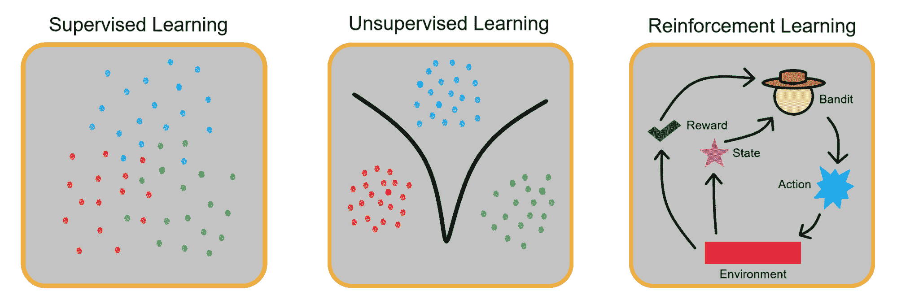
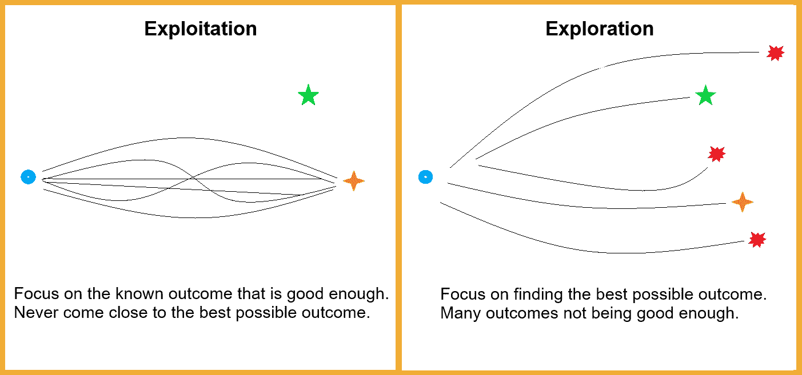
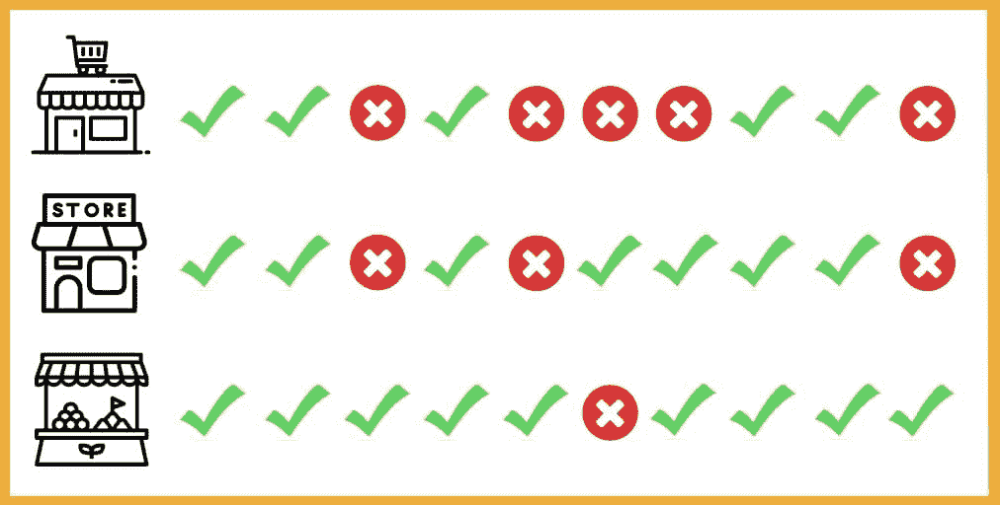

# 多臂老虎机问题简介

> 原文：[`www.kdnuggets.com/2023/01/introduction-multiarmed-bandit-problems.html`](https://www.kdnuggets.com/2023/01/introduction-multiarmed-bandit-problems.html)

多臂老虎机（MAB）是一个机器学习框架，它使用复杂的算法在面对多个选择时动态分配资源。换句话说，它是一种高级的 A/B 测试形式，数据分析师、医学研究人员和营销专家最常使用它。

在我们深入探讨多臂老虎机的概念之前，我们需要讨论强化学习以及探索与利用的困境。然后，我们可以专注于各种老虎机解决方案和实际应用。

* * *

## 我们的前 3 名课程推荐

 1\. [谷歌网络安全证书](https://www.kdnuggets.com/google-cybersecurity) - 快速开启网络安全职业生涯。

 2\. [谷歌数据分析专业证书](https://www.kdnuggets.com/google-data-analytics) - 提升你的数据分析技能

 3\. [谷歌 IT 支持专业证书](https://www.kdnuggets.com/google-itsupport) - 支持你的组织的 IT 需求

* * *

# 什么是强化学习？

除了监督学习和无监督学习之外，强化学习是机器学习的基本三大范式之一。与我们提到的前两种原型不同，强化学习关注的是在代理与环境互动时的奖励和惩罚。

强化学习的实际例子每天都在我们身边。例如，如果你的小狗咬断了你的电脑电缆，你可能会责骂它并表达你对其行为的不满。通过这样做，你将教会你的狗破坏家中电缆是不好的行为。这是负向强化。

同样地，当你的狗表演它学会的技巧时，你会奖励它。在这种情况下，你正在使用正向强化来鼓励它的行为。

多臂老虎机以相同的方式进行学习。

# 探索与利用

这种近乎哲学的困境存在于我们生活的各个方面。你应该从你下班后无数次光顾的那家咖啡店买咖啡，还是应该尝试一下刚刚在街对面开张的新咖啡店？

如果你选择**探索**，你的每日咖啡可能会变成一种不愉快的体验。然而，如果你选择**利用**你已经知道的东西，去访问熟悉的地方，你可能会错过你曾经品尝过的最美味的咖啡。

多臂老虎机在各个领域解决这些问题，并帮助数据分析师确定正确的行动方案。

# 什么是多臂老虎机？

单臂老虎机是老虎机的另一种说法。无需解释这个绰号背后的含义。

多臂老虎机问题得名于臭名昭著的单臂老虎机。然而，这一名称并非源于盗匪和抢劫，而是基于在长期使用老虎机时获得赢得结果的预定几率。

为了更好地理解这一点，我们来使用另一个现实生活中的例子。这次，你要决定在哪里购买蔬菜。你有三个选择：超市、本地杂货店和附近的农贸市场。每个选择都有不同的考虑因素，比如价格和食物是否有机，但在这个例子中我们只关注食物质量。

假设你在每个地点购买了十次杂货，并且你最常对农贸市场的蔬菜感到满意。最终，你会有意识地决定将绿色蔬菜专门从该市场购买。

当市场偶尔关闭时，你可能被迫再次尝试商店或超市，而结果可能会让你改变主意。最好的老虎机代理程序会做同样的事情，时不时地尝试回报较少的选项，并强化它们已经拥有的数据。

老虎机在实时学习并相应调整其参数。与 A/B 测试相比，多臂老虎机允许你基于较长时间段收集高级信息，而不是在短暂测试后做出选择。

# 多臂老虎机构建与解决方案

有无限种方法来构建多臂老虎机代理。纯探索代理是完全随机的。它们专注于探索，而不利用它们所收集的任何数据。

正如名称所示，纯利用代理总是选择最佳可能的解决方案，因为它们已经拥有所有可以利用的数据。由于其本质上的矛盾，这使得它们在理论上可能存在，但与随机代理一样糟糕。

因此，我们将重点解释三种最流行的多臂老虎机代理，这些代理既不是完全随机的，也不是在实践中不可能部署的。

## Epsilon-贪婪

Epsilon-贪婪多臂老虎机通过在公式中添加探索值（epsilon）来平衡探索和利用。如果 epsilon 等于 0.3，则代理将在 30%的时间内探索随机可能性，其余 70%的时间专注于利用最佳平均结果。

还包括一个衰减参数，它随着时间的推移减少 epsilon。当构建代理时，你可以决定在经过一定时间或采取一定行动后将 epsilon 从方程中移除。这将导致代理仅专注于利用已经收集的数据，并从方程中移除随机测试。

## 上置信界限

这些多臂赌博机与 epsilon-贪婪代理非常相似。然而，两者之间的关键区别在于构建上置信界限赌博机时所包含的额外参数。

这个方程中包含一个变量，迫使赌博机时不时地关注那些较少探索的可能性。例如，如果你有选项 A、B、C 和 D，而选项 D 只被选择过十次，而其他选项被选择了数百次，那么赌博机将故意选择 D 以探索其结果。

实质上，上置信界限代理牺牲了一些资源，以避免从未探索最佳可能结果的巨大但相当不可能的错误。

## Thompson Sampling（贝叶斯）

这个代理与我们之前探索的两个代理构建方式截然不同。作为列表中最先进的赌博机解决方案，详细解释其工作原理需要一篇长篇文章。然而，我们可以选择一种较为简单的分析方法。

Thompson 赌博机能够根据过去选择的频率更多或更少地信任某些选择。例如，我们有选项 A，代理选择了 100 次，平均奖励比率为 0.71。我们还有选项 B，它总共被选择了 20 次，平均奖励比率与选项 A 相同。

在这种情况下，Thompson 采样代理会更频繁地选择选项 A。这是因为选择路径的频率较高通常会产生较低的平均奖励。代理假设选项 A 更值得信赖，而选项 B 如果被更频繁选择，可能会有较低的平均结果。

# 多臂赌博机在现实生活中的应用

也许我们在这里可以提到的最著名的例子是 [Google Analytics](https://analytics.googleblog.com/2013/01/multi-armed-bandit-experiments.html)。作为其官方文档的一部分，他们解释了如何使用多臂赌博机探索不同搜索结果的可行性以及这些结果应该如何频繁地展示给不同的访问者。

2018 年，[Netflix 在 Data Council 举办了一次演讲](https://www.youtube.com/watch?v=kY-BCNHd_dM&ab_channel=DataCouncil)，讨论了他们如何应用多臂赌博机来确定哪些标题应该更频繁地展示给观众。市场营销人员可能会觉得这个演示非常有趣，因为它解释了不同因素（如标题的重播频率或观众暂停的情况）如何影响多臂赌博机的解决方案。

多臂赌博机对人类最重要的用途可能与医疗保健相关。至今，医学专家使用各种 MAB 构建来确定患者的最佳治疗方案。赌博机还在临床试验和新疗法探索中得到了各种应用。

# 关键要点

多臂赌博机在多个领域取得了成功应用，包括市场营销、金融，甚至是健康。然而，正如强化学习本身一样，它们也受到环境变化的严重限制。如果环境条件倾向于变化，多臂赌博机每次都不得不重新“学习”，从而成为一个不那么有用的工具。

**[亚历克斯·波波维奇](https://www.linkedin.com/in/alex-popovic-24283a169/)**是一位工程经理和作家，拥有十年的技术和金融团队领导经验。他现在经营自己的咨询公司，同时探索他所热爱的主题，如数据科学、人工智能和高幻想。你可以通过 hello@writeralex.com 联系亚历克斯。

### 更多相关话题

+   [更多分类问题的性能评估指标](https://www.kdnuggets.com/2020/04/performance-evaluation-metrics-classification.html)

+   [常见数据问题（及解决方案）](https://www.kdnuggets.com/2022/02/common-data-problems-solutions.html)

+   [识别机器学习可解决问题的 4 个因素](https://www.kdnuggets.com/2022/04/4-factors-identify-machine-learning-solvable-problems.html)

+   [想用你的数据技能解决全球问题？了解更多…](https://www.kdnuggets.com/2022/04/jhu-want-data-skills-solve-global-problems.html)

+   [解决 5 个复杂的 SQL 问题：难题查询解释](https://www.kdnuggets.com/2022/07/5-hardest-things-sql.html)

+   [数据科学项目，帮助你解决现实世界问题](https://www.kdnuggets.com/2022/11/data-science-projects-help-solve-real-world-problems.html)
