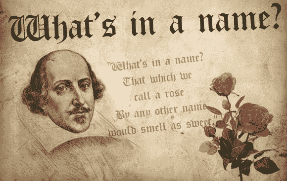
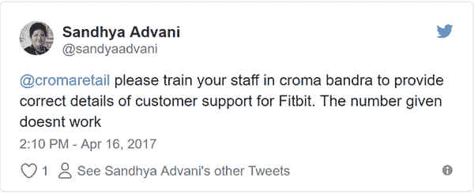
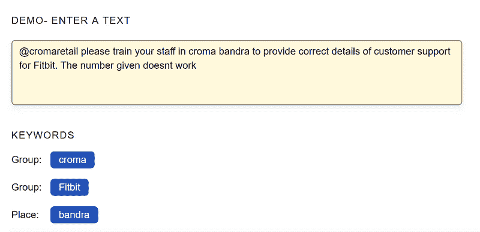
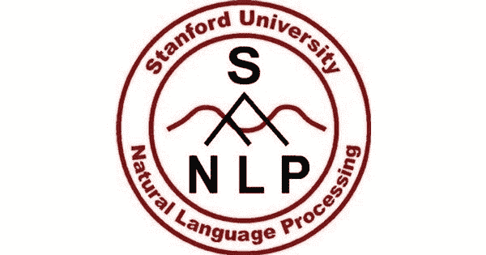
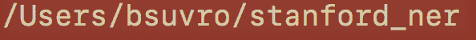
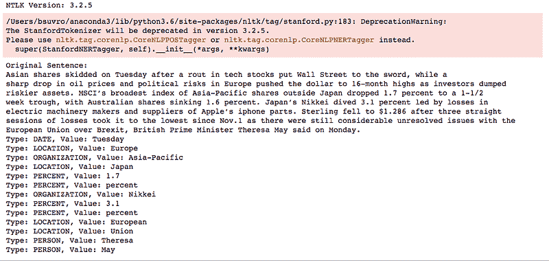
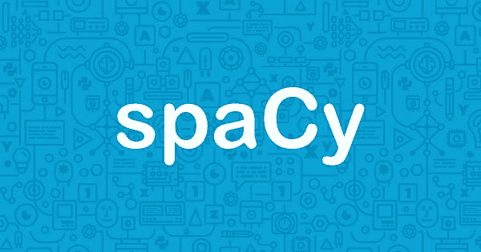
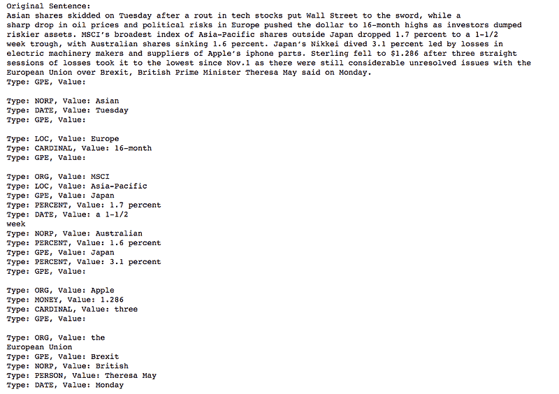
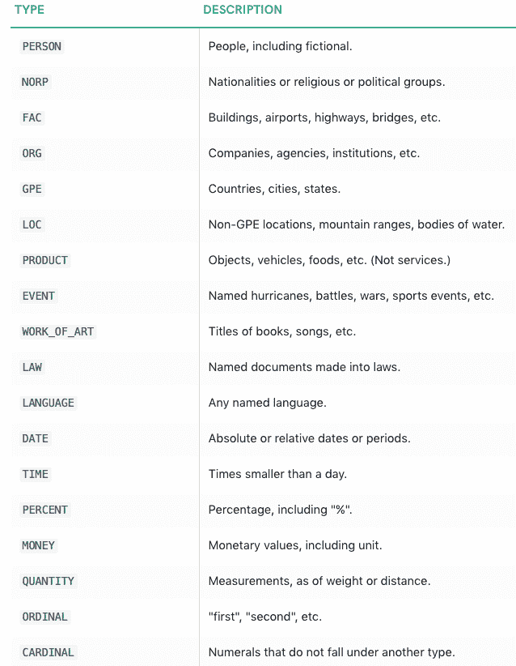

# 命名实体识别介绍

> 原文：[`www.kdnuggets.com/2018/12/introduction-named-entity-recognition.html`](https://www.kdnuggets.com/2018/12/introduction-named-entity-recognition.html)

 评论

**由 [Suvro Banerjee](https://www.linkedin.com/in/suvro-banerjee-9345442a/)，Juniper Networks 的机器学习工程师**



[`www.lovejustine.com/journal/whats-in-a-name`](http://www.lovejustine.com/journal/whats-in-a-name)

### **介绍**

在这篇文章中，我们将了解什么是命名实体识别，也称为 NER。我们将讨论一些使用案例，并评估几个标准的 Python 库，以便我们能够快速入门并解决实际问题。

在接下来的文章系列中，我们将深入了解这一类算法，变得更加复杂，并从零开始创建自己的命名实体识别系统（NER）。

那么，让我们开始这段旅程吧。

### **什么是命名实体识别？**

命名实体识别，也称为实体提取，将文本中的命名实体分类到预定义的类别中，如“个人”、“公司”、“地点”、“组织”、“城市”、“日期”、“产品术语”等。它为你的内容增加了丰富的语义知识，帮助你迅速理解任何给定文本的主题。

### **命名实体识别的几个使用案例**

**为新闻提供商分类内容**


为新闻提供商分类内容

命名实体识别可以自动扫描整个文章，并揭示其中讨论的主要人物、组织和地点。了解每篇文章的相关标签有助于自动将文章分类到定义的层级中，并实现顺畅的内容发现。


[`www.paralleldots.com/named-entity-recognition`](https://www.paralleldots.com/named-entity-recognition)

**高效搜索算法**


跨品牌的高效搜索

假设你正在为一个拥有数百万篇文章的在线出版商设计一个内部搜索算法。如果每次搜索查询时，算法都需要在数百万篇文章中搜索所有的词汇，那么这个过程将非常耗时。相反，如果能够对所有文章运行一次命名实体识别，并将每篇文章相关的实体（标签）分别存储，这将大大加快搜索过程。采用这种方法，搜索词将只与每篇文章中讨论的少量实体匹配，从而实现更快的搜索执行。

**客户支持**



Twitter 上的客户支持

假设你在一个全球多分支的电子商店处理客户支持部门，你会看到客户反馈中有很多提及。例如，像这样。

现在，如果你通过命名实体识别 API 传递，它会提取出 Bandra（地点）和 Fitbit（产品）这些实体。然后，这些信息可以用来分类投诉，并将其分配给组织中应该处理此事的相关部门。



[`www.paralleldots.com/named-entity-recognition`](https://www.paralleldots.com/named-entity-recognition)

### **标准库来使用命名实体识别**

我将讨论三个在 Python 中广泛使用的标准库来执行 NER。我相信还有许多其他的，欢迎读者在评论区补充。

1.  Stanford NER

1.  spaCy

1.  NLTK

### **Stanford NER**



Stanford NER

Stanford NER 是一个 Java 实现的命名实体识别器。Stanford NER 也被称为 CRFClassifier。该软件提供了（任意顺序）线性链条件随机场（CRF）序列模型的一般实现。也就是说，通过在标记数据上训练自己的模型，你实际上可以使用这段代码来构建用于 NER 或其他任务的序列模型。

现在，NLTK（自然语言工具包）是一个很棒的 Python 包，提供了一系列自然语言语料库和各种 NLP 算法的 API。NLTK 附带了高效的 Stanford NER 实现。

现在有了这些背景，让我们使用 Stanford NER。

**安装 NLTK 库**

```py
pip install nltk
```

**下载 Stanford NER 库**

前往 [`nlp.stanford.edu/software/CRF-NER.html#Download`](https://nlp.stanford.edu/software/CRF-NER.html#Download) 下载最新版本，我使用的是 Stanford Named Entity Recognizer 版本 3.9.2。

我获取了一个名为“stanford-ner-2018–10–16.zip”的压缩文件，需要解压缩，我将其重命名为 stanford_ner 并放置在主文件夹中。



现在，以下 Python 代码用于在给定文本上执行 NER。代码放在“bsuvro”文件夹中，以便可以使用相对路径访问 NER 标签引擎（stanford-ner-3.9.2.jar）和在英语语料库上训练的 NER 模型（classifiers/english.muc.7class.distsim.crf.ser.gz）。你可以看到我使用了 7class 模型，这将提供七种不同的输出命名实体，如地点、人物、组织、货币、百分比、日期、时间。

你也可以使用 —

+   english.all.3class.distsim.crf.ser.gz: 地点、人物和组织

+   english.conll.4class.distsim.crf.ser.gz: 地点、人物、组织和其他

Stanford 命名实体识别

上述代码的输出如下，你可以看到单词如何被标记为命名实体。注意 “O” 是未标记的或可以称为“其他”的东西。



斯坦福 NER 标注器的输出

现在，让我们转到下一个库，称为 spaCy。

### **spaCy**



spaCy NER

spaCy 以其工业级自然语言处理库而闻名。它是用 Cython 编写的，Cython 是一种具有 C 类性能的 Python 编程语言的超集。

虽然我希望深入探讨 spaCy，因为它有许多有趣的 NLP 模块，但我将专注于 NER 标注。我会有一个单独的系列来探索 spaCy。

**安装 spaCy 库并下载“en”（英文）模型**

```py
pip install spacy
python -m spacy download en
```

spaCy NER

上述代码的输出 -



spaCy NER 的输出

现在支持以下实体类型 -



[`spacy.io/api/annotation#pos-tagging`](https://spacy.io/api/annotation#pos-tagging)

* * *

## 我们的前三个课程推荐

 1\. [Google 网络安全证书](https://www.kdnuggets.com/google-cybersecurity) - 快速进入网络安全职业道路

 2\. [Google 数据分析专业证书](https://www.kdnuggets.com/google-data-analytics) - 提升你的数据分析技能

 3\. [Google IT 支持专业证书](https://www.kdnuggets.com/google-itsupport) - 支持你的组织在 IT 领域

* * *

### 更多相关内容

+   [图像识别与自然语言处理的迁移学习](https://www.kdnuggets.com/2022/01/transfer-learning-image-recognition-natural-language-processing.html)

+   [语音识别度量的演变](https://www.kdnuggets.com/2022/10/evolution-speech-recognition-metrics.html)

+   [5 个需求量大但未获得足够认可的 IT 职业](https://www.kdnuggets.com/5-it-jobs-that-are-high-in-demand-but-dont-get-enough-recognition)

+   [自然语言处理的温和介绍](https://www.kdnuggets.com/2022/06/gentle-introduction-natural-language-processing.html)

+   [AI 中的爬山算法简介](https://www.kdnuggets.com/2022/07/introduction-hill-climbing-algorithm-ai.html)

+   [SMOTE 介绍](https://www.kdnuggets.com/2022/11/introduction-smote.html)
nition-eda8c97c2db1)。经许可转载。

**相关：**

+   使用 Scikit-Learn 进行命名实体识别和分类

+   Apache Spark 简介

+   命名实体识别：实用者的 NLP 指南

* * *

## 我们的三大课程推荐

 1\. [谷歌网络安全证书](https://www.kdnuggets.com/google-cybersecurity) - 快速进入网络安全职业生涯

 2\. [谷歌数据分析专业证书](https://www.kdnuggets.com/google-data-analytics) - 提升你的数据分析技能

 3\. [谷歌 IT 支持专业证书](https://www.kdnuggets.com/google-itsupport) - 支持你的组织的 IT 需求

* * *

### 更多相关话题

+   [图像识别和自然语言处理的迁移学习](https://www.kdnuggets.com/2022/01/transfer-learning-image-recognition-natural-language-processing.html)

+   [语音识别指标的演变](https://www.kdnuggets.com/2022/10/evolution-speech-recognition-metrics.html)

+   [5 个需求高却未获得足够认可的 IT 职位](https://www.kdnuggets.com/5-it-jobs-that-are-high-in-demand-but-dont-get-enough-recognition)

+   [自然语言处理的温和介绍](https://www.kdnuggets.com/2022/06/gentle-introduction-natural-language-processing.html)

+   [人工智能中的爬山算法介绍](https://www.kdnuggets.com/2022/07/introduction-hill-climbing-algorithm-ai.html)

+   [SMOTE 介绍](https://www.kdnuggets.com/2022/11/introduction-smote.html)
