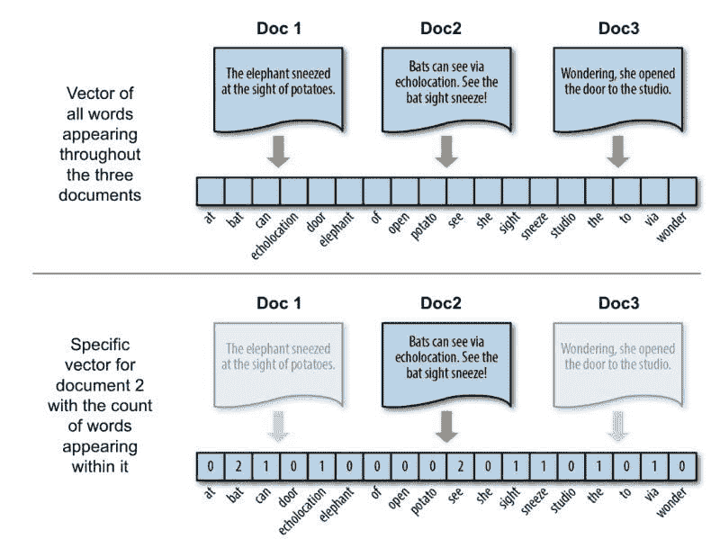
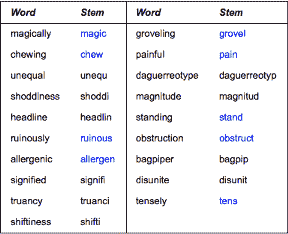
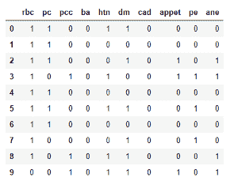

# 《NLP 简介及提升技巧的 5 个建议》

> 原文：[`www.kdnuggets.com/2020/09/introduction-nlp-5-tips-raising-your-game.html`](https://www.kdnuggets.com/2020/09/introduction-nlp-5-tips-raising-your-game.html)

评论

对于从事数据科学、机器学习和/或人工智能工作的人来说，NLP 可能是最令人兴奋的领域之一。

> *NLP 代表自然语言处理，涉及计算机与人类语言之间的交互。编程算法能够处理和分析大量自然语言数据。*

其基本目标可能有所不同，但总体目标是得出关于人类行为的结论……我们写作时的意图，我们在写作时的思考或感受，我们所写内容的类别，以及其他一些东西，如聊天机器人、客户市场细分、查找重复项和元素之间的相似性、虚拟助手（如 Siri 或 Alexa）等等。

尽管如此，作为一个学科，NLP 并未出现很久，直到 1960 年，艾伦·图灵发表了一篇名为《计算机与智能》的文章，提出了现在被称为‘图灵测试’的概念。该论文提出了“机器能思考吗？”的问题，并通过测试机器表现出的智能行为是否等同于或不可区分于人类的智能行为。进行测试需要三名参与者，其中一名玩家 C，即评估者，负责确定哪个玩家——A 或 B——是计算机，哪个是人类。


日本机器人 Pepper，由 Aldebaran Robotics 公司制造。

评估者将判断一个人类和一个旨在生成类似人类响应的机器之间的自然语言对话，知道对话中的两个伙伴中有一个是机器。对话将限制在仅文本的频道中，结果不依赖于机器是否能正确回答问题，而仅仅取决于其回答与人类回答的相似程度。如果在测试结束时，评估者无法可靠地区分机器和人类，则机器被认为通过了测试。

从那时起，在过去几年中，该领域已呈指数级发展，从使用一组规则的手工编码系统发展到更复杂的统计 NLP。在这种背景下，一些公司在该领域做了一些非常令人兴奋的工作。例如，如果你是 Android 用户，你可能熟悉**Swiftkey**，这是一个使用文本预测的初创公司，旨在提高用户写作的准确性、流畅性和速度。Swiftkey 从我们的写作中学习，预测最喜欢的单词、表情符号甚至表达方式。另一个初创公司**SignAll**，则将手语转换为文本，帮助听障人士与不会手语的人交流。

事实上，如今，使用 Python、Tensorflow、Keras 等开源库的扩展，使得 NLP 变得更加可及，每天越来越多的企业在使用它。其中一些公司专门聘请其他专门从事该领域的公司，而另一些则雇佣数据科学家和数据分析师来构建自己的解决方案。

如果你遇到任何这些情况，无论你是公司还是数据专家，在接下来的几行中，我将介绍我在从事 NLP 工作时的一些学习经验。幸运的是，所有这些都是基于错误的提示！希望你能提前避免它们，而不是像我一样经历这些 :)

### 1\. 找到适合你的向量化类型

在自然语言处理（NLP）中，通常在经过大量的数据清理后，魔法开始于所谓的向量化。这种工具、技术或无论你怎么称呼它，将一堆文本，通常称为文档，根据每个文档中出现的单词，将它们转换为向量。请看以下示例：



示例由作者使用来自 [`www.oreilly.com`](https://www.oreilly.com/library/view/applied-text-analysis/9781491963036/ch04.html) 的图像创建

在上面的示例中，我们使用了一种称为**计数向量器或词袋模型**的工具。这种向量化方法通常会忽略文本中的语法、顺序和结构。它是一个很好的选择，因为它跟踪文档中出现的所有单词，而且通过简单地计数来处理它们的方式易于理解，并且为我们提供了对整体最重要单词的清晰认识。然而，它也存在两个主要问题：

+   **数据稀疏性**：在统计所有文档中的出现次数时，我们可能会得到一个由全是零的向量组成的矩阵，因为每个文档只包含所有可能单词的一小部分。我们稍后会详细讨论这个问题。

+   **未来本身**：计数向量器输出一个固定大小的矩阵，包含我们当前文档中所有单词（或某些频率的单词）。如果我们未来收到更多文档，而我们不知道可能会遇到的单词，这可能会成为一个问题。

+   **棘手的文档**：如果我们有一个文档，其中一个特定的单词出现得如此频繁，以至于它看起来像是所有文档中最常见的单词，而不仅仅是一个单词在一个文档中出现了很多次，那会发生什么呢？

为了解决第一个和第二个问题，我们可以使用**哈希向量化器**，它将文本文档集合转换为使用[哈希技巧](https://en.wikipedia.org/wiki/Feature_hashing)计算的出现矩阵。每个词汇通过哈希函数映射到一个特征，这个函数将其转换为一个数字。如果我们在文本中再次遇到该词，它将被转换为相同的哈希，从而允许我们在不保留词典的情况下计算词汇出现的次数。这个技巧的主要缺点是无法计算逆变换，因此我们失去了重要特征对应的词汇信息。

为了解决上述第三个问题，我们可以使用**词频-逆文档频率（tf-idf）向量化器**。tf-idf 分数告诉我们哪些词在文档之间具有最强的区分能力。在一个文档中频繁出现但在许多文档中很少出现的词包含了很大的区分能力。逆文档频率是衡量词汇提供多少信息的指标，即该词在所有文档中是常见还是稀有。提升特定文档的词汇，同时抑制那些在大多数文档中常见的词汇。

Sklearn 对所有这三种向量化类型都提供了实现：

+   [Countvectorizer](https://scikit-learn.org/stable/modules/generated/sklearn.feature_extraction.text.CountVectorizer.html)

+   [Hashingvectorizer](https://scikit-learn.org/stable/modules/generated/sklearn.feature_extraction.text.HashingVectorizer.html)

+   [Tfidfvectorizer](https://scikit-learn.org/stable/modules/generated/sklearn.feature_extraction.text.TfidfVectorizer.html)

### 2\. 个性化停用词，并注意数据中的语言

在进行任何形式的向量化时，使用停用词是获得可靠结果的关键步骤。将停用词列表传递给我们的算法，我们是在告诉它：“如果找到这些词，请忽略它们……我不希望它们出现在我的输出矩阵中。” Sklearn 确实包含一个默认的停用词列表，只需将单词‘english’传递给‘stop_words’超参数即可。然而，这里有几个限制：

+   它仅包括基本的词汇，如“and”、“the”、“him”，这些词被认为在表示文本内容时不具备信息量，可能会被删除以避免被解读为预测信号。然而，例如，如果你在处理从租赁代理网站抓取的房屋描述，你可能会希望移除所有不属于房产描述本身的词汇，如‘opportunity’、‘offer’、‘amazing’、‘great’、‘now’等。

+   对我来说，作为一名西班牙语使用者，在处理该语言的机器学习问题时最大的问题是：它仅在英语中可用。

所以，无论你是想丰富英语中的默认单词列表以改善输出矩阵，还是想使用其他语言的单词列表，你都可以通过使用超参数‘stop_words’将个性化的停用词列表传递给 Sklearn 的算法。顺便说一下，[这是一个 GitHub 仓库](https://github.com/Alir3z4/stop-words) ，其中包含了许多语言的词表。

在进入下一个点之前，请记住，有时你可能根本不需要使用任何停用词。例如，如果你处理的是数字，即使是 Sklearn 默认的英语停用词列表也包括所有从 0 到 9 的单个数字。因此，重要的是要问自己是否正在处理需要停用词的 NLP 问题。

### 3\. 使用词干提取器进行‘分组’相似单词

文本标准化是将稍有不同版本的具有本质上等同意义的单词转换为相同特征的过程。在某些情况下，考虑到所有可能的变体可能是合理的，但无论你是在英语还是其他语言中工作，有时你还需要对文档进行某种预处理，以相同的方式表示具有相同意义的单词。例如，consultant、consulting、consult、consultative 和 consultants 都可以表示为‘consultant’。更多示例见下表：



来源：[`www.wolfram.com`](https://www.wolfram.com/language/11/text-and-language-processing/generate-and-verify-stemmed-words.html) — 生成和验证词干化单词

为此，我们可以使用词干提取。词干提取器去除单词的形态学词缀，仅保留词干。幸运的是，[Python 的 NLTK 库](https://www.nltk.org/api/nltk.stem.html)包含了几种强大的词干提取器。如果你想将特定语言的词干提取器或其他词干提取器整合到你的向量化算法中，你可以使用以下代码：

```py
spanish_stemmer = SpanishStemmer()classStemmedCountVectorizerSP(CountVectorizer):
def build_analyzer(self):
analyzer = super(StemmedCountVectorizerSP,self).build_analyzer()return lambda doc: ([spanish_stemmer.stem(w) for w in analyzer(doc)])
```

你可以通过更改分配给类的算法轻松地将其改为使用 HashingVectorizer 或 TfidfVectorizer。

### 4\. 避免使用 Pandas DataFrames

这条建议简短明了：如果你在处理超过 5-10k 行的数据的 NLP 项目时，避免使用 DataFrames。仅仅使用 Pandas 对大量文档进行向量化会返回一个巨大的矩阵，处理速度非常慢，而且很多时候，自然语言处理项目涉及测量距离，这通常非常缓慢，因为需要彼此比较元素。即使我自己也大量使用 Pandas 的 DataFrames，对于这类任务，我建议使用 Numpy Arrays 或 Sparse Matrices。

同时，请注意，你总是可以通过使用‘.toarray()’函数将稀疏矩阵转换为数组，反之亦然，从数组转换为稀疏矩阵：

```py
from scipy import sparsemy_sparse_matrix = sparse.csr_matrix(my_array)
```

顺便说一下，如果你处理时间问题，记得可以使用以下方法来计时你的代码：

```py
start = time.time()whatever_you_want_to_timeend = time.time()print(end — start)
```

### 5. 数据稀疏性：使你的输出矩阵可用



正如之前所说，处理 NLP 时最大的一个问题是数据稀疏性……结果是充满零的数万个列的矩阵，这使得之后应用某些技术变得不可能。以下是我过去处理这个问题时使用的一些技巧：

+   **使用 TfidfVectorizer 或 CountVectorizer 时，设置超参数‘max_features’**。例如，你可以打印出文档中的词频，然后为其设置某个阈值。假设你设置了一个 50 的阈值，而你的数据语料库包含 100 个词。经过查看词频，发现有 20 个词出现次数少于 50 次。因此，你将 max_features 设置为 80，然后可以继续使用。如果 max_features 设置为 None，那么在转换过程中会考虑整个语料库。否则，如果你传递例如 5 给 max_features，那将意味着从文本文档中最频繁的 5 个词中创建特征矩阵。

+   **在 HashingVectorizer 中设置‘n_features’的数量**。这个超参数设置输出矩阵中的特征/列数。较小的特征数量可能会导致哈希冲突，但较大的特征数量会导致线性学习器中的系数维度增大。具体数量取决于你和你的需求。

+   **使用降维技术**。如主成分分析（PCA）可以将具有数万个列的输出矩阵转化为捕捉原始矩阵方差的较小集合。这可能是一个很好的主意。只要分析这种降维对最终结果的影响，检查其实际效用，并选择使用的维度数量。

我真的希望我所学到的这些知识能够帮助你的 NLP 项目。未来会有更多关于 NLP 的故事，但如果你喜欢这个故事，不要忘记查看我最近的一些文章，如 [如何将数据分成训练集和测试集以确保代表性](https://medium.com/better-programming/how-to-divide-data-into-train-and-test-assuring-representativeness-c4c12c215d79?source=friends_link&sk=389e0ee2de25f5e76d31d8430e7ccc4b)、[数据科学中的幸存者偏差](https://towardsdatascience.com/survivorship-bias-in-data-science-and-machine-learning-4581419b3bca?source=friends_link&sk=fd531decb8e07af98c506c4038c53bf9) 和 [在云中使用集群进行数据科学项目的 4 个简单步骤](https://medium.com/swlh/using-a-cluster-in-the-cloud-for-data-science-projects-in-4-simple-steps-9ee067238448?source=friends_link&sk=39832abc5b65eca87eb1089f934e87e1)。所有这些及更多内容可在 [我的 Medium 个人资料](https://medium.com/@g.ferreiro.volpi) 中找到。

**如果你想直接通过电子邮件接收我的最新文章，**[**请订阅我的通讯**](https://gmail.us3.list-manage.com/subscribe?u=8190cded0d5e26657d9bc54d7&id=3e942158a2)** :)**

感谢阅读！

特别提到以下我在整个故事中使用的来源：

+   [*https://blog.ventureradar.com/2015/09/22/top-5-companies-innovating-with-natural-language-processing/*](https://blog.ventureradar.com/2015/09/22/top-5-companies-innovating-with-natural-language-processing/)

+   [*https://en.wikipedia.org/wiki/Natural_language_processing*](https://en.wikipedia.org/wiki/Natural_language_processing)

+   [*https://en.wikipedia.org/wiki/Turing_test*](https://en.wikipedia.org/wiki/Turing_test)

+   [*https://www.forbes.com/sites/bernardmarr/2019/06/03/5-amazing-examples-of-natural-language-processing-nlp-in-practice/#365b59901b30*](https://www.forbes.com/sites/bernardmarr/2019/06/03/5-amazing-examples-of-natural-language-processing-nlp-in-practice/#365b59901b30)

+   [*https://www.oreilly.com/library/view/applied-text-analysis/9781491963036/ch04.html*](https://www.oreilly.com/library/view/applied-text-analysis/9781491963036/ch04.html)

+   [*https://stackoverflow.com/questions/46118910/scikit-learn-vectorizer-max-features*](https://stackoverflow.com/questions/46118910/scikit-learn-vectorizer-max-features)

**简历：** 在电子商务和市场营销领域拥有超过 5 年的经验，**[贡萨洛·费雷罗·沃尔皮](https://www.linkedin.com/in/gferreirovolpi/)** 转向数据科学和机器学习领域，目前在 Ravelin Technology 工作，结合机器学习和人类洞察力来应对电子商务中的欺诈问题。

[原文](https://towardsdatascience.com/an-introduction-to-nlp-and-5-tips-for-raising-your-game-639636188ddf)。经许可转载。

**相关：**

+   加速自然语言处理：来自亚马逊的免费课程

+   4 门免费数学课程，提升你的数据科学技能

+   NLP 模型生成器：按需生成模型代码

* * *

## 我们的三大课程推荐

 1\. [Google 网络安全证书](https://www.kdnuggets.com/google-cybersecurity) - 快速进入网络安全职业生涯。

 2\. [Google 数据分析专业证书](https://www.kdnuggets.com/google-data-analytics) - 提升你的数据分析能力

 3\. [Google IT 支持专业证书](https://www.kdnuggets.com/google-itsupport) - 支持你所在的组织进行 IT 工作

* * *

### 相关主题更多信息

+   [立即提升你的数据科学技能的 5 个技巧](https://www.kdnuggets.com/5-tips-to-step-up-your-data-science-game-right-away)

+   [提升你的 Python 技能，使用《数据科学的快速 Python》！](https://www.kdnuggets.com/2022/06/manning-step-python-game-fast-python-data-science.html)

+   [为数据游戏做好未来准备：2023 年每个数据科学家需要的顶级技能](https://www.kdnuggets.com/futureproof-your-data-game-top-skills-every-data-scientist-needs-in-2023)

+   [用 LangChain 改变 AI：文本数据的游戏规则改变者](https://www.kdnuggets.com/2023/08/transforming-ai-langchain-text-data-game-changer.html)

+   [Python f-Strings 魔法：每个编码者需要了解的 5 个改变游戏规则的技巧](https://www.kdnuggets.com/python-fstrings-magic-5-gamechanging-tricks-every-coder-needs-to-know)

+   [通过这 5 门免费课程启动你的 NLP 旅程](https://www.kdnuggets.com/kickstart-your-nlp-journey-with-these-5-free-courses)
