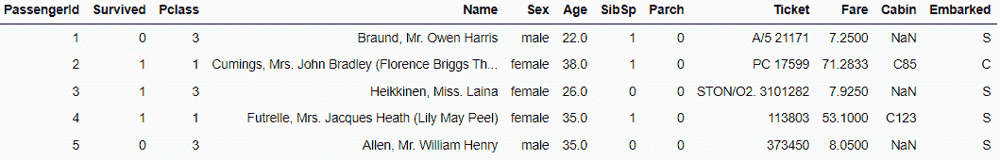
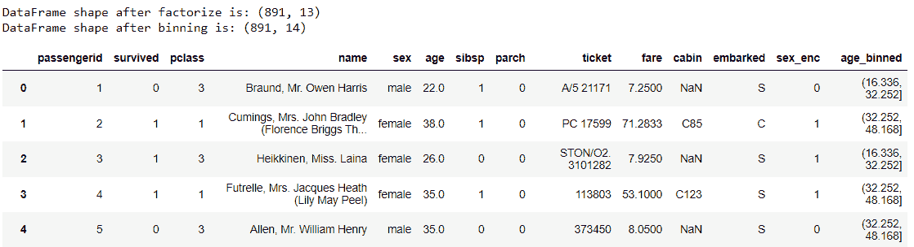
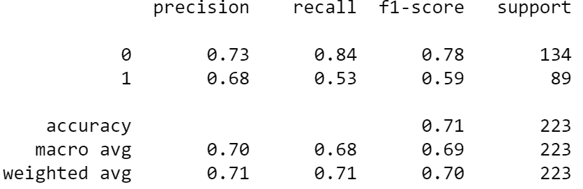
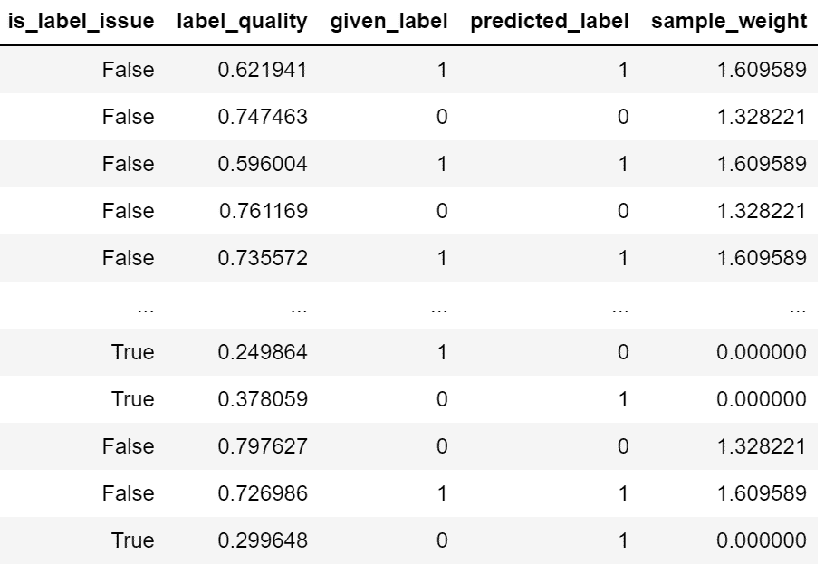
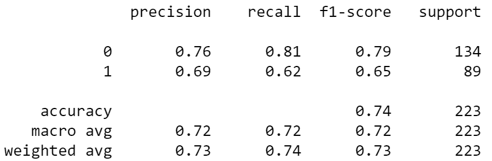

# Python 数据清理库简介

> 原文：[`www.kdnuggets.com/2023/03/introduction-python-libraries-data-cleaning.html`](https://www.kdnuggets.com/2023/03/introduction-python-libraries-data-cleaning.html)


图片由 [pch.vecto](https://www.freepik.com/free-vector/male-female-cleaning-staff-with-mops-vacuum-cleaner_18733883.htm#query=cleaning&position=6&from_view=search&track=sph) 提供，来源于 [Freepik](https://www.freepik.com/)

数据清理是任何数据专家必须做的活动，因为我们需要确保数据没有错误、一致，并且适用于分析。如果没有这一步，分析结果可能会受到影响。然而，数据清理通常需要很长时间，并且可能会很重复。此外，有时我们会遗漏一个需要意识到的错误。

* * *

## 我们的前三个课程推荐

 1\. [谷歌网络安全证书](https://www.kdnuggets.com/google-cybersecurity) - 快速进入网络安全职业生涯。

 2\. [谷歌数据分析专业证书](https://www.kdnuggets.com/google-data-analytics) - 提升您的数据分析能力

 3\. [谷歌 IT 支持专业证书](https://www.kdnuggets.com/google-itsupport) - 支持您的组织进行 IT

* * *

这就是为什么我们可以依赖专门为数据清理设计的 Python 包。这些包旨在改善我们的数据清理体验，并缩短数据清理的处理时间。这些包是什么？让我们找出来。

# PyJanitor

Pandas 提供了许多数据清理函数，如 fillna 和 dropna，但这些功能仍然可以得到增强。 [PyJanitor](https://pyjanitor-devs.github.io/pyjanitor/) 是一个 Python 包，提供 Pandas API 内的数据清理 API，而不替代它们。该包提供了各种方法，包括但不限于以下内容：

+   清理列名，

+   识别重复值，

+   数据因子化，

+   数据编码，

还有更多。然而，PyJanitor 的特别之处在于其 API 可以通过链式方法执行。让我们用示例数据来测试它们。对于这个示例，我将使用 [Kaggle 的 Titanic 训练数据](https://www.kaggle.com/competitions/titanic/data?select=train.csv)。

首先，让我们安装 PyJanitor 包。

```py
pip install pyjanitor
```

然后我们将加载 Titanic 数据集。

```py
import pandas as pd
df = pd.read_csv('train.csv')
df.head() 
```



我们将使用上述数据集作为示例。让我们尝试使用 PyJanitor 包来清理数据，使用一些示例函数。

```py
import janitor

df.factorize_columns(column_names=["Sex"]).also(
    lambda df: print(f"DataFrame shape after factorize is: {df.shape}")
).bin_numeric(from_column_name="Age", to_column_name="Age_binned").also(
    lambda df: print(f"DataFrame shape after binning is: {df.shape}")
).clean_names()
```



我们通过链式方法转换初始数据框。那么，以上代码会发生什么？让我来分解一下。

+   首先，我们使用 factorize 函数将‘Sex’列转换为数值，

+   使用 also 函数，我们打印因子分解后的形状，

+   接下来，我们使用 bin_numeric 函数将年龄分组，

+   与 also 函数相同，

+   最后，我们通过将列名转换为小写，然后用 clean_names 替换所有空格为下划线来清理列名。

上述所有操作可以通过直接在我们的 Pandas 数据框中进行单链方法完成。你仍然可以用 PyJanitor 包做更多的事情，所以我建议你查看他们的[文档](https://pyjanitor-devs.github.io/pyjanitor/api/functions/)。

# Feature-engine

[Feature-Engine](https://feature-engine.trainindata.com/en/latest/index.html#)是一个用于特征工程和选择的 Python 包，它保留了 scikit-learn 的 API 方法，如 fit 和 transform。该包旨在提供一个嵌入机器学习管道的数据转换器。

该包提供了各种数据清洗转换器，包括但不限于：

+   数据插补，

+   分类编码，

+   异常值移除，

+   变量选择，

还有许多其他函数。让我们先通过安装它们来尝试这个包。

```py
pip install feature-engine
```

Feature-Engine 的使用很简单；你只需要导入它们并训练转换器，类似于 scikit-learn API。例如，我使用 Imputer 用中位数填充年龄列的缺失数据。

```py
from feature_engine.imputation import MeanMedianImputer

# set up the imputer
median_imputer = MeanMedianImputer(imputation_method='median', variables=['Age'])
# fit the imputer
median_imputer.fit(df)

median_imputer.transform(df) 
```

上面的代码将用中位数填充数据框中的年龄列。你可以尝试很多转换器。试着在[文档](https://feature-engine.trainindata.com/en/latest/api_doc/index.html)中找到适合你的数据管道的转换器。

# Cleanlab

[Cleanlab](https://docs.cleanlab.ai/stable/index.html)是一个开源的 Python 包，用于清理机器学习数据集标签中的任何问题。它旨在使带有噪声标签的机器学习训练更加稳健，并提供可靠的输出。任何具有概率输出的模型都可以与 Cleanlab 包一起训练。

让我们用代码示例来尝试这个包。首先，我们需要安装 Cleanlab。

```py
pip install cleanlab
```

由于 Cleanlab 用于清洗标签问题，我们来尝试准备数据集以进行机器学习训练。

```py
# Selecting the features
df = df[["Survived", "Pclass", "SibSp", "Parch"]]

# Splitting the dataset
from sklearn.model_selection import train_test_split

X_train, X_test, y_train, y_test = train_test_split(
    df.drop("Survived", axis=1), df["Survived"], random_state=42
) 
```

数据集准备好后，我们将尝试用分类模型来拟合数据集。让我们看看在不清洗标签的情况下的预测指标。

```py
#Fit the model
from sklearn.linear_model import LogisticRegression

model = LogisticRegression(random_state = 42)
model.fit(X_train, y_train)
preds = model.predict(X_test)

#Print the metrics result
from sklearn.metrics import classification_report

print(classification_report(y_test, preds))
```



这是一个不错的结果，但让我们看看在清洗标签后能否进一步提高结果。我们来尝试用以下代码实现这一点。

```py
from cleanlab.classification import CleanLearning

#initiate model with CleanLearning
cl = CleanLearning(model, seed=42)

# Fit model
cl.fit(X_train, y_train)

# Examine the label quality
cl.get_label_issues()
```



从上面的结果可以看出，由于预测错误，一些标签存在问题。通过清洗标签，我们来看看模型指标的结果。

```py
clean_preds = cl.predict(X_test)
print(classification_report(y_test, clean_preds))
```



我们可以看到，相比于之前没有标签清洗的模型，结果有所改善。你仍然可以使用 Cleanlab 做很多事情；我建议你访问[文档](https://docs.cleanlab.ai/stable/index.html)以进一步了解。

# 结论

数据清洗是任何数据分析过程中的必经步骤。然而，这通常需要花费大量时间来正确清洗所有数据。幸运的是，有一些 Python 包被开发出来以帮助我们正确清洗数据。在本文中，我介绍了三个帮助清洗数据的包：PyJanitor、Feature-Engine 和 Cleanlab。

**[Cornellius Yudha Wijaya](https://www.linkedin.com/in/cornellius-yudha-wijaya/)** 是一名数据科学助理经理和数据撰写员。他在全职工作于 Allianz Indonesia 的同时，喜欢通过社交媒体和写作分享 Python 和数据技巧。

### 更多内容

+   [深度学习库简介：PyTorch 和 Lightning AI](https://www.kdnuggets.com/introduction-to-deep-learning-libraries-pytorch-and-lightning-ai)

+   [数据科学、数据可视化及…的前 38 个 Python 库](https://www.kdnuggets.com/2020/11/top-python-libraries-data-science-data-visualization-machine-learning.html)

+   [2022 年数据科学家应该知道的 Python 库](https://www.kdnuggets.com/2022/04/python-libraries-data-scientists-know-2022.html)

+   [50 级数据科学家：必知的 Python 库](https://www.kdnuggets.com/level-50-data-scientist-python-libraries-to-know)

+   [每位数据工程师都应该知道的 7 个 Python 库](https://www.kdnuggets.com/7-python-libraries-every-data-engineer-should-know)

+   [数据处理的基本 Python 库](https://www.kdnuggets.com/essential-python-libraries-for-data-manipulation)
