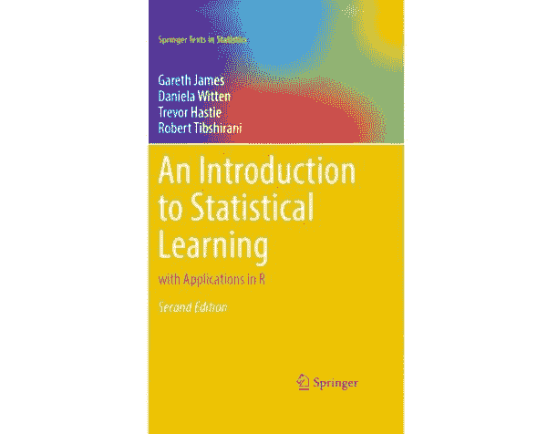

# 《统计学习导论 第二版》

> 原文：[`www.kdnuggets.com/2021/08/introduction-statistical-learning-v2.html`](https://www.kdnuggets.com/2021/08/introduction-statistical-learning-v2.html)

评论

**[《统计学习导论：R 语言应用》](https://www.statlearning.com/)**，由 Gareth James、Daniela Witten、Trevor Hastie 和 Robert Tibshirani 编写，是该领域的绝对经典。此书是统计学习教材的主流，对于各个层次的读者都很友好，可以在没有太多基础知识的情况下阅读。

尽管原版自 2013 年以来已存在，但第二版最近刚刚出版，并且现在可以在[书籍网站](https://www.statlearning.com/)上免费获取 PDF 版本。

* * *

## 我们的前三课程推荐

 1\. [Google 网络安全证书](https://www.kdnuggets.com/google-cybersecurity) - 快速入门网络安全职业。

 2\. [Google 数据分析专业证书](https://www.kdnuggets.com/google-data-analytics) - 提升您的数据分析技能

 3\. [Google IT 支持专业证书](https://www.kdnuggets.com/google-itsupport) - 支持您组织的 IT

* * *

来自书籍网站的描述：

> 随着数据收集的规模和范围在几乎所有领域持续增长，统计学习已成为任何希望理解数据的人的关键工具包。《统计学习导论》提供了对统计学习关键主题的广泛且技术性较少的处理。每一章都包含一个 R 实验室。此书适合希望使用现代数据分析工具的人。

原版中突出的主题包括：

+   稀疏分类和回归方法

+   决策树

+   提升方法

+   支持向量机

+   聚类

第二版扩展了以下值得注意的主题：

+   深度学习

+   生存分析

+   多重检验

+   朴素贝叶斯和广义线性模型

+   贝叶斯加法回归树

+   矩阵补全

《统计学习导论：R 语言应用》（ISLR）可以视为对另一本经典著作的较少深入的处理，这本书由一些相同的作者撰写，[《统计学习的要素》](https://www.kdnuggets.com/2020/05/elements-statistical-learning-free-ebook.html)。这两本书之间的另一个主要区别，除了材料深度之外，是 ISLR 将这些主题与编程语言中的实际实现结合在一起，这里使用的是 R 语言。

如上所述，这本书在该领域中绝对是经典之作。但你无需仅仅听我的话来了解它的重要性。以下是卡内基梅隆大学的拉里·瓦瑟曼对该书的评价（摘自该书的亚马逊网站）：

> "《统计学习导论（ISL）》由 James、Witten、Hastie 和 Tibshirani 编写，是统计学习的“操作手册”。受到《统计学习的元素》（Hastie、Tibshirani 和 Friedman）的启发，本书提供了如何实现前沿统计和机器学习方法的清晰和直观的指导。ISL 使现代方法对广泛的读者群体变得可及，而不需要统计学或计算机科学的背景。作者对可用方法的精确、实际解释，并提供了明确的 R 代码。任何希望智能分析复杂数据的人都应该拥有这本书。"
> 
> —拉里·瓦瑟曼，教授，统计与机器学习系，卡内基梅隆大学

书籍的印刷版可以在[亚马逊上购买](https://www.amazon.com/Introduction-Statistical-Learning-Applications-Statistics/dp/1071614177)，而 PDF 可以[从这里免费下载](https://web.stanford.edu/~hastie/ISLRv2_website.pdf)。

附带的代码和数据集[可以在这里找到](https://www.statlearning.com/resources-second-edition).

**相关内容**：

+   《统计学习导论：免费电子书》

+   《机器学习数学基础：免费电子书》

+   《统计学习的元素：免费电子书》

### 更多相关主题

+   [《Python 深度学习：第二版》 by François Chollet](https://www.kdnuggets.com/2022/01/manning-deep-learning-python-second-edition-francois-chollet.html)

+   [《Kubernetes 实战：第二版》](https://www.kdnuggets.com/2022/03/manning-kubernetes-action-second-edition.html)

+   [《统计学习导论：Python 版》：免费电子书](https://www.kdnuggets.com/2023/07/introduction-statistical-learning-python-edition-free-book.html)

+   [烂番茄电影评分预测的数据科学项目：…](https://www.kdnuggets.com/2023/07/data-science-project-rotten-tomatoes-movie-rating-prediction-second-approach.html)

+   [如何每天处理 150 亿条日志，并将大查询保持在 1 秒内](https://www.kdnuggets.com/how-to-digest-15-billion-logs-per-day-and-keep-big-queries-within-1-second)

+   [前 10 大机器学习演示：Hugging Face Spaces 版](https://www.kdnuggets.com/2022/05/top-10-machine-learning-demos-hugging-face-spaces-edition.html)
