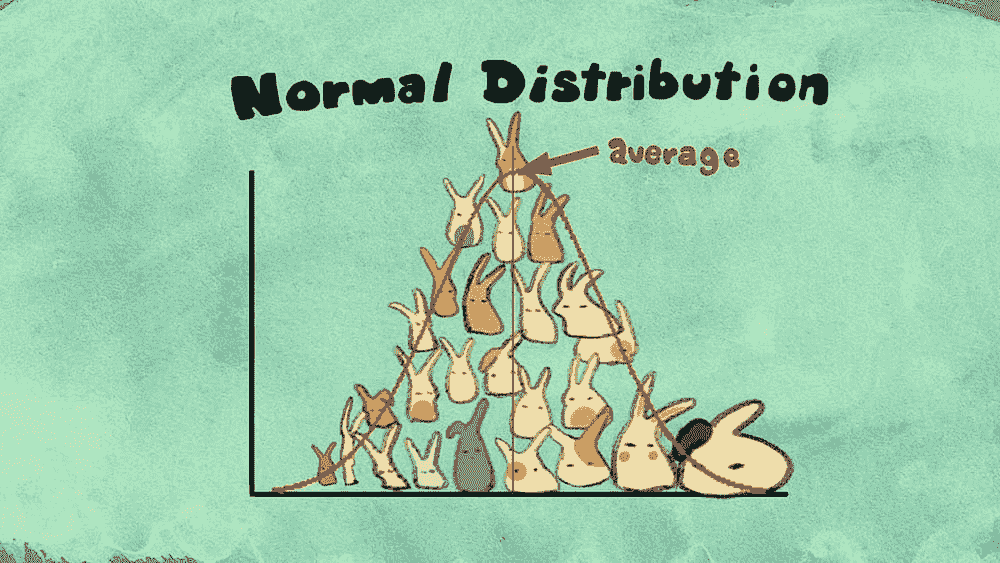
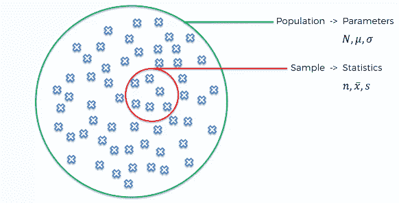
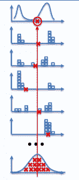
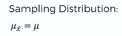
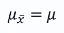
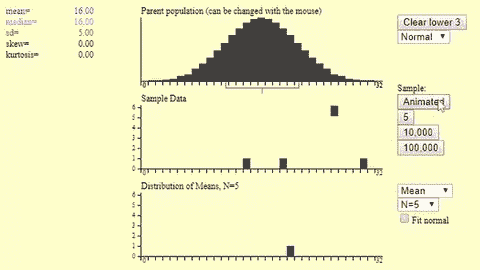
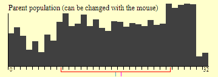

# 数据科学统计学简介

> 原文：[`www.kdnuggets.com/2018/12/introduction-statistics-data-science.html`](https://www.kdnuggets.com/2018/12/introduction-statistics-data-science.html)

 评论

**由[Diogo Menezes Borges](https://www.linkedin.com/in/diogomenezesborges/?locale=en_US)**。

* * *

## 我们的前三大课程推荐

 1\. [谷歌网络安全证书](https://www.kdnuggets.com/google-cybersecurity) - 快速进入网络安全职业生涯。

 2\. [谷歌数据分析专业证书](https://www.kdnuggets.com/google-data-analytics) - 提升你的数据分析技能

 3\. [谷歌 IT 支持专业证书](https://www.kdnuggets.com/google-itsupport) - 支持你的组织 IT

* * *

**[来源](https://vimeo.com/75089338)**

尽管中心极限定理可以作为“[高级水平——概率分布下的推断统计基础](https://medium.com/diogo-menezes-borges/introduction-to-statistics-for-data-science-7bf596237ac6)”文章的一部分，但我认为这个定理值得单独讨论！

每次进行统计分析的第一步是确定你处理的数据集是总体还是样本。正如你可能记得的，总体是你研究中所有感兴趣项目的集合，而样本是来自总体的数据点的子集。让我们来个简短的复习！

### 总体与样本

+   **总体**：我们观察的某种事物的数量，包括人类、事件、动物等。它有一些参数，如均值、中位数、众数、标准差等。

+   **样本**：它是来自总体的随机子集。通常，当总体太大而难以分析整个数据集时，你会使用样本。在样本中，你没有参数，只有统计量。

**[SuperDataScience 商业分析统计学 A-Z](https://www.superdatascience.com/courses/statistics-business-analytics-a-z/)**

### 中心极限定理

这被认为是统计学以及数学中最重要的定理。当评估问题和世界局势时，它可能非常强大！中心极限定理指出

> 抽样分布将呈现出正常分布的形态，无论你分析的总体是什么。

### **抽样分布**

正如我们所见，你通过抽样来估计整个总体的参数。然而，仅仅通过抽样并不总是能够获得总体真实参数的正确估计。

如果我们从总体中取多个样本而不是单一样本会怎么样？对于每个样本，我们会计算均值。最终，我们将得到多个均值估计值，然后可以将它们绘制在图表上。

**[SuperDataScience 商业分析统计 A-Z](https://www.superdatascience.com/courses/statistics-business-analytics-a-z/)**

这将被称为样本均值的抽样分布。

### 中心极限定理 — 直观理解

让我们通过一个例子来学习。假设我们想查看葡萄牙男性总体中每个人身高的分布。

首先，我们从总体中取几个样本（不同男性的身高），对于每个样本组，我们计算相应的均值。例如，我们可以有身高为 176 厘米的组，身高为 182 厘米的组，身高为 172 厘米的组，等等。然后我们绘制这个样本均值分布。下图展示了我们几个样本的分布，每个样本的均值用 x 标记表示。

**[SuperDataScience 商业分析统计 A-Z](https://www.superdatascience.com/courses/statistics-business-analytics-a-z/)**

你可以看到，尽管你的抽样均值（红色 X 标记）可能位于总体分布的极端，但它们中的大多数趋向于靠近中心。

> *最后，这些样本均值的分布将呈现正态分布。请看最后的图表，它由所有样本均值的分布组成。*

仅用 5 个样本，你已经可以看到大多数均值趋向于集中在抽样分布的中心。令人惊讶的是，最终，抽样分布的均值将与原始总体分布的均值一致。

因此，中心极限定理有两个确定性：

+   抽样分布将始终是正态分布或接近正态分布；

+   抽样分布的均值将等于总体的均值分布；

+   你抽样分布的标准误差与原始总体的标准差直接相关。`nis` 是你为每个样本所取的值的数量。

让我们通过这个 GIF 看一个更直观的例子。人口已经显示出正态分布，但之后你可以尝试其他形状，甚至绘制自己的分布图。我们首先从人口中抽取样本，样本大小为 n=5，并计算相应的均值。当你增加 n=5 的样本数量时，你会发现均值的分布开始呈现正态分布的形状。当我们将这个过程重复几千次时，我们得到一个均值等于总体均值的正态分布。样本越多，正态分布就越窄。

现在试试吧！你可以在这个网站上用鼠标直接绘制你的分布图。就像你在这里看到的那样。

因此，如果我们开始抽取样本并计算每个样本的均值，然后将它们绘制在抽样分布图中，你将得到一个以初始均值为中心的正态分布。

在这里访问：

[`onlinestatbook.com/stat_sim/sampling_dist/index.html`](http://onlinestatbook.com/stat_sim/sampling_dist/index.html)

想了解更多关于中心极限定理的内容，可以查看 CreatureCast 制作的这个精彩视频！

**[CreatureCast - 中心极限定理](https://vimeo.com/75089338) by [Casey Dunn](https://vimeo.com/user1747626) on [Vimeo](https://vimeo.com).**

**个人简介**: [Diogo Menezes Borges](https://www.linkedin.com/in/diogomenezesborges/?locale=en_US)是一名数据科学家，具有工程背景，并拥有 2 年的经验，使用预测建模、数据处理和数据挖掘算法解决具有挑战性的业务问题。

[原文](https://medium.com/diogo-menezes-borges/introduction-to-statistics-for-data-science-a67a3199dcd4)。已获许可转载。

**资源：**

+   [在线和基于网络的：分析、数据挖掘、数据科学、机器学习教育](https://www.kdnuggets.com/education/online.html)

+   [用于分析、数据科学、数据挖掘和机器学习的软件](https://www.kdnuggets.com/software/index.html)

**相关内容：**

+   [机器学习资源的综合列表：开放课程、教材、教程、备忘单等](https://www.kdnuggets.com/2018/12/finlayson-machine-learning-resources.html)

+   [数据科学家需要了解的 5 个基本统计概念](https://www.kdnuggets.com/2018/11/5-basic-statistics-concepts-data-scientists-need-know.html)

+   [量子机器学习：神话、现实和未来预测](https://www.kdnuggets.com/2018/11/quantum-machine-learning.html)

### 更多相关内容

+   [成为出色数据科学家所需的 5 项关键技能](https://www.kdnuggets.com/2021/12/5-key-skills-needed-become-great-data-scientist.html)

+   [每个初学者数据科学家应掌握的 6 种预测模型](https://www.kdnuggets.com/2021/12/6-predictive-models-every-beginner-data-scientist-master.html)

+   [2021 年最佳 ETL 工具](https://www.kdnuggets.com/2021/12/mozart-best-etl-tools-2021.html)

+   [学习数据科学统计的最佳资源](https://www.kdnuggets.com/2021/12/springboard-top-resources-learn-data-science-statistics.html)

+   [停止学习数据科学以寻找目标，并通过寻找目标来…](https://www.kdnuggets.com/2021/12/stop-learning-data-science-find-purpose.html)

+   [建立一个稳固的数据团队](https://www.kdnuggets.com/2021/12/build-solid-data-team.html)
