# t-SNE 介绍与 Python 示例

> 原文：[`www.kdnuggets.com/2018/08/introduction-t-sne-python.html`](https://www.kdnuggets.com/2018/08/introduction-t-sne-python.html)

 评论

**作者：[Andre Violante](https://www.linkedin.com/in/andreviolante/)，SAS 数据科学家**

### **介绍**

我一直对学习充满热情，并认为自己是一个终身学习者。在 SAS 担任数据科学家，让我可以学习并尝试我们定期发布给客户的新算法和功能。很多时候，这些算法在技术上并不新颖，但对我来说是新的，这让它们非常有趣。

* * *

## 我们的三大课程推荐

 1\. [谷歌网络安全证书](https://www.kdnuggets.com/google-cybersecurity) - 快速进入网络安全职业生涯。

 2\. [谷歌数据分析专业证书](https://www.kdnuggets.com/google-data-analytics) - 提升你的数据分析水平

 3\. [谷歌 IT 支持专业证书](https://www.kdnuggets.com/google-itsupport) - 支持你的组织 IT 工作

* * *

最近，我有机会深入了解 t-分布随机邻域嵌入（t-SNE）。在这篇文章中，我将对 t-SNE 算法进行高层次概述。我还会分享一些 Python 示例代码，其中我将使用 t-SNE 对 Digits 和 MNIST 数据集进行处理。

### **什么是 t-SNE？**

t-分布随机邻域嵌入（t-SNE）是一种[无监督、非线性技术](https://blogs.sas.com/content/subconsciousmusings/2017/04/12/machine-learning-algorithm-use/)，主要用于数据探索和可视化高维数据。简单来说，t-SNE 让你感知或直观了解数据在高维空间中的排列。它由 Laurens van der Maatens 和 Geoffrey Hinton 于 2008 年开发。

### **t-SNE 与 PCA**

如果你熟悉[主成分分析](https://blogs.sas.com/content/iml/2017/08/09/robust-principal-components-sas.html)（PCA），那么像我一样，你可能会想知道 PCA 和 t-SNE 之间的区别。首先要注意的是，PCA 是在 1933 年开发的，而 t-SNE 是在 2008 年开发的。自 1933 年以来，数据科学领域发生了很多变化，主要体现在计算能力和数据规模上。其次，PCA 是一种线性降维技术，旨在最大化方差并保留较大的成对距离。换句话说，不同的事物最终会远离。这可能导致可视化效果不佳，特别是在处理非线性流形结构时。把流形结构想象成任何几何形状，如：圆柱体、球体、曲线等。

t-SNE 与 PCA 的不同之处在于，它只保留小的成对距离或局部相似度，而 PCA 则关注保留大的成对距离以最大化方差。Laurens 通过图 1 [1] 中的瑞士卷数据集很好地展示了 PCA 和 t-SNE 方法。你可以看到，由于这个玩具数据集（流形）的非线性以及保留大的距离，PCA 会错误地保留数据的结构。

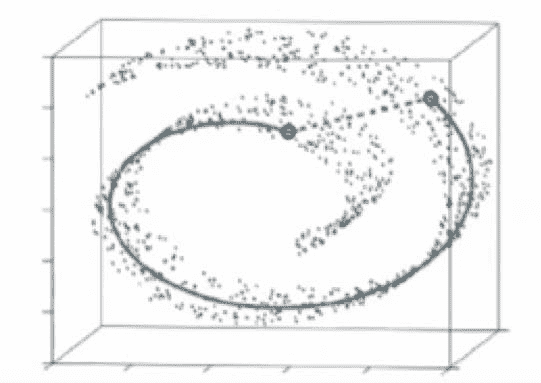

图 1 — 瑞士卷数据集。使用 t-SNE（实线）保留小距离 vs 最大化方差的 PCA [1]

**t-SNE 的工作原理**

现在我们知道为什么我们可能会选择 t-SNE 而不是 PCA，让我们讨论一下 t-SNE 是如何工作的。t-SNE 算法计算高维空间和低维空间中实例对之间的相似度测量。然后，它尝试使用成本函数来优化这两种相似度测量。我们将这个过程分解为 3 个基本步骤。

1.  步骤 1，在高维空间中测量点之间的相似度。可以将一组数据点想象成散布在二维空间中的点（图 2）。对于每个数据点（x[i]），我们将一个高斯分布中心放置在该点上。然后我们测量所有点（x[j]）在该高斯分布下的密度。接着对所有点进行重新归一化。这将为所有点提供一组概率（P[ij]）。这些概率与相似度成正比。这意味着，如果数据点 x1 和 x2 在这个高斯圆圈下具有相等的值，那么它们的比例和相似度也相等，因此你可以在这个高维空间的结构中获得局部相似度。高斯分布或圆圈可以通过所谓的困惑度进行调整，它影响分布的方差（圆圈大小）以及本质上的最近邻数量。困惑度的正常范围是 5 到 50 [2]。

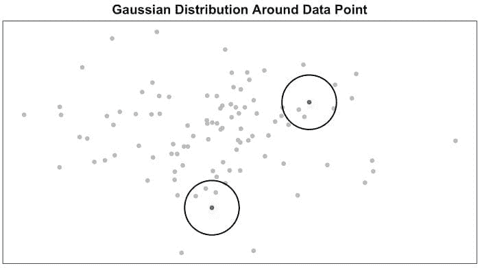

图 2 — 在高维空间中测量成对相似度

1.  步骤 2 与步骤 1 类似，但不同的是，使用的是具有一个自由度的 Student t 分布，也称为 Cauchy 分布（图 3）。这为低维空间中的所有点提供了一组第二概率（Q[ij]）。正如你所看到的，Student t 分布比正态分布有更重的尾部。重尾部更好地建模了远距离。

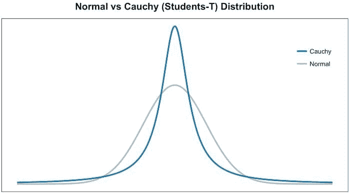

图 3 — 正态分布 vs Student t 分布

1.  最后一步是我们希望低维空间（Q[ij]）中的这些概率集合尽可能准确地反映高维空间（P[ij]）中的概率集合。我们希望这两个映射结构相似。我们使用 Kullback-Liebler 散度（KL）来测量这两个二维空间中概率分布的差异。我不会深入讲解 KL，只说它是一种有效比较大 P[ij] 和 Q[ij] 值的非对称方法。最后，我们使用梯度下降来最小化 KL 成本函数。

### **t-SNE 的使用案例**

现在你了解了 t-SNE 的工作原理，我们快速讨论一下它的应用领域。Laurens van der Maaten 在他的 [1] 视频演示中展示了很多例子。他提到 t-SNE 在气候研究、计算机安全、生物信息学、癌症研究等领域的应用。t-SNE 可以用于高维数据，然后这些维度的输出再作为其他分类模型的输入。

此外，t-SNE 还可以用于调查、学习或评估分割。通常我们会在建模之前选择分段的数量，或者在结果之后进行迭代。t-SNE 通常能清楚地显示数据中的分离。这可以在使用分割模型之前用来选择集群数量，或在之后用来评估你的分段是否有效。然而，t-SNE 不是一种聚类方法，因为它不像 PCA 那样保留输入，值在不同运行之间可能会发生变化，所以它仅用于探索。

### **代码示例**

以下是一个 Python 代码示例（下方的图像链接到 GitHub），你可以看到 PCA 和 t-SNE 在 Digits 和 MNIST 数据集上的视觉比较。我选择这两个数据集是因为它们在维度上的差异，因此结果也会有所不同。我还在代码中展示了一种技术，即在运行 t-SNE 之前先运行 PCA。这可以减少计算量，通常你会将维度减少到 ~30，然后再运行 t-SNE。

我用 Python 运行了这个示例，并调用了 [SAS 库](http://go.documentation.sas.com/?cdcId=pgmcdc&cdcVersion=8.11&docsetId=allprodsactions&docsetTarget=actionSetsByName.htm&locale=en)。它可能看起来与您习惯的略有不同，你可以在下方的图像中看到。我使用了 `seaborn` 来进行可视化，我认为效果很好，但在 t-SNE 中你可能会得到非常紧凑的聚类，需要放大。另一个可视化工具，如 plotly，可能更适合需要放大的情况。

查看 [GitHub 上的完整笔记本](https://github.com/aviolante/sas-python-work/blob/master/tSneExampleBlogPost.ipynb)，以便查看所有步骤，并获取代码：

*步骤 1 — 加载 Python 库。创建到 SAS 服务器的连接（称为‘CAS’，这是一个分布式内存引擎）。加载 CAS 动作集（将这些视为库）。读取数据并查看数据形状。*

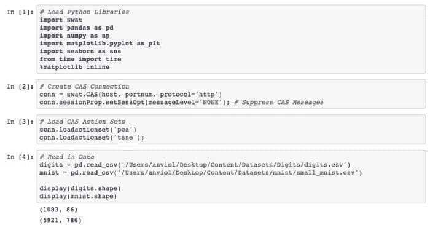

*步骤 2 — 到目前为止，我仍在我的本地机器上工作。我将把数据加载到我提到的 CAS 服务器中。这有助于我利用分布式环境并提高性能效率。然后我对 Digits 和 MNIST 数据进行 PCA 分析。*

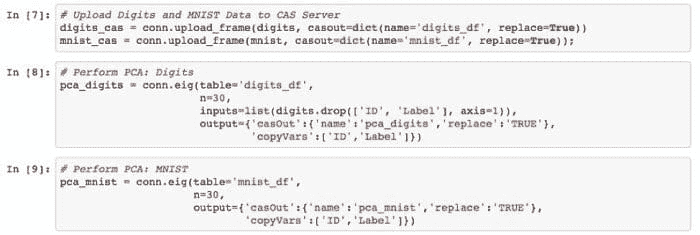

*步骤 3 — 可视化我们对 Digits 和 MNIST 的 PCA 结果*

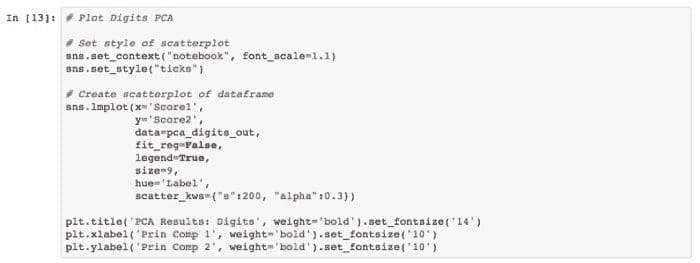

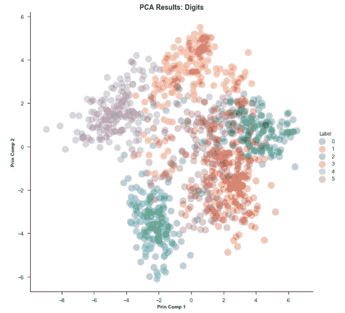

PCA 实际上在 Digits 数据集上做得相当不错，能够发现结构。

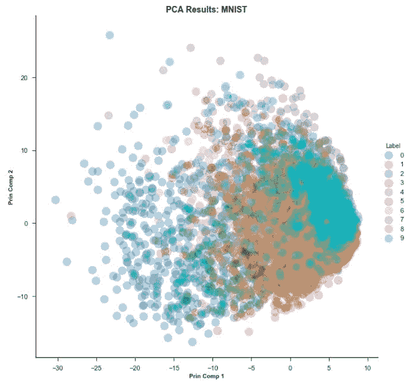

如你所见，PCA 在 MNIST 数据集上存在‘拥挤’问题。

*步骤 4 — 现在让我们尝试与上述相同的步骤，但使用 t-SNE 算法*

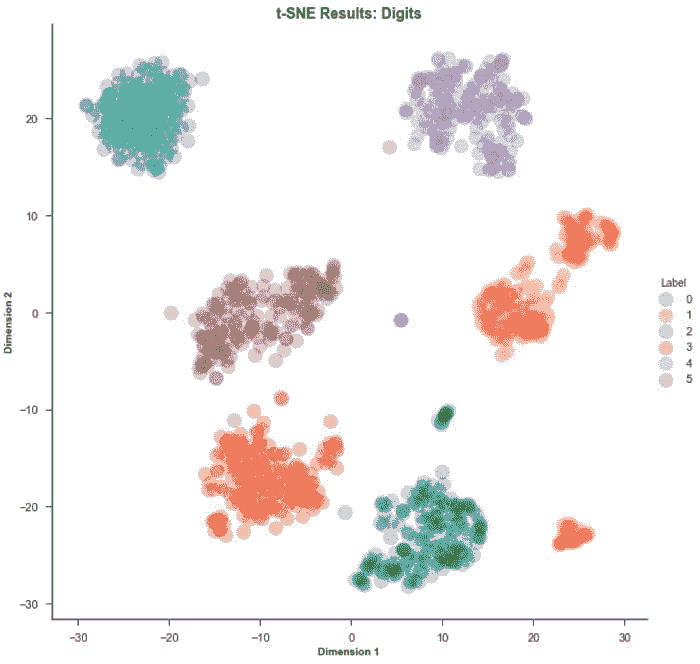

*现在来看 MNIST 数据集…*

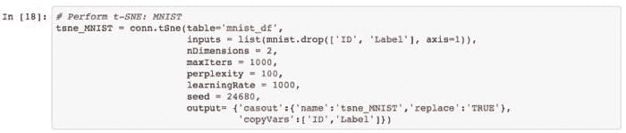 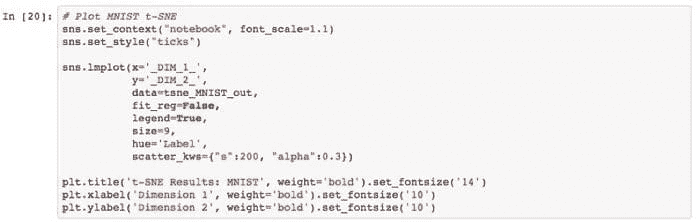

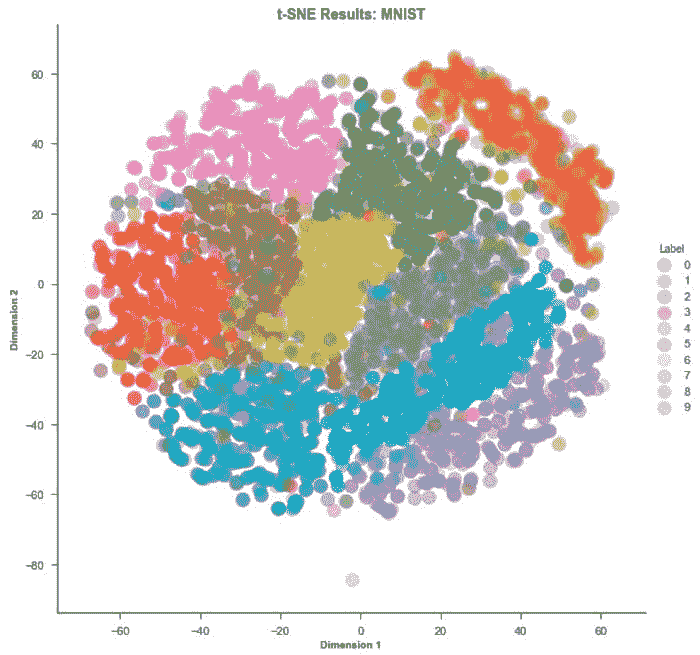

### **结论**

我希望你喜欢这次 t-SNE 算法的概述和示例。我发现 t-SNE 作为可视化工具非常有趣和有用，因为几乎所有我处理过的数据似乎都是高维的。我将在下面发布我发现非常有帮助的资源。对我而言，最好的资源是 Laurens 的 YouTube 视频。虽然时间有点长，接近 1 小时，但讲解很清楚，是我找到的最详细的解释。

### **我发现有用的额外资源：**

1.  T-SNE 与 PCA 的比较: [`www.quora.com/What-advantages-does-the-t-SNE-algorithm-have-over-PCA`](https://www.quora.com/What-advantages-does-the-t-SNE-algorithm-have-over-PCA)

1.  Kullback-Liebler 散度: [`en.wikipedia.org/wiki/Kullback%E2%80%93Leibler_divergence`](https://en.wikipedia.org/wiki/Kullback%E2%80%93Leibler_divergence)

1.  T-SNE 维基百科: [`en.wikipedia.org/wiki/T-distributed_stochastic_neighbor_embedding`](https://en.wikipedia.org/wiki/T-distributed_stochastic_neighbor_embedding)

1.  T-SNE 指南: [`www.analyticsvidhya.com/blog/2017/01/t-sne-implementation-r-python/`](https://www.analyticsvidhya.com/blog/2017/01/t-sne-implementation-r-python/)

1.  优良的超参数信息: [`distill.pub/2016/misread-tsne/`](https://distill.pub/2016/misread-tsne/)

1.  Lauren van der Maaten 的 GitHub 页面: [`lvdmaaten.github.io/tsne/`](https://lvdmaaten.github.io/tsne/)

### **参考文献**

1.  YouTube. (2013 年 11 月 6 日). 使用 t-SNE 可视化数据 [视频文件]. 来源于 [`www.youtube.com/watch?v=RJVL80Gg3lA`](https://www.youtube.com/watch?v=RJVL80Gg3lA)

1.  L.J.P. van der Maaten 和 G.E. Hinton. 使用 t-SNE 可视化高维数据。机器学习研究杂志 9（11 月）：2579–2605，2008 年。

**个人简介**：[Andre](https://www.linkedin.com/in/andreviolante/) 在 SAS 拥有超过 8 年的数字分析经验。他在零售行业专长，拥有丰富的客户分析经验。Andre 曾使用多种开源工具（主要是 R 和 Python）在多个数据平台（包括本地和云端）上工作。Andre 天生好奇，对解决问题充满热情。

Andre 拥有商业管理学士学位和分析学硕士学位。他还在乔治亚理工学院攻读计算机科学硕士学位，重点是机器学习。

Andre 喜欢和家人一起度假，尝试新的餐馆。他也喜欢户外活动和保持活跃。

**相关：**

+   [降维 ：PCA 真的能改善分类结果吗？](https://www.kdnuggets.com/2018/07/dimensionality-reduction-pca-improve-classification-results.html)

+   [数据科学家的优化 101](https://www.kdnuggets.com/2018/08/optimization-101-data-scientists.html)

+   [成为数据科学家必知的十种机器学习算法](https://www.kdnuggets.com/2018/04/10-machine-learning-algorithms-data-scientist.html)

### 更多相关主题

+   [使用 PyCaret 进行 Python 中的聚类介绍](https://www.kdnuggets.com/2021/12/introduction-clustering-python-pycaret.html)

+   [多标签分类：使用 Python 的 Scikit-Learn 入门](https://www.kdnuggets.com/2023/08/multilabel-classification-introduction-python-scikitlearn.html)

+   [Python 中的多线程和多处理介绍](https://www.kdnuggets.com/introduction-to-multithreading-and-multiprocessing-in-python)

+   [Python 中的内存分析介绍](https://www.kdnuggets.com/introduction-to-memory-profiling-in-python)

+   [鸭子，鸭子，代码：Python 的鸭子类型介绍](https://www.kdnuggets.com/duck-duck-code-an-introduction-to-pythons-duck-typing)

+   [介绍 __getitem__：Python 中的魔法方法](https://www.kdnuggets.com/2023/03/introduction-getitem-magic-method-python.html)
