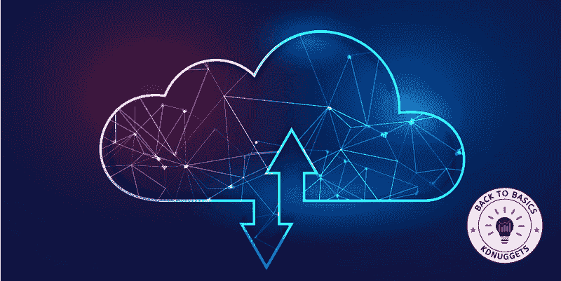

# 数据科学中的云计算简介

> 原文：[`www.kdnuggets.com/introduction-to-cloud-computing-for-data-science`](https://www.kdnuggets.com/introduction-to-cloud-computing-for-data-science)

图片由 [starline](https://www.freepik.com/author/starline) 提供

在当今世界，两大主要力量已经成为游戏规则的改变者：

* * *

## 我们的前三个课程推荐

 1\. [谷歌网络安全证书](https://www.kdnuggets.com/google-cybersecurity) - 快速进入网络安全职业生涯。

 2\. [谷歌数据分析专业证书](https://www.kdnuggets.com/google-data-analytics) - 提升您的数据分析能力

 3\. [谷歌 IT 支持专业证书](https://www.kdnuggets.com/google-itsupport) - 支持您的组织的 IT

* * *

数据科学与云计算。

想象一下，一个每秒钟生成大量数据的世界。

嗯……你不需要想象……这就是我们的世界！

从社交媒体互动到金融交易，从医疗记录到电子商务偏好，数据无处不在。

*但如果我们无法获得价值，这些数据有什么用呢？*

**这正是数据科学的作用。**

*那么我们在哪里存储、处理和分析这些数据呢？*

**这正是云计算的闪光点。**

让我们开始了解这两项技术奇迹之间的交织关系。

让我们一起（尝试）发现所有的内容吧！

# 数据科学和云计算的本质

## 数据科学？-?提取见解的艺术

数据科学是从大量多样化数据中提取有意义见解的艺术和科学。

它结合了统计学、机器学习等多个领域的专业知识，以解释数据并做出明智的决策。

随着数据的爆炸性增长，数据科学家的角色变得至关重要，他们将原始数据转化为黄金。

## 云计算？-?数字存储革命

云计算是指通过互联网按需交付计算服务。

无论我们需要存储、处理能力还是数据库服务，云计算为企业和专业人士提供了一个灵活可扩展的环境，无需维护物理基础设施的开销。

不过，你们大多数人可能在想，为什么它们是相关的？

让我们回到最初…

# 为什么数据科学和云计算是不可分割的

云计算成为数据科学一个关键或互补组件的主要原因有两个。

## #1\. 协作的迫切需求

在数据科学旅程的开始，初级数据专业人员通常会在个人计算机上安装 Python 和 R。随后，他们使用本地集成开发环境（IDE），如 Jupyter Notebook 应用程序或 RStudio 编写和运行代码。

然而，随着数据科学团队的扩展和高级分析的普及，对协作工具的需求也在上升，以提供洞察、预测分析和推荐系统。

这就是为什么协作工具的必要性变得至关重要。这些工具对获取洞察、预测分析和推荐系统至关重要，并且通过可重复研究、笔记本工具和代码源控制得到了增强。云平台的集成进一步放大了这种协作潜力。

图片由 [macrovector](https://www.freepik.com/author/macrovector) 提供

需要注意的是，协作不仅仅局限于数据科学团队。

它涵盖了更广泛的人群，包括如高管、部门领导以及其他数据中心角色等利益相关者。

## #2\. 大数据时代

**大数据**这个词已经在大型科技公司中广受欢迎。虽然其确切定义仍然模糊，但它通常指的是如此庞大的数据集，以至于超出了标准数据库系统和分析方法的能力。

这些数据集在捕捉、存储、管理和处理数据的合理时间框架方面超出了典型软件工具和存储系统的限制。

在考虑大数据时，请始终记住 3V：

+   **体量：** 指数据的巨大数量。

+   **多样性：** 指数据的不同格式、类型和分析应用。

+   **速度：** 指数据的发展或生成的速度。

随着数据的持续增长，迫切需要更强大的基础设施和更高效的分析技术。

所以，这两个主要原因是为什么我们？—作为数据科学家？—需要超越本地计算机进行扩展。

# 超越本地计算机的可扩展数据科学

公司和专业人员可以租用从应用程序到存储的所有服务，而不是拥有自己的计算基础设施或数据中心。

**这使得公司和专业人员可以按需支付他们使用的服务，** 而不必处理维护本地 IT 基础设施的成本和复杂性。

简单来说，**云计算**是按需提供计算服务—从应用程序到存储和处理能力—通常通过互联网和按需支付的方式进行。

关于最常见的提供商，我相信你们都对其中至少一个有所了解。Google（Google Cloud）、Amazon（Amazon Web Services）和 Microsoft（Microsoft Azure）是三种最常见的云技术，占据了几乎所有市场。

# 所以……什么是云？

**云** 这个术语可能听起来很抽象，但它有一个具体的含义。

从本质上讲，云就是网络计算机共享资源。可以把互联网看作是最广泛的计算机网络，而较小的例子包括家庭网络，如 LAN 或 WiFi SSID。这些网络共享从网页到数据存储的资源。

在这些网络中，单独的计算机被称为*节点*。它们使用诸如 HTTP 等协议进行通信，以进行状态更新和数据请求等各种目的。通常，这些计算机不在现场，而是在配备了必要基础设施的数据中心内。

由于计算机和存储成本的降低，现在使用多个互联计算机而非一台昂贵的计算机已成为常态。这种互联的方式确保了即使一台计算机故障，系统也能持续运行，并能够处理增加的负载。

像 Twitter、Facebook 和 Netflix 这样的流行平台 exemplify 云基础应用程序，能够管理数百万的日常用户而不崩溃。当同一网络中的计算机为一个共同目标协作时，这被称为*集群*。

集群作为一个整体，提供了增强的性能、可用性和可扩展性。

*分布式计算* 指的是设计用来利用*集群*进行特定任务的软件，比如 Hadoop 和 Spark。

**那么……再一次……什么是云？**

除了共享资源，云还包括由单一实体管理的服务器、服务、网络等。

尽管互联网是一个广阔的网络，但它不是云，因为没有任何单一方拥有它。

# 结论

总结一下，数据科学和云计算是同一枚硬币的两面。

数据科学为专业人士提供了提取数据价值所需的所有理论和技术。

云计算是提供存储和处理这些数据的基础设施的那个。

第一个提供了评估任何项目的知识，第二个则提供了执行这些项目的可行性。

它们共同形成了一个强大的组合，推动着技术创新。

随着我们向前发展，这两者之间的协同作用将会增强，为更加数据驱动的未来铺平道路。

拥抱未来吧，因为它是数据驱动和云支持的！

**[Josep Ferrer](https://www.linkedin.com/in/josep-ferrer-sanchez)** 是一位来自巴塞罗那的分析工程师。他毕业于物理工程专业，目前在应用于人类流动性的领域从事数据科学工作。他还是一名兼职内容创作者，专注于数据科学和技术。你可以通过 [LinkedIn](https://www.linkedin.com/in/josep-ferrer-sanchez/)、[Twitter](https://twitter.com/rfeers) 或 [Medium](https://medium.com/@rfeers) 联系他。

### 更多相关主题

+   [如何高效地利用云计算扩展数据科学项目](https://www.kdnuggets.com/2023/05/efficiently-scale-data-science-projects-cloud-computing.html)

+   [云计算如何增强数据科学工作流程](https://www.kdnuggets.com/2023/08/cloud-computing-enhances-data-science-workflows.html)

+   [云原生超级计算](https://www.kdnuggets.com/2022/03/nvidia-cloud-native-super-computing.html)

+   [云计算初学者指南](https://www.kdnuggets.com/2023/01/beginner-guide-cloud-computing.html)

+   [量子计算解析：对数据科学和人工智能的影响](https://www.kdnuggets.com/breaking-down-quantum-computing-implications-for-data-science-and-ai)

+   [AWS 云的 11 个最佳实践：云和数据迁移](https://www.kdnuggets.com/2023/04/11-best-practices-cloud-data-migration-aws-cloud.html)
