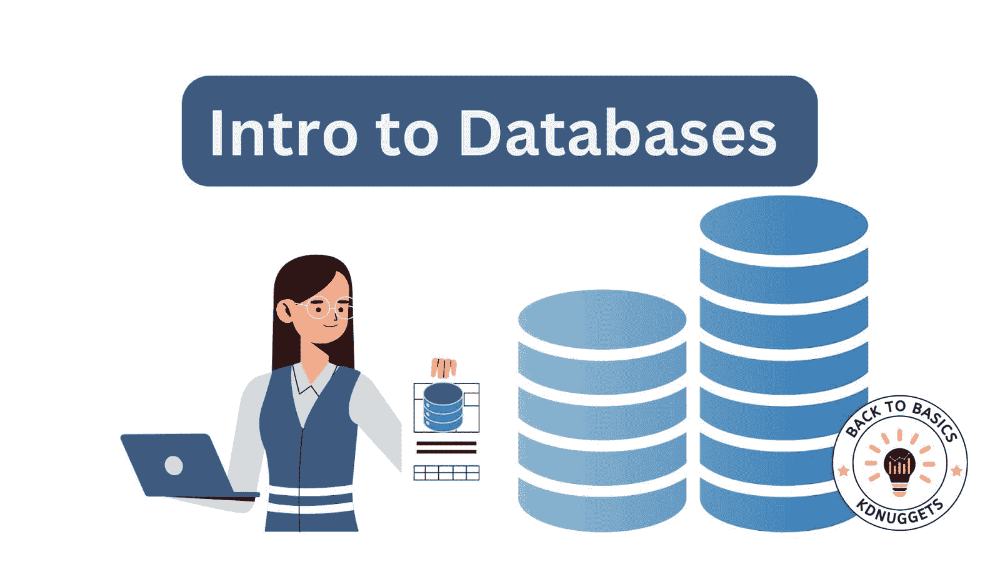
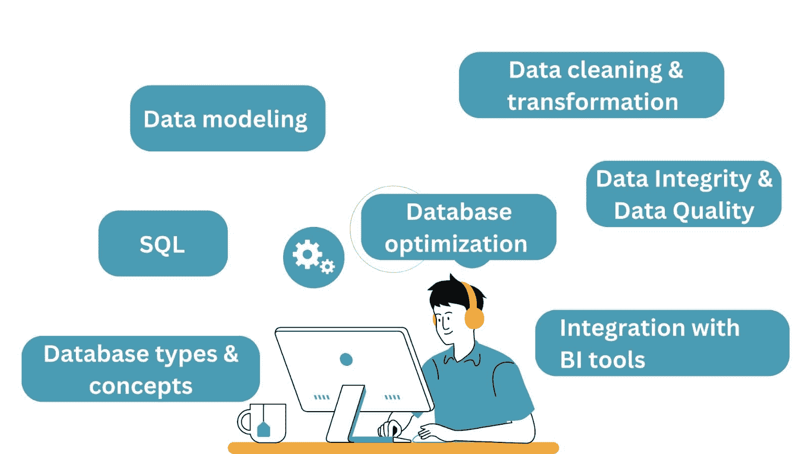
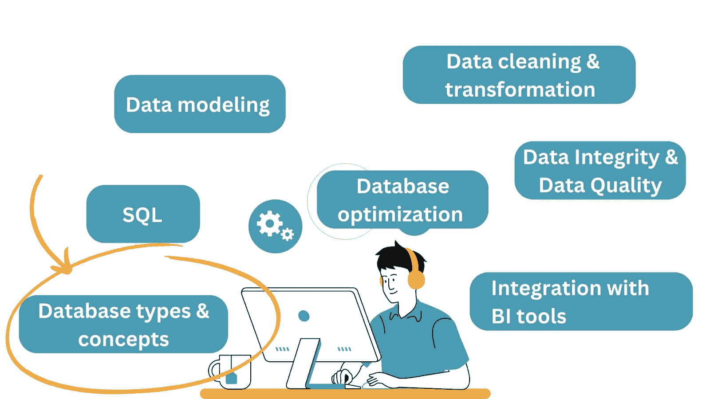
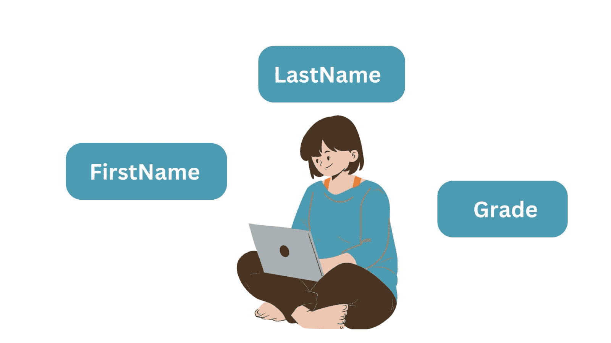

# 数据科学中的数据库介绍

> 原文：[`www.kdnuggets.com/introduction-to-databases-in-data-science`](https://www.kdnuggets.com/introduction-to-databases-in-data-science)

作者提供的图片

数据科学涉及从大量数据中提取价值和洞察，以驱动业务决策。它还包括使用历史数据构建预测模型。数据库促进了对这些大量数据的有效存储、管理、检索和分析。

* * *

## 我们的前三个课程推荐

 1\. [Google 网络安全证书](https://www.kdnuggets.com/google-cybersecurity) - 快速开启网络安全职业生涯。

 2\. [Google 数据分析专业证书](https://www.kdnuggets.com/google-data-analytics) - 提升你的数据分析技能

 3\. [Google IT 支持专业证书](https://www.kdnuggets.com/google-itsupport) - 支持你所在的组织进行 IT 工作

* * *

因此，作为数据科学家，你应该了解数据库的基础知识。因为它们能够存储和管理大量复杂的数据集，从而实现高效的数据探索、建模和洞察。让我们在本文中详细探讨这一点。

我们将从讨论数据科学的*基本数据库技能*开始，包括用于数据检索的 SQL、数据库设计、优化等。然后我们将讨论主要的数据库类型、它们的优势以及使用场景。

# 数据科学的基本数据库技能

数据库技能对数据科学家至关重要，因为它们为有效的数据管理、分析和解释提供了基础。

下面是数据科学家应该理解的关键数据库技能的详细信息：

作者提供的图片

尽管我们尝试将数据库概念和技能分类到不同的类别中，但它们是相互关联的。而且你通常需要在项目中进行工作时学习或了解它们。

现在让我们逐一讨论上述内容。

## 1\. 数据库类型和概念

作为数据科学家，你应该对不同类型的数据库有一个良好的理解，例如关系型数据库和 NoSQL 数据库，以及它们各自的使用场景。

## 2\. SQL（结构化查询语言）用于数据检索

通过实践掌握 SQL 的熟练程度对于数据领域的任何角色都是必须的。你应该能够编写和优化 SQL 查询，以从数据库中检索、过滤、聚合和联接数据。

理解查询执行计划并能够识别和解决性能瓶颈也是很有帮助的。

## 3\. 数据建模和数据库设计

除了查询数据库表之外，你还应该理解数据建模和数据库设计的基础知识，包括实体-关系（ER）图、模式设计和数据验证约束。

你还应该能够设计支持高效查询和数据存储的数据库模式，以便于分析。

## 4\. 数据清洗和转换

作为数据科学家，你需要将原始数据预处理和转换为适合分析的格式。数据库可以支持数据清洗、转换和集成任务。

所以你应该知道如何从各种来源提取数据，将其转换成合适的格式，并将其加载到数据库中进行分析。熟悉 ETL 工具、脚本语言（Python，R）和数据转换技术很重要。

## 5\. 数据库优化

你应该了解优化数据库性能的技术，例如创建索引、去范式化和使用缓存机制。

为了优化数据库性能，使用索引来加速数据检索。适当的索引通过使数据库引擎能快速定位所需数据来改善查询响应时间。

## 6\. 数据完整性和质量检查

数据完整性通过定义数据输入规则的约束来维护。像唯一约束、非空约束和检查约束这样的约束确保数据的准确性和可靠性。

事务用于确保数据一致性，保证多个操作作为一个原子单位处理。

## 7\. 工具和语言的集成

数据库可以与流行的分析和可视化工具集成，使数据科学家能够有效地分析和展示他们的发现。所以你应该知道如何使用像 Python 这样的编程语言连接和交互数据库，并进行数据分析。

熟悉像 Python 的 pandas、R 和可视化库等工具也很有必要。

总结：了解各种数据库类型、SQL、数据建模、ETL 过程、性能优化、数据完整性以及与编程语言的集成是数据科学家技能组合的关键部分。

在本简介指南的剩余部分，我们将专注于*基本的数据库概念和类型*。

作者提供的图片

# 关系数据库基础

关系数据库是一种数据库管理系统（DBMS），它通过使用具有行和列的表来以结构化的方式组织和存储数据。流行的 RDBMS 包括 PostgreSQL、MySQL、Microsoft SQL Server 和 Oracle。

让我们通过一些示例深入了解关键的关系数据库概念。

## 关系数据库表

在关系数据库中，每个*表*代表一个特定的**实体**，*表之间的关系*通过**键**建立。

要理解数据如何在关系数据库表中组织，最好从**实体**和**属性**入手。

你通常会想要存储关于对象的数据：学生、客户、订单、产品等。这些对象是实体，它们有属性。

让我们以一个简单的实体为例——一个具有三个属性的“学生”对象：名字、姓氏和成绩。存储数据时，该实体变成数据库表，属性变成列名或字段。每一行是实体的一个实例。

作者提供的图像

关系数据库中的表由行和列组成：

+   **行**也被称为*记录或元组*，而且

+   **列**被称为*属性或字段*。

这里是一个简单的“学生”表的例子：

| **学生 ID** | **名字** | **姓氏** | **成绩** |
| --- | --- | --- | --- |
| 1 | 简 | 史密斯 | A+ |
| 2 | 艾米莉 | 布朗 | A |
| 3 | 杰克 | 威廉姆斯 | B+ |

在这个例子中，每一行代表一个学生，每一列代表有关学生的信息。

## 了解键

键用于唯一标识表中的行。两种重要的键类型包括：

+   **主键**：主键唯一标识表中的每一行。它确保数据完整性，并提供引用特定记录的方式。在“学生”表中，“学生 ID”可以是主键。

+   **外键**：外键建立表之间的关系。它引用另一表的主键，用于连接相关数据。例如，如果我们有一个名为“课程”的表，“课程”表中的“学生 ID”列可以是一个外键，引用“学生”表中的“学生 ID”。

## 关系

关系数据库允许你在表之间建立关系。这里是最重要和最常见的关系：

+   **一对一关系**：在一对一关系下，表中的每一条记录与数据库中另一表中的一条（且仅一条）记录相关。例如，一个“学生详细信息”表包含有关每个学生的附加信息，可能与“学生”表有一对一关系。

+   **一对多关系**：第一个表中的一个记录与第二个表中的多个记录相关。例如，一个“课程”表可以与“学生”表有一对多关系，其中每个课程与多个学生相关。

+   **多对多关系**：两个表中的多个记录彼此相关。为了表示这种关系，使用中介表，通常称为连接表或链接表。例如，一个“学生课程”表可以在学生和课程之间建立多对多关系。

## 规范化

规范化（通常在数据库优化技术中讨论）是将数据组织成*最小化数据冗余*和提高数据完整性的过程。它涉及将大型表拆分成较小的相关表。每个表应表示一个单独的实体或概念，以避免数据重复。

例如，如果我们考虑 "Students" 表和一个假设的 "Addresses" 表，规范化可能涉及创建一个单独的 "Addresses" 表，并将其主键与 "Students" 表通过外键关联。

# 关系型数据库的优点和限制。

关系型数据库的一些优点如下：

+   关系型数据库提供了一种结构化且有序的方式来存储数据，使得定义不同类型数据之间的关系变得容易。

+   它们支持 ACID 属性（原子性、一致性、隔离性、持久性）以确保事务的数据一致性。

另一方面，它们有以下限制：

+   关系型数据库在横向扩展方面存在挑战，使得处理大量数据和高流量负载变得困难。

+   它们还需要一个严格的模式，使得在不修改模式的情况下适应数据结构的变化变得具有挑战性。

+   关系型数据库专为具有明确定义关系的结构化数据设计。它们可能不适合存储像文档、图像和多媒体内容这样的非结构化或半结构化数据。

# 探索 NoSQL 数据库。

NoSQL 数据库*不*以熟悉的行列格式存储数据（因此是非关系型的）。"NoSQL" 代表 "not only SQL"——表明这些数据库与传统的关系型数据库模型不同。

NoSQL 数据库的主要优点是其**可扩展性**和**灵活性**。这些数据库旨在处理大量非结构化或半结构化数据，并提供比传统关系型数据库更灵活和可扩展的解决方案。

NoSQL 数据库涵盖了多种不同的数据模型、存储机制和查询语言的数据库类型。一些常见的 NoSQL 数据库类别包括：

+   键值存储。

+   文档数据库。

+   列族数据库。

+   图形数据库。

现在，让我们逐一探讨每种 NoSQL 数据库类别，深入了解它们的特性、使用案例、示例、优点和限制。

## 键值存储。

**键值存储**将数据存储为简单的**键值对**。它们优化了高速读写操作，适用于缓存、会话管理和实时分析等应用。

然而，这些数据库在键值检索之外的查询能力有限。因此，它们不适合处理复杂关系。

亚马逊 DynamoDB 和 Redis 是流行的键值存储。

## 文档数据库。

**文档数据库**以文档格式（如 JSON 和 BSON）存储数据。每个文档可以具有不同的结构，允许嵌套和复杂数据。其灵活的模式允许轻松处理半结构化数据，支持不断发展的数据模型和层次关系。

这些数据库特别适合用于内容管理、电子商务平台、目录、用户档案和具有变化的数据结构的应用程序。文档数据库可能不适合复杂的连接或涉及多个文档的复杂查询。

MongoDB 和 Couchbase 是流行的文档数据库。

## 列族存储（宽列存储）

**列族存储**，也称为列式数据库或列导向数据库，是一种 NoSQL 数据库，按列而非传统的行方式组织和存储数据。

列族存储适用于涉及在大型数据集上运行复杂查询的分析工作负载。聚合、过滤和数据转换在列族数据库中通常执行得更高效。它们有助于管理大量半结构化或稀疏数据。

Apache Cassandra、ScyllaDB 和 HBase 是一些列族存储的例子。

## 图数据库

**图数据库**分别通过节点和边建模数据和关系，以表示复杂的关系。这些数据库支持高效处理复杂关系和强大的图查询语言。

正如你所猜测的，这些数据库适用于社交网络、推荐引擎、知识图谱以及一般的复杂关系数据。

流行的图数据库例子包括 Neo4j 和 Amazon Neptune。

**NoSQL 数据库有很多种类型。那么我们该如何决定使用哪一种呢？** *答案是：这要看情况。*

每种 NoSQL 数据库类别都提供了独特的功能和优势，使它们适合特定的使用场景。选择合适的 NoSQL 数据库时，必须考虑访问模式、可扩展性要求和性能考虑。

总结：NoSQL 数据库在灵活性、可扩展性和性能方面提供了优势，使其适用于各种应用程序，包括大数据、实时分析和动态网页应用。然而，它们在数据一致性方面存在权衡。

# NoSQL 数据库的优缺点

以下是 NoSQL 数据库的一些优势：

+   NoSQL 数据库设计用于水平扩展，允许它们处理大量的数据和流量。

+   这些数据库允许灵活和动态的模式。它们具有灵活的数据模型，以适应各种数据类型和结构，使其非常适合非结构化或半结构化数据。

+   许多 NoSQL 数据库被设计为在分布式和容错环境中运行，即使在硬件故障或网络中断的情况下，也能提供高可用性。

+   它们可以处理非结构化或半结构化数据，使其适用于处理各种数据类型的应用程序。

一些限制包括：

+   NoSQL 数据库优先考虑可扩展性和性能，而不是严格的 ACID 合规性。这可能导致最终一致性，并可能不适用于需要强数据一致性的应用程序。

+   由于 NoSQL 数据库有多种类型，提供不同的 API 和数据模型，缺乏标准化可能会使得在不同数据库之间切换或无缝集成变得具有挑战性。

需要注意的是，NoSQL 数据库并不是一种通用的解决方案。选择 NoSQL 数据库还是关系型数据库取决于应用程序的具体需求，包括数据量、查询模式和可扩展性要求等。

# 关系型数据库与 NoSQL 数据库

让我们总结一下迄今为止讨论的区别：

| **特性** | **关系型数据库** | **NoSQL 数据库** |
| --- | --- | --- |
| **数据模型** | 表格结构（表） | 多样的数据模型（文档、键值对、图形、列等） |
| **数据一致性** | 强一致性             | 最终一致性 |
| **模式**          | 定义良好的模式   | 灵活或无模式 |
| **数据关系** | 支持复杂关系 | 根据类型而异（有限或显式关系） |
| **查询语言** | 基于 SQL 的查询 | 特定的查询语言或 API |
| **灵活性** | 对非结构化数据不够灵活 | 适用于各种数据类型，包括 |
| **应用场景**                         | 结构良好的数据、复杂的事务 | 大规模、高吞吐量、实时应用 |

# 关于时间序列数据库的说明

作为数据科学家，你也将处理时间序列数据。时间序列数据库也是非关系型数据库，但具有更具体的使用场景。

它们需要支持存储、管理和查询*带时间戳的数据点*——即随时间记录的数据点——例如传感器读数和股票价格。它们提供了存储、查询和分析基于时间的数据模式的专用功能。

一些时间序列数据库的例子包括 InfluxDB、QuestDB 和 TimescaleDB。

# 结论

在本指南中，我们讨论了关系型数据库和 NoSQL 数据库。值得注意的是，除了流行的关系型和 NoSQL 类型外，你还可以探索一些其他数据库。新 SQL 数据库如 CockroachDB 提供了传统 SQL 数据库的好处，同时提供了 NoSQL 数据库的可扩展性和性能。

你还可以使用内存数据库，该数据库主要在计算机的主内存（RAM）中存储和管理数据，而不是传统的将数据存储在磁盘上的数据库。这种方法由于内存中的读写操作比磁盘存储要快得多，因此提供了显著的性能优势。

**[Bala Priya C](https://www.linkedin.com/in/bala-priya/)** 是一位来自印度的开发者和技术作家。她喜欢在数学、编程、数据科学和内容创作的交汇点上工作。她的兴趣和专长领域包括 DevOps、数据科学和自然语言处理。她喜欢阅读、写作、编码和喝咖啡！目前，她正在通过撰写教程、操作指南、观点文章等，学习并与开发者社区分享她的知识。

### 了解更多相关主题

+   [SQL 数据库入门：免费哈佛课程](https://www.kdnuggets.com/introduction-to-databases-with-sql-free-harvard-course)

+   [从 Oracle 到 AI 数据库：数据存储的演变](https://www.kdnuggets.com/2022/02/oracle-databases-ai-evolution-data-storage.html)

+   [键值数据库的解释](https://www.kdnuggets.com/2021/04/nosql-explained-understanding-key-value-databases.html)

+   [NoSQL 数据库及其使用案例](https://www.kdnuggets.com/2023/03/nosql-databases-cases.html)

+   [使用向量数据库进行语义搜索](https://www.kdnuggets.com/semantic-search-with-vector-databases)

+   [在 Python 中使用 SQLite 数据库的指南](https://www.kdnuggets.com/a-guide-to-working-with-sqlite-databases-in-python)
