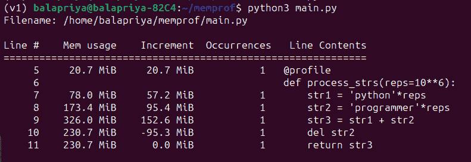
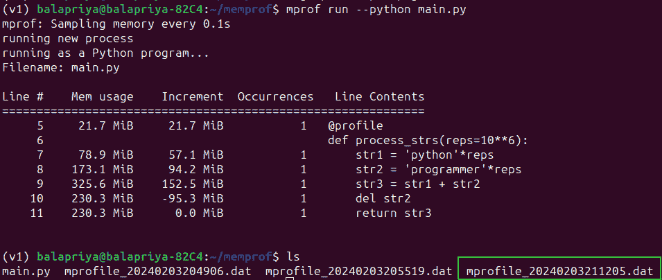
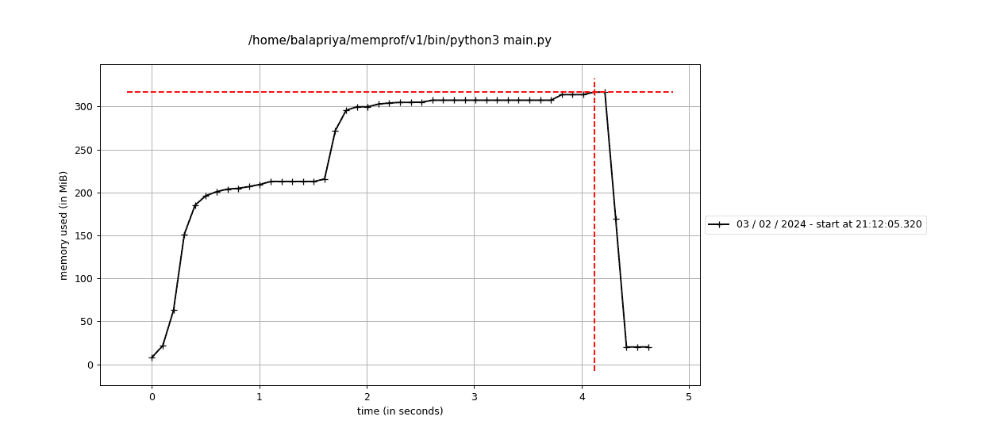
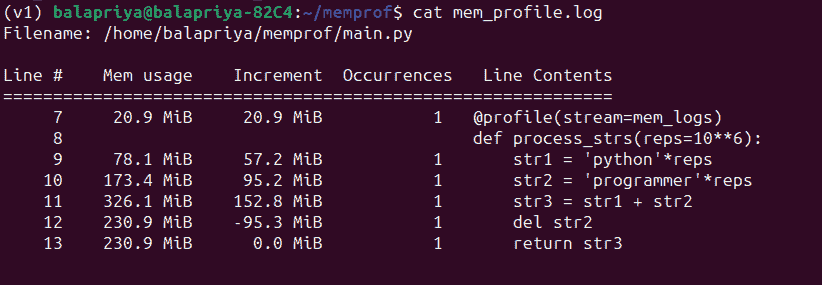

# Python 中的内存分析简介

> 原文：[`www.kdnuggets.com/introduction-to-memory-profiling-in-python`](https://www.kdnuggets.com/introduction-to-memory-profiling-in-python)


图片由作者提供

对 Python 代码进行性能分析有助于了解代码的工作原理并识别优化机会。你可能已经对你的 Python 脚本进行了时间相关的度量—测量代码特定部分的执行时间。

* * *

## 我们的三大课程推荐

 1\. [谷歌网络安全证书](https://www.kdnuggets.com/google-cybersecurity) - 快速进入网络安全职业

 2\. [谷歌数据分析专业证书](https://www.kdnuggets.com/google-data-analytics) - 提升你的数据分析技能

 3\. [谷歌 IT 支持专业证书](https://www.kdnuggets.com/google-itsupport) - 支持你的组织 IT

* * *

但进行内存分析—了解执行过程中内存的分配和释放—同样重要。因为内存分析可以帮助识别内存泄漏、资源利用情况以及潜在的扩展问题。

在本教程中，我们将探索使用 Python 包[memory-profiler](https://pypi.org/project/memory-profiler/)对 Python 代码进行内存使用分析。

# 安装 memory-profiler Python 包

让我们首先使用 pip 安装 memory-profiler Python 包：

```py
pip3 install memory-profiler
```

> **注意**：在项目的[虚拟环境](https://docs.python.org/3/library/venv.html)中安装 memory-profiler，而不是在全局环境中。我们还将使用 memory-profiler 中可用的绘图功能来绘制内存使用情况，这需要[matplotlib](https://matplotlib.org/)。因此，请确保在项目的虚拟环境中也安装了 matplotlib。

# 使用@profile 装饰器进行内存使用分析

我们来创建一个 Python 脚本（比如 main.py），其中包含一个函数`process_strs`：

+   该函数创建了两个超长的 Python 字符串`str1`和`str2`并将它们连接在一起。

+   关键字参数`reps`控制硬编码字符串重复的次数，以创建`str1`和`str2`。我们将其默认值设置为 10**6，如果调用函数时未指定`reps`的值，将使用此默认值。

+   然后我们显式地删除`str2`。

+   该函数返回连接后的字符串`str3`。

```py
# main.py

from memory_profiler import profile

@profile
def process_strs(reps=10**6):
	str1 = 'python'*reps
	str2 = 'programmer'*reps
	str3 = str1 + str2
	del str2
	return str3

process_strs(reps=10**7)
```

运行脚本应给你类似的输出：



从输出中可以看出，我们能够看到使用的内存，每次创建字符串时的增量，以及删除字符串步骤释放的一部分内存。

## 运行 mprof 命令

除了运行上面显示的 Python 脚本，你还可以这样运行 `mprof` 命令：

```py
mprof run --python main.py
```

当你运行此命令时，你还应该能够看到一个包含内存使用数据的 .dat 文件。每次运行 `mprof` 命令时，你会有一个 .dat 文件——通过时间戳来识别。



## 绘制内存使用情况

有时从图形中分析内存使用情况比查看数字更容易。记住，我们讨论了 matplotlib 是使用绘图功能的必备依赖项。

你可以使用 `mprof plot` 命令将 .dat 文件中的数据绘制成图像文件（此处为 output.png）：

```py
mprof plot -o output.png
```

默认情况下，`mprof plot` 使用最近一次运行 `mprof` 命令的数据。



你也可以在图中看到提到的时间戳。

## 将内存使用分析记录到日志文件

另外，你也可以将内存使用统计信息记录到工作目录中的首选日志文件。这里，我们创建了一个文件处理器 `mem_logs`，并在 `@profile` 装饰器中将 `stream` 参数设置为文件处理器：

```py
# main.py

from memory_profiler import profile

mem_logs = open('mem_profile.log','a')

@profile(stream=mem_logs)
def process_strs(reps=10**6):
	str1 = 'python'*reps
	str2 = 'programmer'*reps
	str3 = str1 + str2
	del str2
	return str3

process_strs(reps=10**7)
```

现在运行脚本时，你应该能够在工作目录中看到 `mem_profile.log` 文件，其内容如下：



# 使用 memory_usage 函数进行分析

你还可以使用 `memory_usage()` 函数了解特定函数执行所需的资源——以固定时间间隔进行采样。

`memory_usage` 函数接收要分析的函数、位置参数和关键字参数作为一个元组。

在这里，我们希望找到 `process_strs` 函数在 `reps` 关键字参数设置为 10**7 时的内存使用情况。我们还将采样间隔设置为 0.1 秒：

```py
# main.py

from memory_profiler import memory_usage

def process_strs(reps=10**6):
	str1 = 'python'*reps
	str2 = 'programmer'*reps
	str3 = str1 + str2
	del str2
	return str3

process_strs(reps=10**7)

mem_used = memory_usage((process_strs,(),{'reps':10**7}),interval=0.1)
print(mem_used)
```

这是相应的输出：

```py
Output >>>
[21.21875, 21.71875, 147.34375, 277.84375, 173.93359375]
```

你还可以根据希望捕获内存使用情况的频率来调整采样间隔。例如，我们将间隔设置为 0.01 秒；这意味着我们将获得更详细的内存使用情况视图。

```py
# main.py

from memory_profiler import memory_usage

def process_strs(reps=10**6):
	str1 = 'python'*reps
	str2 = 'programmer'*reps
	str3 = str1 + str2
	del str2
	return str3

process_strs(reps=10**7)

mem_used = memory_usage((process_strs,(),{'reps':10**7}),interval=0.01)
print(mem_used)
```

你应该能够看到类似的输出：

```py
Output >>>
[21.40234375, 21.90234375, 33.90234375, 46.40234375, 59.77734375, 72.90234375, 85.65234375, 98.40234375, 112.65234375, 127.02734375, 141.27734375, 155.65234375, 169.77734375, 184.02734375, 198.27734375, 212.52734375, 226.65234375, 240.40234375, 253.77734375, 266.52734375, 279.90234375, 293.65234375, 307.40234375, 321.27734375, 227.71875, 174.1171875]
```

# 结论

在本教程中，我们学习了如何开始对 Python 脚本进行内存使用分析。

具体来说，我们学习了如何使用 memory-profiler 包来实现这一点。我们使用了 `@profile` 装饰器和 `memory_usage()` 函数来获取示例 Python 脚本的内存使用情况。我们还学习了如何使用绘图功能和将统计信息捕获到日志文件中。

如果你对分析 Python 脚本的执行时间感兴趣，可以考虑阅读 使用 timeit 和 cProfile 分析 Python 代码。

**[](https://twitter.com/balawc27)**[Bala Priya C](https://www.kdnuggets.com/wp-content/uploads/bala-priya-author-image-update-230821.jpg)** 是一位来自印度的开发者和技术作家。她喜欢在数学、编程、数据科学和内容创作的交汇处工作。她的兴趣和专长领域包括 DevOps、数据科学和自然语言处理。她喜欢阅读、写作、编程和喝咖啡！目前，她正在通过撰写教程、操作指南、观点文章等与开发者社区分享她的知识。Bala 还创建了引人入胜的资源概述和编码教程。**

### 更多相关话题

+   [使用 timeit 和 cProfile 对 Python 代码进行性能分析](https://www.kdnuggets.com/profiling-python-code-using-timeit-and-cprofile)

+   [如何使用 Pandas 执行内存高效的大数据集操作](https://www.kdnuggets.com/how-to-perform-memory-efficient-operations-on-large-datasets-with-pandas)

+   [变压器模型的内存复杂度](https://www.kdnuggets.com/2022/12/memory-complexity-transformers.html)

+   [使用 PyCaret 进行 Python 聚类介绍](https://www.kdnuggets.com/2021/12/introduction-clustering-python-pycaret.html)

+   [Python 数据清洗库介绍](https://www.kdnuggets.com/2023/03/introduction-python-libraries-data-cleaning.html)

+   [《统计学习导论，Python 版：免费书籍》](https://www.kdnuggets.com/2023/07/introduction-statistical-learning-python-edition-free-book.html)
