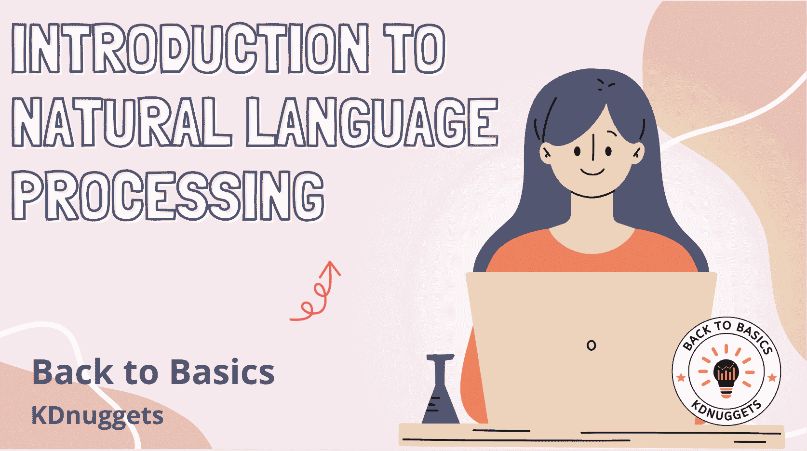
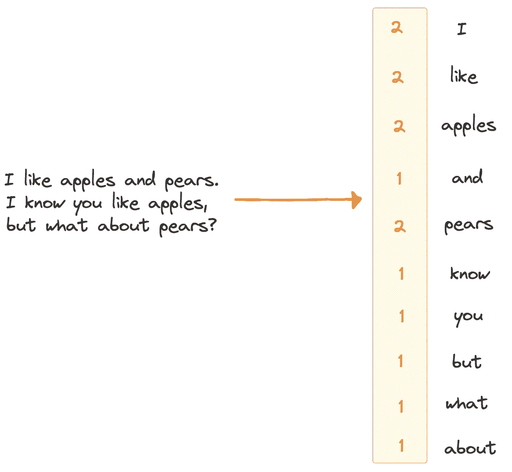

# 自然语言处理简介

> 原文：[`www.kdnuggets.com/introduction-to-natural-language-processing`](https://www.kdnuggets.com/introduction-to-natural-language-processing)

图片来源：作者

我们正在了解 ChatGPT 和大型语言模型（LLMs）。自然语言处理一直是一个有趣的话题，目前在 AI 和科技界掀起了风暴。是的，像 ChatGPT 这样的 LLMs 促进了它们的增长，但了解这一切的来源不是很好吗？所以让我们回到基础 - NLP。

* * *

## 我们的三大课程推荐

 1\. [谷歌网络安全证书](https://www.kdnuggets.com/google-cybersecurity) - 快速进入网络安全职业的快车道。

 2\. [谷歌数据分析专业证书](https://www.kdnuggets.com/google-data-analytics) - 提升你的数据分析能力

 3\. [谷歌 IT 支持专业证书](https://www.kdnuggets.com/google-itsupport) - 支持你所在组织的 IT

* * *

NLP 是人工智能的一个子领域，它使计算机能够通过语音和文本像人类一样检测和理解人类语言。NLP 帮助模型处理、理解和输出人类语言。

自然语言处理（NLP）的目标是弥合人类与计算机之间的沟通差距。NLP 模型通常在如下一个词预测等任务上进行训练，这使它们能够建立上下文依赖关系，从而生成相关的输出。

# 自然语言基础

NLP 的基础在于能够理解人类语言的不同元素、特征和结构。想想你尝试学习新语言的那些时候，你必须理解它的不同元素。或者，如果你没有尝试学习新语言，也许去健身房学习如何深蹲 - 你必须学习良好姿势的元素。

自然语言是我们人类相互沟通的方式。如今世界上有超过 7100 种语言。哇！

自然语言的一些关键基础包括：

+   **句法** - 这指的是组织单词以创建句子的规则和结构。

+   **语义学** - 这指的是语言中单词、短语和句子的含义。

+   **形态学** - 这指的是研究单词的实际结构以及它们如何由称为语素的小单位组成。

+   **语音学** - 这指的是研究语言中的声音，以及如何将不同的单位组合在一起以形成单词。

+   **语用学** - 这是研究上下文在语言解释中所起重要作用的学科，例如语气。

+   **话语分析** - 这是语言上下文与如何形成句子和对话之间的联系。

+   **语言习得** - 这涉及人类如何学习和发展语言技能，例如语法和词汇。

+   **语言变异** - 这关注于不同地区、社会群体和上下文中使用的 7100 多种语言。

+   **歧义** - 这指的是具有多种解释的单词或句子。

+   **多义性** - 这指的是具有多种相关含义的单词。

如你所见，自然语言的关键基本要素有很多，这些要素都用于引导语言处理。

# NLP 的关键要素

现在我们知道了自然语言的基本知识。那么它在自然语言处理（NLP）中是如何使用的呢？有多种技术用于帮助计算机理解、解释和生成自然语言。这些技术包括：

+   **分词** - 这指的是将段落和句子拆分成更小的单位，以便它们可以被轻松定义并用于 NLP 模型。原始文本被拆分成称为标记的更小的单位。

+   **词性标注** - 这是一种将语法类别（例如名词、动词和形容词）分配给句子中每个词元的技术。

+   **命名实体识别（NER）** - 这是一种识别和分类命名实体的技术，例如人名、组织名、地名和日期。

+   **情感分析** - 这是一种分析文本中表达的语气的技术，例如文本是积极的、消极的还是中性的。

+   **文本分类** - 这是一种将不同类型文档中的文本根据其内容分类到预定义类别或类中的技术。

+   **语义分析** - 这是一种分析单词和句子以通过上下文和单词之间的关系更好地理解所表达意思的技术。

+   **词嵌入** - 这是将单词表示为向量，以帮助计算机理解和捕捉单词之间的语义关系。

+   **文本生成** - 是指计算机能够基于从现有文本数据中学习的模式创建类似人类的文本。

+   **机器翻译** - 这是将文本从一种语言翻译成另一种语言的过程。

+   **语言建模** - 这是一种考虑到所有上述工具和技术的技术。这是构建概率模型以预测序列中下一个单词的过程。

如果你曾经处理过数据，你会知道一旦收集了数据，就需要对其进行标准化。数据标准化是将数据转换为计算机可以轻松理解和使用的格式的过程。

NLP 也适用同样的原则。文本规范化是将文本数据清理和标准化为一致格式的过程。你会希望得到一种没有太多或任何变异和噪音的格式。这使得 NLP 模型能够更有效、更准确地分析和处理语言。

# NLP 如何工作？

在将任何内容输入 NLP 模型之前，你需要理解计算机，并理解它们只能理解数字。因此，当你有文本数据时，你需要使用文本向量化将文本转换为机器学习模型可以理解的格式。

请查看下面的图片：

作者提供的图片

一旦文本数据以机器可以理解的格式进行向量化，NLP 机器学习算法就会被输入训练数据。这些训练数据帮助 NLP 模型理解数据、学习模式，并对输入数据建立关系。

统计分析和其他方法也被用来构建模型的知识库，其中包含文本的特征、不同的特性等。这基本上是它们的大脑的一部分，已经学习并储存了新信息。

在训练阶段输入到这些 NLP 模型中的数据越多，模型就会越准确。一旦模型完成了训练阶段，它将进入测试阶段。在测试阶段，你将看到模型在使用未见过的数据时预测结果的准确性。未见过的数据对模型来说是新的，因此它必须利用其知识库进行预测。

由于这是 NLP 的基础概述，我必须做到这一点，而不是让你陷入过于复杂的术语和话题。如果你想了解更多，可以阅读：

+   不同词嵌入技术的终极指南

+   NLP 的 ABC，从 A 到 Z

+   学习实用 NLP 的最佳方式？

# NLP 应用

现在你对自然语言的基本原理、NLP 的关键要素及其大致工作原理有了更好的理解。下面是今天社会中 NLP 应用的一些列表。

+   情感分析

+   文本分类

+   语言翻译

+   聊天机器人和虚拟助手

+   语音识别

+   信息检索

+   命名实体识别（NER）

+   主题建模

+   文本摘要

+   语言生成

+   垃圾邮件检测

+   问答系统

+   语言建模

+   假新闻检测

+   医疗保健和医学 NLP

+   财务分析

+   法律文档分析

+   情感分析

# 总结

最近在 NLP 领域有很多新进展，你可能已经注意到，像 ChatGPT 这样的聊天机器人和各种大型语言模型层出不穷。了解 NLP 对任何人都是非常有益的，特别是对于那些进入数据科学和机器学习领域的人。

如果你想了解更多关于 NLP 的信息，可以查看：过去 12 个月必读的 NLP 论文

**[Nisha Arya](https://www.linkedin.com/in/nisha-arya-ahmed/)** 是一名数据科学家、自由撰稿人和 KDnuggets 的社区经理。她特别感兴趣于提供数据科学职业建议或教程及理论知识。她还希望探索人工智能如何能够提升人类生命的长寿。作为一个热衷学习的人，她寻求拓宽自己的技术知识和写作技能，同时帮助指导他人。

### 更多相关话题

+   [自然语言处理中的 N-gram 语言建模](https://www.kdnuggets.com/2022/06/ngram-language-modeling-natural-language-processing.html)

+   [自然语言处理的温和入门](https://www.kdnuggets.com/2022/06/gentle-introduction-natural-language-processing.html)

+   [自然语言处理关键术语解析](https://www.kdnuggets.com/2017/02/natural-language-processing-key-terms-explained.html)

+   [自然语言处理任务的数据表示](https://www.kdnuggets.com/2018/11/data-representation-natural-language-processing.html)

+   [图像识别和自然语言处理的迁移学习](https://www.kdnuggets.com/2022/01/transfer-learning-image-recognition-natural-language-processing.html)

+   [如何开始使用 PyTorch 进行自然语言处理](https://www.kdnuggets.com/2022/04/start-natural-language-processing-pytorch.html)
