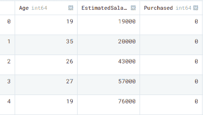
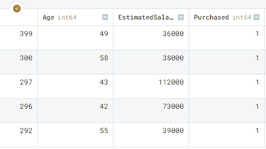
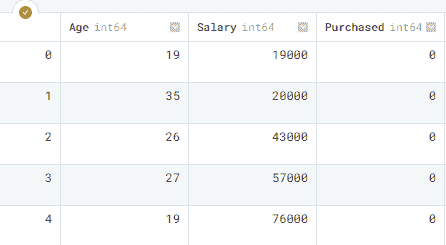
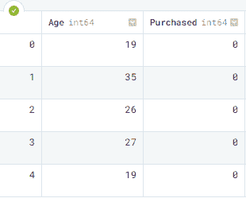
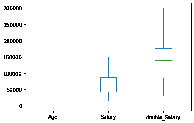
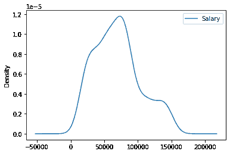

# Pandas 入门教程

> 原文：[`www.kdnuggets.com/2022/03/introductory-pandas-tutorial.html`](https://www.kdnuggets.com/2022/03/introductory-pandas-tutorial.html)


图片由作者提供

# 什么是 Pandas？

[Pandas](https://pandas.pydata.org/) 是一个灵活且易于使用的数据分析和数据处理工具。它在数据科学家中广泛使用，用于准备数据、清洗数据和进行数据科学实验。Pandas 是一个开源库，帮助你用简单易用的语法解决复杂的统计问题。

* * *

## 我们的前三个课程推荐

 1\. [谷歌网络安全证书](https://www.kdnuggets.com/google-cybersecurity) - 快速进入网络安全职业生涯。

 2\. [谷歌数据分析专业证书](https://www.kdnuggets.com/google-data-analytics) - 提升您的数据分析技能

 3\. [谷歌 IT 支持专业证书](https://www.kdnuggets.com/google-itsupport) - 支持您的组织的 IT

* * *

我创建了一个简单的指南，用于温和地介绍 Pandas 函数。在这个指南中，我们将学习数据导入、数据导出、数据探索、数据总结、选择与筛选、排序、重命名、删除数据、应用函数和可视化。

# 导入数据

对于导入，我们将使用 Kaggle 的开源数据集 [Social Network Advertisements](https://www.kaggle.com/rishidamarla/social-network-advertisements)。该数据集包含三列和 400 个样本。首先，让我们使用 **read_csv()** 导入我们的 CSV（逗号分隔值）文件。

```py
import pandas as pd

data = pd.read_csv("Social_Network_Ads.csv")
type(data)

>>> pandas.core.frame.DataFrame
```

如我们所见，我们的 **CSV** 文件已成功加载并转换为 Pandas 数据框。要查看前五行，我们将使用 **head()**。

```py
data.head()
```



Pandas 数据框包含 **Age**、**EstimatedSalary** 和 **Purchased** 列。

## 其他格式

除了 CSV 文件，我们还可以导入 Excel 文件、从任何 SQL 服务器导入文件、读取和解析 JSON 文件、使用 HTML 解析从网站导入表格，并使用字典创建数据框。Pandas 使得导入任何类型的数据变得简单。

```py
pd.read_excel('filename')
pd.read_sql(query,connection_object)
pd.read_json(json_string)
pd.read_html(url)
pd.DataFrame(dict)
```

# 导出数据

要将数据框导出为 CSV，我们将使用 **to_csv()**。

```py
data.to_csv("new_wine_data.csv",index=False)
```

类似地，我们可以将数据框导出到 Excel、发送到 SQL、导出为 JSON，并通过一行代码创建 HTML 表格。

```py
data.to_excel(filename)
data.to_sql(table_name, connection_object)
data.to_json(filename)
data.to_html(filename)
```

# 数据总结

要生成一个简单的数据总结，我们将使用 **info()** 函数。总结包括数据类型、样本数量和内存使用情况。

```py
data.info()
 RangeIndex: 400 entries, 0 to 399
Data columns (total 3 columns):
 #   Column           Non-Null Count  Dtype
---  ------           --------------  -----
 0   Age              400 non-null    int64
 1   EstimatedSalary  400 non-null    int64
 2   Purchased        400 non-null    int64
dtypes: int64(3)
memory usage: 9.5 KB
```

同样，要获取数据框的具体信息，我们可以使用 **.shape** 获取列数和行数，**.index** 获取索引范围，**.columns** 获取列名。这些小工具在解决更大的数据问题时非常有用。

```py
data.shape
>>> (400, 3)
data.index
>>> RangeIndex(start=0, stop=400, step=1)
data.columns
>>> Index(['Age', 'EstimatedSalary', 'Purchased'], dtype='object')
```

**describe()** 将给我们一个数值列分布的摘要。它包括均值、标准差、最小值/最大值以及四分位距。

```py
data.describe()

Age  EstimatedSalary   Purchased
count  400.000000       400.000000  400.000000
mean    37.655000     69742.500000    0.357500
std     10.482877     34096.960282    0.479864
min     18.000000     15000.000000    0.000000
25%     29.750000     43000.000000    0.000000
50%     37.000000     70000.000000    0.000000
75%     46.000000     88000.000000    1.000000
max     60.000000    150000.000000    1.000000
```

要检查缺失值，我们可以简单地使用 **isnull()** 函数，它会返回布尔值，并且我们可以将它们相加以获得确切的数字。我们的数据集没有缺失值。

```py
data.isnull().sum()
Age                0
EstimatedSalary    0
Purchased          0
dtype: int64
```

**corr()** 将生成数值列之间的相关矩阵。列之间没有高相关性。

```py
data.corr()
                     Age  EstimatedSalary  Purchased
Age              1.000000         0.155238   0.622454
EstimatedSalary  0.155238         1.000000   0.362083
Purchased        0.622454         0.362083   1.000000
```

# 选择和过滤

选择列有多种方法。下面的示例是直接选择。

使用**data[“<column_name>”]** 或 **data.<column_name>**

```py
data["Age"]
0      19
1      35
2      26
3      27
4      19
       ..
395    46
396    51
397    50
398    36
399    49
Name: Age, Length: 400, dtype: int64

data.Purchased.head()
0    0
1    0
2    0
3    0
4    0
Name: Purchased, dtype: int64
```

我们还可以使用 **iloc** 和 **loc** 来选择列和行，如下所示。

```py
data.iloc[0,1]
19000

data.loc[0,"Purchased"]
0
```

要计算列中类别的数量，我们将使用 **value_counts()** 函数。

```py
data.Purchased.value_counts()
0    257
1    143
Name: Purchased, dtype: int64
```

过滤值很简单。我们只需提供简单的 Python 条件。在我们的案例中，我们只过滤**1**的值来自 Purchased 列。

```py
print(data[data['Purchased']==1].head())
   Age  EstimatedSalary  Purchased
7    32           150000          1
16   47            25000          1
17   45            26000          1
18   46            28000          1
19   48            29000          1
```

对于更复杂的演示，我们通过使用 **&** 添加了第二个条件。

```py
print(data[(data['Purchased']==1) & (data['Age']>=35)])

    Age  EstimatedSalary  Purchased
16    47            25000          1
17    45            26000          1
18    46            28000          1
19    48            29000          1
20    45            22000          1
..   ...              ...        ...
393   60            42000          1
395   46            41000          1
396   51            23000          1
397   50            20000          1
399   49            36000          1

[129 rows x 3 columns]
```

# 数据排序

对于排序索引，我们使用 **sort_values()**。它接受多个参数，第一个是我们想要排序的列，第二个是排序方向。在我们的例子中，我们按 **Purchased** 列降序排序。

```py
data.sort_values('Purchased', ascending=False).head()
```



**sort_index()** 类似于排序索引，但它将根据索引号对数据框进行排序。

```py
data.sort_index()
```

# 重命名列

要重命名列，我们需要一个当前名称和修改名称的字典。我们使用 **rename()** 函数将名称从 ‘EstimatedSalary` 更改为 `Salary`。

```py
data = data.rename(columns= {'EstimatedSalary' : 'Salary'})
data.head()
```



# 删除数据

我们可以简单地使用 **drop** 函数来删除列或行。在这个例子中，我们成功地删除了 `Salary` 列。

```py
data.drop(columns='Salary').head()
```



要删除一行，你可以简单地写下行号。

```py
data.drop(1)
```

# 转换数据类型

我们有三列，所有列都是整数。让我们将“Purchased”列更改为布尔型，因为它只包含 1 和 0。

```py
data.dtypes
Age              int64
Salary           int64
Purchased        int64
dtype: object
```

使用 **astype()** 函数更改数据类型。

```py
data['Purchased'] = data['Purchased'].astype('bool')
```

我们已经成功地将‘Purchased’列更改为布尔类型。

```py
data.dtypes
Age          int64
Salary       int64
Purchased     bool
dtype: object
```

# 应用函数

对列或整个数据集应用 Python 函数变得更加简单，通过 Pandas **apply()** 函数。在这一部分，我们将创建一个简单的双倍值的函数，并将其应用于‘Salary’列。

```py
def double(x):   #create a function
    return x*2

data['double_Salary'] = data['Salary'].apply(double)
print(data.head())
```

我们可以观察到，新创建的列包含了双倍的工资。

```py
   Age  Salary  Purchased  double_Salary
0   19   19000      False          38000
1   35   20000      False          40000
2   26   43000      False          86000
3   27   57000      False         114000
4   19   76000      False         152000
```

我们还可以在 apply 函数中使用 Python **lambda** 函数来获得类似的结果。

```py
data['Salary'].apply(lambda x: x*2).head()
```

# 可视化

Pandas 使用**matplotlib**库来可视化数据。我们可以使用此函数生成条形图、折线图、饼图、箱线图、直方图、KDE 图等。我们还可以像 matplotlib 库一样自定义我们的图表。通过简单地更改图形的**kind**，我们可以使用**plot()**函数生成任何类型的图形。

箱线图显示了三个数值列的分布情况。

```py
data.plot( kind='box');
```



要绘制密度图，我们需要 x 和 y 参数以及 kind。在此示例中，我们绘制了**年龄**与**薪资**的密度图。

```py
data.plot(x="Age",y = "Salary", kind='density');
```



# 结论

Pandas 的内容如此之多，我们尚未涉及。它是数据科学家和数据从业者中使用最广泛的库。如果你有兴趣了解更多，可以查看 [Python Pandas 教程](https://www.learndatasci.com/tutorials/python-pandas-tutorial-complete-introduction-for-beginners/) 或参加一个完整的数据分析课程，学习 Pandas 的使用案例。在本指南中，我们学习了 Pandas Python 库以及如何使用它来执行各种数据操作和分析任务。希望你喜欢，如果你对这些主题有问题，请在评论区输入，我会尽力回答。

**[Abid Ali Awan](https://www.polywork.com/kingabzpro)** ([@1abidaliawan](https://twitter.com/1abidaliawan)) 是一位认证数据科学专业人士，热爱构建机器学习模型。目前，他专注于内容创作，并撰写关于机器学习和数据科学技术的技术博客。Abid 拥有技术管理硕士学位和电信工程学士学位。他的愿景是使用图神经网络构建一款 AI 产品，帮助面临心理健康问题的学生。

### 更多相关内容

+   [使用 Pandas 进行数据摄取：初学者教程](https://www.kdnuggets.com/2022/04/data-ingestion-pandas-beginner-tutorial.html)

+   [联邦学习：协作机器学习教程…](https://www.kdnuggets.com/2021/12/federated-learning-collaborative-machine-learning-tutorial-get-started.html)

+   [YOLOv5 PyTorch 教程](https://www.kdnuggets.com/2022/12/yolov5-pytorch-tutorial.html)

+   [文本摘要开发：一个使用 GPT-3.5 的 Python 教程](https://www.kdnuggets.com/2023/04/text-summarization-development-python-tutorial-gpt35.html)

+   [使用 scikit-learn 进行聚类：无监督学习教程](https://www.kdnuggets.com/2023/05/clustering-scikitlearn-tutorial-unsupervised-learning.html)

+   [数据科学家的 Docker 教程](https://www.kdnuggets.com/2023/07/docker-tutorial-data-scientists.html)
