# 直观的集成学习指南与梯度提升

> 原文：[`www.kdnuggets.com/2018/07/intuitive-ensemble-learning-guide-gradient-boosting.html`](https://www.kdnuggets.com/2018/07/intuitive-ensemble-learning-guide-gradient-boosting.html)

 评论

使用单一的机器学习模型可能并不总是能拟合数据。优化其参数也可能无济于事。一个解决方案是将多个模型结合起来拟合数据。本教程讨论了集成学习的重要性，以梯度提升为研究案例。

### **介绍**

* * *

## 我们的前三名课程推荐

 1\. [Google 网络安全证书](https://www.kdnuggets.com/google-cybersecurity) - 快速进入网络安全职业生涯。

 2\. [Google 数据分析专业证书](https://www.kdnuggets.com/google-data-analytics) - 提升你的数据分析技能

 3\. [Google IT 支持专业证书](https://www.kdnuggets.com/google-itsupport) - 支持你的组织的 IT 需求

* * *

机器学习（ML）管道中的一个关键步骤是选择最适合数据的算法。根据数据中的一些统计信息和可视化，ML 工程师将选择最佳算法。让我们以图 1 中的回归示例来应用这一点。

**图 1**

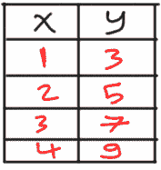

根据图 2 可视化数据，似乎线性回归模型将是合适的。

**图 2**

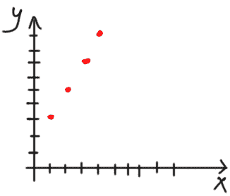

一个只有一个输入和一个输出的回归模型将根据图 3 中的方程进行制定。

**图 3**

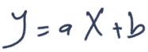

其中 a 和 b 是方程的参数。

由于我们不知道最优的参数来拟合数据，我们可以从初始值开始。我们可以将 a 设置为 1.0，b 设置为 0.0，并如图 4 所示可视化模型。

**图 4**

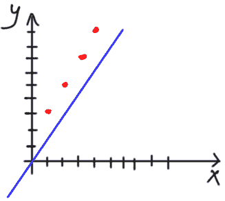

基于初始值的模型似乎并没有拟合数据。

预计第一次试验可能无法奏效。问题在于如何在这种情况下提升结果？换句话说，如何最大化分类准确性或最小化回归误差？有多种方法可以实现这一目标。

一种简单的方法是尝试更改之前选择的参数。经过若干次试验，模型将知道最优的参数是 a=2 和 b=1。模型将在这种情况下拟合数据，如图 5 所示。非常好。

**图 5**

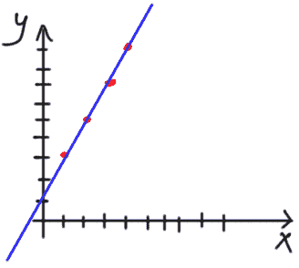

但在某些情况下，改变模型参数并不能使模型更好地拟合数据。会出现一些错误预测。假设数据中有一个新点（x=2，y=2）。根据图 6，无法找到使模型完全拟合每个数据点的参数。

**图 6**

有人可能会说，拟合 4 个点而漏掉一个是可以接受的。但是如果有更多的点线无法拟合，如图 7 所示呢？这样模型的错误预测会比正确预测更多。没有单一的直线能够拟合整个数据。模型对直线上的点预测较强，但对其他点预测较弱。

**图 7**

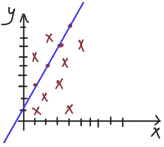

### **集成学习**

因为单一的回归模型无法拟合整个数据，一个替代方案是使用多个回归模型。每个回归模型可以强烈地拟合数据的一部分。所有模型的组合将减少整个数据的总误差，并产生一个通常较强的模型。在问题中使用多个模型称为集成学习。使用多个模型的重要性在图 8 中有所展示。图 8(a) 显示在预测样本结果时误差较高。根据图 8(b)，当有多个模型（例如，三个模型）时，它们结果的平均值能够比以前做出更准确的预测。

**图 8**

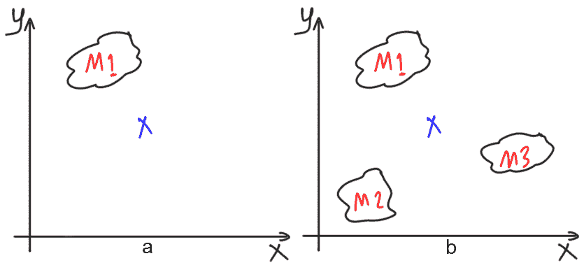

应用到图 7 中的先前问题时，图 9 展示了 4 个回归模型拟合数据的集成结果。

**图 9**

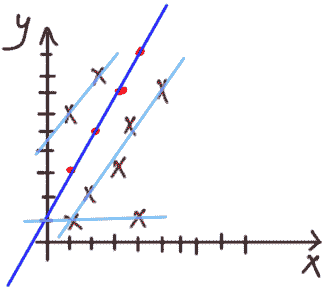

这引出了另一个问题。如果有多个模型来拟合数据，如何得到单一预测？有两种方法可以将多个回归模型组合以返回单一结果。它们是自助法和提升法（本教程的重点）。

在自助法（bagging）中，每个模型都会返回其结果，最终结果通过汇总所有这些结果来获得。一个方法是对所有结果进行平均。自助法是并行的，因为所有模型同时工作。

相比之下，提升法被视为顺序的，因为一个模型的结果是下一个模型的输入。提升法的理念是使用一个弱学习器来拟合数据。由于它很弱，它将无法正确拟合数据。一个弱学习器的不足将被另一个弱学习器修正。如果一些不足仍然存在，那么将使用另一个弱学习器来修正它们。这条链会延续，直到最终从多个弱学习器中产生一个强学习器。

接下来是讲解梯度提升的工作原理。

### **梯度提升 (GB)**

下面是梯度提升在一个简单示例中的工作原理：

假设要建立一个回归模型，数据有一个输出，其中第一个样本的输出为 15。它如图 10 所示。目标是建立一个能够正确预测这种样本输出的回归模型。

**图 10**

第一个弱模型预测第一个样本的输出为 9，而不是 15，如图 11 所示。

**图 11**

为了测量预测中的损失量，需要计算其残差。残差是期望输出与预测输出之间的差异。它按照以下方程计算：

**desired – predicted1 = residual1**

其中**predicted1**和**residual1**分别是第一个弱模型的预测输出和残差。

通过代入期望输出和预测输出的值，残差将为 6：

**15 – 9 = 6**

对于**residual1**=6，在预测和期望输出之间，我们可以创建一个第二个弱模型，其目标是预测一个等于第一个模型残差的输出。因此，第二个模型将修正第一个模型的不足。两个模型的输出总和将等于期望输出，按照以下方程：

**desired = predicted1 + predicted2(residual1)**

如果第二个弱模型能够正确预测**residual1**，则期望输出将等于所有弱模型的预测值，如下所示：

**desired = predicted1 + predicted2(residual1) = 9 + 6 = 15**

但如果第二个弱模型未能正确预测**residual1**的值，例如返回了 3，则第二个弱学习器也会有一个非零残差，计算如下：

**residual2 = predicted1 - predicted2 = 6 - 3 = 3**

如图 12 所示。

**图 12**

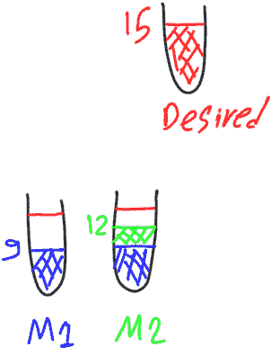

为了修正第二个弱模型的不足，将创建第三个弱模型。其目标是预测第二个弱模型的残差。因此，其目标是 3。我们样本的期望输出将等于所有弱模型的预测值，如下所示：

**desired = predicted1 + predicted2(residual1) + predicted3(residual2)**

如果第三个弱模型的预测值是 2，即它无法预测第二个弱模型的残差，则第三个模型将有一个等于如下的残差：

**residual3 = predicted2 – predicted3 = 3 - 2 = 1**

如图 13 所示。

**图 13**

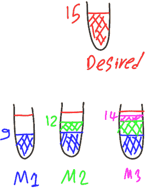

结果，将创建第四个弱模型来预测第三个弱模型的残差，该残差等于 1。期望输出将等于所有弱模型的预测值，如下所示：

**desired = predicted1 + predicted2(residual1) + predicted3(residual2) + predicted4(residual3)**

如果第四个弱模型正确预测了其目标（即 residual3），那么图 14 所示，通过总共四个弱模型已经达到了期望的输出 15。

**图 14**

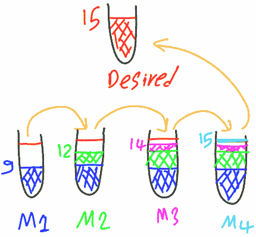

这是梯度提升算法的核心思想。使用前一个模型的残差作为下一个模型的目标。

### **GB 摘要**

总结来说，梯度提升从一个弱模型开始进行预测。该模型的目标是问题的期望输出。在训练该模型后，计算其残差。如果残差不为零，则创建另一个弱模型来修正前一个模型的不足。然而，新模型的目标将不是期望输出，而是前一个模型的残差。也就是说，如果给定样本的期望输出是 T，则第一个模型的目标是 T。训练后，该样本可能会有一个残差 R。新模型的目标将设置为 R，而不是 T。这是因为新模型填补了前一个模型的空白。

梯度提升类似于多个弱者将重金属搬上几层楼梯。没有一个弱者能够将金属搬上所有的楼梯。每个人只能搬上一个台阶。第一个弱者将金属搬上一个台阶后就会感到疲惫。另一个弱者将金属再搬上一个台阶，依此类推，直到将金属搬上所有的楼梯。

**简介：[Ahmed Gad](https://www.linkedin.com/in/ahmedfgad/)** 于 2015 年 7 月获得埃及梅努非亚大学计算机与信息学院的信息技术学士学位，并获得优异荣誉。因在学院中排名第一，他于 2015 年被推荐在埃及的一所学院担任助教，随后于 2016 年继续担任助教和研究员。他目前的研究兴趣包括深度学习、机器学习、人工智能、数字信号处理和计算机视觉。

[原文](https://www.linkedin.com/pulse/intuitive-ensemble-learning-guide-gradient-boosting-study-ahmed-gad/)。经许可转载。

**相关内容：**

+   Python 集成学习介绍

+   从头开始使用 NumPy 构建卷积神经网络

+   集成学习以提高机器学习结果

### 更多相关内容

+   [掌握季节性和提升业务成果的终极指南](https://www.kdnuggets.com/2023/08/media-mix-modeling-ultimate-guide-mastering-seasonality-boosting-business-results.html)

+   [支持向量机：直观方法](https://www.kdnuggets.com/2022/08/support-vector-machines-intuitive-approach.html)

+   [协同过滤的直观解释](https://www.kdnuggets.com/2022/09/intuitive-explanation-collaborative-filtering.html)

+   [提升机器学习算法：概述](https://www.kdnuggets.com/2022/07/boosting-machine-learning-algorithms-overview.html)

+   [带例子的集成学习](https://www.kdnuggets.com/2022/10/ensemble-learning-examples.html)

+   [集成学习技术：Python 中随机森林的实践指南](https://www.kdnuggets.com/ensemble-learning-techniques-a-walkthrough-with-random-forests-in-python)
