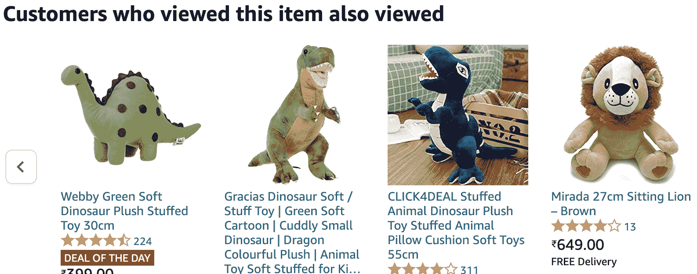
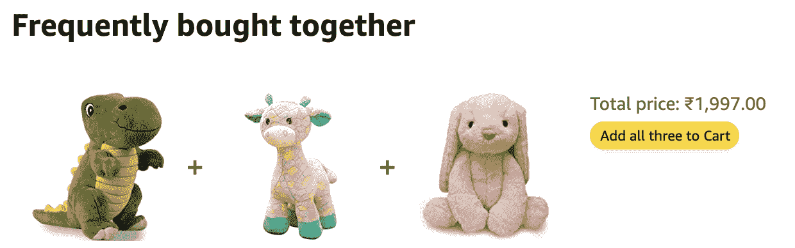
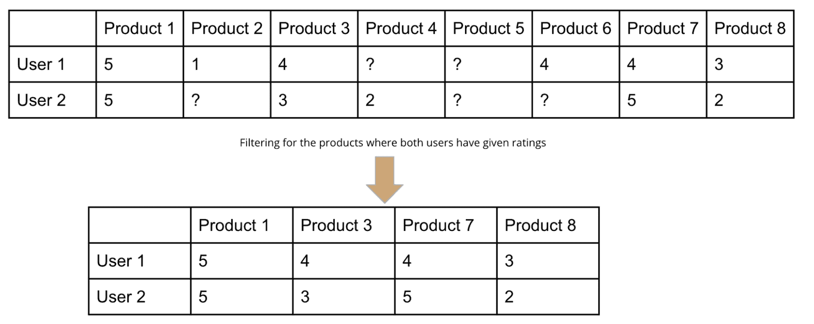
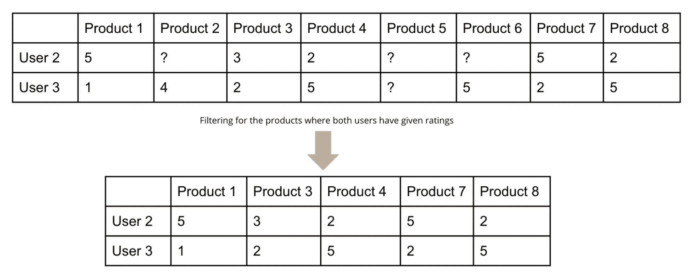
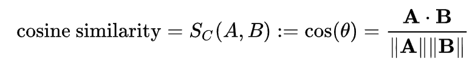

# 协同过滤的直观解释

> 原文：[`www.kdnuggets.com/2022/09/intuitive-explanation-collaborative-filtering.html`](https://www.kdnuggets.com/2022/09/intuitive-explanation-collaborative-filtering.html)

# 介绍

* * *

## 我们的前三名课程推荐

 1\. [谷歌网络安全证书](https://www.kdnuggets.com/google-cybersecurity) - 加速进入网络安全职业的快车道。

 2\. [谷歌数据分析专业证书](https://www.kdnuggets.com/google-data-analytics) - 提升你的数据分析能力

 3\. [谷歌 IT 支持专业证书](https://www.kdnuggets.com/google-itsupport) - 支持你的组织 IT

* * *

人工智能无处不在，并巧妙地影响我们的决策、选择和偏好。在多个环节中，许多组织将大量数据转化为算法，以生成洞察力，提升客户体验。

例如，电子商务公司从用户的点击流中收集数据，以向新用户提供便捷的购物体验，并从其不断变化的偏好中学习。如果你曾在线购买产品，那么你一定见过以下列出的某些推荐：

### 1\. 基于感兴趣的项目推荐其他用户浏览过的产品

来源：作者自亚马逊网站

### 2\. 推荐其他用户经常与搜索产品一起购买的附加产品

来源：作者自亚马逊网站

上述图示表明，当前用户会收到与感兴趣的产品相关的多个推荐，这些推荐基于过去类似用户的浏览或购买记录。这些推荐来自协同过滤算法——最流行的在线产品推荐方式。

值得注意的是，推荐产品的最简单方式也可能基于浏览次数、评分、转化率等，但这意味着通常用户已经购买了该产品。因此，这种基于人气指数的推荐因缺乏个性化而效果有限。

# 协同过滤

协同过滤的核心思想是，历史数据中的相似偏好可以揭示用户未来的偏好信息。

> “协同”一词暗示，具有相似口味和选择的用户最适合协作，并决定是否向该用户推荐此产品。

接下来我们将了解用户-用户协同过滤是如何工作的。

## 协同过滤是如何工作的？

产品是根据类似用户对这个特定产品的喜好来推荐给新用户的。除了统计学上的根基外，认为我们的选择与我们更亲近的人主要是一致的也是比较直观的。

让我们通过下面的示例来理解一些基本概念：

|  | 产品 1 | 产品 2 | 产品 3 | 产品 4 | 产品 5 | 产品 6 | 产品 7 | 产品 8 |
| --- | --- | --- | --- | --- | --- | --- | --- | --- |
| 用户 1 | 5 | 1 | 4 | ? | ? | 4 | 4 | 3 |
| 用户 2 | 5 | ? | 3 | 2 | ? | ? | 5 | 2 |
| 用户 3 | 1 | 4 | 2 | 5 | ? | 5 | 2 | 5 |

+   三位用户对八种产品进行了评分（视为某种偏好测量）

+   不是所有用户对所有产品进行评分，因此这些单元格标记为问号‘?’

    +   要么用户尚未购买这些产品，要么

    +   他们选择不对某些产品进行评分，导致矩阵稀疏

+   注意，可能存在一些完全没有评分的特定产品，比如产品 5 - 这可能是因为这些产品是市场上的新产品。类似地，一些新用户访问电子商务网站时没有任何反映其偏好的记录，因此无法开始接收个性化推荐。

+   我们的目标是根据用户-产品矩阵找到用户 2 的下一组产品。

## 快速而简单的推荐方法

用户 2 尚未对产品 2 和产品 6 进行评分，所以要在这两者中选择一个 - 一种方法是计算这些产品在整个用户基础上的平均值，并推荐分数较高的那个。

但有一个警告 - 如果这两个产品的平均评分相似，如何打破平局？另一个问题是，所有用户的平均评分并没有给与与该用户（即用户 2）相似的用户子集更多权重。

这将引出下一个话题 - 如何生成个性化推荐。

## 个性化推荐

我们需要找出哪个用户（或在重要子集中哪个用户）最类似于用户 2。

让我们将矩阵分为两个部分 - 每个部分对应于用户 2，如下所示：

### 1\. 用户 2 和 用户 1

来源：作者

### 2\. 用户 2 和 用户 3

来源：作者

## 相似度分数

根据这两个子集，你可以观察到用户 1 和用户 2 有相似的偏好，而用户 2 和用户 3 并不一致。

让我们推导一个数学度量，以得出一个可以定义相似度程度的单一度量 - 其中一个度量是余弦相似度。

[余弦相似度](https://www.sciencedirect.com/topics/computer-science/cosine-similarity#:~:text=Cosine%20similarity%20measures%20the%20similarity,document%20similarity%20in%20text%20analysis.) 定义为：

> “内积空间中两个向量的相似度。它通过两个向量之间夹角的余弦值来衡量，确定两个向量是否大致指向相同的方向。它常用于文本分析中测量文档相似度。”

它是通过[两个向量 A 和 B 的点积](https://en.wikipedia.org/wiki/Cosine_similarity)表示的

使用上述公式来计算“用户 1 与用户 2”和“用户 2 与用户 3”的相似度，我们得到相似度分数 S₁₂和 S₂₃分别为 0.97 和 0.65，这与我们的直观理解相符。

最后一步是对产品 2 的用户评分进行加权平均，使用相似度分数 S??和 S??。

(0.97 * 1 + 0.65 * 4) / (0.97 + 0.65) = 2.35

同样地，我们计算了产品 6 的权重分数，两个产品中得分较高的产品 6 被推荐给用户 2。

(0.97 * 4 + 0.65 * 5) / (0.97 + 0.65) = 4.4

# 总结

这篇文章解释了通过协同过滤进行产品推荐的直观理解。它详细说明了过去搜索过类似产品的用户如何影响适合新用户的推荐。

这篇文章还说明了如何使用余弦相似度计算用户-用户相似度分数，并最终通过对每个产品分数的加权求和计算最终分数。现在你已经了解了协同过滤的基础，我建议你阅读由 Andrew Ng 精彩讲解的[六部分推荐系统系列](https://www.youtube.com/playlist?list=PL-6SiIrhTAi6x4Oq28s7yy94ubLzVXabj)。

## 参考文献

+   [Ritvik Math 在 YouTube](https://www.youtube.com/watch?v=Fmtorg_dmM0&ab_channel=ritvikmath)

+   [亚马逊推荐系统](https://www.cs.umd.edu/~samir/498/Amazon-Recommendations.pdf)

**[Vidhi Chugh](https://vidhi-chugh.medium.com/)** 是一位获奖的 AI/ML 创新领袖和 AI 伦理学家。她在数据科学、产品和研究的交汇点工作，致力于提供商业价值和洞察。她倡导以数据为中心的科学，并在数据治理方面是领先的专家，致力于构建值得信赖的 AI 解决方案。

### 更多相关内容

+   [支持向量机：直观方法](https://www.kdnuggets.com/2022/08/support-vector-machines-intuitive-approach.html)

+   [联邦学习：带教程的协作机器学习…](https://www.kdnuggets.com/2021/12/federated-learning-collaborative-machine-learning-tutorial-get-started.html)

+   [开放助理：探索开放和协作的可能性…](https://www.kdnuggets.com/2023/04/open-assistant-explore-possibilities-open-collaborative-chatbot-development.html)

+   [线性回归与逻辑回归：简明解释](https://www.kdnuggets.com/2022/03/linear-logistic-regression-succinct-explanation.html)

+   [KDnuggets 新闻 22:n12，3 月 23 日：最佳数据科学书籍…](https://www.kdnuggets.com/2022/n12.html)

+   [过滤 Python 列表的 5 种方法](https://www.kdnuggets.com/2022/11/5-ways-filtering-python-lists.html)
