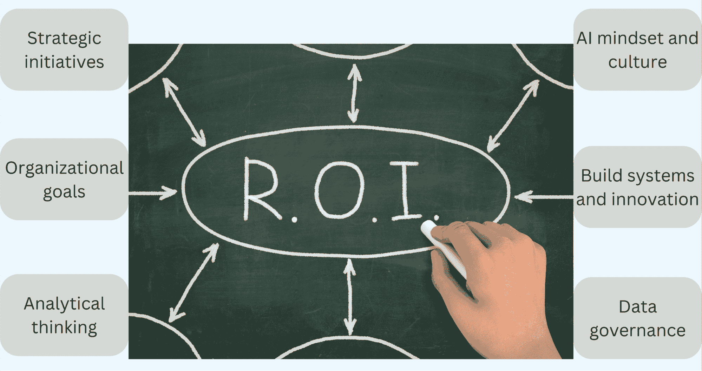
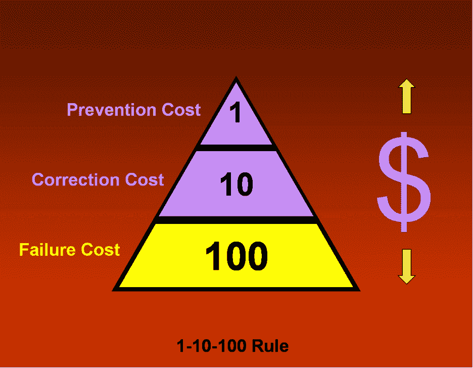

# 投资人工智能？需要考虑的事项

> 原文：[`www.kdnuggets.com/investing-in-ai-here-is-what-to-consider`](https://www.kdnuggets.com/investing-in-ai-here-is-what-to-consider)

投资回报率（ROI）帮助企业确定哪些项目应优先考虑，简单来说——哪些举措最值得投入资源和关注，以实现业务目标。

图片来源：Canva

既然我们谈论的是涉及数字的投资回报率，那就让我们从一些统计数据开始吧：

+   根据《福布斯》的数据，[全球人工智能市场](https://www.forbes.com/advisor/in/business/ai-statistics/)预计将以 38%的年均增长率增长，到 2030 年将达到约 1812 亿美元。

+   [人工智能是 83%公司](https://explodingtopics.com/blog/ai-statistics)的首要优先事项。

+   根据[IBM](https://www.ibm.com/thought-leadership/institute-business-value/en-us/report/ai-capabilities)的数据，2023 年对人工智能系统的支出将增加 27%，达到 1540 亿美元。

+   该报告进一步指出，组织平均只能在 10%的资本投资成本上获得 5.9%的回报率。

+   然而，成功的远见者通过在正确的时间把握正确的机会实现了 13%的回报率。

# 专业投资。

鉴于巨额开支，必然会有人谈论这样的问题——如此高额的投资能带来什么回报。[PwC](https://www.pwc.com/us/en/tech-effect/ai-analytics/artificial-intelligence-roi.html)表示，大多数公司甚至无法获得任何回报。

人工智能投资很快成为大多数高管关注的焦点。他们需要做出明智的人工智能投资，以获得高回报率，但他们如何才能实现领导者所能带来的回报？请注意，预计的回报北极星是[高达 30%](https://nexocode.com/blog/posts/the-roi-of-ai/)。

+   第一步是将人工智能视为战略举措。它必须源于特定组织的目标，而不是竞争对手的目标。重要的是要记住，每个组织都有其独特的位置，考虑到其细分市场、商业模式和技术能力。

+   这需要识别与业务战略一致的项目，即组织在未来 3-5 年的目标和愿景。

+   即使前方道路明确，实现人工智能的潜力也不是没有困难。这需要分析思维，并在整个组织中培养人工智能文化。

图片来源：作者

+   人工智能思维方式帮助企业辨别哪些人工智能项目值得启动，同时节省对非人工智能项目的投入。从文化角度来看，建议迅速建立一个充满机会和创新的项目池，并具备快速应对各种变量的能力。

+   接下来是数据——它是整个 AI 转型的关键，因此，大部分关注和努力必须集中在构建数据治理过程上。[SAP](https://www.sap.com/india/products/technology-platform/master-data-governance/what-is-data-governance.html)将数据治理定义为“为确保组织的数据首先是准确的——然后在输入、存储、操作、访问和删除时得到适当处理的政策和程序。”

# 价值生成

要理解 AI 举措的 ROI 背景，“价值”比纯利润更为重要。

利润意味着与传统计算回报相关的实际现金。然而，AI 从业者优先考虑“价值生成”，以体现 AI 实施在组织层面的好处。

有了这些额外的背景信息，我们来将投资回报率（ROI）拆解为两个组成部分。回报是从投资中产生的价值，这涉及到开发这些系统的成本。

## 收入和回报

评估收入的方式有很多种。除了来自 AI 驱动产品的直接收入流，一些举措并不是直接的收入来源，但可以巧妙地增强或补充现有流程。

这些举措可能不会立即产生结果，但随着时间的推移，可以显著增加收入。考虑到电子商务平台上基于用户浏览历史的 AI 驱动推荐引擎，这些推荐轻轻引导用户进行额外购买，从而提高销售额。

图片来自 Canva

另一个例子是，当平台通过快速提供用户感兴趣的选择来提升搜索相关性和改善客户体验，从而使他们对平台保持忠诚并留住他们。

## 成本——我们都知道的

收入只是 ROI 计算的一部分；另一部分涉及审慎的成本管理。AI 项目的主要成本包括基础设施、建立 AI 团队和数据管理解决方案。

招聘 AI 技能涉及入职、技能提升和薪酬成本。一些组织将整个项目或需要特定技能集的部分项目外包，避免了前期成本。

然而，外部招聘也会产生间接成本，因为内部人员可能没有足够的能力继续支持项目，从而引入了对外部承包商的依赖，增加了项目维护和额外成本。

AI 可以用于一些简单的案例，比如自动化一些重复任务，以减少人为错误，节省运营开销。

## 失败的成本

让我们谈谈那些常常未被考虑的成本——与延续错误决策相关的成本。

[1-10-100 规则](https://totalqualitymanagement.wordpress.com/2009/02/25/what-is-1-10-100-rule/) 解释了“未注意到一个成本如何使损失在美元中上升。预防成本可能应该优先，因为预防缺陷的成本远低于修正缺陷的成本”。

图片来源于 [全面质量管理](https://totalqualitymanagement.wordpress.com/2009/02/25/what-is-1-10-100-rule/)

像这个规则一样，错误决策的成本至关重要。它要求从一开始就建立设计思维的视角，包括项目范围界定、识别正确的 AI 机会及相关风险。

因此，建立一个全组织风险评估框架对于解决如偏见、缺乏监督、透明度和问责制、数据隐私等问题至关重要。

# PoC 期间的 ROI 估算

在构思阶段的初步 ROI 估算有助于优先考虑项目。

在对业务问题有了更深刻的理解之后，接下来是讨论技术。建议开始构建 PoC，而不是等待理想的环境——所有输入组件，如数据、算法、基础设施等，都已整理好。

一旦你开始开发 PoC，是否有可能将项目扩展的现实就开始显现。

PoC 帮助你在有限的预算和更短的时间内验证想法。

测试环境或沙箱可以在投资建设规模系统之前确保价值主张。然而，规模方面必须在 PoC 阶段就进行前瞻性思考，无论是在以下方面：

+   建立数据管道以支持大规模数据，

+   需要昂贵计算资源的算法

+   应用程序将服务的用户数量。

这些维度的估算展示了 AI 解决方案将如何融入组织的技术栈。

如果 PoC 证明了投资的合理性，项目将进入开发阶段。

值得注意的是，评估收入和成本因素是特定于业务模型的；因此，本文旨在帮助建立一个视角，以衡量不同因素及其对 ROI 的影响。

**[Vidhi Chugh](https://vidhi-chugh.medium.com/)** 是一位 AI 战略家和数字化转型领导者，她在产品、科学和工程交汇处工作，致力于构建可扩展的机器学习系统。她是一位获奖的创新领袖、作者和国际演讲者。她的使命是使机器学习民主化，打破术语，让每个人都能参与到这场转型中。

### 更多相关话题

+   [你应该考虑数据 Ops 职业吗？](https://www.kdnuggets.com/2023/05/consider-dataops-career.html)

+   [如果你想成为数据分析师，你应该考虑的 3 门课程](https://www.kdnuggets.com/3-courses-you-should-consider-if-you-want-to-become-a-data-analyst)

+   [2023 年值得考虑的顶级 AutoML 框架](https://www.kdnuggets.com/2023/05/best-automl-frameworks-2023.html)

+   [值得考虑的印度顶级公司](https://www.kdnuggets.com/top-companies-in-india-to-consider-for-employment)

+   [Burtch Works 2023 数据科学与人工智能专业人员薪资报告…](https://www.kdnuggets.com/2023/08/burtch-works-2023-data-science-ai-professionals-salary-report.html)

+   [这些是我用来赚取 $10,000 的人工智能工具及技能…](https://www.kdnuggets.com/2023/07/ai-tools-along-skills-make-10000-monthly-bs.html)
