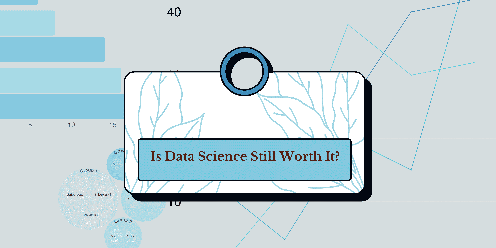

# 2024 年数据科学还值得吗？

> 原文：[`www.kdnuggets.com/is-data-science-still-worth-it-in-2024`](https://www.kdnuggets.com/is-data-science-still-worth-it-in-2024)

图片来源：作者

很多人对 2024 年数据科学家的职位有不同的看法。随着生成式 AI 工具的使用不断增加，许多组织和员工在数据分析过程中受益。

* * *

## 我们的前 3 个课程推荐

 1\. [Google 网络安全证书](https://www.kdnuggets.com/google-cybersecurity) - 快速进入网络安全职业轨道。

 2\. [Google 数据分析专业证书](https://www.kdnuggets.com/google-data-analytics) - 提升你的数据分析技能

 3\. [Google IT 支持专业证书](https://www.kdnuggets.com/google-itsupport) - 支持你的组织的 IT

* * *

有人说数据科学已经过时，有人说数据科学正在重生。你应该相信什么？

这是我的看法。

如果数据被比作黄金，越来越多的公司正在生成数据，并希望获得这些数据。你必须问自己，为什么大家对数据如此疯狂？

但这是否意味着如果组织拥有像 ChatGPT 这样的工具来清理和分析数据，它们仍然需要数据科学家？尽管组织和专家在日常活动中利用机器学习和人工智能工具，但数据科学市场仍然有明显的增长趋势。

## 数据科学是否过度饱和？

我们都承认，科技行业正在蓬勃发展，人们正努力进入这一行业。许多公司正在寻找具备网页分析技能、商业智能和基础数据工程的专业人士，而[数据科学家](https://datacamp.pxf.io/75Yn9A)正具备这些能力。

然而，当你看一个非技术公司时，许多任务可以被自动化，从而减少对数据科学家的需求。然而，如果你在一个更加技术驱动的公司工作，该公司需要在金融领域进行风险分析或数据工程和客户分析，你将在职业生涯中有更大的机会成功，[数据科学家](https://datacamp.pxf.io/75Yn9A)。

这更多取决于你工作的公司。

例如，制造业、物流、医疗保健和金融业。这些行业需要分析服务，其中对数据科学的核心需求持续增长。别忘了 AI 领域，例如自然语言处理（NLP）和计算机视觉，目前也在迅猛发展。

## 所以，数据科学值得吗？

简单的答案是肯定的。对于那些具备分析和人工智能模型开发技能的人员来说，机会非常大。[《美国新闻与世界报道》](https://money.usnews.com/careers/best-jobs/data-scientist)将数据科学排名为第 4 大技术工作、第 7 大 STEM 工作，并在 2024 年列为 100 个最佳工作的第 8 位。

这些数据突显了对[数据科学专业人士](https://datacamp.pxf.io/75Yn9A)的需求，以及他们在未来技术和商业中的重要性。

## 我如何成为一名数据科学家？

如你所知，对数据科学家的需求很高，许多人都在尝试进入这个行业。你们中的一些人可能考虑过回到大学，但无法衡量经济负担。

进入科技行业现在不再那么困难。各种在线课程可以在几个月内而不是几年内帮助你进入这一领域。

其中一个课程是 DataCamp 的[数据科学家认证](https://datacamp.pxf.io/75Yn9A)。这是一个行业认可的认证，让你可以确信你的认证具有价值，并将被主要组织认可。

在此认证中，你将学习如何使用机器学习和人工智能收集、分析和解释大量数据。通过这种技术学习，你还将学会如何有效地将你的分析结果传达给业务利益相关者。

令人惊讶的是，你可以在[30 天内](https://datacamp.pxf.io/75Yn9A)完成这一过程！一旦注册，你将有 30 天的时间完成所有必要的计时和实操考试，以确保成功！学习平台提供了你所需的一切准备，以实现你的目标。

最困难的部分是找工作，对吗？在当前经济和就业市场中，很多人害怕投资于他们的职业发展，我理解你的担忧。

然而，DataCamp 还为你提供了独家访问他们的认证社区的机会，在这里你可以与其他认证专业人士联系，并探索由社区团队为你量身定制的内容。在这个社区中，你将了解与行业专家的新活动，这对网络拓展、讨论组提问和获得反馈、专门为你定制的内容以及资源来帮助你在求职中脱颖而出非常有帮助。

## 总结

许多人对数据科学在当前市场上的增长持有不同意见。然而，仍然有很多人进入这一领域以满足需求。任何技术角色都需要学习和提升技能，因此作为数据科学家进入这一领域将使你能够转向其他需求量大的领域，如商业智能或数据工程。

**[Nisha Arya](https://www.linkedin.com/in/nisha-arya-ahmed/)**是一名数据科学家、自由技术写作人员，同时也是 KDnuggets 的编辑和社区经理。她特别关注于提供数据科学职业建议或教程以及基于理论的数据科学知识。Nisha 涉及广泛的话题，并希望探索人工智能如何有利于人类寿命的不同方式。作为一个热衷学习者，Nisha 致力于拓宽她的技术知识和写作技能，同时帮助指导他人。

### 更多相关话题

+   [人力分析的努力是否值得结果？](https://www.kdnuggets.com/2022/09/efforts-people-analytics-worth-outcome.html)

+   [在生成式人工智能时代，数据科学家还需要吗？](https://www.kdnuggets.com/2023/06/data-scientists-still-needed-age-generative-ai.html)

+   [低代码：开发者仍然需要吗？](https://www.kdnuggets.com/2022/04/low-code-developers-still-needed.html)

+   [调查：机器学习项目仍然经常无法部署](https://www.kdnuggets.com/survey-machine-learning-projects-still-routinely-fail-to-deploy)

+   [2024 年顶级免费数据科学在线课程](https://www.kdnuggets.com/top-free-data-science-online-courses-for-2024)

+   [追求 2024 年第 3 名在线数据科学硕士项目](https://www.kdnuggets.com/2024/05/baypath/pursue-a-masters-in-data-science-with-the-3-rd-best-online-program)
