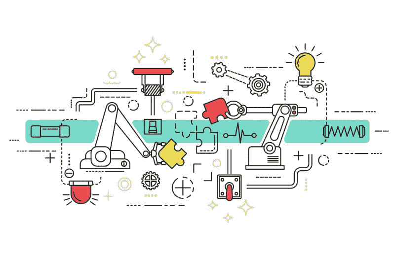

# 你的工作会被机器取代吗？

> 原文：[`www.kdnuggets.com/2021/10/job-replaced-machine.html`](https://www.kdnuggets.com/2021/10/job-replaced-machine.html)

评论

**由 [马丁·佩里](https://www.linkedin.com/in/martinperry/)，微软高级数据专业人士**

[由 macrovector / Freepik 设计](https://www.freepik.com)

* * *

## 我们的前三个课程推荐

 1\. [谷歌网络安全证书](https://www.kdnuggets.com/google-cybersecurity) - 快速进入网络安全职业。

 2\. [谷歌数据分析专业证书](https://www.kdnuggets.com/google-data-analytics) - 提升你的数据分析技能

 3\. [谷歌 IT 支持专业证书](https://www.kdnuggets.com/google-itsupport) - 支持你的组织 IT 需求

* * *

是的！这将会发生。然而，你可以通过成为一个公民开发者来应对并在这个破坏性的时代中蓬勃发展！

这是一个**大规模颠覆性数字化转型**的时代。数据的供应年年**指数级**增长——这都由于我们周围的数字化，从人与人之间的互动到人与机器之间的互动。所有这些迭代都通过数十亿个传感器、屏幕和设备被捕捉和数字化。

这些数据由机器的贪婪需求消费——算法驱动虚拟和物理机器人。运行这些机器人几乎是免费的：处理能力、连接性和数据存储普遍且丰富。

你的未来职业将被数字化！工作被简化为数据。一旦简化为数据，机器执行得更好，因为机器的表现具备：

1.  成本节省更便宜

1.  更高的速度更快

1.  更高的质量和准确性更好

创新/更高价值的工作（如商业洞察、客户参与、设计）不容易数字化。人类将在这些创造性和更高价值的工作中继续超越机器。你必须**转变你的重点**。

我们在**知识经济**中的工作方式已经改变——使用浏览器和搜索引擎进行信息发现的时代已经结束。现在，期望数据能即时传递到最终用户设备作为信息。搜索不再是在未处理数据的海洋中进行，而是期望在最终用户设备上提供清晰可消费的信息流。应用在这方面**非常棒**。

这导致了应用需求的**爆炸**。预计应用的增长速度是全球 IT 交付能力的五倍——四年内将超过 5 亿个应用。IT 功能的专业发展无法跟上。你可以转变以填补这一空缺，自我服务，并在未来保持相关性。公民开发**工具**现已可用，以满足应用生产和业务流程自动化的需求。

这个大规模的数字转型时代将要求你的参与。静坐不动只会让机器自动化你的当前角色，并做得更好。调整方向，创造你的未来。设计机器高效的工作流程和过程。利用生产力指数增长的好处。专注于更高价值的工作。

机器将至少取代你工作的部分；但你可以调整、留在岗位上并成长。

**成为公民开发者！**

**简介: [马丁·佩里的个人资料](https://www.linkedin.com/in/martinperry/)** 完成了公路工程博士学位，并在建筑材料行业担任了 5 年的项目管理职位。2000 年，他进入软件行业，担任 IBM 和微软的财务、战略及高级领导角色。他目前的领导角色是高级数据专业人士。他秉持成长心态，不断寻找学习和成长的机会，以保持在现代职场中的相关技能。他最近完成了由 EDX.org 主办的微软专业数据科学课程，获得了爱尔兰分析协会认证的数据科学家称号，并成为了微软认证培训师。

**相关：**

+   数据分析师会被 AI 取代吗？

+   在数据领域选择合适的工作：工程文化中的 5 个标志

+   GitHub Copilot 与编程自动化中的 AI 语言模型的崛起

### 更多相关内容

+   [数据分析中的工作趋势：用于工作趋势分析的 NLP](https://www.kdnuggets.com/job-trends-in-data-analytics-nlp-for-job-trend-analysis)

+   [如何在没有任何工作经验的情况下获得你的第一份数据科学工作](https://www.kdnuggets.com/2021/02/first-job-data-science-without-work-experience.html)

+   [选择下一个数据科学工作前需要记住的 5 件事](https://www.kdnuggets.com/2022/01/5-things-keep-mind-selecting-next-job.html)

+   [获得第一份数据科学工作的 7 个步骤](https://www.kdnuggets.com/7-steps-to-landing-your-first-data-science-job)

+   [掌握数据科学求职的 5 个免费资源](https://www.kdnuggets.com/5-free-resources-to-master-your-data-science-job-search)

+   [免费数据科学面试书，助你获得理想工作](https://www.kdnuggets.com/free-data-science-interview-book-to-land-your-dream-job)
