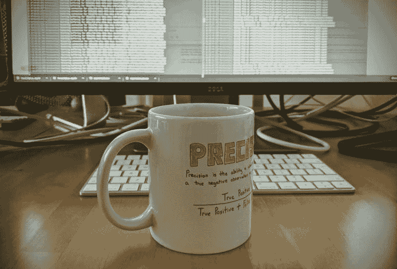

# 从软件工程师到机器学习工程师的旅程

> 原文：[`www.kdnuggets.com/2020/12/journey-from-software-machine-learning-engineer.html`](https://www.kdnuggets.com/2020/12/journey-from-software-machine-learning-engineer.html)

评论

**由 [Guillermo Carrasco](https://www.linkedin.com/in/guillermocarrasco/)，iZettle，PayPal**

定制的马克杯，特色展示了 Chris Albon 的 [机器学习闪卡](https://store.chrisalbon.com/machine-learning-flashcards)

* * *

## 我们的前三大课程推荐

 1\. [谷歌网络安全证书](https://www.kdnuggets.com/google-cybersecurity) - 快速进入网络安全职业生涯。

 2\. [谷歌数据分析专业证书](https://www.kdnuggets.com/google-data-analytics) - 提升你的数据分析技能

 3\. [谷歌 IT 支持专业证书](https://www.kdnuggets.com/google-itsupport) - 支持你的组织的 IT 需求

* * *

我在 iZettle 工作了大约四年。我在这家公司并不是作为机器学习工程师开始的，而是在公司内部成长的过程中逐步过渡到这一职位的。

我的正规教育背景是计算机科学/软件工程，事实上，我已经作为软件开发人员工作了大约 8 年。这些年的软件工程经历使我具备了一些技能，这些技能使我在向机器学习工程师过渡时的路径颇具特色。我想与您分享一下我在准备这一角色时希望更多关注的方面，以及我认为我的背景如何帮助我完成这一过渡。

### 如何开始

首先——为什么？我对软件工程师的工作不满意吗？我认为成为机器学习工程师比成为软件工程师要更好？**绝对不是！** 这只是我喜欢花时间做的事情，那就是*数据*。我从 15 岁开始编程，一直热爱它。但我最喜欢的是用我的工作来理解世界。像很多人一样，我有很多“个人项目”*想法*从未实现，但当我阅读这些想法的列表时，我发现了类似于：*构建工具以使用推特数据进行自然灾害检测，分析我社交媒体账户的数据以理解自己的行为，检测朋友聊天中的情绪等等*。你看到了模式吗？所有这些项目想法都寻求对某种情况的理解，并且都围绕数据展开。因此，我一直对数据有很大兴趣，大约两年前我决定让这成为我的主要工作。我想认为机器学习是我个人的选择，但从数据驱动的角度来看，我可以将我的决定映射到近年来机器学习领域的高潮期，当时你阅读的每篇技术文章都在讲述某种机器学习创新，所以我想我永远不会知道。

无论如何，我做出了那个决定，幸运的是，iZettle 正在运行一个机器学习辅导项目，我愉快地报名参加了。

### 学习过程

在那个辅导项目中，我们逐章学习了[Python 机器学习](https://www.packtpub.com/product/python-machine-learning-third-edition/9781789955750)这本书。每周，我们讨论一章并编写一些练习代码来实验所学的概念。我发现这非常令人兴奋，它真正巩固了我对机器学习工作原理的基础理解。

除此之外，我利用空闲时间参加了一些在线课程，比如在 Udacity 上的[深度学习专业课程](https://www.udacity.com/course/deep-learning-nanodegree--nd101)，参与了[Kaggle](https://www.kaggle.com/)比赛（虽然没什么成功，我得承认），并尝试实现一些我之前提到的项目。

我告诉你这些不是为了炫耀，而是为了让你明白我在尽可能多地吸收关于这个话题的知识，当我准备好换标题时，我感觉自己对机器学习有了非常扎实的理解。

在超过 6 个月的密集学习之后，我加入了 iZettle 的机器学习团队。

### 课程和书籍无法教给你的

我带着满腔热情和渴望开始我的第一个项目。正是从这个第一个项目开始，我注意到学习机器学习和实际*做*机器学习之间的不同。这个第一个项目是关于尝试预测我们商户的破产，以便我们能够联系并帮助他们改善业务。

当你进行一个来自课程或书籍的项目时，该项目最重要的部分已经为你完成了。也就是说：*你到底在尝试做什么？* 在课程中，你会得到一个数据集、一个目标指标，你需要做的就是“处理”你的数据并训练模型，以在目标指标上获得良好的表现。

在这种情况下，有一些事情你不会学习，甚至不会质疑。

**问题定义**：从机器学习的角度来看，问题是如何被制定的，以使其有意义？对于破产问题，我对突然涌现出的问题感到震惊，几乎无中生有：预测破产是什么意思？这意味着商人明天破产吗？一周后？一个月后？我如何知道我们的哪些商人已经破产？这是缺乏活动吗？那么季节性因素呢？这是否是一些外部信息？我如何将其映射到算法可以学习的标签上？… 我习惯于得到一个标记的数据集，从未考虑过仅仅创建那个标签需要大量的思考、领域知识和商业考虑。而且根据你如何定义标签，你可以使用的问题和特征会完全改变。

**数据：** 我已经暗示了接下来要讲的内容，众所周知，获得正确的数据是机器学习问题中的一个难点。然而，当你第一次遇到这个问题时，它仍然会让你感到惊讶。数据很难获取，而且很混乱，你不应该盲目相信它。构建标签实际上是在你获得数据源之后进行的。在我的第一次任务中，我有两个来自不同来源的数据集，我必须将它们合并并映射到我们每个商人的特征集上。对于你引入的每一个新信息来源，你需要确保不仅数据质量是可接受的，还要确保你没有引入任何形式的[bias](https://towardsdatascience.com/survey-d4f168791e57)，或者至少要考虑到这一点。

在某些情况下，你甚至没有要解决问题的数据，机器学习的工作在编写代码之前几个月就已经开始了，包括建立数据收集策略和与其他团队的关系。

**评估**：我们拥有数据集和标签。我们开始建模……那么我们如何衡量性能呢？这不仅仅是选择使用哪个指标的问题，还涉及到它是否符合业务逻辑。权衡取舍在这里发挥了重要作用。我以前从未考虑过使用哪个指标来衡量模型的性能，那是理所当然的。我真的在等待有人告诉我：使用准确率/ROC-AUC 等。当这种情况没有发生时，我不得不考虑一个指标*及其影响*，我意识到花费大量时间思考这一点是多么重要，同时对任何书籍或课程中对这个话题的关注感到有些失望。想一想：根据预测真正的值却是假的（即假阳性）或类似的情况的“严重程度”，你可能希望保持最低的精确度或召回率，而不管你的总体指标（例如 ROC-AUC）是上升还是下降。这只是一个例子，还有许多。

这些是我意识到在我所上的任何课程或阅读的书籍中完全没有学到的主要点。这些都是我在工作中、每天以及多亏了非常有经验和耐心的同事们学到的东西。

### 对我旅程有帮助的事物

当然，也有一些意外的好处，我可以利用作为软件工程师多年积累的技能。列举一些：

+   **通用软件开发实践：** 在许多课程中，花费大量时间解释常见的软件开发实践：版本控制、基础编程、专注于单一编程语言（90% 的时间该语言是 Python）等。多年来与软件打交道，这不仅是我已经有实践的领域，而且这也是一种“内化”的东西。这使我更容易开始测试和实施想法，并希望能够传播这些实践并激励我新加入的团队。

+   **阅读和理解他人代码：** 由于这一直是我做的事情，我非常擅长阅读其他同事的代码，并希望能够给予建设性的反馈。

+   **灵活性**在“为工作选择合适工具”方面。机器学习工程师往往会陷入他们习惯使用的工具中。虽然我没有数据来支持这一说法，但这是我注意到的。因为我曾使用过许多语言和框架，所以我发现尝试新工具和库相对容易（而且令人兴奋！），这希望能让我拥有更广泛的视野和工具集。

### 那么……该怎么办？

如果你处于与我曾经类似的情况，我有以下附加练习供你在阅读的书籍或所上的课程中进行。**试着回答以下问题**：

+   **你想解决/预测什么？** 你是否理解问题的所有部分？

+   **你所得到的数据是否对你正在尝试解决的问题有意义？**

+   **数据是如何收集的？** 如果你不能确定这一点，你会如何*收集*这些数据？需要多长时间？谁需要参与数据收集？是网页开发人员（可能是点击事件），应用程序开发人员（应用程序使用数据）等？

+   **如果这是一个需要在公司内部解决的问题，除了你的预测，还需要什么其他的项目需求？** 一些基础设施？任何商业决策？应用程序中的新功能？*谁*会参与其中？

+   **你使用了什么评估指标？** 你理解它吗？它是否适合这个问题？是否有其他替代指标对这个问题更有意义？**误分类一个样本的成本**是多少？

+   无论目标性能是什么：***如果这是一个真实项目，你*什么时候会感到满意？** 为什么是这个数字？为什么不是更低/更高？

我相信，如果你真的尝试回答学习过程中遇到的每一个问题，你将会对“现实生活中的机器学习”有更广泛和现实的理解。

我希望这篇文章能帮助许多人在学习过程中！如果你有任何问题，或想与我们分享你的故事，我们很乐意听取！

**个人简介: [Guillermo Carrasco](https://www.linkedin.com/in/guillermocarrasco/)** 是在 iZettle，PayPal 工作的机器学习工程师。对技术（尤其是数据和机器学习）、自然和各种户外运动感兴趣。对音乐充满热情。

[原文](https://medium.com/izettle-engineering/a-journey-from-software-to-machine-learning-engineer-at-izettle-49192ce3a758)。经许可转载。

**相关：**

+   数据工程师面试终极指南

+   数据专业人士如何在简历中增加更多变化

+   有抱负的数据科学家的顶级课程

### 更多相关话题

+   [软件开发人员与软件工程师](https://www.kdnuggets.com/2022/05/software-developer-software-engineer.html)

+   [通过 Uplimit 的 Metaflow 加速你的机器学习之旅…](https://www.kdnuggets.com/2023/10/uplimit-accelerate-your-machine-learning-journey-metaflow-mastery-course)

+   [机器学习模型可解释性如何加速人工智能的采纳之旅…](https://www.kdnuggets.com/2022/07/ml-model-explainability-accelerates-ai-adoption-journey-financial-services.html)

+   [让你的 AI 之旅更上一层楼！加入 Uplimit 的免费构建 AI…](https://www.kdnuggets.com/2024/01/uplimit-supercharge-your-ai-journey-openai-course)

+   [规划你的 SAS 认证之旅](https://www.kdnuggets.com/2022/11/sas-map-journey-towards-sas-certification.html)

+   [在数据科学之旅中取得飞跃](https://www.kdnuggets.com/2023/02/make-quantum-leaps-data-science-journey.html)
