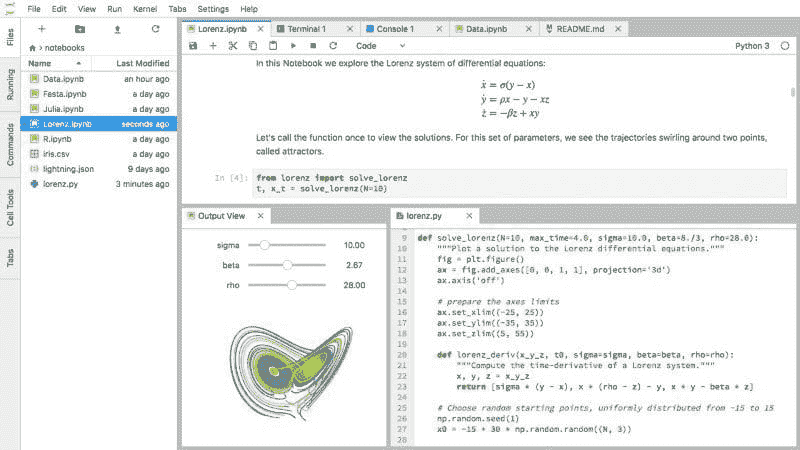
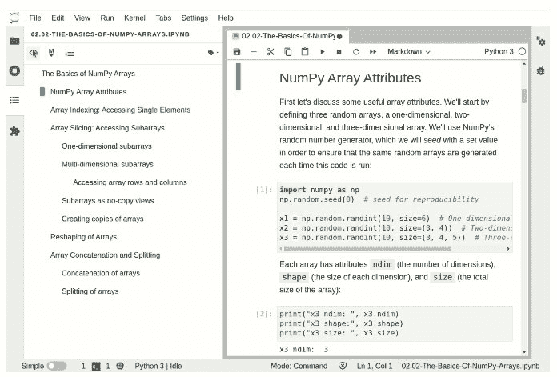
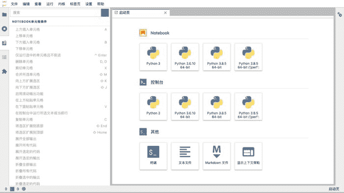
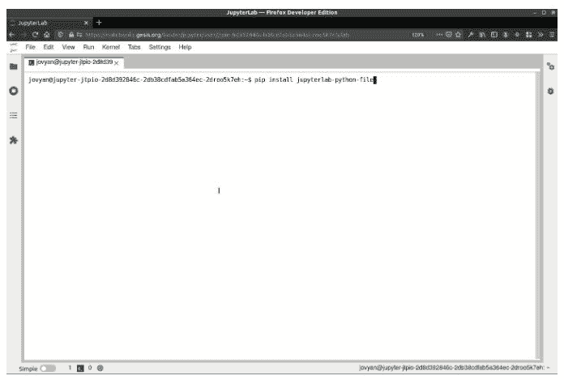

# JupyterLab 3 已发布：现在升级的关键理由

> 原文：[`www.kdnuggets.com/2021/01/jupyterlab-3-here-reasons-upgrade.html`](https://www.kdnuggets.com/2021/01/jupyterlab-3-here-reasons-upgrade.html)

评论

**[JupyterLab](https://jupyterlab.readthedocs.io/en/stable/)** 是“下一代基于 Web 的 Project Jupyter 用户界面”，与 Jupyter notebooks 保持一致，并在功能上有所提升。Jupyter 的 Web IDE 已存在多年，并在数据科学社区中占据了显著的地位，它们结合起来在我们的读者中是 最受欢迎的 IDE。

* * *

## 我们的前三个课程推荐

 1\. [谷歌网络安全证书](https://www.kdnuggets.com/google-cybersecurity) - 快速进入网络安全职业生涯。

 2\. [谷歌数据分析专业证书](https://www.kdnuggets.com/google-data-analytics) - 提升你的数据分析技能

 3\. [谷歌 IT 支持专业证书](https://www.kdnuggets.com/google-itsupport) - 支持你组织的 IT 工作

* * *

[最新版本](https://blog.jupyter.org/jupyterlab-3-0-is-out-4f58385e25bb)的 JupyterLab 刚刚发布，它带来了多个更新和新功能，值得尝试。以下是你现在应检查最新版本的 3 个理由。

### 目录

更容易使用版本 3 中的目录功能来浏览 Jupyter 文档。它会根据文档中的标题自动生成，并可以在界面左侧开关。这使得在较长文档中跳转变得更加轻松，同时将相关代码和文档整齐地收纳，直到需要时再展开。



### 支持多种显示语言

JupyterLab 现在支持多种（自然）语言。用户可以在 [语言包存储库](https://github.com/jupyterlab/language-packs/) 中单独安装所需的语言，并在 Jupyter 文档中使用。下图展示了简体中文的使用情况，可通过以下方式轻松安装：

```py
pip install jupyterlab-language-pack-zh-CN
```



### 使用 pip 和 conda / mamba 安装新扩展

现在可以通过流行的包管理工具 pip、conda 和 mamba 安装预构建的 Jupyter 扩展。虽然这是一次便利的升级，但用户必须安装 Node.js 才能利用此新功能。



> 预构建的扩展可以作为独立包发布到 PyPI 和 conda-forge，也可以与 Jupyter Server 扩展和 Classic Notebook 扩展打包到现有包中。这有助于使整个生态系统更加连贯。

这意味着安装一个新扩展对于 JupyterLab 和 Jupyter notebooks 都适用，只需一次安装；不需要为其中之一或另一个额外配置步骤。

这些只是 JuptyerLab 3 中发现的一些新功能。了解更多其他功能，请点击[这里](https://blog.jupyter.org/jupyterlab-3-0-is-out-4f58385e25bb)，并立即尝试最新版本。

**相关内容**：

+   这里是最受欢迎的 Python IDEs/编辑器

+   停止从命令行运行 Jupyter Notebooks

+   Scikit-learn 0.23 的 5 个新功能

### 更多相关话题

+   [LLM 世界末日：开源克隆的复仇](https://www.kdnuggets.com/2023/05/llm-apocalypse-revenge-open-source-clones.html)

+   [现在 AWS 上的 8 门 GenAI 课程](https://www.kdnuggets.com/top-8-genai-courses-for-aws-to-take-now)

+   [你应该避免数据科学职业的 5 个理由](https://www.kdnuggets.com/2022/04/top-5-reasons-avoid-data-science-career.html)

+   [通用语义层对你的数据栈有益的 6 个理由](https://www.kdnuggets.com/2024/01/cube-6-reasons-why-a-universal-semantic-layer-is-beneficial)

+   [你应该使用线性回归模型而不是……的 3 个理由](https://www.kdnuggets.com/2021/08/3-reasons-linear-regression-instead-neural-networks.html)

+   [为什么你不应该使用机器学习的 4 个理由](https://www.kdnuggets.com/2021/12/4-reasons-shouldnt-machine-learning.html)
