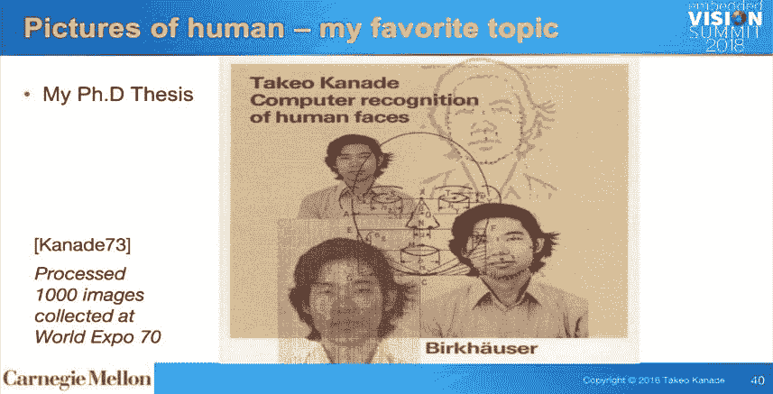
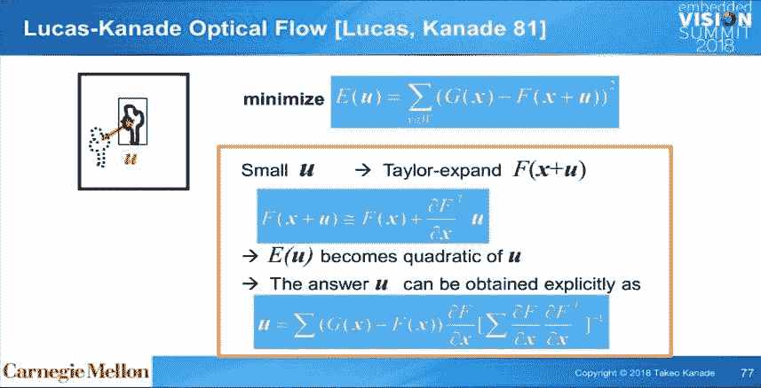
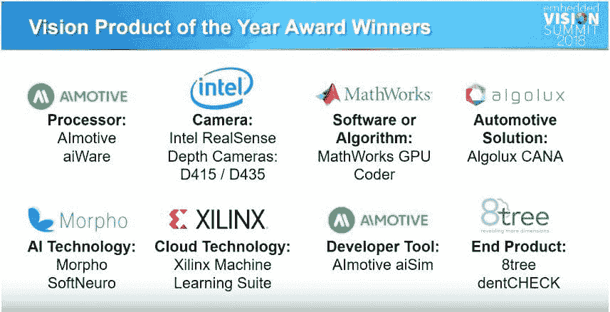

# 像业余爱好者一样思考，像专家一样行动：来自计算机视觉职业生涯的经验教训

> 原文：[`www.kdnuggets.com/2019/05/kanade-lessons-career-computer-vision.html`](https://www.kdnuggets.com/2019/05/kanade-lessons-career-computer-vision.html)

 评论

**2018 年嵌入式视觉峰会高井博士主旨演讲的要点**

[高井武男博士](https://www.ri.cmu.edu/ri-faculty/takeo-kanade/) 是卡内基梅隆大学的 U.A.和海伦·惠特克教授。他的讲座题目是：**像业余爱好者一样思考，像专家一样行动：来自计算机视觉职业生涯的经验教训**

* * *

## 我们的前三个课程推荐

 1\. [谷歌网络安全证书](https://www.kdnuggets.com/google-cybersecurity) - 快速入门网络安全职业生涯

 2\. [谷歌数据分析专业证书](https://www.kdnuggets.com/google-data-analytics) - 提升您的数据分析技能

 3\. [谷歌 IT 支持专业证书](https://www.kdnuggets.com/google-itsupport) - 支持您的组织的 IT 工作

* * *

高井博士做了一个极具吸引力的演讲，内容丰富且充满幽默。点击[这里](https://www.embedded-vision.com/platinum-members/embedded-vision-alliance/embedded-vision-training/videos/pages/may-2018-embedded-vision-summit-kanade)观看视频。

+   他从研究生阶段开始，已经从事计算机视觉和机器人学工作 50 年。他的博士论文：计算机识别人脸。

+   他出名的时刻：2001 年 1 月 28 日 - 在超级碗 XXXV 上 - 使用[EyeVision](https://www.youtube.com/watch?v=Bse7YXWdP-c)进行的行动回放，使用 33 台相机，每台相机配有一台带有索尼相机和大变焦镜头的机器人（当时价格为 80,000 美元的三菱 PA-10）。硬件总成本超过 300 万美元。总电缆长度超过 20 公里。他描述了在活跃比赛期间协调机器人相机进行平移、倾斜、变焦和对焦的挑战。

+   另一个出名时刻：高井博士在布鲁斯·威利斯电影[代理人](https://www.imdb.com/title/tt0986263/?ref_=fn_al_tt_1)中出现，在一个 2.5 秒的片段中饰演自己。

+   什么是“好研究”？即使是经验丰富的研究人员也发现很难清楚回答这个问题。他引用了已故的[艾伦·纽厄尔教授](https://en.wikipedia.org/wiki/Allen_Newell)：

    +   优秀的科学回应真实的现象或实际问题

    +   优秀的科学在于细节

    +   优秀的科学改变世界

+   进行有用且有趣的研究：

    +   从一个场景开始：设想成功的情景 - 可能发生什么，如何以及在哪里使用？

    +   自由地、愉快地思考

    +   故事展开，你可以谈论它

    +   其他人可以加入

+   高井博士的教训：

    +   成功的想法通常出乎意料地简单，甚至是幼稚而微不足道的。

    +   对这种简单思考的阻碍：“我知道”的心态。

    +   可靠的执行需要实质性的知识和技能——在这里，专业知识是必要的；然而，我们可能需要克服“专家”偏见；这不是将业余人士配对以提出简单的解决方案，然后让专家执行，而是专家根据需要做出适应。

    +   **像业余人士一样思考，像专家一样行动**——当你开始解决一个问题时，像新手一样思考，主动避免先入为主的偏见。在实施解决方案时，采取细致和彻底的方法。 Kanade 博士甚至用日语写了这方面的书（并翻译成了除英语外的其他语言）。

+   多摄像头系统：

    +   他关于多摄像头实时系统的第一篇论文被拒绝了（其中一位审稿人的评论是：“……使用这些多余摄像头的设备太贵而没有用处。”）

    +   他最初通过将真实现实建模为虚拟现实，提出了 Ladar（扫描激光测距仪）。

    +   为了克服 Ladar 的视频限制，他的团队主导了 3D 摄像头和软摄像头的开发，以克服遮挡问题。

    +   大约在 2000 年，他们开发了一个完全数字化的系统，创建了动态虚拟视图（虚拟现实）。

    +   后来的工作包括面部检测、姿态检测。

    +   多摄像头系统、大规模 3D 摄像头现在在许多地方使用，如娱乐（还记得电影《黑客帝国》吗？）

+   Navlab：

    +   Navlab 是一个于 1984 年与 DARPA 启动的自动驾驶程序。 这个项目经历了从 Navlab 1 到 Navlab 10 的多个版本。

    +   美国无手驾驶——在 1995 年：Navlab 5 在计算机控制下行驶了从华盛顿 DC 到圣地亚哥的 98.2%的距离。

+   智能头灯：

    +   雪花和雨滴具有很高的反射性。

    +   解决方案：避免光束击中雨滴！

    +   即使在约 1000 fps 的帧率和 1.5 ms 的延迟下，其他系统限制也显现出来。 随着速度的提高，许多问题变得更容易解决！

    +   这方面的一个实际应用将是适用于所有道路驾驶员的自适应远光灯。

+   研究的价值：

    +   研究不必是新的。

    +   “新颖本身并不是一种美德，有用才是。”

    +   预测研究很难：Dr. Kanade 分享了 Lucas-Kanade 光流的故事[[Lucas, Kanade ‘81](https://cecas.clemson.edu/~stb/klt/lucas_bruce_d_1981_1.pdf)]。大约在 80 年代，他们正在研究跟踪问题。他的学生 Bruce Lucas 提出了一个想法：将泰勒级数展开（已知 300 年）与二次方程的图形解法相结合。Lucas 坚持认为他们应该写一篇论文，而 Dr. Kanade 坚持认为不应该发表，因为这似乎很平凡……学生坚持，最后教授妥协……允许学生在一个冷门期刊上发表。结果，Dr. Kanade 发表的 400 多篇论文中，这篇论文成为了被引用最多的论文。每个使用视频处理的算法都使用了这个概念。

+   当前的计算机视觉正处于“完美风暴”的状态

    +   新型、普及型、嵌入式、偶尔超人类的视觉传感器

    +   Dr. Kanade 预测这个领域将会出现爆炸性的增长和进展

**关于嵌入式视觉联盟和 2018 年嵌入式视觉峰会**

版权归：Jeff Bier，BDTI 创始人兼总裁，Embedded Vision Alliance 创始人

+   嵌入式视觉联盟是一个由公司组成的合作伙伴关系，致力于加速和促进计算机视觉在解决实际问题中的应用——“我们旨在激发和创造能够‘看见’的产品”

+   嵌入式视觉联盟致力于将视觉感知融入各种系统和设备

+   从 2011 年起，Embedded Vision Alliance 从 16 名成员开始，现在已有 90 名成员

+   主题：在边缘和云端实现计算机视觉——几乎一半的联盟成员已经在使用云计算，约 75%已经在使用边缘视觉。云计算将成为嵌入式视觉解决方案的主要推动力。

+   视觉年度产品奖设立了 8 个类别：处理器、相机、软件、汽车、AI、云计算、开发者、最终产品

+   一名没有计算机视觉经验的开发者可以在几个月内创建一个有效的基于云的视觉解决方案（Chris Adzima 的[talk](https://www.youtube.com/watch?v=XA16cdPl_ts)）

+   3D 相机模块现在的价格大约为 20-30 美元（Guillaume Girardin 的[talk](https://www.youtube.com/watch?v=BvOgJTkz7-0)）

+   二值神经网络可以显著降低 DNN 推理的成本和功耗（Abdullah Raouf, Mohammad Rastegari - [talk](https://www.youtube.com/watch?v=ciKEmQzbEMQ)）

+   一个 DNN 可以为另一个 DNN 生成新的训练数据（Peter Corcoran 的[talk](https://www.youtube.com/watch?v=1aTUP7rU1e4)）

+   即使智能相机普及，我们也可以保护隐私（Charlotte Dryden 的[talk](https://www.youtube.com/watch?v=AOUiTHvmzfE)）

+   Vision Tank：一场激动人心的创业竞赛，争夺“最具创新性的视觉基础产品”奖。决赛入围者：

    +   [AiFi](http://aifi.io/)

    +   [Aquifi](https://www.aquifi.com/)

    +   [Boulder AI](https://www.boulderai.com/)

    +   [Sturfee](https://sturfee.com/)

    +   [VirtuSense Technologies](https://www.virtusensetech.com/)

+   2018 年嵌入式视觉峰会的亮点包括：

    +   1200 名与会者

    +   90+个演讲，跨越 2 天，6 个主题

    +   来自 50 多家展商的 100+个实际演示

    +   84%的与会者积极开发或计划开发基于视觉的产品

每年，这个活动都在积聚越来越多的关注和声势。

[2019 年嵌入式视觉峰会](https://www.embedded-vision.com/summit)将于下周在加利福尼亚州圣克拉拉的圣克拉拉会议中心举行。以下是关键日期和事件：

+   **2018 年 5 月 20 日，星期一**：关于 TensorFlow 2.0 的深度学习和 OpenCV 中的计算机视觉应用的培训课程。[需要在活动网站上单独注册]

+   **2018 年 5 月 21 日至 22 日，星期二和星期三**：主会议和视觉技术展示

+   **2018 年 5 月 23 日，星期四**：Intel、Khronos 和 Synopsys 主办的视觉技术研讨会 [需要通过活动网站单独注册]

所以，赶快注册 2019 年嵌入式视觉峰会吧。这里是链接：[`www.embedded-vision.com/summit`](https://www.embedded-vision.com/summit)

**一些关于计算机视觉的 KDNuggets 文章**

+   [Andrew Ng 的计算机视觉——11 个经验教训](https://www.kdnuggets.com/2017/12/ng-computer-vision-11-lessons-learnied.html)：Ryan Shrott 系统回顾了 Andrew Ng 在 Coursera 上的计算机视觉课程，并分享了他的学习经验。

+   [介绍 VisualData：计算机视觉数据集的搜索引擎](https://www.kdnuggets.com/2018/09/introducing-visualdata-search-engine-computer-vision-datasets.html)：Jie Feng 在这篇文章中介绍了[VisualData](http://www.visualdata.io/)，这是一个计算机视觉数据集的搜索引擎。

+   [如何在计算机视觉中做一切](https://www.kdnuggets.com/2019/02/everything-computer-vision.html)：在这篇文章中，George Seif 带我们深入了解计算机视觉中的分类、检测、分割、姿态估计、增强和恢复任务，使用深度学习方法。

### 更多相关内容

+   [计算机视觉中的 TensorFlow——简化的迁移学习](https://www.kdnuggets.com/2022/01/tensorflow-computer-vision-transfer-learning-made-easy.html)

+   [发现计算机视觉的世界：介绍 MLM 的最新…](https://www.kdnuggets.com/2024/01/mlm-discover-the-world-of-computer-vision-ebook)

+   [计算机视觉的 5 种应用](https://www.kdnuggets.com/2022/03/5-applications-computer-vision.html)

+   [你需要知道的 6 件数据管理事宜及其重要性](https://www.kdnuggets.com/2022/05/6-things-need-know-data-management-matters-computer-vision.html)

+   [KDnuggets 新闻 2022 年 3 月 9 日：在 5 分钟内构建机器学习 Web 应用](https://www.kdnuggets.com/2022/n10.html)

+   [DINOv2：Meta AI 的自监督计算机视觉模型](https://www.kdnuggets.com/2023/05/dinov2-selfsupervised-computer-vision-models-meta-ai.html)
