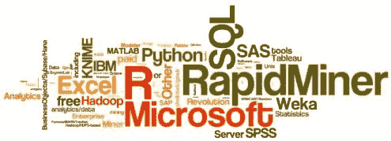

# KDnuggets 第 15 届年度分析、数据挖掘、数据科学软件调查：RapidMiner 继续领先

> 原文：[`www.kdnuggets.com/2014/06/kdnuggets-annual-software-poll-rapidminer-continues-lead.html`](https://www.kdnuggets.com/2014/06/kdnuggets-annual-software-poll-rapidminer-continues-lead.html)

 评论

第 15 届 KDnuggets 软件调查引起了分析和数据挖掘社区及供应商的巨大关注，吸引了超过 3,000 名选民。

这项投票测量了数据挖掘工具的使用范围，以及鉴于 KDnuggets 的受欢迎程度，供应商对其工具的宣传力度。许多供应商要求用户参与投票，但有一位供应商创建了一个特殊页面，硬编码仅投票支持其软件。在公平竞选中，支持你的候选人是正常的，但不给选民提供仅有一个选项的选票是不合适的。选民应该能够考虑所有选择。来自该供应商的无效票已从投票中移除，留下了 3,285 张有效票用于本次分析。

我们确实有来自许多供应商的广告，但这些供应商出现在投票的顶部、中部和底部，广告对投票结果完全没有影响。我们更关注通过本次投票揭示的总体趋势 - 见下文分析。

平均使用的工具数量为 3.7，显著高于 2013 年的 3.0。

商业软件和免费软件之间的差距继续缩小。（注意：由于 RapidMiner 最近相对较晚推出了商业版本，因此在下面的分析中我们将 RapidMiner 视为免费软件。）

今年，71%的选民使用了商业软件，78%使用了免费软件。约 22%仅使用商业软件，低于 2013 年的 29%（部分变化可能由于 2013 年 RapidMiner 商业版和免费版投票的混淆）。约 28.5%仅使用免费软件，略低于 2013 年的 30%。49%同时使用了免费和商业软件，高于 2013 年的 41%。

约 17.5%的选民报告使用 Hadoop 或其他大数据工具，相较于 2013 年的 14%有所增加（2012 年为 15%，2011 年为 3%）。

这表明大数据的使用增长缓慢，并且仍主要是网络巨头、政府机构和非常大型企业的少数分析师的领域。大多数数据分析仍然是在“中型”及小型数据上进行的。

以下词云表示了对工具的投票情况。

 **前 10 名工具按用户份额排列**

1.  RapidMiner, 44.2%份额（2013 年为 39.2%）

1.  R, 38.5%（2013 年为 37.4%）

1.  Excel, 25.8%（2013 年为 28.0%）

1.  SQL, 25.3%（2013 年为无数据）

1.  Python, 19.5%（2013 年为 13.3%）

1.  Weka, 17.0%（2013 年为 14.3%）

1.  KNIME, 15.0%（2013 年为 5.9%）

1.  Hadoop, 12.7%（2013 年为 9.3%）

1.  SAS Base，10.9%（2013 年为 10.7%）

1.  Microsoft SQL Server，10.5%（2013 年为 7.0%）

在市场份额至少为 2%的工具中，2014 年增长最多的是

+   Alteryx，增长 1079%，从 2013 年的 0.3%升至 2014 年的 3.1%

+   SAP（包括 BusinessObjects/Sybase/Hana），增长 377%，从 1.4%升至 6.8%

+   BayesiaLab，增长 310%，从 1.0%升至 4.1%

+   KNIME，增长 156%，从 5.9%升至 15.0%

+   Oracle Data Miner，2014 年增长 117%，从 1.0%升至 2.2%

+   KXEN（现为 SAP 的一部分），增长 104%，从 1.9%升至 3.8%

+   Revolution Analytics R，增长 102%，从 4.5%升至 9.1%

+   TIBCO Spotfire，增长 100%，从 1.4%升至 2.8%

+   Salford SPM/CART/Random Forests/MARS/TreeNet，增长 61%，从 2.2%升至 3.6%

+   Microsoft SQL Server，增长 50%，从 7.0%升至 10.5%

Revolution Analytics、Salford Systems 和 Microsoft SQL Server 已经连续 2 年表现出强劲的增长。

不断增长的分析市场也反映在更多的工具中（超过 70 种）。

2014 年获得至少 1%市场份额的新分析工具（不包括如 Perl 或 SQL 等语言）有

+   Pig 3.5%

+   Alpine Data Labs，2.7%

+   Pentaho，2.6%

+   Spark，2.6%

+   Mahout，2.5%

+   MLlib，1.0%

在市场份额至少为 2%的工具中，2014 年最大下降的是

+   StatSoft Statistica（现为戴尔的一部分），2014 年下降 81%，从 2013 年的 9.0%降至 1.7%（部分由于 Statistica 成为戴尔的一部分后缺乏宣传）

+   Stata，下降 32%，从 2.1%降至 1.4%

+   IBM Cognos，下降 24%，从 2.4%降至 1.8%

+   MATLAB，下降 15%，从 9.9%降至 8.4%

Statistica 的市场份额已连续 2 年下降（2012 年为 14%）。随着最近被戴尔收购，Statistica 很可能会继续失去市场和关注度。

下表显示了调查结果，包括工具（用户投票），仅使用百分比。

**仅使用** 是指工具投票者仅使用该工具的百分比。例如，仅 0.9%的 Python 用户只使用 Python，而 35.1%的 RapidMiner 用户表示他们仅使用该工具。

| **你在过去 12 个月中用于实际项目的分析、大数据、数据挖掘、数据科学软件是什么？** [3285 名投票者]  |
| --- |

| 图例：红色：免费/开源工具 绿色：商业工具

Fuchsia: 与 Hadoop 相关的工具 |  2014 年用户%  2013 年用户%

na - 2013 年未包含在调查中。 |

| RapidMiner (1453)，仅 35.1% |   |
| --- | --- |
| R (1264)，仅 2.1% |   |
| Excel (847)，仅 0.1% |   |
| SQL (832)，仅 0.1% |  na |
| Python (639)，仅 0.9% |   |
| Weka (558)，0.4% 独立使用 |   |
| KNIME (492)，10.6% 独立使用 |   |
| Hadoop (416)，0% 独立使用 |   |
| SAS base (357)，0% 独立使用 |   |
| Microsoft SQL Server (344)，0% 独立使用 |   |
| Revolution Analytics R (300)，13.3% 独立使用 |   |
| Tableau (298)，1.3% 独立使用 |   |
| MATLAB (277)，0% 独立使用 |   |
| IBM SPSS Statistics (253)，0.4% 独立使用 |   |
| SAS Enterprise Miner (235)，1.3% 独立使用 |   |
| SAP（包括 BusinessObjects/Sybase/Hana）(225)，0% 独立使用 |   |
| Unix shell/awk/gawk (190)，0% 独立使用 |  na |
| IBM SPSS Modeler (187)，3.2% 独立使用 |   |
| 其他免费分析/数据挖掘工具 (168)，1.8% 独立使用 |   |
| Rattle (161)，0% 独立使用 |   |
| BayesiaLab (136)，23.5% 独立使用 |   |
| 其他基于 Hadoop/HDFS 的工具 (129)，0% 独立使用 |  na |
| Gnu Octave (128)，0% 独立使用 |   |
| JMP (125)，3.2% 独立使用 |   |
| KXEN (现在是 SAP 的一部分) (125)，0% 独立使用 |   |
| Predixion Software (122)，47.5% 独立使用 |   |
| Salford SPM/CART/Random Forests/MARS/TreeNet (118)，31.4% 独立 |   |
| Pig (116)，0% 独立 |  na |
| Orange (112)，0% 独立 |   |
| Alteryx (103)，50.5% 独立 |   |
| Perl (100)，2.0% 独立 |  na |
| 其他分析语言 (98)，0% 独立 |  na |
| QlikView (97)，1.0% 独立 |   |
| TIBCO Spotfire (91)，25.3% 独立 |   |
| Alpine Data Labs (88)，52.3% 独立 |  na |
| Pentaho (87)，0% 独立 |  na |
| Spark (87)，0% 独立 |  na |
| Mahout (81)，0% 独立 |  na |
| Mathematica (74)，0% 独立 |   |
| Oracle Data Miner (72)，5.6% 独立 |   |
| 其他付费分析/数据挖掘/数据科学软件 (62)，0% 独立 |   |
| IBM Cognos (60)，0% 独立 |   |
| StatSoft Statistica（现为戴尔的一部分） (56)，14.3% 独立 |   |
| C4.5/C5.0/See5 (49)，0% 独立 |   |
| Stata (46)，0% 独立 |   |
| XLSTAT (38)，0% 独立 |   |
| MLlib (33)，0% 独立 |  na |
| Graphlab (29)，0% 独立 |  na |
| BigML (28)，14.3% 独立 |  na |
| Miner3D (28)，14.3% 独立 |   |
| Julia (27)，0% 独立 |  na |
| Datameer (26), 34.6% 单独使用 |  na |
| Zementis (26), 15.4% 单独使用 |   |
| Splunk/ Hunk (24), 0% 单独使用 |  na |
| F# (17), 5.9% 单独使用 |   |
| Clojure (16), 0% 单独使用 |  na |
| Actian (15), 0% 单独使用 |  na |
| RapidInsight/Veera (15), 0% 单独使用 |   |
| Angoss (13), 0% 单独使用 |   |
| Lisp (10), 0% 单独使用 |  na |
| Lavastorm (9), 0% 单独使用 |   |
| WPS: World Programming System (8), 0% 单独使用 |  na |
| FICO Model Builder (7), 0% 单独使用 |  na |
| WordStat (7), 0% 单独使用 |   |
| 0xdata 和 H2O (5), 0% 单独使用 |  na |
| SciDB from Paradigm4 (5), 0% 单独使用 |  na |
| Megaputer Polyanalyst/TextAnalyst (4), 0% 单独使用 |   |
| SiSense (4), 50.0% 单独使用 |  na |
| GoodData (3), 0% 单独使用 |  na |

在这次调查中未列出的附加工具，但在评论中提到过的有

+   Frontline Systems XLMiner (数据挖掘工具用于 Excel) 和 Solver（优化工具），[www.solver.com/products-overview](http://www.solver.com/products-overview)

+   OmniScope，集成了与 R 的“回合处理”，使 Omniscope 中的任何人都能进行数据清洗等操作，[www.visokio.com/download](http://www.visokio.com/download)

+   DataDetective（数据挖掘与 Mapinfo / ArcGis GIS 和 I2 Analyst's Notebook 的结合）

+   Oracle R Enterprise

+   Vowpal Wabbit，[hunch.net/~vw/](http://hunch.net/~vw/)

+   VISUAL PROCESS，[www.visual-process.com](http://www.visual-process.com)

下表显示了按地区和工具类型的分类：商业/免费/两者兼有。仅使用 Hadoop 工具的人员大约有 12 人，他们被排除在以下分析之外。

尽管在所有地区，使用免费工具和商业工具的分析师比例都约为 50%，但只有美国是商业工具使用者多于免费工具使用者的地区（2/1 比例）。在欧洲、亚洲和拉丁美洲，这一比例正好相反，只有免费工具使用者的数量是商业工具使用者的 2 到 4 倍。

| 区域, 平均工具数量 |  |
| --- | --- |
| 美国/加拿大 (39%), 3.8 | 33%                    17%         49% |
| 欧洲 (36%), 3.5 | 14%              38%                 47% |
| 亚洲 (12%), 4.2 | 15%              31%                 53% |
| 拉丁美洲 (6.1%), 3.8 | 8.5%                39%                        53% |
| 非洲/中东 (3.2%), 3.6 | 12%                    40%              48% |
| 澳大利亚/新西兰 (3.0%), 4.2 | 23%              19%                 58% |

我们还研究了各地区 Hadoop 相关工具（包括 Spark）的使用情况，并注意到 Hadoop 的使用增长在美国之外的地区尤其是亚洲增长最快。

| 区域 | 2014 年使用 Hadoop 相关工具的百分比 | 2013 年使用 Hadoop 相关工具的百分比 |
| --- | --- | --- |
| 美国/加拿大 | 18% | 17% |
| 欧洲 | 13% | 12% |
| 亚洲 | 31% | 19% |
| 拉丁美洲 | 16% | 8% |
| 非洲/中东 | 17% | 11% |
| 澳大利亚/新西兰 | 12% | 9% |
| 全部 | 18% | 14% |

这里还有额外的 KDnuggets 软件调查分析，包括如何下载匿名调查数据。

**相关内容：**

+   KDnuggets 2013 年软件调查：RapidMiner 与 R 争夺第一名.

+   KDnuggets 2012 年调查：分析、数据挖掘、大数据软件使用情况

+   KDnuggets 2011 年调查：数据挖掘/分析工具使用情况

+   KDnuggets 2010 年调查：数据挖掘/分析工具使用情况

+   KDnuggets 2009 年调查：数据挖掘工具使用情况

+   KDnuggets 2008 年调查：数据挖掘软件使用情况

+   KDnuggets 2007 年调查：数据挖掘/分析软件工具

### 更多相关话题

+   [软件开发人员与软件工程师](https://www.kdnuggets.com/2022/05/software-developer-software-engineer.html)

+   [深度神经网络不会引领我们走向 AGI](https://www.kdnuggets.com/2021/12/deep-neural-networks-not-toward-agi.html)

+   [软件错误与权衡：Tomasz Lelek 新书及…](https://www.kdnuggets.com/2021/12/manning-software-mistakes-tradeoffs-book.html)

+   [具备开发者准备软件堆栈的设备端 AI](https://www.kdnuggets.com/2022/03/qualcomm-ondevice-ai-developer-ready-software-stacks.html)

+   [决策树软件完整指南](https://www.kdnuggets.com/2022/08/complete-guide-decision-tree-software.html)

+   [AI 与开源软件：天生一对吗？](https://www.kdnuggets.com/ai-and-open-source-software-separated-at-birth)
