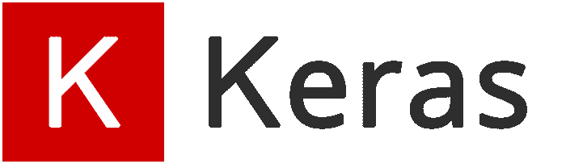

# Keras 回调函数三分钟解释

> 原文：[`www.kdnuggets.com/2019/08/keras-callbacks-explained-three-minutes.html`](https://www.kdnuggets.com/2019/08/keras-callbacks-explained-three-minutes.html)

 评论

**作者 [Andre Duong](https://www.linkedin.com/in/andreduong/)，德克萨斯大学达拉斯分校**



[图片来源](https://keras.io/)

* * *

## 我们的前三大课程推荐

 1\. [谷歌网络安全证书](https://www.kdnuggets.com/google-cybersecurity) - 快速进入网络安全职业生涯。

 2\. [谷歌数据分析专业证书](https://www.kdnuggets.com/google-data-analytics) - 提升你的数据分析技能。

 3\. [谷歌 IT 支持专业证书](https://www.kdnuggets.com/google-itsupport) - 支持你的组织的 IT。

* * *

在没有回调函数的情况下构建深度学习模型，就像开着没有正常刹车的车——你对整个过程几乎没有控制，很可能会导致灾难。在这篇文章中，你将学习如何使用 Keras 回调函数（如 ModelCheckpoint 和 EarlyStopping）来监控和改进你的深度学习模型。

### 什么是回调函数？

来自 [Keras 文档](https://keras.io/callbacks/):

> 回调函数是一组在训练过程的特定阶段应用的函数。你可以使用回调函数来查看模型在训练期间的内部状态和统计信息。

当你希望在每次训练/轮次后自动执行某些任务时，你会定义并使用回调函数，这些任务有助于你控制训练过程。这包括在达到特定的准确度/损失分数时停止训练、在每次成功的轮次后将模型保存为检查点、随着时间调整学习率等等。让我们深入探讨一些回调函数！

### EarlyStopping

过拟合是机器学习从业者的噩梦。避免过拟合的一种方法是提前终止训练过程。`EarlyStopping` 函数具有各种指标/参数，你可以修改这些指标来设置训练过程应何时停止。以下是一些相关的指标：

+   **monitor**: 被监控的值，例如: val_loss

+   **min_delta**: 监控值的最小变化。例如，min_delta=1 意味着如果监控值的绝对变化小于 1，则训练过程将被停止。

+   **patience**: 在训练停止之前没有改进的轮次数量。

+   **restore_best_weights**: 将此指标设置为 True，如果你希望在训练停止后保留最佳权重。

以下代码示例将定义一个 EarlyStopping 函数，该函数跟踪 val_loss 值，如果在 3 个轮次后 val_loss 没有变化，则停止训练，并在训练停止时保留最佳权重：

```py
from keras.callbacks import EarlyStoppingearlystop = EarlyStopping(monitor = 'val_loss',
                          min_delta = 0,
                          patience = 3,
                          verbose = 1,
                          restore_best_weights = True)
```

### ModelCheckpoint

这个回调在每个 epoch 之后保存模型。以下是一些相关指标：

+   **filepath**：你想保存模型的文件路径

+   **monitor**：正在监控的值

+   **save_best_only**：如果你不想覆盖最新的最佳模型，请将其设置为 True

+   **mode**：auto, min 或 max。例如，如果监控的值是 `val_loss` 且你想要最小化它，则设置 `mode=’min’`。

示例：

```py
from keras.callbacks import ModelCheckpointcheckpoint = ModelCheckpoint(filepath,
                             monitor='val_loss',
                             mode='min',
                             save_best_only=True,
                             verbose=1)
```

### LearningRateScheduler

```py
from keras.callbacks import LearningRateSchedulerscheduler = LearningRateScheduler(schedule, verbose=0) # schedule is a function
```

这个非常简单明了：它根据你事先编写的 `schedule` 来调整学习率。此函数根据当前的 epoch（作为输入的 epoch 索引）返回所需的学习率（输出）。

### 其他回调函数

除了上述函数，还有其他回调函数你可能会遇到或想在深度学习项目中使用：

+   **History** 和 **BaseLogger**：默认情况下自动应用于你的模型的回调

+   **TensorBoard**：这是我最喜欢的 Keras 回调。这一回调为 TensorBoard 写入日志，而 TensorBoard 是 TensorFlow 的优秀可视化工具。如果你通过 pip 安装了 TensorFlow，你应该能从命令行启动 TensorBoard：`tensorboard — logdir=/full_path_to_your_logs`

+   **CSVLogger**：此回调将 epoch 结果流式传输到 csv 文件

+   **LambdaCallback**：此回调允许你构建自定义回调

### 结论

在这篇文章中，你已经学习了 Keras 中回调函数的主要概念。Keras 文档中有一个非常全面的回调页面，你绝对应该查看一下：[`keras.io/callbacks/`](http://keras.io/callbacks/)

如果你对如何改进这篇文章有任何建议，请留言。关注我 [Medium](https://medium.com/@andreduong07) 或在 [LinkedIn](https://www.linkedin.com/in/andreduong/) 上与我联系，获取更多优质内容！

**个人简介：[Andre Duong](https://www.linkedin.com/in/andreduong/)** 是 UT 达拉斯的大二计算机科学本科生。他的兴趣包括机器学习、数据科学和软件开发。

[原文](https://medium.com/towards-artificial-intelligence/keras-callbacks-explained-in-three-minutes-846a43b44a16)。已获许可转载。

**相关：**

+   高级 Keras——构建复杂的自定义损失和指标

+   卷积神经网络：使用 TensorFlow 和 Keras 的 Python 教程

+   哪个深度学习框架增长最快？

### 更多主题

+   [5 种机器学习模型在 5 分钟内讲解](https://www.kdnuggets.com/5-machine-learning-models-explained-in-5-minutes)

+   [每个数据科学家都应该知道的三种 R 语言库（即使你使用 Python）](https://www.kdnuggets.com/2021/12/three-r-libraries-every-data-scientist-know-even-python.html)

+   [使用 TensorFlow 和 Keras 构建和训练你的第一个神经网络](https://www.kdnuggets.com/2023/05/building-training-first-neural-network-tensorflow-keras.html)

+   [Keras 3.0：你需要知道的一切](https://www.kdnuggets.com/2023/07/keras-30-everything-need-know.html)

+   [3 分钟理解偏差-方差权衡](https://www.kdnuggets.com/2020/09/understanding-bias-variance-trade-off-3-minutes.html)

+   [5 分钟构建机器学习网络应用](https://www.kdnuggets.com/2022/03/build-machine-learning-web-app-5-minutes.html)
