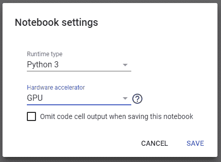
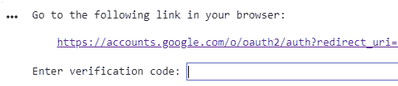

# Keras 超参数调整在 Google Colab 中使用 Hyperas

> 原文：[`www.kdnuggets.com/2018/12/keras-hyperparameter-tuning-google-colab-hyperas.html`](https://www.kdnuggets.com/2018/12/keras-hyperparameter-tuning-google-colab-hyperas.html)

 评论

**由 [Nils Schlüter](https://www.nilsschlueter.de/) 提供，软件工程师**


为你的神经网络调整超参数可能会很棘手（照片由 [Anthony Roberts](https://unsplash.com/@aroberts1228) 提供，来自 [Unsplash](https://unsplash.com/)）

超参数调整是创建深度学习网络时最耗费计算资源的任务之一。幸运的是，你可以使用 Google Colab 显著加快这个过程。在这篇文章中，我将向你展示如何使用 Hyperas 调整现有 Keras 模型的超参数，并在 Google Colab 笔记本中运行所有操作。

**创建一个新的笔记本并启用 GPU 运行时**



更改运行时为 GPU 的对话框

首先，你需要创建一个新的笔记本。打开你的 [Colab 控制台](https://colab.research.google.com/) 并选择 **新建 Python 3 笔记本**。在笔记本中，从菜单中选择 **运行时**，然后选择 **更改运行时类型**。选择硬件加速器：GPU 并点击保存。这将显著加快你在这个笔记本中进行的所有计算。

**安装包**

你可以使用 *pip* 安装新包。在这种情况下，我们需要 [hyperas](https://github.com/maxpumperla/hyperas) 和 [hyperopt](https://github.com/hyperopt/hyperopt)。将以下内容复制并粘贴到笔记本的第一个单元格中：

```py
!pip install hyperas
!pip install hyperopt
```

当你运行单元格时，你会看到 pip 正在下载和安装依赖项。

### **获取数据并创建模型**

在这篇文章中，我将使用 [hyperas github 页面](https://github.com/maxpumperla/hyperas) 的示例。你可以在 [这里](https://colab.research.google.com/drive/184Tas98M-pPQanCfTbOHRBRUeE9dtdM9#scrollTo=rdo3mScvBHF4) 找到完成的 Colab 笔记本。

****数据函数****

你需要一个数据函数来加载你的数据。它需要返回你的 X_train、Y_train、X_test 和 Y_test 值。下面是一个数据函数的示例：

> **注意：**你的数据函数需要按照确切的顺序返回这些值：X_train、Y_train、X_test、Y_test。如果你使用 scikit-learn 的 [train_test_split](https://scikit-learn.org/stable/modules/generated/sklearn.model_selection.train_test_split.html)，要小心，因为它返回值的顺序可能不同。

****模型函数****

模型函数是你定义模型的地方。你可以使用所有可用的 Keras 函数和层。为了添加用于调整的超参数，你可以使用 **{{uniform()}}** 和 **{{choice()}}** 关键字。

假设你想尝试不同的*batch_size*值。你可以简单地写*batch_size={{choice([32, 64, 128])}}*，在每次试用中，将会选择并尝试其中一个值。关于如何定义待调整的参数的更详细说明可以在 [Hyperas Github 页面](https://github.com/maxpumperla/hyperas) 上找到，或者你可以查看示例：

> **注意：** 你的模型函数必须返回一个包含 loss 键和 status 键的 Python 字典

### Colab 的问题

如果你现在尝试运行这个示例，试用将会失败，因为 Hyperas 无法找到你的笔记本。你需要复制你的笔记本并重新上传到你的 Google Drive 文件夹中。幸运的是，你可以从笔记本内部完成此操作，详见这个 [stackoverflow 回答](https://stackoverflow.com/questions/49920031/get-the-path-of-the-notebook-on-google-colab)。

> **注意：** 在第 16 行和第 18 行，你需要将*HyperasMediumExample*更改为你自己的笔记本名称

运行此单元格后，你将被提示在浏览器中打开一个网站并将代码复制并粘贴回笔记本中：



你运行上面单元格后的输出

跟随链接，用你的 Google 账户登录，并将代码复制并粘贴回笔记本。如果你打开左侧边栏中的**文件**选项卡，你现在应该能看到一个名为 <YourNotebook>.ipynb 的文件

**开始试用**

现在你可以开始试用。请注意，你必须将参数*notebook_name*设置为你的笔记本名称。否则试用将会失败：

运行此单元格后，扫描将开始，你可以在单元格的输出中查看结果。

### **故障排除**

如果你在操作过程中遇到任何问题，我建议你执行以下操作：

1.  在左侧边栏中，打开**文件**。会有一个名为 <YourNotebook>.ipynb 的文件。删除该文件

1.  在菜单中，选择**运行时**，然后选择**重启运行时**。

1.  重新加载页面

在你的运行时重新连接后，你可以通过从上到下运行每个单元格来重新开始

### 结论

只需进行一些调整，你就可以使用 Google Colab 来调整 Keras 网络的超参数。再次提醒，完整示例可以在 [这里](https://colab.research.google.com/drive/184Tas98M-pPQanCfTbOHRBRUeE9dtdM9#scrollTo=rdo3mScvBHF4) 找到。

**个人简介：[Nils Schlüter](https://www.nilsschlueter.de/)** (**[@schlueter_nils](https://twitter.com/schlueter_nils)**) 是一位软件工程师及机器学习爱好者。

[原文](https://towardsdatascience.com/keras-hyperparameter-tuning-in-google-colab-using-hyperas-624fa4bbf673)。已获转载许可。

**相关：**

+   自动化机器学习的当前状态

+   Auto-Keras，或如何用 4 行代码创建深度学习模型

+   自动化机器学习与自动化数据科学

* * *

## 我们的三大课程推荐

 1\. [谷歌网络安全证书](https://www.kdnuggets.com/google-cybersecurity) - 快速进入网络安全职业生涯

 2\. [谷歌数据分析专业证书](https://www.kdnuggets.com/google-data-analytics) - 提升你的数据分析技能

 3\. [谷歌 IT 支持专业证书](https://www.kdnuggets.com/google-itsupport) - 支持你所在组织的 IT

* * *

### 更多相关话题

+   [在 Google Colab 上免费微调 LLAMAv2 与 QLora](https://www.kdnuggets.com/fine-tuning-llamav2-with-qlora-on-google-colab-for-free)

+   [使用网格搜索和随机搜索进行超参数调整](https://www.kdnuggets.com/2022/10/hyperparameter-tuning-grid-search-random-search-python.html)

+   [超参数调整：GridSearchCV 和 RandomizedSearchCV 的解释](https://www.kdnuggets.com/hyperparameter-tuning-gridsearchcv-and-randomizedsearchcv-explained)

+   [从 Google Colab 到 Ploomber 管道：利用 GPU 进行大规模机器学习](https://www.kdnuggets.com/2022/03/google-colab-ploomber-pipeline-ml-scale-gpus.html)

+   [在 Google Colab 上免费运行 Mixtral 8x7b](https://www.kdnuggets.com/running-mixtral-8x7b-on-google-colab-for-free)

+   [在 Google Colab 上运行 Redis](https://www.kdnuggets.com/2022/01/running-redis-google-colab.html)
