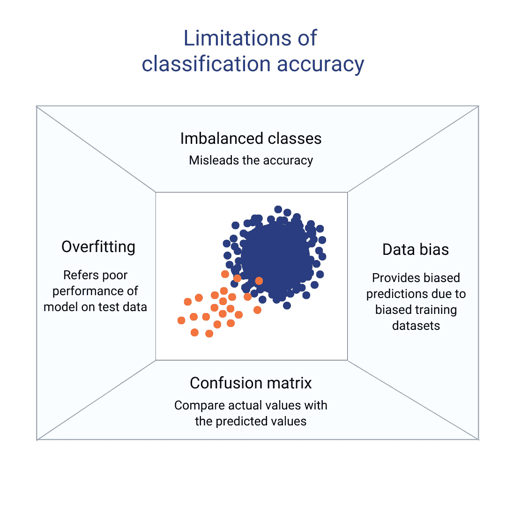
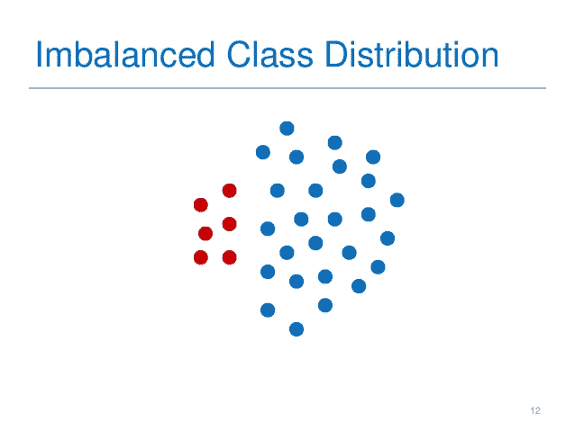
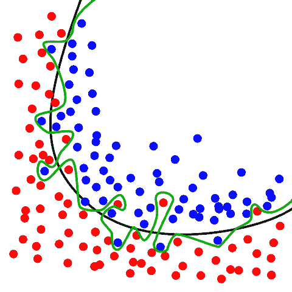
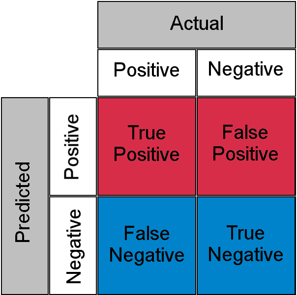

# 与分类准确性相关的关键问题

> 原文：[`www.kdnuggets.com/2023/03/key-issues-associated-classification-accuracy.html`](https://www.kdnuggets.com/2023/03/key-issues-associated-classification-accuracy.html)

作者提供的图片

# 不平衡类别

* * *

## 我们的前三个课程推荐

 1\. [谷歌网络安全证书](https://www.kdnuggets.com/google-cybersecurity) - 快速进入网络安全职业轨道。

 2\. [谷歌数据分析专业证书](https://www.kdnuggets.com/google-data-analytics) - 提升你的数据分析技能

 3\. [谷歌 IT 支持专业证书](https://www.kdnuggets.com/google-itsupport) - 支持你的组织进行 IT 管理

* * *

如果数据集包含不均衡的分类，准确性可能会具有误导性。例如，如果主导类别占据了 99%的数据，一个仅预测主要类别的模型将会有 99%的准确率。不幸的是，它将无法恰当地分类少数类别。应使用包括精确率、召回率和 F1 分数在内的其他指标来解决这个问题。

处理分类准确性中不平衡类别问题的 5 种最常见技术是：[解决不平衡类别问题](https://discuss.datasciencedojo.com/t/handling-imbalanced-data-in-multi-class-classification-problem/409)。

不平衡类别 | 知识工程

1.  上采样少数类别：在这种技术中，我们复制少数类别中的示例以平衡类别分布。

1.  下采样主要类别：在这种技术中，我们从主要类别中移除示例以平衡类别分布。

1.  合成数据生成：一种用于生成少数类别新样本的技术。当随机噪声被引入现有示例中，或通过插值或外推生成新示例时，就会发生合成数据生成。

1.  异常检测：在这种技术中，少数类别被视为异常，而主要类别被视为正常数据。

1.  改变决策阈值：这种技术调整分类器的决策阈值，以提高对少数类别的敏感度。

# 过拟合

当模型在训练数据上过度训练并在测试数据上表现不佳时，称为过拟合。因此，训练集上的准确性可能很高，但测试集上的表现可能很差。应采用如[交叉验证和正则化](https://stats.stackexchange.com/questions/472202/when-to-use-regularization-vs-cross-validation#:~:text=Cross%20validation%20is%20about%20choosing,to%2C%20result%20in%20similar%20solutions.)等技术来解决这一问题。

过拟合 | Freepik

有几种技术可以用来解决过拟合问题。

1.  使用更多数据训练模型：这使算法能够更好地检测信号并减少错误。

1.  正则化：这涉及在训练过程中向成本函数中添加惩罚项，有助于限制模型的复杂性并减少过拟合。

1.  交叉验证：这种技术通过将数据分为训练集和验证集，进而在每个集上训练和评估模型，从而帮助评估模型的表现。

1.  集成方法。这是一种训练多个模型并将其预测结果结合的技术，有助于减少模型的方差和偏差。

# 数据偏差

如果训练数据集存在偏差，模型将产生偏颇的预测结果。这可能导致训练数据上的高准确性，但在未见数据上的表现可能较差。应采用数据增强和重新采样等技术来解决此问题。其他解决此问题的方法如下：

数据偏差 | Explorium

1.  一种技术是确保使用的数据代表了其旨在建模的总体。这可以通过从总体中随机抽取数据，或使用过采样或欠采样等技术来平衡数据。

1.  通过测量不同人口统计类别和敏感群体的准确性水平，仔细测试和评估模型。这可以帮助识别数据和模型中的任何偏差，并加以解决。

1.  注意观察者偏差，这种偏差发生在你无论是有意识还是无意地将个人观点或愿望强加于数据时。可以通过意识到潜在偏差的可能性，并采取措施减少偏差来避免。

1.  使用预处理技术来移除或纠正数据偏差。例如，使用数据清理、数据规范化和数据缩放等技术。

# 混淆矩阵

作者提供的图片

分类算法的性能使用混淆矩阵进行描述。这是一个表格布局，其中实际值与预期值对比，以定义分类算法的性能。解决此问题的一些方法包括：

1.  分析矩阵中的值，并识别错误中的模式或趋势。例如，如果存在许多假阴性，可能表明模型对某些类别的敏感性不足。

1.  使用精准度、召回率和 F1 分数等指标来评估模型性能。这些指标提供了对模型表现的更详细理解，并有助于识别模型表现薄弱的具体领域。

1.  调整模型的阈值，如果阈值过高或过低，会导致模型产生更多的假阳性或假阴性。

1.  使用集成方法，如自助法（bagging）和提升法（boosting），这有助于通过结合多个模型的预测来改善模型性能。

**了解更多关于混淆矩阵的内容，请观看这个** [**视频**](https://youtu.be/wpp3VfzgNcI)

# 分类准确性的贡献

总结来说，分类准确率是评估机器学习模型性能的一个有用指标，但它可能具有误导性。为了获得对模型性能的更全面的视角，还应使用其他指标，包括精准度、召回率、F1 分数和混淆矩阵。为了解决类不平衡、过拟合和数据偏倚等问题，应采用交叉验证、规范化、数据增强和重采样等技术。

**[Ayesha Saleem](https://www.linkedin.com/in/ayesha-saleem-6347ba120/)** 热衷于通过有意义的内容创作、文案写作、电子邮件营销、SEO 写作、社交媒体营销和创意写作来重塑品牌。

### 更多相关话题

+   [分类指标指南：逻辑回归与…](https://www.kdnuggets.com/2022/10/classification-metrics-walkthrough-logistic-regression-accuracy-precision-recall-roc.html)

+   [理解分类指标：评估模型准确性的指南](https://www.kdnuggets.com/understanding-classification-metrics-your-guide-to-assessing-model-accuracy)

+   [10 种最常见的数据质量问题及其解决方法](https://www.kdnuggets.com/2022/11/10-common-data-quality-issues-fix.html)

+   [用伟大的期望克服数据质量问题](https://www.kdnuggets.com/2023/01/overcome-data-quality-issues-great-expectations.html)

+   [我应该使用哪种指标？准确率与 AUC](https://www.kdnuggets.com/2022/10/metric-accuracy-auc.html)

+   [无限可能：了解 JetBlue 如何使用蒙特卡罗和 Snowflake…](https://www.kdnuggets.com/2022/12/monte-carlo-jetblue-snowflake-build-trust-improve-model-accuracy.html)
