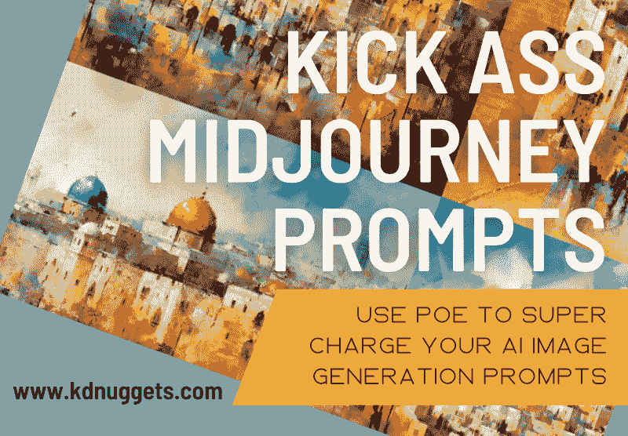
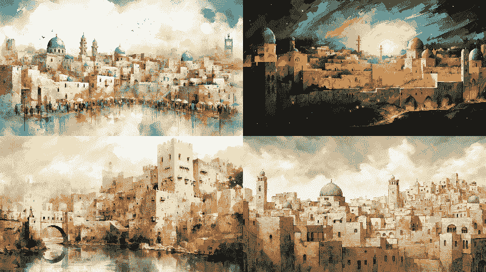
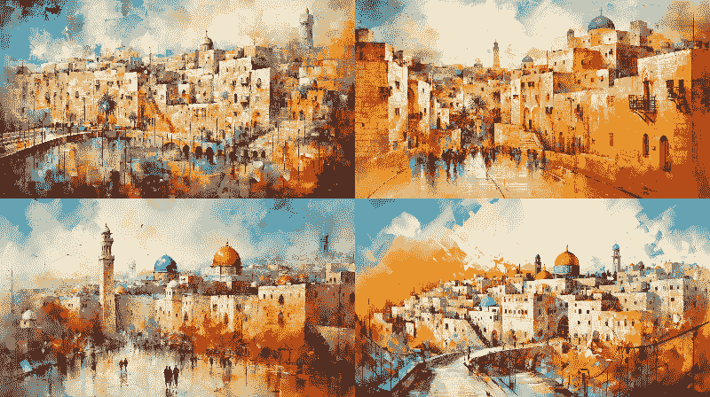
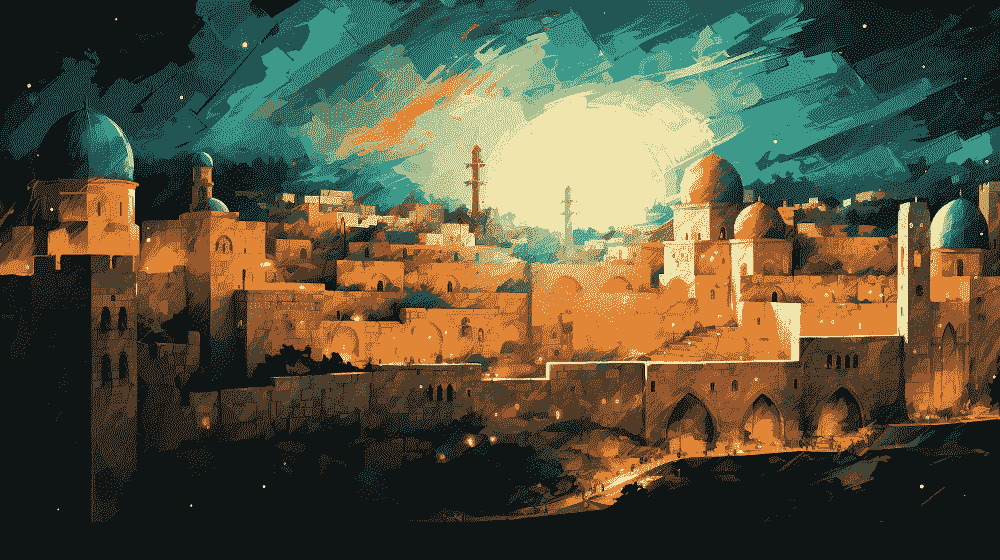
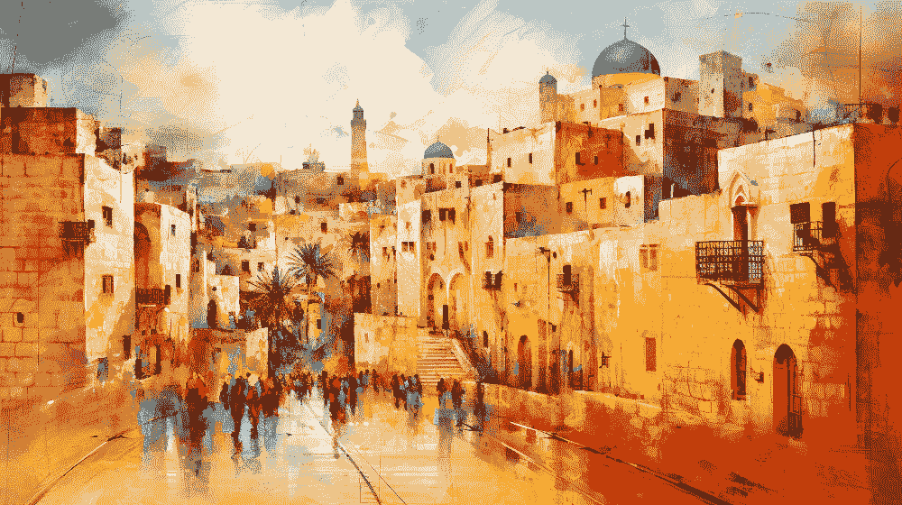
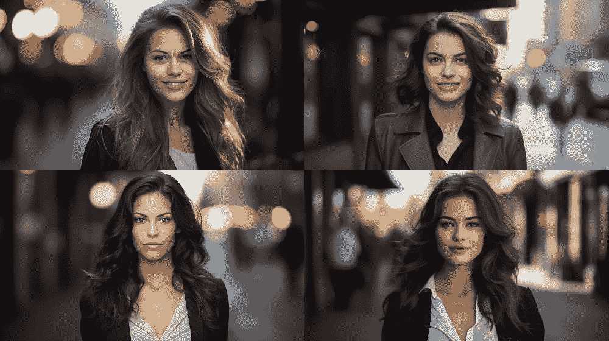
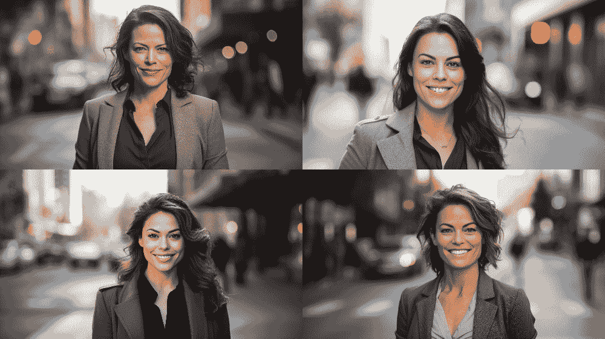
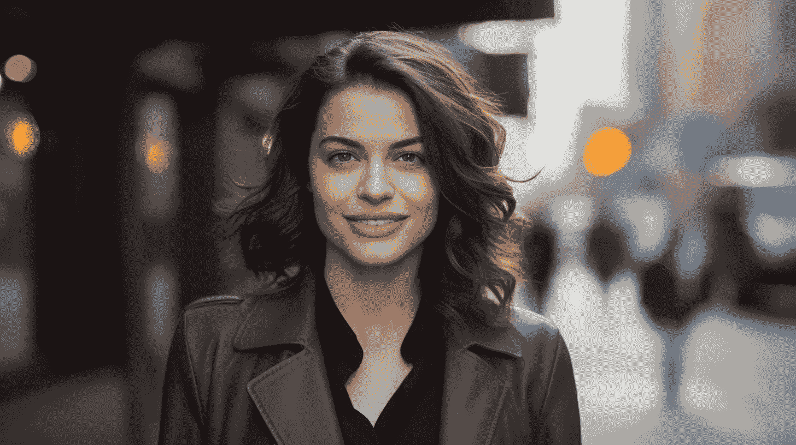
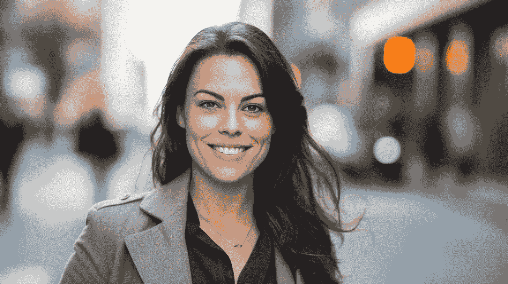

# 使用 Poe 提升 Midjourney 提示的技巧

> 原文：[`www.kdnuggets.com/kick-ass-midjourney-prompts-with-poe`](https://www.kdnuggets.com/kick-ass-midjourney-prompts-with-poe)

[Poe](https://poe.com/) 是一个通过统一界面提供访问众多聊天机器人和大型语言模型的平台 — 同时或单独使用 — 除了一些常见的 LLM，如 ChatGPT、Llama 等，Poe 还访问了许多定制的聊天机器人，例如那些将你的输入转换成表情符号；对你提出的问题不感兴趣（真的）；认为你做的任何事都是犯罪；等等。该网站有免费和订阅层级。Poe 是由 Quora 创建的。

* * *

## 我们的前三个课程推荐

 1\. [谷歌网络安全证书](https://www.kdnuggets.com/google-cybersecurity) - 快速进入网络安全职业生涯。

 2\. [谷歌数据分析专业证书](https://www.kdnuggets.com/google-data-analytics) - 提升你的数据分析技能

 3\. [谷歌 IT 支持专业证书](https://www.kdnuggets.com/google-itsupport) - 支持你的组织的 IT

* * *

[Midjourney](https://www.midjourney.com/) 是一个付费的 AI 图像生成服务。可以说是目前生成图像质量最高的最强大模型，优化 Midjourney 提示并获得最佳结果本身就是一门艺术，通常需要许多迭代和大量时间。这就是 Poe 的用武之地。

Poe 上比较受欢迎的机器人之一是 Midjourney 机器人。不，机器人并不提供对 Midjourney 模型的访问；而是将你的粗略提示作为输入，重新编写以增加从一开始就生成可接受图像的机会。

在本文中，我们将尝试这个过程的几次迭代并比较结果，从而让我们了解这个 Poe 机器人如何让我们从一开始就改善图像。

对于这些比较，作者仅执行了下方显示的比较，为每个提示执行了确切的一次图像生成运行，并没有以任何方式挑选结果。所有主观判断都由作者单独做出。请注意 Poe 可能在其新提示中附加的任何额外 Midjourney 参数，以便最好地比较类似的果实。我已经在所有提示中添加了`--ar 16:9`，因为 16:9 是唯一可接受的图像比例，故事到此为止。

# 旧城耶路撒冷

让我们从地球上最具标志性和易于识别的地方之一开始：旧城耶路撒冷。我并不追求任何特定的地标，只是想要一张代表和类似旧城独特风貌的图像。

我的基本提示和结果：

> 旧城耶路撒冷的抽象艺术渲染 --ar 16:9

作者使用 Midjourney 生成的图像

Poe 辅助的提示和结果：

> 这是一张耶路撒冷旧城的抽象艺术渲染的彩色照片。主题是对古老城市的生动和动态的解读，捕捉了其丰富的历史和精神意义。照片展示了一系列大胆的笔触和鲜艳的色彩，唤起了一种能量和动感的感觉。环境中弥漫着神秘的气息，狭窄的街道、古老的城墙和繁忙的市场都融入了一种和谐的混沌之中。相机设置是实验性的和前卫的，突破了传统摄影的界限。使用了 Hasselblad X1D II 50C，相配以 Lensbaby Velvet 56 镜头，实现了创意模糊和柔焦效果。采用了双重曝光技术和有意的相机运动，为图像增添了一种空灵和梦幻的质量。这个场景的不太可能的合作伙伴可能是**亚历杭德罗·冈萨雷斯·伊纳里图**，以其沉浸式叙事而闻名的远见导演；**埃曼纽尔·鲁贝斯基**，以其诗意的视觉效果而著称的著名摄影师；**大卫·拉查佩尔**，以其超现实和充满活力的构图而著名的挑衅性摄影师；以及**艾瑞斯·范·赫佩**，以其未来主义和雕塑性设计而受到赞誉的创新时装设计师 --ar 16:9

作者使用 Midjourney 和 Poe 生成的图像

首先，看看 Poe 生成的提示有多详细。查看一些细节，包括有争议的“风格”措辞。

现在，你可以把我蒙上眼睛，我或多或少能够在耶路撒冷旧城中导航，我可以告诉你，生成的图像中没有任何实际的位置。但我们不能用这个标准来判断生成的图像；相反，我们必须使用主观的艺术价值标准。

*注意：虽然你可以对讨论 AI 生成图像时使用“艺术价值”（或“艺术”任何东西）这个词有所争论，但我认为这是在这种情况下表达我想要传达的内容的最佳词汇。生气吗？想象一下我写了“模仿的艺术价值”。仍然生气吗？好吧，AI 生成的图像已经存在，它们不会消失，虽然合理的人们可以对我们如何称呼 AI 图像生成的过程和结果持有不同意见，但这不是我现在想讨论的内容。我只是展示了那些倾向于尝试改进其 AI 图像生成提示的人可以如何尝试。*

我发现原始图像有点平淡，除了初次浏览外没有真正引起我注意的有趣图像。第二轮，在 Poe 的帮助下，更加丰富多彩，至少在我看来，值得进一步检视。美在于观察者的眼中，因此这里的观点会有所不同，但我在两种情况下都选择了右上角的图像作为“最佳”代表。我对两者都进行了放大处理，并在下方分享。

使用基本提示生成的 Midjourney 图像的“最佳”图像

使用 Poe 提示生成的 Midjourney 图像的“最佳”图像

再次说明，这完全是主观的，但最终我对使用 Poe 的提示所获得的“最佳”结果印象更深刻。总的来说，我发现 Poe 的提示生成的图像总体上比原始提示的图像要好，我同样认为 Poe 的最佳效果优于我原始提示的最佳效果。

# 专业头像

我们尝试一些不同的东西，生成一些包含人的图像。我们来制作一些专业头像。

我的简洁提示：

> 街头的职业女性头像

作者使用 Midjourney 生成的图像

比较一下这些与 Poe 扩展提示的效果：

> 一张色彩照片，展现街头女性的职业头像。被摄者是一位自信且稳重的女性，在城市背景中散发着职业和优雅。她的头像捕捉了她灿烂的笑容和温暖的个性，展示了她的亲和力和职业素养。环境是一条繁忙的城市街道，背景中的行人和交通模糊，突出了女性作为焦点。相机设置经过精心选择，以突出她的特征并捕捉她的本质。使用了 Nikon D850，相机配备了如 Nikon AF-S NIKKOR 85mm f/1.4G 的肖像镜头，以实现浅景深并创造出令人愉悦的虚化效果。照片采用平衡的构图，通过周围建筑的引导线增加视觉兴趣。与这一场景不太可能合作的有：以细腻叙事著称的著名导演索非亚·科波拉、以氛围光效著称的著名摄影师达留斯·康第、以引人入胜的肖像摄影著称的标志性摄影师安妮·莱博维茨，以及以永恒和可持续设计闻名的影响力时尚设计师斯特拉·麦卡特尼。

作者使用 Midjourney 和 Poe 生成的图像

再次比较提示措辞的细节。现在，撇开所有生成的女性都是白人的事实，这是一个值得关注的讨论，以下是我认为的 2 张“最佳”图像，每个提示各一张。

*注意：为了透明起见，由于好奇心，我在之后运行了 4 次 Poe 提示，在生成的 16 个额外的不存在的女性中，有 5 个看起来不是白人。随意处理这些信息，但我认为尝试并报告结果是值得的。*

"最佳"图像，由 Midjourney 使用基本提示生成

"最佳"图像，由 Midjourney 使用 Poe 的提示生成

再次，我发现 Poe 辅助的提示更具现实感。它们似乎有更“自然”的感觉，确定它们是 AI 生成的比基本提示图像需要更长时间。光线和户外方面似乎看起来更自然，尽管差距不大，但我会说稍微好一点。

# 结论

也许这篇文章应该叫做 "*强大的 Midjourney 提示与 Poe**???***" 我认为是否这个 Poe 机器人能帮助你更好地制定图像生成提示还不确定——如果可以，那效果如何？——虽然这肯定无法通过仅仅一对例子解决。我倾向于喜欢 Poe 辅助的最佳提示，而不是基本提示，但这仍然是主观的，且基于非常少的数据点。也许应该得出的结论是，提示工程是一个复杂且难以捉摸的领域，艺术（无论是 *真实的* 还是 AI 生成的）过于主观，难以确定某些东西是否优于其他东西。

试试 Poe 进行自己的图像生成项目，看看效果如何。

[**马修·梅约**](https://www.linkedin.com/in/mattmayo13/) ([**@mattmayo13**](https://twitter.com/mattmayo13)) 拥有计算机科学硕士学位和数据挖掘研究生文凭。作为 KDnuggets 的总编辑，Matthew 旨在让复杂的数据科学概念变得易于理解。他的专业兴趣包括自然语言处理、机器学习算法以及探索新兴的 AI。他的使命是让数据科学社区的知识民主化。Matthew 从 6 岁开始编程。

### 更多相关话题

+   [一些强大的提示工程技术来提升我们的 LLM 模型](https://www.kdnuggets.com/some-kick-ass-prompt-engineering-techniques-to-boost-our-llm-models)

+   [揭示 Midjourney 5.2：AI 图像生成的飞跃](https://www.kdnuggets.com/2023/06/unveiling-midjourney-52-leap-forward.html)

+   [6 个提升工作效率的 ChatGPT 提示](https://www.kdnuggets.com/6-chatgpt-prompts-to-enhance-your-productivity-at-work)
