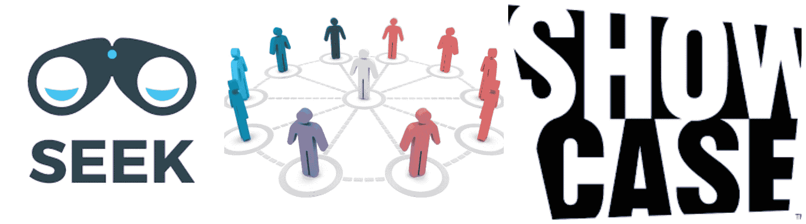
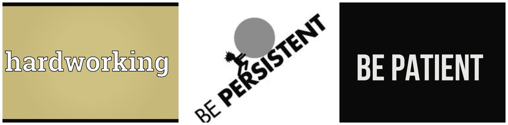

# 启动你的数据职业生涯！前线的建议

> 原文：[`www.kdnuggets.com/2018/12/kick-start-your-data-career.html`](https://www.kdnuggets.com/2018/12/kick-start-your-data-career.html)

 评论

**由 [Vaishali Lambe](https://www.linkedin.com/in/vaishali-lambe/)，数据科学家**

市场上有许多需求的职位——数据分析师 / 数据分析 / 数据可视化 / 机器学习 / 深度学习 / 数据科学家 / 数据分析中的软件工程 / 数据科学 / 机器学习、大数据工程师等。职位名称可能会根据你的技能专长和工作经验不断变化。

* * *

## 我们的前三大课程推荐

 1\. [谷歌网络安全证书](https://www.kdnuggets.com/google-cybersecurity) - 快速进入网络安全职业轨道。

 2\. [谷歌数据分析专业证书](https://www.kdnuggets.com/google-data-analytics) - 提升你的数据分析技能

 3\. [谷歌 IT 支持专业证书](https://www.kdnuggets.com/google-itsupport) - 支持你的组织 IT

* * *

由于许多人准备将职业投入其中，我将通过这个博客系列提供非常有趣和实用的小贴士，这将帮助学生们启动他们的数据职业生涯。

### 开始你的数据职业生涯小贴士 #1

**成为一名探索者 [在学术领域] - 探索和学习时不要限制自己的领域。停止担心 GPA [分数]**

****

我会说，如果你正在攻读硕士或博士学位，你很勇敢。你展现了学习和成长的勇气。那么，这一步之后会发生什么问题呢？一旦你开始学习，你会有很多作业，很多自学和探索的内容，进行研究等。学生们开始担心按时完成作业以获得最高分，完成作业的百分之百以获得最高分，作业的准确性以获得最高分。这反过来会影响他们的 GPA。因此，他们开始忽视学习的事实，奔波于得分和获得好 GPA。我想告诉你，如果你担心获得最高分，为此请求别人的作业来完成你的作业，这只会给你带来分数上的回报。你会在找工作时意识到其后果。如果你的 GPA 维持在 3.0 或更高[具体标准取决于你的大学]，你就可以了。GPA 并不重要，重要的是你获得了多少知识。GPA 只是一个数字，如果你符合市场上任何工作申请的最低要求，你就做得很好。如果你遵循学习和获得知识，你一定会获得好的成绩。

所以，不要在学术期间限制自己探索事物。把自己当作一张空白的画布，在学术中尽可能多地探索这个领域。这是你作为新手探索的时间。不要犹豫去旁听必修学分之外的课程。大学的最佳部分在于，你可以免费旁听课程。有时候你可能需要接触特定的教授以旁听他的课程。旁听也能让你获得知识。如果你不能旁听某门课程，我相信你应该认识正在上那门课的其他人。于是，接触并询问那位朋友课程的情况，他们在学习什么。这样你将了解周围的情况，市场上需要哪些技能，以及其他领域的动态。一旦你开始探索，你会了解到更多，并开始发现自己的兴趣领域。

专门谈论数据——尽可能选修/审核你们大学提供的与数据分析、数据挖掘、机器学习、深度学习、数据科学、认知、数据可视化、编程[`R`、`python`、`Scala`等]、大数据、商业智能、概率、统计等相关的课程。不要只是为了完成学分、毕业和获得学位而上课。你已经足够成熟，能够找到适合你的方法。尽量找时间，尽量自己完成作业，不要担心分数。如果你真的要担心一些事情，那就担心是否真正理解了概念，担心是否有效利用了大学时间，担心是否及时帮助了自己。所以，请，“做一个探索者！！”

### 启动你的数据职业生涯技巧#2

**利用周围的设施 – 明智地利用大学提供的设施**

**

注册大学课程后，你可以获得许多免费的设施：

+   免费 Wi-Fi [24X7]

+   开放图书馆 [24 X7]，可以访问大量书籍和资料

+   免费的个人/小组学习室

+   免费使用大量软件和安装工具

+   参加大学内发生的各种技术活动[雇主会来展示他们的案例研究以及他们在寻找什么]

+   参观一些雇主以了解他们的工作文化

+   访问打印机、扫描仪、礼堂、白板

还有很多……

充分利用你所获得的每一项设施。你可以免费学习和探索很多工具。小组学习室在你做项目、准备演讲时帮助你并指导团队合作。参观雇主的工作场所会激励你更加努力，因为那可能是你梦想中的工作。并不是因为这些设施你就能找到工作，而是理解大学提供的每项设施的重要性。利用这些设施的方式完全取决于你。

既然我们要成为探索者，同时利用大学提供的设施也很重要。大学的课程并不限制你学习特定的学科，很多设施都是为了让你探索和学习更多。

你们中的一些人可能不喜欢一直学习和上课[一直单调的生活对每个人来说都很困难]，所以大学也提供了一些额外的娱乐设施，比如——

+   电影之夜

+   文化活动和庆祝活动

+   免费的酒吧或迪斯科

+   音乐活动

+   周末旅游/旅行

+   社会公益活动，如[END 7 计划等]

+   游戏之夜/运动

+   各种俱乐部，如徒步旅行、攀岩等

在学习的同时也要利用这些机会，但你已经足够成熟，懂得你愿意在这些活动上花多少时间。这些非技术活动帮助你交朋友，拥有社交生活，提供了领导或组织活动的机会。因此，你获得的每一项资源都有其自身的目的。你的工作就是弄清楚每一项资源的优先级。你是学生，你的工作是正确利用大学提供的任何资源。

具体到数据领域，尽可能多地学习和探索在大学中接触到的工具和软件。阅读关于统计学、概率论、数学、机器学习等方面的书籍。将你未来可能需要参考的书页打印出来，或做笔记以备查阅。利用小组学习室讨论和理解你的数据，进行演示。参加公司研讨会或演讲，了解他们的案例研究。如果数据俱乐部不存在，可以组建一个，并组织活动/会议。参加竞赛，在大学中很容易组成团队，因为你会发现班级中有很多对你感兴趣的同学。好好利用大学提供的资源。

### 启动数据职业生涯小贴士 #3

****寻找、建立网络和展示——**寻找群体/个人，与[大学及更远]的人联系，展示你的才华/兴趣**

进入你感兴趣的领域的另一个非常重要的方面是“寻找同样充满热情的人，建立网络并展示你的才华/兴趣”。这是一个困难但漫长且持续的过程，需要与你的教育并行进行。

我们已经讨论过在大学内部建立网络的一个方面，但我将在本博客中对此进行进一步详细说明。

由于大学举办和组织大量技术活动，重要的是要与参与活动的人建立联系。不必与每个人联系，但重要的是要发起沟通并展示你的热情。

许多雇主会访问大学校园，展示他们的案例研究和他们在行业中所做的工作。与他们见面并打招呼，询问如果你发现对你所在领域有兴趣的问题，并讨论你的想法，这点很重要。

有时大学会筛选简历，带一些学生去展示几家雇主的工作文化，此时也很重要展示勇气，自信地展示自己并建立关系。

除了大学活动，还有其他方式可以进行网络建立和联系。例如，你可以参加数据领域的技术聚会[每个地区都有很多可用的]，出席并与人互动，询问他们在做什么，展示你可以做什么贡献。有几个专门针对 Kaggle 竞赛的聚会，这是组建团队和合作的好方式。

如果有时你不想参加技术见面会，你也可以参加非技术性的见面会，比如游戏、徒步旅行、电影俱乐部、周日早午餐，这些联系可以变得非常有益，并使你对你尝试建立职业的领域有更多了解。

除了见面会，还有像开放数据科学、机器学习、机器人和人工智能等会议，以及其他大学活动——如麻省理工学院、哈佛等。如果你无法购买票，作为学生的好处是这些会议会促进学生并提供票务折扣，或者你可以加入他们作为志愿者。这样你可以再次聆听并与许多领袖建立联系，了解他们在数据领域的工作。

参加黑客马拉松 – 这也给你一个机会去学习更多有创意的工作，并允许你参与并展示你的才华。

所以，我认为有很多方法可以找到你所寻找的东西，你需要做的只是始终寻求你想要的东西。与人接触并提出问题是很重要的。始终记住，没有问题是对或错的，可能有时它们可能简单或困难。但不要犹豫去自己寻找答案或询问别人。不要为了找到任何目的而与任何人交谈，你永远不知道那个联系可能在你职业转型中进一步帮助你。所以，请“寻求、建立联系和展示”。

### 启动你的数据职业生涯提示 #4

**要勤奋、坚持和耐心 – 永远坚持并有耐心去实现你想要的东西。努力工作总是会得到回报。**

****

我们讨论了很多关于探索、学习、建立联系、展示知识或兴趣的话题。尽管这些关键词听起来很简单，但这实际上是一个非常艰难且持续的过程。大多数人都有在过程中放弃的倾向。我认为这不是他们的错，而是一种态度或人类倾向，每个人都希望一夜之间获得成功和名声。令人痛苦的是，这种情况从未发生过。我们总是看到一个人的成功，但从未看到他们获得成功或名声的时间有多长。也许有一些例外，他们在年轻时成为了亿万富翁，但即便如此，生活对于他们而言也不容易，尽管他们取得了如此多的成功，但维持、消化和进一步发展这种成功仍然是一个重要因素。

如我们所知，数据领域目前正处于繁荣期，市场上有很多类似的工作机会，薪水也很丰厚。毫无疑问，每个人都希望在这个领域建立自己的职业。因此，这个领域竞争激烈。考虑到我们现在的职位申请流程——它并不高效，几乎是过时的，导致人们很难获得面试机会。许多简历被自动筛选系统过滤掉。因此，学生可能会发现获得面试机会有挑战，但保持耐心和坚持是重要的。如果你真的想进入某个特定职位，不要失去兴趣和耐心。继续通过在线招聘网站申请工作。与你网络上的人总是要递交你的简历。坚持下去，不放弃，你一定会得到你想要的。

职业变换或技术变换虽然听起来很简单，但在学习方面很容易，但在获得第一个工作机会时总是很难。

我记得，当我开始寻找数据科学相关工作时，我的第一个担忧是，为什么他们需要博士候选人？学位怎么会成为任何职位的筛选条件？经验为什么没有优先于学位？毫无疑问，你现在或以后也会面临类似的情况。但我有一个非常好的品质，那就是“我从不放弃”。我坚持不懈地申请工作——所有的平台——LinkedIn、Glassdoor 或 Monster [无论你觉得哪个，或者全部]。最后终于得到了一个机会。

如果你正在攻读硕士或博士学位，必须努力工作并进入相同的兴趣领域。作为移民或在该领域新人的挑战可能更多，但这些三个品质确实有助于克服这些挑战。所以，继续申请。在付出努力之前妥协是不好的。要有耐心和坚持。我相信，总有一天你会像我一样顺利实现你的目标。

祝你求职顺利！

### 数据职业启动小贴士 #5

**脱颖而出——找出你的优势，并利用这些优势在你感兴趣的任何领域中脱颖而出。**

****

你可能听到过你遇到的人/网络/接触的很多关于如何在你希望建立职业的领域中脱颖而出的建议。

一般性的问题——我需要做些什么才能在数据领域的申请者中脱颖而出？一个人应该具备什么？答案并不简单，但显然，自我分析优点并具备创造力和聪明才智确实有助于脱颖而出。

一个人需要找出自己擅长什么。这可能是你的写作、沟通或领导技能。或者你可能更具创新性或创造力。答案是，每种品质都会为你在感兴趣的领域中脱颖而出提供机会。

如果你想展示自己确实拥有所有必需的技能集，但还有其他额外的东西使你的简历相比其他申请者更强，可以是你的博客、主办和组织交流会/活动、公众演讲、或是做自己的项目。所有这些品质都能帮助你在普通求职者中脱颖而出。

所以，记住每个品质都有其荣耀和好处，你需要理解如何利用这些来在特定领域建立你的职业生涯。

具体谈谈数据，你可能会发现很多人做并使用 Kaggle 项目，但你可以相信并展示自己有趣的项目，而不仅仅是学术项目，以展示你的技能和创造力。你可能会发现很多人参加技术交流会，但在这些交流会上增加价值、展示知识、分享知识，以及主办和组织这些活动，可能会使你从其他人中脱颖而出。你可能会看到很多人跟随各种领导者来获取知识，但只有少数人相信分享知识和提升技能。你需要做的就是找出你希望如何脱颖而出。

我见过很多人根据数据职位的需求来修改他们的简历，这真的有必要吗？答案是，对于自动解析系统来说，有时确实是需要的，但相信我，如果你在某个特定领域或方向上表现出色，这些障碍影响不大。制作简历的创意是另一个独立的话题，这篇博客不会详细探讨，但更重要的因素是“找出你的优势并利用这些优势在就业市场上脱颖而出”。希望你在跟进???。记住，“不是每个人天生聪明，但人们肯定会学会变聪明”。

**简历：[Vaishali Lambe](https://www.linkedin.com/in/vaishali-lambe/)** 获得了计算机系统硕士学位，专注于数据科学，目前在一家医疗保健公司担任数据科学家。拥有 8 年的 IT 工作经验，曾在印度、新西兰和美国国际工作。

[原文](https://www.vaishalilambe.com/blog)。转载已获许可。

**相关内容：**

+   2019 年每个准数据科学家应设定的 6 个目标

+   5 条大数据和数据科学的职业路径解释

+   5 个关键数据科学职位市场趋势

### 更多关于此话题

+   [厉害的 Midjourney 提示与 Poe](https://www.kdnuggets.com/kick-ass-midjourney-prompts-with-poe)

+   [一些厉害的提示工程技巧以提升我们的 LLM 模型](https://www.kdnuggets.com/some-kick-ass-prompt-engineering-techniques-to-boost-our-llm-models)

+   [数据科学入门：你需要知道的 10 项基本技能](https://www.kdnuggets.com/2020/10/data-science-minimum-10-essential-skills.html)

+   [如果我必须重新开始学习数据科学，我会如何做？](https://www.kdnuggets.com/2020/08/start-learning-data-science-again.html)

+   [如何开始使用 PyTorch 进行自然语言处理](https://www.kdnuggets.com/2022/04/start-natural-language-processing-pytorch.html)

+   [在 Kaggle 上竞争的 4 个技巧以及你为什么应该开始](https://www.kdnuggets.com/2022/05/packt-top-4-tricks-competing-kaggle-start.html)
