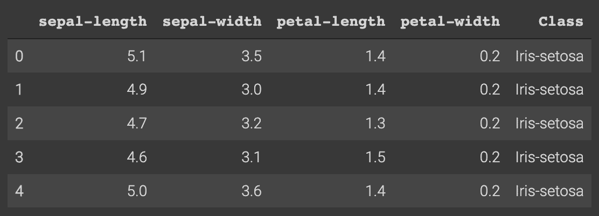
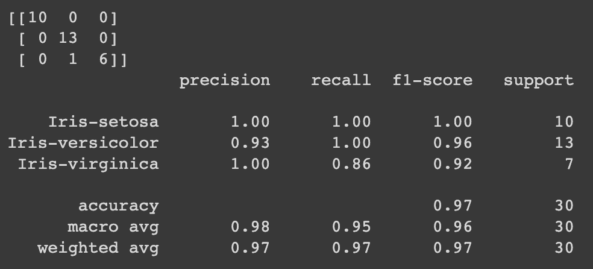

# Scikit-learn 中的 K-最近邻

> 原文：[`www.kdnuggets.com/2022/07/knearest-neighbors-scikitlearn.html`](https://www.kdnuggets.com/2022/07/knearest-neighbors-scikitlearn.html)


[Nina Strehl](https://unsplash.com/@ninastrehl) via Unsplash

K-最近邻（KNN）是一种监督学习的机器学习算法，可用于回归和分类任务。

* * *

## 我们的前三个课程推荐

 1\. [谷歌网络安全证书](https://www.kdnuggets.com/google-cybersecurity) - 快速入门网络安全职业。

 2\. [谷歌数据分析专业证书](https://www.kdnuggets.com/google-data-analytics) - 提升你的数据分析技能

 3\. [谷歌 IT 支持专业证书](https://www.kdnuggets.com/google-itsupport) - 支持你的组织 IT 工作

* * *

一种监督式机器学习算法依赖于有标签的输入数据，算法在这些数据上进行学习，并利用学到的知识在输入未标记数据时生成准确的输出。

KNN 的使用是根据训练数据的特征（有标签的数据）对测试数据集进行预测。进行这些预测的方法是通过计算测试数据和训练数据之间的距离，假设数据点的相似特征或属性存在于接近的范围内。

它允许我们在考虑新数据点的特征的基础上，识别并分配新数据的类别，这些特征是基于训练数据中的学习数据点。这些新数据点的特征将被 KNN 算法学习，并根据其与其他数据点的接近程度进行分类。

# 为什么 KNN 是一个好的算法？

KNN 特别适用于分类任务。分类是许多数据科学家和机器学习工程师遇到的典型任务，它解决了许多现实世界的问题。

因此，像 KNN 这样的算法是用于模式分类和回归模型的好且准确的选择。KNN 被认为不会对数据做任何假设，因此比其他分类算法具有更高的准确性。该算法也容易实现且易于解释。

# KNN 中的“k”

KNN 中的“K”是一个参数，指的是最近邻的数量，其中 K 值本质上创建了一个环境，使数据点根据接近程度理解其相似性。使用 K 值，我们计算测试数据点与已训练标签点之间的距离，以更好地对新数据点进行分类。

K 值是一个正整数，通常值较小，推荐为奇数。当 K 值较小时，误差率下降，偏差较低但方差较高，这会导致模型过拟合。

# 如何计算数据点之间的距离？

KNN 是一种基于距离的算法，最常用的方法包括：

+   连续数据的欧氏距离和曼哈顿距离

+   类别数据的汉明距离

欧氏距离是欧几里得空间中两点之间的数学距离，使用两点之间的线段长度。这是最常见的距离度量，许多人会从学校的毕达哥拉斯定理中记住它。

曼哈顿距离是两点之间的数学距离，即其笛卡尔坐标的绝对差的总和。简单来说，距离的移动方向只能是上下和左右。

汉明距离比较两个二进制数据字符串，然后比较这两个字符串输入以找到每个位置字符的不同数量。

# 简单的 KNN 算法步骤

这些是 KNN 算法的一般步骤

1.  加载你的数据集

1.  选择一个 k 值。你应该选择一个奇数，以避免出现平局。

1.  计算新数据点与邻近的已训练数据点之间的距离。

1.  将新数据点分配给其 K 个最近邻

# 使用 sklearn 进行 kNN

`neighbours`是来自 sklearn 模块的一个包，用于最近邻分类任务。这可用于无监督学习和有监督学习。

首先，你需要导入这些库：

```py
import numpy as np
import matplotlib.pyplot as plt
import pandas as pd
```

这是 sklearn 的 neighbors 包：

```py
sklearn.neighbors.KNeighborsClassifier
```

这些是可以使用的参数：

```py
class sklearn.neighbors.KNeighborsClassifier(n_neighbors=5, *, weights='uniform', algorithm='auto', leaf_size=30, p=2, metric='minkowski', metric_params=None, n_jobs=None)
```

示例中使用的距离度量是 minkowski，但如上所述，你可以使用不同的距离度量。

如果你想了解更多关于这些参数的信息，请点击这个[链接](https://scikit-learn.org/stable/modules/generated/sklearn.neighbors.KNeighborsClassifier.html)。

# Scikit-Learn 中的 K 近邻在鸢尾花数据集上的应用

## 加载鸢尾花数据集

导入这些库：

```py
import numpy as np
import matplotlib.pyplot as plt
import pandas as pd
```

导入鸢尾花数据集：

```py
# url for Iris dataset
url = "https://archive.ics.uci.edu/ml/machine-learning-databases/iris/iris.data"

# Assign column names to the dataset
names = ['sepal-length', 'sepal-width', 'petal-length', 'petal-width', 'Class']

# Read in the dataset
df = pd.read_csv(url, names=names)
```

执行`df.head()`后数据集应呈现如下：



## 数据集预处理

下一步是根据属性和标签拆分数据集。类别列被视为标签，称为 y，而前 4 列是属性，称为 X。

```py
X = dataset.iloc[:, :-1].values
y = dataset.iloc[:, 4].values
```

## 训练/测试划分

对数据集进行训练/测试划分将帮助我们更好地了解算法在未见数据/测试阶段的表现。这也有助于减少过拟合的发生。

```py
from sklearn.model_selection import train_test_split
X_train, X_test, y_train, y_test = train_test_split(X, y, test_size=0.20)
```

## 特征缩放

特征缩放是在执行模型以开始进行预测之前的重要步骤。它涉及将特征重新缩放到一个共同的边界，以确保不丢失关于每个数据点的信息。否则，你的模型可能会做出错误的预测。

```py
from sklearn.preprocessing import StandardScaler
scaler = StandardScaler()
scaler.fit(X_train)

X_train = scaler.transform(X_train)
X_test = scaler.transform(X_test)
```

## 进行预测

这是我们将使用 sklearn 模块中的邻居包的地方。如你所见，我们已将邻居数量（K 值）选择为 5。

```py
from sklearn.neighbors import KNeighborsClassifier
classifier = KNeighborsClassifier(n_neighbors=5)
classifier.fit(X_train, y_train)
```

现在我们想对测试数据集进行预测：

```py
y_pred = classifier.predict(X_test)
```

## 评估你的算法

用于评估你算法的最典型指标是混淆矩阵、精确度、召回率和 F1 分数。

```py
from sklearn.metrics import classification_report, confusion_matrix
print(confusion_matrix(y_test, y_pred))
print(classification_report(y_test, y_pred))
```

这是输出：



# 结论

所以我们已经了解到 KNN 是一个适用于分类任务的良好算法，并且 Scikit-learn 中的邻居包可以使一切变得更加简单。它实现起来非常简单且容易，并且具有特征/距离选择的灵活性。它能够处理多类情况，并且可以有效地生成准确的输出。

但在使用 KNN 时，你需要考虑一些问题。确定 k 值可能很困难，因为这可能会导致过拟合或避免过拟合。确定应使用哪个距离度量也可能是一个反复试验的过程。KNN 的计算成本也很高，因为我们要计算新数据点和训练数据点之间的距离。正因为如此，随着示例和变量数量的增加，KNN 算法会变慢。

尽管这是最古老且使用广泛的分类算法之一，但你仍然需要考虑其缺点。

**[Nisha Arya](https://www.linkedin.com/in/nisha-arya-ahmed/)** 是一位数据科学家和自由技术作家。她特别关注提供数据科学职业建议或教程，以及围绕数据科学的理论知识。她还希望探索人工智能如何能够改善人类寿命。她是一个热衷学习的人，寻求扩展她的技术知识和写作技能，同时帮助指导他人。

### 更多相关主题

+   [从理论到实践：构建 k-最近邻分类器](https://www.kdnuggets.com/2023/06/theory-practice-building-knearest-neighbors-classifier.html)

+   [用于分类的最近邻](https://www.kdnuggets.com/2022/04/nearest-neighbors-classification.html)
