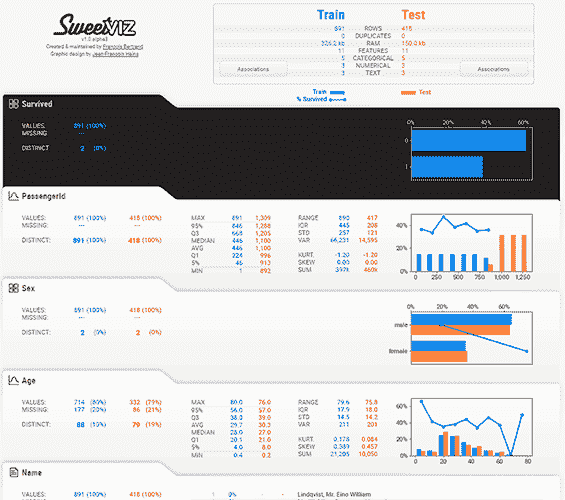
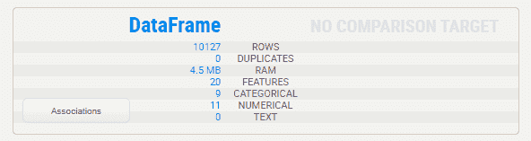
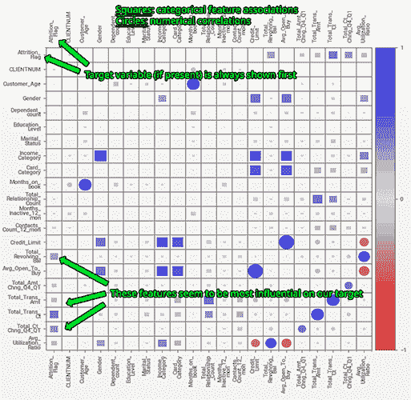
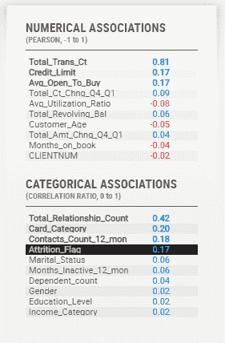
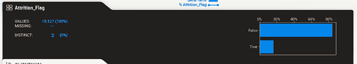
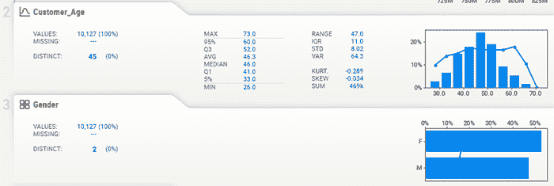
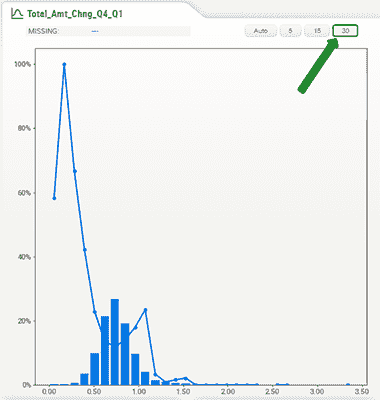
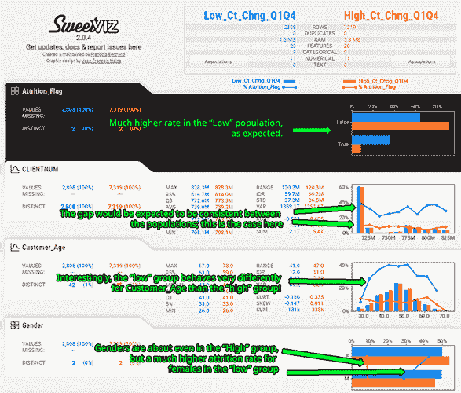

# 使用新的 Sweetviz Python 库更快地了解您的数据

> 原文：[`www.kdnuggets.com/2021/03/know-your-data-much-faster-sweetviz-python-library.html`](https://www.kdnuggets.com/2021/03/know-your-data-much-faster-sweetviz-python-library.html)

评论

**作者：[Francois Bertrand](https://medium.com/@fbertrand27)，数据可视化和游戏设计师**

> *这是关于 Sweetviz 的第二篇文章，详细介绍了比较分析、新功能、一般用例，并且使用了不同的数据集。你可以在这里找到原文。*



探索性数据分析（EDA）是大多数数据科学项目中的一个重要早期步骤，它通常包括采取相同的步骤来描述数据集（例如，了解数据类型、缺失信息、值的分布、相关性等）。鉴于这些任务的重复性和相似性，一些库可以自动化这些过程并帮助启动。

最新的一项是一个名为 Sweetviz 的开源 Python 库（[GitHub](https://github.com/fbdesignpro/sweetviz)），由一些贡献者和我自己为这个目的创建。它处理 pandas 数据框，生成一个自包含的 HTML 报告，可以在浏览器中单独查看或集成到笔记本中。

它功能强大；除了用仅两行代码创建有洞察力和美观的可视化外，它还提供了需要更多时间手动生成的分析，包括一些其他库无法如此快速提供的内容，例如：

1.  目标分析：显示目标值（例如泰坦尼克号数据集中的“幸存”）与其他特征的关系

1.  数据集比较：数据集之间（例如“训练集与测试集”）和数据集内部（例如“男性与女性”）

1.  相关性/关联性：数值和分类数据的相关性和关联性的完整整合，所有内容都在一个图表和表格中

其他参考/示例：

+   [Google Colab 笔记本，包含文档和集成示例](https://colab.research.google.com/drive/1-md6YEwcVGWVnQWTBirQSYQYgdNoeSWg?usp%3Dsharing&sa=D&ust=1611941330247000&usg=AOvVaw1dyrc3C9Dzi-M7IGPhnULe)

+   [知名样本泰坦尼克号幸存者数据集的示例报告](http://cooltiming.com/SWEETVIZ_REPORT.html)

+   [GitHub 页面（完整文档及用法）](https://github.com/fbdesignpro/sweetviz)

### 探索性数据分析（EDA）变得……有趣？！

能够如此迅速地获取大量关于目标值的信息，并比较数据集中的不同区域，使得这一初步步骤从乏味变得更快、有趣，甚至在某种程度上……有趣！（至少对这个数据迷来说如此！）当然，探索性数据分析（EDA）是一个更长的过程，但至少第一步要顺利得多。让我们看看实际数据集的效果如何。

### 创建报告

一旦数据加载完成，创建报告是一个快速的两行过程。

对于本文，我们将使用描述的信用卡客户数据集的清理版本（[这里](https://www.kaggle.com/sakshigoyal7/credit-card-customers)）。你可以 [在这里下载清理后的数据集](http://cooltiming.com/SV/BankChurners_clean.csv)。清理仅包括移除描述中提到的最后两列，并将“Attrition_Flag”变量转换为布尔值，如预期的那样。

安装 Sweetviz（使用 pip install sweetviz）后，按正常方式加载 pandas 数据框：

```py
import sweetviz
import pandas as pd
df = pd.read_csv("BankChurners_clean.csv")
```

### 步骤 1：创建报告

要创建报告，你可以调用以下任一方法：

+   使用 analyze() 对单个数据集进行分析

+   使用 compare() 比较两个数据集（例如，测试集与训练集）

+   使用 compare_intra() 比较同一数据集中的两个子群体

在我们的例子中，我们有一个数据集，所以让我们对其进行 analyze()。重要的是，我们希望获取目标变量“Attrition_Flag”的信息，所以我们来指定一下：

```py
report = sweetviz.analyze(df, "Attrition_Flag")
```

### 步骤 2：生成输出

一旦我们有了报告对象，它可以生成一个独立的 HTML 应用程序（HTML 页面）或将报告嵌入到 Notebook 中。有关更多细节，请参考使用示例/文档（[这里](https://github.com/fbdesignpro/sweetviz) & [这里](https://colab.research.google.com/drive/1-md6YEwcVGWVnQWTBirQSYQYgdNoeSWg?usp%3Dsharing)）。现在，让我们生成一个独立的 HTML 应用程序：

```py
report.show_html()
```

使用默认选项，这将创建一个名为“SWEETVIZ_REPORT.html”的文件并打开浏览器。你可以查看生成的完整报告 [这里](http://cooltiming.com/SV/SWEETVIZ_REPORT.html)。如果你在笔记本中操作，该文件将会生成，但浏览器可能不会弹出（建议在笔记本中使用 show_notebook()，参见 [文档](https://colab.research.google.com/drive/1-md6YEwcVGWVnQWTBirQSYQYgdNoeSWg?usp%3Dsharing)）。

输出选项包括：

+   布局（宽屏或垂直）

+   缩放

+   窗口大小（用于笔记本）

### Sweetviz 报告

我可以（实际上也可能！）花整篇文章来讲述 Sweetviz 报告的具体组件，因为它们每个都带来了独特的见解。现在，以下是本示例情况所有组件的简要概述。

### 概述



在报告顶部，提供数据集的简单概述（如果有比较的话也包括比较）。对于每个特征，Sweetviz 将尽力确定每列的数据类型，包括：

+   数值型

+   类别/布尔型

+   文本（默认/备用）

请注意，这些可以使用“FeatureConfig”覆盖（参见 [文档](https://github.com/fbdesignpro/sweetviz)）。

### 关联/相关性

“关联”按钮解锁了一个非常强大的关联和相关分析。这张图是来自[Drazen Zaric: Better Heatmaps and Correlation Matrix Plots in Python](https://towardsdatascience.com/better-heatmaps-and-correlation-matrix-plots-in-python-41445d0f2bec)的视觉效果和[Shaked Zychlinski: The Search for Categorical Correlation](https://towardsdatascience.com/the-search-for-categorical-correlation-a1cf7f1888c9)的概念的综合。

基本上，除了显示传统的数值相关性外，它还将数值相关性、不确定系数（对于分类-分类）和相关比（对于分类-数值）统一在一个图表中。请注意，出于清晰的考虑，平凡的对角线被留空。





相同的数据也可以在每个变量的“详细信息”窗格中找到（稍后会详细说明）：

值得注意的是，这些相关/关联方法不应被视为绝对的，因为它们对数据的底层分布和关系做出了一些假设。然而，它们可以作为一个非常有用的起点。

### 目标分析

当分析一个具有目标变量的数据集时，这一功能极具洞察力。

如果我们指定一个目标变量（目前仅支持布尔型和数值型），它会显著地显示为第一个变量，并使用黑色标记。



最重要的是，它的值会覆盖在每一个其他图表上，迅速提供目标与每个其他变量分布的洞察。

一眼就能立刻看出目标值如何受到其他变量的影响。正如预期的那样，这通常与“关联”图中发现的内容一致，但提供了每个变量的具体信息。这里是一个示例：


重要提示：记住你可以使用目标分析来分析任意特征与所有其他特征的关系。这对于理解特征之间的关系非常有帮助，即使在你分析的数据中没有“实际”目标变量。

### 一般特征分析

报告的主要部分是每个特征的总结和详细信息：




请注意，对于数值数据，你可以更改图表中的“箱数”以更好地评估分布，以及目标特征的相关性。例如，在上面的截图中，如果我们将箱数更改为 30，我们可以更清晰地了解目标如何随该特征变化：



### 比较数据集和子人群（例如，男性与女性）

Sweetviz 可以比较两个不同的数据集，这在很多情况下非常有用（例如，训练数据与测试数据）。但即使你只查看单个数据集，你也可以研究该数据集内不同子人群的特征。

让我们用上述看起来有趣的特征做一个示例。似乎当“Total_Ct_Chng_Q4_Q1”的值低于约 0.6 时，Attrition_Flag 显著更高。

我们可以使用`compare_intra()`函数来隔离该人群，并给出条件以拆分人群（以及给低/高人群一个更具描述性的名称）：

```py
report = sweetviz.compare_intra(df, df["Total_Ct_Chng_Q4_Q1"] < 0.6, ["Low_Ct_Chng_Q1Q4", "High_Ct_Chng_Q1Q4"], "Attrition_Flag")
```

这将输出以下报告，迅速为我们提供大量关于数据的新见解。仅查看前两个变量，我们就可以立即看到，当使用“Total_Ct_Chng_Q4_Q1”特征拆分人群时，Customer_Age 和 Gender 的行为与其一般分布相比非常不同：



你可以在[这里](http://cooltiming.com/SV/SWEETVIZ_REPORT_COMPARED.html)访问完整报告。

### 使用场景与结论

使用目标分析、数据集/内部集比较、全面特征分析和统一关联/相关数据，Sweetviz 仅用 2 行代码即可提供无与伦比的见解。

当然，分析数据集是一个更长且富有艺术性的过程，但 Sweetviz 可以带来早期见解并节省大量工作时间，特别是在初始阶段，往往很繁琐。

在 EDA 之后，Sweetviz 继续通过以下方式提供价值：

+   特征工程：可视化工程化特征如何相对于其他特征和目标变量进行表现/相关性分析

+   测试：确认测试/验证集的组成和均衡

+   解释/沟通：生成的图表可以提供易于解读的见解（例如，上面的截图），并且可以在团队或客户之间快速传递，无需额外工作

我喜欢使用这个库以及它在整个工作流程中的帮助，希望你也会像我一样觉得它有用！

**简历：弗朗索瓦·贝特朗**是数据可视化和游戏领域拥有 20 年经验的资深编码员和设计师。

**相关：**

+   仅用两行代码进行强大的探索性数据分析

+   如何从零开始使用 Python 创建惊人的可视化

+   使用 dtreeviz 创建美丽的决策树可视化

* * *

## 我们的前三大课程推荐

 1\. [Google 网络安全证书](https://www.kdnuggets.com/google-cybersecurity) - 快速进入网络安全职业。

 2\. [Google 数据分析专业证书](https://www.kdnuggets.com/google-data-analytics) - 提升你的数据分析水平

 3\. [谷歌 IT 支持专业证书](https://www.kdnuggets.com/google-itsupport) - 支持你所在组织的 IT 工作

* * *

### 更多相关内容

+   [成为优秀数据科学家所需的 5 项关键技能](https://www.kdnuggets.com/2021/12/5-key-skills-needed-become-great-data-scientist.html)

+   [每位初学者数据科学家都应该掌握的 6 种预测模型](https://www.kdnuggets.com/2021/12/6-predictive-models-every-beginner-data-scientist-master.html)

+   [2021 年最佳 ETL 工具](https://www.kdnuggets.com/2021/12/mozart-best-etl-tools-2021.html)

+   [每位数据科学家都应该了解的三个 R 库（即使你使用 Python）](https://www.kdnuggets.com/2021/12/three-r-libraries-every-data-scientist-know-even-python.html)

+   [使用管道编写干净的 Python 代码](https://www.kdnuggets.com/2021/12/write-clean-python-code-pipes.html)

+   [是什么让 Python 成为初创企业理想的编程语言](https://www.kdnuggets.com/2021/12/makes-python-ideal-programming-language-startups.html)
