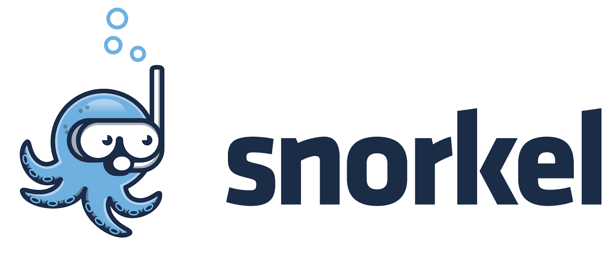
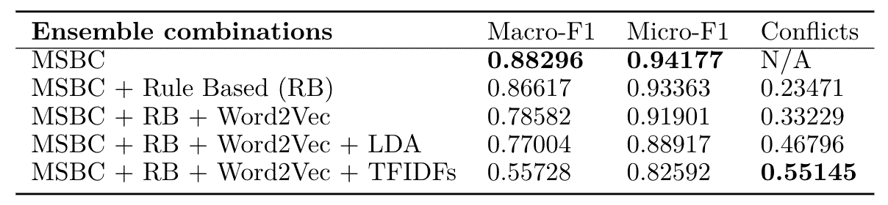

# 使用 Snorkel 标记数据

> 原文：[`www.kdnuggets.com/2020/07/labelling-data-using-snorkel.html`](https://www.kdnuggets.com/2020/07/labelling-data-using-snorkel.html)

评论

**由 [Alister D’Costa](https://www.linkedin.com/in/alisterdcosta/)、[Stefan Denkovski](https://www.linkedin.com/in/stefandenkovski/)、[Michal Malyska](https://www.linkedin.com/in/malyskamichal/)、[Sally Moon](https://www.linkedin.com/in/sallysaeyoungmoon/)、[Brandon Rufino](https://www.linkedin.com/in/brandon-rufino/)、[NLP4H](https://nlp4h.com/authors/)** 撰写

* * *

## 我们的前三个课程推荐

 1\. [谷歌网络安全证书](https://www.kdnuggets.com/google-cybersecurity) - 快速进入网络安全职业轨道。

 2\. [谷歌数据分析专业证书](https://www.kdnuggets.com/google-data-analytics) - 提升您的数据分析技能

 3\. [谷歌 IT 支持专业证书](https://www.kdnuggets.com/google-itsupport) - 支持您的组织 IT

* * *

在本教程中，我们将逐步介绍如何使用 Snorkel 为未标记的数据集生成标签。我们将通过引导您完成 Snorkel 在实际临床应用中的基本组件示例，具体来说，我们将使用 Snorkel 尝试提升预测[多发性硬化症 (MS) 严重程度评分](https://www.mstrust.org.uk/a-z/expanded-disability-status-scale-edss)的结果。祝您使用愉快！

*查看*[*Snorkel 简介教程*](https://www.snorkel.org/use-cases/01-spam-tutorial)*，了解垃圾邮件标记的详细步骤。有关 Snorkel 在实际应用中的高性能示例，请参阅*[*Snorkel 的出版物列表*](https://www.snorkel.org/resources/)*。*

*查看我们其他关于 MS 严重程度分类的 NLP 相关工作*[*这里*](https://medium.com/@nlp4health/ms-bert-using-neurological-examination-notes-for-multiple-sclerosis-severity-classification-f75f13600d3e)*。*

### Snorkel 是什么？

Snorkel 是一个简化构建和管理训练数据集过程的系统，无需手动标记。Snorkel 流水线的第一个组件包括标记功能，这些功能旨在作为弱启发式函数，根据未标记的数据预测标签。我们为 MS 严重程度评分标记开发的标记功能如下：

+   在文本中进行多个关键字搜索（使用正则表达式）。例如，在查找严重程度评分时，我们搜索了数字格式和罗马数字格式的短语。

+   常见基准如逻辑回归、线性判别分析和支持向量机，这些基准使用词频-逆文档频率（或简称 tf-idf）特征进行训练。

+   Word2Vec 卷积神经网络 (CNN)。

+   我们的 MS-BERT 分类器在 [这篇博客文章](https://medium.com/@nlp4health/ms-bert-using-neurological-examination-notes-for-multiple-sclerosis-severity-classification-f75f13600d3e) 中进行了描述。

Snorkel 管道的第二个组件是一个生成模型，它根据所有标注函数的预测输出每个数据点的单个置信度加权训练标签。它通过学习估计标注函数的准确性和相关性来完成此任务，基于它们的一致性和不一致性。

### Snorkel 教程

重申一下，在本文中，我们演示了 MS 严重性评分的标签生成。MS 严重性的一种常见测量是 EDSS 或扩展残疾状态量表。这是一个从 0 增加到 10 的量表，具体取决于 MS 症状的严重程度。我们将 EDSS 通称为 MS 严重性评分，但为了我们的细心读者，我们提供了这些信息。这个评分的详细描述见 [这里](https://www.mstrust.org.uk/a-z/expanded-disability-status-scale-edss)。

### 步骤 0: 获取数据集

在我们的任务中，我们使用了由领先的 MS 研究医院编制的数据集，该数据集包含超过 *70,000* 个 MS 咨询笔记，涵盖约 5000 名患者。在这 70,000 个笔记中，只有 *16,000* 个由专家手动标记了 MS 严重性。这意味着大约有 *54,000* 个未标记的笔记。你可能知道，拥有更大的数据集来训练模型通常会带来更好的模型性能。因此，我们使用 Snorkel 为我们的 *54,000* 个未标记笔记生成了我们称之为“银标签”的标签。这 *16,000* 个“金标签”笔记被用来训练我们的分类器，然后再创建它们各自的标注函数。

### 步骤 1: 安装 Snorkel

要将 Snorkel 安装到你的项目中，你可以运行以下命令：

### 步骤 2: 添加标注函数

### 设置

标注函数允许你定义弱启发式和规则，以预测给定未标记数据的标签。这些启发式可以源自专家知识或其他标注模型。在 MS 严重性评分预测的情况下，我们的标注函数包括：从临床医生那里获得的关键词搜索函数、训练预测 MS 严重性评分的基线模型（tf-idf、word2vec cnn 等），以及我们的 MS-BERT 分类器。

正如你将看到的那样，你通过在函数上方添加“@labeling_function()”来标记标注函数。对于每个标注函数，将传入包含未标记数据（即一个观察/样本）的一行数据框。每个标注函数应用启发式或模型来获取每行的预测。如果未找到预测，函数将弃权（即返回 -1）。

当所有标注函数定义完成后，你可以使用“PandasLFApplier”来获取给定所有标注函数的预测矩阵。

运行以下代码后，你将获得一个 (N X num_lfs) 的 L_predictions 矩阵，其中 N 是‘df_unlabelled’中的观察数，‘num_lfs’ 是在‘lfs’中定义的标注函数数量。

### 标注函数示例 #1：关键字搜索

下文展示了一个关键字搜索的示例（使用正则表达式），用于提取以十进制形式记录的 MS 严重性评分。正则表达式函数用于尝试搜索以十进制形式记录的 MS 严重性评分。如果找到，函数将以适当的输出格式返回评分。否则，函数将 abstain（即返回-1），以指示未找到评分。

### 标注函数示例 #2：训练分类器

上文展示了一个使用关键字搜索的示例。要集成一个训练好的分类器，你必须额外执行一步。即，你必须在创建标注函数之前训练并导出你的模型。这是一个基于 tf-idf 特征的逻辑回归模型训练的示例。

训练好模型后，实现标注函数就简单如是：

### 步骤 3(a)：使用 Snorkel 的多数投票

有人会说，Snorkel 用于生成标签的最简单函数是‘多数投票’。正如名字所示，多数投票基于投票最多的类别做出预测。

要实现多数投票，你必须指定‘cardinality’（即类别数量）。

### 步骤 3(b)：使用 Snorkel 的标签模型

为了充分利用 Snorkel 的功能，我们使用了‘标签模型’来生成一个基于所有标注函数获得的预测矩阵（即 L_unlabelled）的单一置信加权标签。标签模型通过学习估计标注函数的准确性和相关性来进行预测，基于它们的同意和分歧。

你可以定义一个标签模型并指定‘cardinality’。在用 L_unlabelled 训练标签模型后，它将为未标记数据生成单一预测。

### 步骤 4：评估工具

### LF 分析 — 覆盖率、重叠、冲突

为了更好地理解你的标注函数的功能，你可以利用 Snorkel 的 LFAnalysis。LF 分析报告每个标注函数的极性、覆盖率、重叠和冲突。

这些术语的定义如下，你可以参考 [Snorkel 文档](https://snorkel.readthedocs.io/en/v0.9.1/packages/_autosummary/labeling/snorkel.labeling.LFAnalysis.html#snorkel.labeling.LFAnalysis.lf_polarities) 以获取更多信息：

+   极性：基于标签矩阵中的证据推断每个 LF 的极性。

+   覆盖率：计算至少有一个标签的数据点比例。

+   重叠：计算至少有两个（非 abstain）标签的数据点比例。

+   冲突：计算每个标注函数与至少一个其他标注函数意见不一致的数据点比例。

LFAnalysis 将提供关于你的标注函数在相互之间的表现分析。

### `get_label_buckets`

Snorkel 提供了一些额外的评估工具，帮助你理解标签函数的质量。特别是，`get_label_buckets`是一个方便的方式来合并标签并进行比较。有关更多信息，请阅读[Snorkel 文档](https://snorkel.readthedocs.io/en/v0.9.1/packages/_autosummary/analysis/snorkel.analysis.get_label_buckets.html)。

以下代码允许你比较真实标签（y_gold）和预测标签（y_preds），以查看 Snorkel 正确或错误标记的数据点。这将帮助你找出哪些数据点难以正确标记，从而调整你的标签函数以涵盖这些边缘案例。

注意，对于这项分析，我们回到创建了一个包含‘黄金’标签数据集的标签函数预测的 L_train 矩阵。

另外，你可以使用`get_label_buckets`来比较标签函数。

以下代码允许你比较 L_unlabelled 中的标签预测，观察不同标签函数如何以不同方式标记数据点。

### 第 5 步：部署

### 选择最佳标签模型以标记未标记的数据

按照上述程序，我们基于关键字搜索、基线模型和 MS-BERT 分类器开发了各种标签函数。我们尝试了不同的标签函数组合，并使用 Snorkel 的 Label Model 获得了对保留标签数据集的预测。这使我们能够确定哪个标签函数组合最适合标记我们的未标记数据集。

如下表所示，我们观察到仅 MS-BERT 分类器（MSBC）在 Macro-F1 上比所有包含它的组合表现更好至少 0.02。添加较弱的启发式方法和分类器会持续降低组合的性能。此外，我们还观察到随着较弱分类器和启发式方法的添加，MS-BERT 分类器的冲突量增加。

注意，基于规则（RB）指的是我们的关键字搜索。LDA 指线性判别分析。TFIDFs 指所有基于 tf-idf 特征构建的模型（即逻辑回归、线性判别分析和支持向量机）。

要理解我们的发现，我们必须提醒自己，Snorkel 的标签模型学习根据彼此之间的一致性和分歧来预测标记函数的准确性和相关性。因此，在存在强标记函数（如我们的 MS-BERT 分类器）的情况下，添加较弱的标记函数会引入更多与强标记函数的分歧，从而降低性能。从这些发现中，我们了解到 Snorkel 可能更适合只有*弱*启发式和规则的情况。然而，如果你已经有了一个强标记函数，开发一个带有较弱启发式的 Snorkel 集成可能会影响性能。

因此，MS-BERT 分类器单独被选择用于标记我们的未标记数据集。

### 半监督标记结果

MS-BERT 分类器被用于为我们的未标记数据集获得“银牌”标签。这些“银牌”标签与我们的“金牌”标签结合，得到了一个银+金数据集。为了推断银牌标签的质量，开发了新的 MS-BERT 分类器：1) MS-BERT+（在银+金标记数据上训练）；2) MS-BERT-silver（在银标记数据上训练）。这些分类器在之前用于评估我们原始 MS-BERT 分类器（在金标记数据上训练）的持出测试数据集上进行了评估。MS-BERT+ 达到了 0.86238 的 Macro-F1 和 0.92569 的 Micro-F1，而 MS-BERT-silver 达到了 0.82922 的 Macro-F1 和 0.91442 的 Micro-F1。尽管它们的表现略低于我们原始 MS-BERT 分类器（Macro-F1 为 0.88296，Micro-F1 为 0.94177），但仍超越了以前最佳的 MS 严重性预测基准模型。MS-BERT-silver 的强劲结果有助于展示使用我们的 MS-BERT 分类器作为标记函数的有效性。这表明它有潜力减少专业人员阅读患者咨询笔记并手动生成 MS 严重性评分所需的繁琐时间。

### 感谢！

感谢大家的阅读！如果有任何问题，请随时通过 nlp4health (at gmail dot) com 联系我们。 :)

### 致谢

我们要感谢圣迈克尔医院数据科学与高级分析（DSAA）部门的研究人员和工作人员，在整个项目过程中提供了一致的支持和指导。我们还要感谢 Marzyeh Ghassemi 博士和 Taylor Killan，感谢他们给我们提供了参与这个令人兴奋的项目的机会。最后，我们要感谢圣迈克尔医院 MS 门诊的 Tony Antoniou 博士和 Jiwon Oh 博士，感谢他们对神经检查笔记的支持。

*最初发布于*[*https://nlp4h.com*](https://nlp4h.com/blog/snorkel_tutorial/)*。*

**简介: [作者](https://nlp4h.com/authors/)** 是一组在多伦多大学从事医疗 NLP 研究的研究生。

[原文](https://medium.com/swlh/a-snorkel-tutorial-using-clinical-notes-to-predict-multiple-sclerosis-severity-scores-e3863801630f)。经许可转载。

**相关：**

+   手工标注已成过去。未来是 #NoLabel AI

+   从语言到信息：斯坦福大学的另一个出色 NLP 课程

+   深度神经网络在自然语言处理（NLP）中的不合理进展

### 更多相关内容

+   [如何使用 Python 确定最佳拟合的数据分布](https://www.kdnuggets.com/2021/09/determine-best-fitting-data-distribution-python.html)

+   [使用 Eurybia 检测数据漂移以确保生产 ML 模型质量](https://www.kdnuggets.com/2022/07/detecting-data-drift-ensuring-production-ml-model-quality-eurybia.html)

+   [黑客如何利用数据科学窃取数十亿资金的 4 种方式](https://www.kdnuggets.com/2022/02/4-ways-hackers-data-science-steal-billions.html)

+   [利用数据科学使清洁能源更加公平](https://www.kdnuggets.com/2022/03/data-science-make-clean-energy-equitable.html)

+   [如何通过使用自动化 EDA 工具来轻松通过数据科学评估测试](https://www.kdnuggets.com/2022/04/ace-data-science-assessment-test-automatic-eda-tools.html)

+   [使用 Matplotlib 进行数据可视化介绍](https://www.kdnuggets.com/2022/12/introduction-data-visualization-matplotlib.html)
