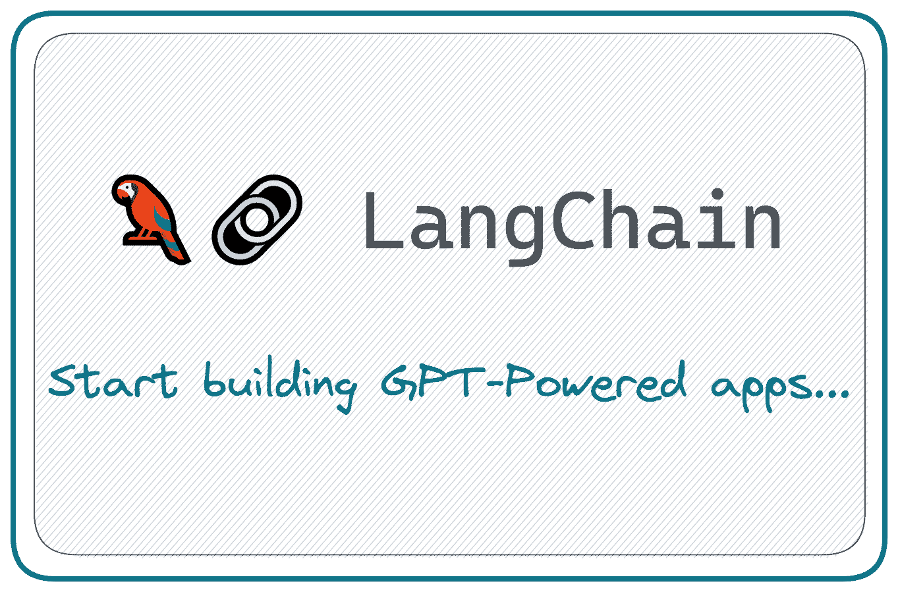
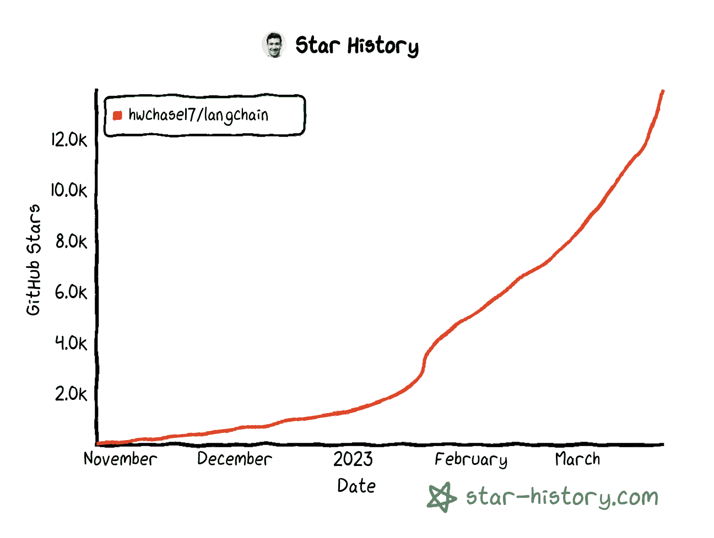
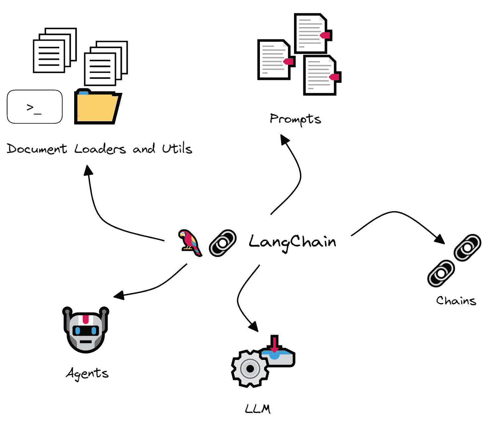
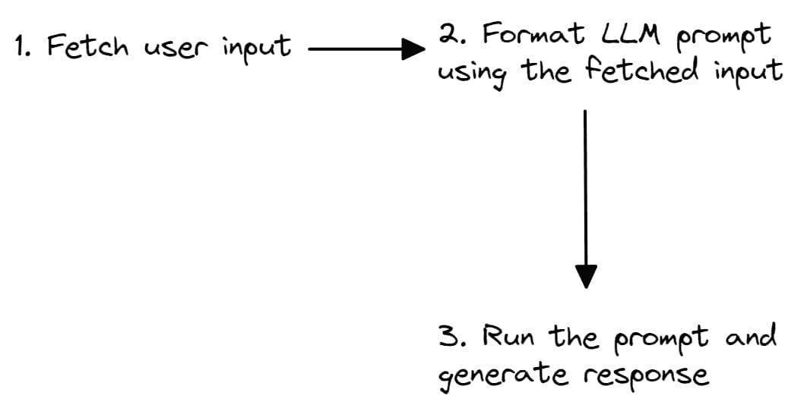

# LangChain 101: 构建你自己的 GPT 驱动应用程序

> 原文：[`www.kdnuggets.com/2023/04/langchain-101-build-gptpowered-applications.html`](https://www.kdnuggets.com/2023/04/langchain-101-build-gptpowered-applications.html)



图片来源：作者

ChatGPT 和 GPT-4 的成功展示了经过强化训练的大型语言模型如何产生可扩展且强大的 NLP 应用程序。

* * *

## 我们的前三大课程推荐

 1\. [Google 网络安全证书](https://www.kdnuggets.com/google-cybersecurity) - 快速通道进入网络安全职业。

 2\. [Google 数据分析专业证书](https://www.kdnuggets.com/google-data-analytics) - 提升你的数据分析技能

 3\. [Google IT 支持专业证书](https://www.kdnuggets.com/google-itsupport) - 支持你的组织的 IT

* * *

然而，响应的有用性依赖于提示，这导致用户探索提示工程领域。此外，大多数实际的 NLP 用例需要比单次 ChatGPT 会话更复杂的解决方案。而这正是像 LangChain 这样的库可以提供帮助的地方！

[LangChain](https://langchain.readthedocs.io/en/latest/) 是一个 Python 库，帮助你利用大型语言模型构建自定义的 NLP 应用程序。

在本指南中，我们将探讨 LangChain 是什么以及你可以用它构建什么。我们还将通过构建一个简单的问答应用程序来入门 LangChain。

让我们开始吧！

# LangChain 是什么？

LangChain 由 [Harrison Chase](https://github.com/hwchase17) 创建，是一个 Python 库，提供开箱即用的支持，用于使用 LLM 构建 NLP 应用程序。你可以连接各种数据和计算源，构建在特定领域数据源、私人库等上执行 NLP 任务的应用程序。

截至本文撰写时（2023 年 3 月），LangChain GitHub 仓库已有超过 14,000 个星标，来自世界各地的 270 多位贡献者。



LangChain Github 星标历史 | 生成于 [star-history.com](https://star-history.com/)

使用 LangChain 可以构建的有趣应用程序包括（但不限于）：

+   聊天机器人

+   针对特定领域的总结和问答

+   查询数据库以获取信息然后处理的应用程序

+   解决特定问题的代理，例如数学和推理难题

# LangChain 模块概览

接下来让我们看看 LangChain 的一些模块：



图片来源：作者

## LLM

LLM 是 LangChain 的基本组件。它本质上是一个围绕大型语言模型的封装器，帮助使用特定大型语言模型的功能和能力。

## 链条

如前所述，LLM 是 LangChain 中的基本单元。然而，正如 LangChain 这个名字所暗示的，你可以根据特定任务将 LLM 调用链接在一起。

例如，你可能需要从特定的 URL 获取数据，汇总返回的文本，并使用生成的摘要回答问题。

链条也可以很简单。你可能需要读取用户输入，然后用这些输入构造提示。提示可以用于生成响应。



图片由作者提供

## 提示

提示是任何 NLP 应用程序的核心。即使在 ChatGPT 会话中，答案也只是与提示相关的。为此，LangChain 提供了可以用于格式化输入的提示模板以及许多其他实用工具。

## 文档加载器和工具

LangChain 的 **文档加载器** 和 **工具** 模块分别有助于连接数据源和计算。

假设你有一大批关于经济学的文本，你希望在此基础上构建一个 NLP 应用程序。你的文本库可能是文本文件、PDF 文档、HTML 网页、图像等的混合。目前，文档加载器利用 Python 库 [Unstructured](https://pypi.org/project/unstructured/) 将这些原始数据源转换为可以处理的文本。

工具模块提供了 Bash 和 Python 解释器会话等。这些适用于需要直接与底层系统交互的应用程序，或当我们需要代码片段来计算特定的数学量或解决问题时，而不是一次性计算答案。

## 代理

我们提到过，“链条”可以帮助将一系列 LLM 调用连接在一起。然而，在某些任务中，这些调用的顺序往往不是确定的。下一步可能依赖于用户输入和前一步的响应。

对于这类应用程序，LangChain 库提供了可以根据输入在过程中采取行动的“**代理**”，而不是一个硬编码的确定性序列。

除了上述功能，LangChain 还提供了与向量数据库的集成，并具备在 LLM 调用之间维护状态的内存功能，以及更多功能。

# 使用 LangChain 构建问答应用程序

现在我们已经对 LangChain 有了了解，让我们按照五个简单的步骤使用 LangChain 构建一个问答应用程序：

## 第一步 – 设置开发环境

在我们开始编码之前，让我们设置开发环境。我假设你已经在工作环境中安装了 Python。

你现在可以使用 pip 安装 LangChain 库：

```py
pip install langchain
```

由于我们将使用 OpenAI 的语言模型，我们还需要安装 OpenAI SDK：

```py
pip install openai
```

## 第二步 – 将 OPENAI_API_KEY 设置为环境变量

接下来，登录你的 OpenAI 账户。导航到账户设置 > **查看 API 密钥**。生成一个密钥并复制它。

在你的 Python 脚本中，使用**os**模块并访问环境变量字典`os.environ`。将“OPENAI_API_KEY”设置为你刚刚复制的秘密 API 密钥：

```py
import os
os.environ["OPENAI_API_KEY"] = "your-api-key-here"
```

## 步骤 3 – 使用 LangChain 进行简单的 LLM 调用

现在我们已经安装了所需的库，让我们看看如何使用 LangChain 进行一个简单的 LLM 调用。

为此，让我们导入 OpenAI 包装器。在这个示例中，我们将使用 text-davinci-003 模型：

```py
from langchain.llms import OpenAI
llm = OpenAI(model_name="text-davinci-003")
```

> “**text-davinci-003**: 相比于 curie、babbage 或 ada 模型，可以更好地完成任何语言任务，提供更长的输出和一致的指令跟随。还支持在文本中[插入](https://platform.openai.com/docs/guides/completion/inserting-text)补全。” – [OpenAI 文档](https://platform.openai.com/docs/models/gpt-3-5)

让我们定义一个问题字符串并生成一个响应：

```py
question = "Which is the best programming language to learn in 2023?"
print(llm(question))
```

```py
Output >>
It is difficult to predict which programming language will be the most popular in 2023\. However, the most popular programming languages today are JavaScript, Python, Java, C++, and C#, so these are likely to remain popular for the foreseeable future. Additionally, newer languages such as Rust, Go, and TypeScript are gaining traction and could become popular choices in the future.
```

## 步骤 4 – 创建一个提示模板

让我们问另一个问题，关于学习一种新的编程语言，比如 Golang：

```py
question = "What are the top 4 resources to learn Golang in 2023?"
print(llm(question))
```

```py
Output >>

1\. The Go Programming Language by Alan A. A. Donovan and Brian W. Kernighan
2\. Go in Action by William Kennedy, Brian Ketelsen and Erik St. Martin
3\. Learn Go Programming by John Hoover
4\. Introducing Go: Build Reliable, Scalable Programs by Caleb Doxsey
```

虽然这对初学者来说效果不错，但当我们试图整理一份学习编程语言和技术栈的资源列表时，它很快变得重复。

这就是提示模板的用武之地。你可以创建一个可以使用一个或多个输入变量格式化的模板。

我们可以创建一个简单的模板，以获取学习任何技术栈的前 k 个资源。在这里，我们使用`k`和`this`作为`input_variables`：

```py
from langchain import PromptTemplate
template = "What are the top {k} resources to learn {this} in 2023?"
prompt = PromptTemplate(template=template,input_variables=['k','this'])
```

## 步骤 5 – 运行我们的第一个 LLM 链

我们现在有了一个 LLM 和一个可以在多个 LLM 调用中重用的提示模板。

```py
llm = OpenAI(model_name="text-davinci-003")
prompt = PromptTemplate(template=template,input_variables=['k','this'])
```

让我们继续创建一个 LLMChain：

```py
from langchain import LLMChain
chain = LLMChain(llm=llm,prompt=prompt)
```

你现在可以将输入作为字典传入，并按如下所示运行 LLM 链：

```py
input = {'k':3,'this':'Rust'}
print(chain.run(input))
```

```py
Output >>

1\. Rust By Example - Rust By Example is a great resource for learning Rust as it provides a series of interactive exercises that teach you how to use the language and its features.

2\. Rust Book - The official Rust Book is a comprehensive guide to the language, from the basics to the more advanced topics.

3\. Rustlings - Rustlings is a great way to learn Rust quickly, as it provides a series of small exercises that help you learn the language step-by-step.
```

# 总结

就这样！你知道如何使用 LangChain 构建一个简单的问答应用程序。我希望你对 LangChain 的功能有了初步的了解。作为下一步，尝试探索 LangChain 来构建更有趣的应用程序。编程愉快！

# 参考资料及进一步学习

+   [LangChain 文档](https://langchain.readthedocs.io/en/latest/)

+   [LangChain 快速入门指南](https://langchain.readthedocs.io/en/latest/modules/prompts/getting_started.html)

+   [LangChain 演示 + 与 Harrison Chase 的问答](https://www.youtube.com/watch?v=zaYTXQFR0_s)

+   Chase, H. (2022). LangChain [计算机软件]. https://github.com/hwchase17/langchain

**[Bala Priya C](https://www.linkedin.com/in/bala-priya/)** 是一位技术作家，喜欢创建长篇内容。她的兴趣领域包括数学、编程和数据科学。她通过撰写教程、操作指南等向开发者社区分享她的学习成果。

### 更多相关话题

+   [使用 LlamaIndex 构建自己的 PandasAI](https://www.kdnuggets.com/build-your-own-pandasai-with-llamaindex)

+   [LangChain + Streamlit + Llama：将对话式 AI 带到你的本地机器上](https://www.kdnuggets.com/2023/08/langchain-streamlit-llama-bringing-conversational-ai-local-machine.html)

+   [如何让大型语言模型与你的软件和谐共处……](https://www.kdnuggets.com/how-to-make-large-language-models-play-nice-with-your-software-using-langchain)

+   [KDnuggets 新闻 2022 年 3 月 9 日：在 5 分钟内构建机器学习网页应用……](https://www.kdnuggets.com/2022/n10.html)

+   [使用 ChatGPT 的 GPTs 自制属于自己的 GPTs！](https://www.kdnuggets.com/make-your-own-gpts-with-chatgpts-gpts)

+   [LangChain 备忘单](https://www.kdnuggets.com/2023/08/langchain-cheat-sheet.html)
