# LangChain + Streamlit + Llama：将对话 AI 带到你的本地机器

> 原文：[`www.kdnuggets.com/2023/08/langchain-streamlit-llama-bringing-conversational-ai-local-machine.html`](https://www.kdnuggets.com/2023/08/langchain-streamlit-llama-bringing-conversational-ai-local-machine.html)

图片来源：作者

在过去几个月里，***大型语言模型（LLMs）***受到了广泛关注，吸引了全球开发者的兴趣。这些模型创造了令人兴奋的前景，特别是对于从事聊天机器人、个人助手和内容创作的开发者。LLMs 带来的可能性在开发者 | AI | NLP 社区中引发了一波热情。

* * *

## 我们的三大课程推荐

 1\. [谷歌网络安全证书](https://www.kdnuggets.com/google-cybersecurity) - 快速进入网络安全职业生涯。

 2\. [谷歌数据分析专业证书](https://www.kdnuggets.com/google-data-analytics) - 提升你的数据分析技能

 3\. [谷歌 IT 支持专业证书](https://www.kdnuggets.com/google-itsupport) - 支持组织的 IT

* * *

# 什么是 LLM？

大型语言模型（LLMs）是指能够生成类似人类语言的文本并以自然方式理解提示的机器学习模型。这些模型通过使用包含书籍、文章、网站和其他来源的大型数据集进行训练。通过分析数据中的统计模式，LLMs 预测最可能跟随给定输入的词或短语。

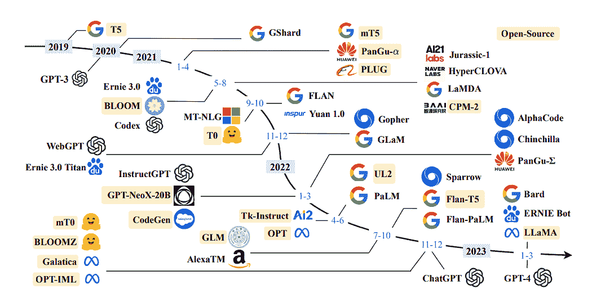

**近几年 LLM 的时间轴：**[**大型语言模型的调研**](https://arxiv.org/abs/2303.18223)

通过利用大型语言模型（LLMs），我们可以整合特定领域的数据以有效回答查询。这在处理模型初次训练时未能访问的信息时尤为有利，例如公司的内部文档或知识库。

为此目的采用的架构被称为 ***检索增强生成***，或较少见的 ***生成性问答。***

# 什么是 LangChain

LangChain 是一个令人印象深刻且免费提供的框架，精心设计用于帮助开发者创建以语言模型，特别是大型语言模型（LLMs）的强大功能为基础的应用程序。

LangChain 彻底改变了各种应用程序的开发过程，包括聊天机器人、生成式问答（GQA）和总结。通过无缝地**串联**来自多个模块的组件，LangChain 实现了围绕 LLMs 的强大功能创建出色的应用程序。

**了解更多：**[**官方文档**](https://python.langchain.com/docs/get_started/introduction.html)

# 动机？

**作者提供的图片**

在这篇文章中，我将演示从头开始创建自己的文档助手的过程，利用 LLaMA 7b 和 Langchain，这是一个专为与 LLMs 无缝集成而开发的开源库。

下面是博客结构的概述，概述了将详细说明过程的特定部分：

1.  `**设置虚拟环境和创建文件结构**`

1.  `**将 LLM 安装到本地机器上**`

1.  `**将 LLM 与 LangChain 集成并自定义 PromptTemplate**`

1.  `**文档检索和回答生成**`

1.  `**使用 Streamlit 构建应用程序**`

# 第一部分：设置虚拟环境和创建文件结构

设置虚拟环境提供了一个受控且隔离的环境来运行应用程序，确保其依赖项与其他系统范围的包分开。这种方法简化了依赖项的管理，并有助于在不同环境中保持一致性。

为了设置这个应用程序的虚拟环境，我将在我的 GitHub 仓库中提供 pip 文件。首先，让我们创建图中所示的必要文件结构。或者，你也可以直接克隆仓库以获取所需文件。

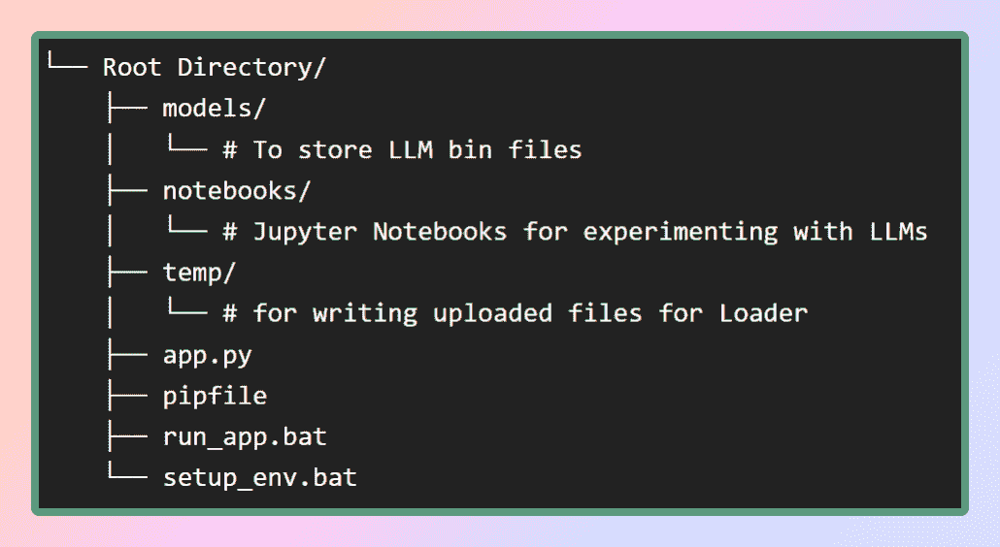

**作者提供的图片：文件结构**

在模型文件夹中，我们将存储下载的 LLMs，而 pip 文件将位于根目录中。

为了创建虚拟环境并安装其中的所有依赖项，我们可以使用 `**pipenv install**`命令，或者直接运行`**setup_env.bat**`批处理文件，它将从 `**pipfile**`中安装所有依赖项。这将确保在虚拟环境中安装所有必要的软件包和库。一旦依赖项成功安装，我们可以继续进行下一步，即下载所需的模型。这里是[仓库](https://github.com/afaqueumer/DocQA)。

# 第二部分：在本地机器上获取 LLaMA

## 什么是 LLaMA？

LLaMA 是 Meta AI 设计的新型大型语言模型，Meta 是 Facebook 的母公司。LLaMA 拥有从 70 亿到 650 亿参数的多种模型，是现有的最全面的语言模型之一。2023 年 2 月 24 日，Meta 将 LLaMA 模型公开发布，展示了其对开放科学的承诺。

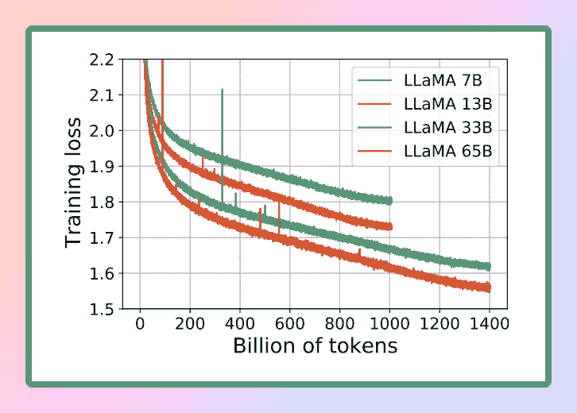

图片来源: [LLaMA](https://research.facebook.com/publications/llama-open-and-efficient-foundation-language-models/)

考虑到 LLaMA 的卓越能力，我们选择使用这个强大的语言模型来满足我们的需求。具体来说，我们将使用 LLaMA 的最小版本，即 LLaMA 7B。即便在这个较小的规模下，LLaMA 7B 仍提供显著的语言处理能力，使我们能够高效且有效地实现所需的结果。

> ***官方研究论文* : **`[**LLaMA: 开放且高效的基础语言模型**](https://research.facebook.com/publications/llama-open-and-efficient-foundation-language-models/)`

要在本地 CPU 上运行 LLM，我们需要一个 GGML 格式的本地模型。有几种方法可以实现这一点，但最简单的方法是直接从[**Hugging Face 模型库**](https://huggingface.co/models)下载 bin 文件。在我们的案例中，我们将下载 Llama 7B 模型。这些模型是开源的，可以自由下载。

如果你想节省时间和精力，不用担心——我已经为你准备好了。这里是直接下载模型的链接[?](https://huggingface.co/TheBloke/LLaMa-7B-GGML)。只需下载任何一个版本，然后将文件移动到我们根目录中的 models 目录下。这样，你就能方便地使用这个模型。

## 什么是 GGML？为什么选择 GGML？如何使用 GGML？LLaMA CPP

GGML 是一个用于机器学习的 Tensor 库，它只是一个 C++库，允许你在 CPU 或 CPU+GPU 上运行 LLMs。它定义了一种用于分发大型语言模型（LLMs）的二进制格式。GGML 利用了一种叫做***量化***的技术，使大型语言模型可以在消费者硬件上运行。

## 那么，什么是量化？

LLM 的权重是浮点（十进制）数字。就像表示一个大整数（例如 1000）比表示一个小整数（例如 1）需要更多空间一样，表示一个高精度浮点数（例如 0.0001）也比表示一个低精度浮点数（例如 0.1）需要更多空间。对大型语言模型进行***量化***的过程涉及减少权重表示的精度，以减少使用模型所需的资源。GGML 支持多种量化策略（例如 4-bit、5-bit 和 8-bit 量化），每种策略在效率和性能之间提供了不同的权衡。

Llama 的量化大小

为了有效使用模型，考虑内存和磁盘需求是至关重要的。由于模型当前完全加载到内存中，你需要足够的磁盘空间来存储它们，以及足够的 RAM 在执行期间加载它们。对于 65B 模型，即使经过量化，建议至少拥有 40 GB 的 RAM。值得注意的是，目前的内存和磁盘要求是相等的。

量化在管理这些资源需求中起着关键作用。除非你有非常强大的计算资源

通过减少模型参数的精度和优化内存使用，量化使得模型可以在更低配置的硬件上使用。这确保了在更广泛的设置中运行模型仍然可行和高效。

## 如果这是一个 C++ 库，我们如何在 Python 中使用它？

这时 Python 绑定就派上用场了。绑定指的是为我们 Python 和 C++ 之间创建桥梁或接口的过程。我们将使用 `**llama-cpp-python**`，这是 `**llama.cpp**` 的 Python 绑定，充当 LLaMA 模型在纯 C/C++ 中的推理。`**llama.cpp**` 的主要目标是使用 4 位整数量化运行 LLaMA 模型。这种集成允许我们有效地利用 LLaMA 模型，结合 C/C++ 实现的优势和 4 位整数量化的好处。

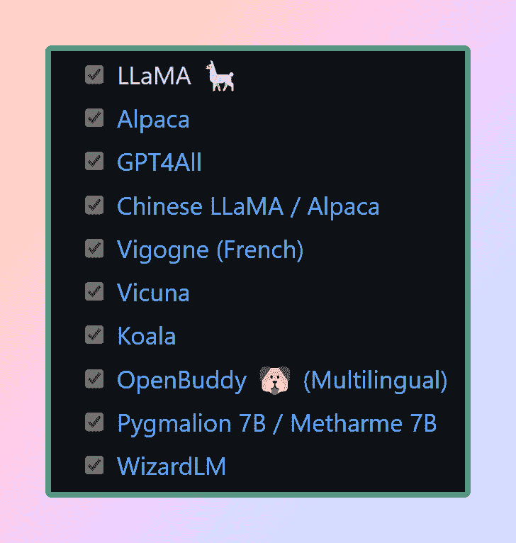

llama.cpp 支持的模型： [来源](https://github.com/ggerganov/llama.cpp)

准备好 GGML 模型并且所有依赖项到位（感谢 pipfile）之后，是时候开始我们的 LangChain 之旅了。但在深入 LangChain 的精彩世界之前，让我们先从惯例 **“Hello World”** 仪式开始 — 这是我们每次探索新语言或框架时遵循的传统，毕竟 LLM 也是一种语言模型。

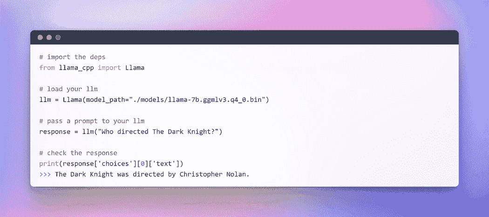

作者提供的图片：在 CPU 上与 LLM 互动

*瞧！！！*我们已经成功在 CPU 上执行了第一个 LLM，完全离线并以完全随机的方式（你可以调整超参数 **temperature**）。

随着这个激动人心的里程碑的完成，我们现在准备开始我们的主要目标：使用 LangChain 框架对自定义文本进行问答。

# 第三部分：开始使用 LLM — LangChain 集成

在上一节中，我们使用 llama cpp 初始化了 LLM。现在，让我们利用 LangChain 框架来开发基于 LLM 的应用程序。你与它们互动的主要接口是通过文本。简而言之，许多模型是**文本输入，文本输出**。因此，LangChain 中的许多接口都是围绕文本展开的。

## 提示工程的兴起

在不断发展的编程领域中，一个引人入胜的范式已经出现：**提示**。提示涉及向语言模型提供特定输入以引出期望的回应。这种创新的方法允许我们根据提供的输入来塑造模型的输出。

我们措辞方式中的细微差别对模型回应的性质和内容产生显著影响，这一点非常值得注意。结果可能会根据措辞的不同而发生根本性的变化，这突显了在制定提示时需要仔细考虑的的重要性。

为了与 LLM 提供无缝互动，LangChain 提供了多个类和函数，通过使用提示模板，使构造和处理提示变得简单。这是一种可重复的生成提示的方式。它包含一个文本字符串**模板**，可以接收来自最终用户的一组参数并生成提示。让我们看几个例子。

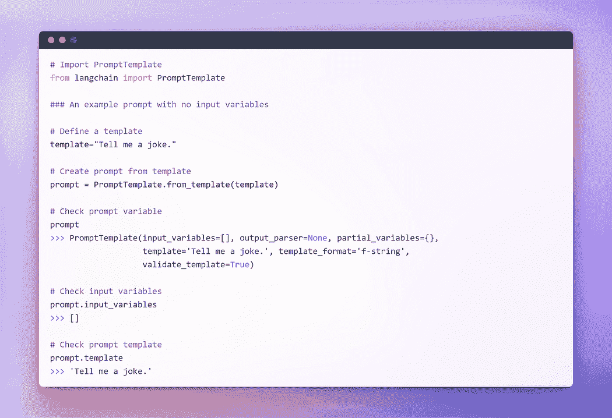

作者提供的图片：没有输入变量的提示

作者提供的图片：使用单一输入变量的提示

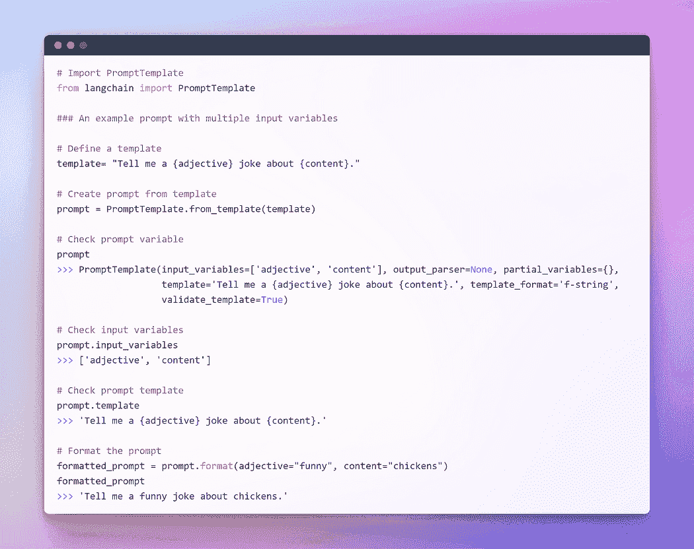

作者提供的图片：使用多个输入变量的提示

我希望之前的解释已经让你对提示的概念有了更清晰的理解。现在，让我们继续对 LLM 进行提示。

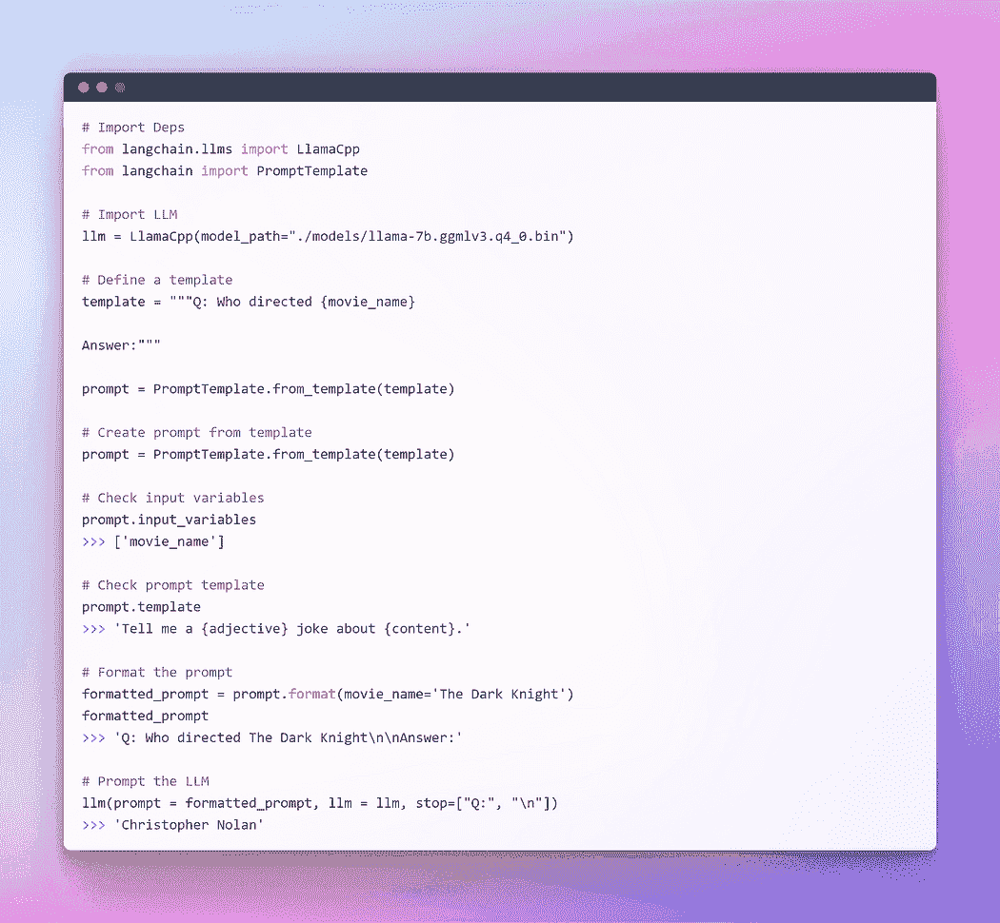

作者提供的图片：通过 Langchain LLM 进行提示

这种方法运行得很好，但这不是 LangChain 的最佳利用方式。到目前为止，我们使用了单独的组件。我们取了提示模板，格式化它，然后取了 llm，然后将这些参数传递给 llm 以生成答案。单独使用 LLM 对于简单应用程序来说是可以的，但更复杂的应用程序需要将 LLM 链接起来——无论是彼此之间，还是与其他组件之间。

LangChain 提供了 Chain 接口用于此类**链式**应用。我们非常泛泛地定义 Chain 为一系列对组件的调用，这些组件可以包括其他链。链允许我们将多个组件组合在一起以创建一个单一的、连贯的应用。例如，我们可以创建一个链，它接受用户输入，用提示模板格式化输入，然后将格式化后的响应传递给 LLM。我们可以通过将多个链组合在一起，或将链与其他组件组合来构建更复杂的链。

为了理解其中一个，让我们创建一个非常简单的**链**，它将接受用户输入，用它格式化提示，然后使用我们已经创建的上述单独组件将其发送给 LLM。

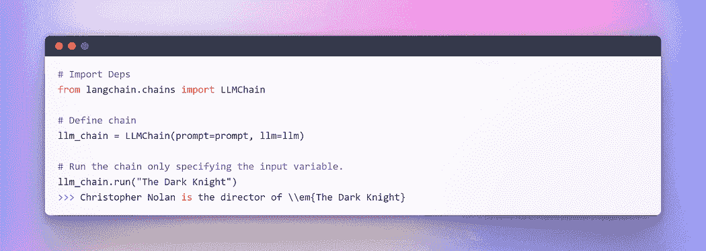

作者提供的图像：LangChain 中的链式操作

在处理多个变量时，你可以选择通过使用字典来集体输入它们。到此为止，这一部分结束了。现在，让我们深入到主要部分，我们将结合外部文本作为检索器来进行问答。

# 第四节：为问答生成嵌入和向量存储

在众多 LLM 应用中，需要用户特定的数据，这些数据未包含在模型的训练集中。LangChain 为你提供了加载、转换、存储和查询数据的基本组件。

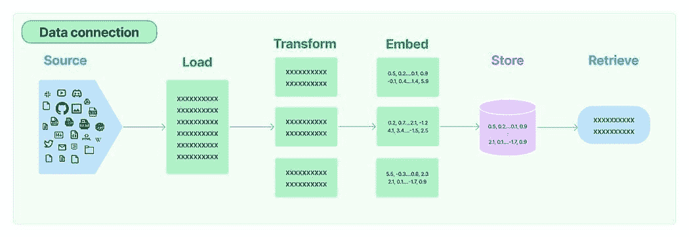

LangChain 中的数据连接：来源

五个阶段是：

1.  **文档加载器：** 用于将数据加载为文档。

1.  **文档转换器：** 它将文档拆分为较小的块。

1.  **嵌入：** 它将块转换为向量表示，即嵌入。

1.  **向量存储：** 用于在向量数据库中存储上述块向量。

1.  **检索器：** 它用于检索与查询最相似的一组/组向量，这些向量以与查询嵌入在同一潜在空间中的向量形式存在。

文档检索/问答循环

现在，我们将逐步进行五个步骤，以检索与查询最相似的文档块。随后，我们可以基于检索到的向量块生成答案，如所提供的图像所示。

然而，在进一步进行之前，我们需要准备一个文本以执行上述任务。为了这个虚构的测试，我从维基百科复制了一段关于一些受欢迎的 DC 超级英雄的文本。以下是文本：

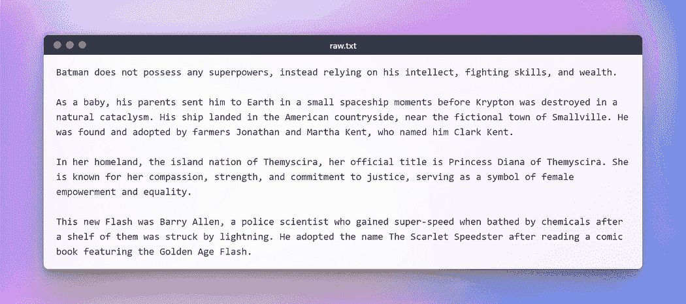

作者提供的图像：用于测试的原始文本

## 加载与转换文档

首先，让我们创建一个文档对象。在这个示例中，我们将使用文本加载器。然而，LangChain 支持多种文档，因此根据你的具体文档，你可以使用不同的加载器。接下来，我们将使用`**load**`方法从预配置的源中检索数据并将其加载为文档。

一旦文档被加载，我们可以通过将其分成较小的块来继续转换过程。为此，我们将使用 TextSplitter。默认情况下，分割器在‘\n\n’分隔符处分隔文档。然而，如果你将分隔符设置为 null 并定义特定的块大小，每个块将具有指定的长度。因此，结果列表的长度将等于文档的长度除以块大小。总之，它将类似于`**list length = length of doc / chunk size**`。让我们实践一下。

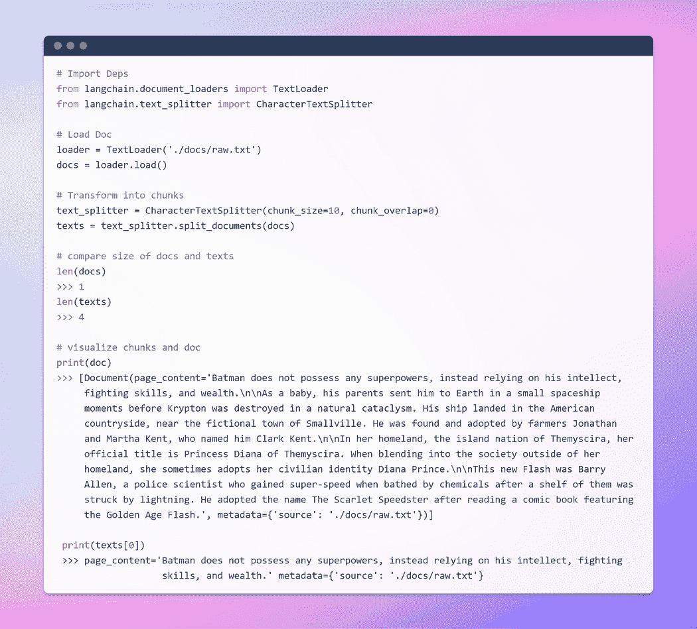

作者提供的图像：加载和转换文档

## 旅程的一部分就是嵌入 !!!

这是最重要的一步。嵌入生成了文本内容的向量化表现。这具有实际意义，因为它允许我们在向量空间中概念化文本。

词嵌入只是单词的向量表示，向量包含实数。由于语言通常包含至少数万词汇，简单的二进制词向量由于维度过高可能变得不切实际。词嵌入通过在低维向量空间中提供密集的词表示来解决这个问题。

当我们谈论检索时，我们指的是检索与查询最相似的一组向量，这些向量以嵌入在相同潜在空间中的形式存在。

LangChain 中的基础嵌入类暴露了两个方法：一个用于嵌入文档，另一个用于嵌入查询。前者接受多个文本作为输入，而后者接受单个文本。

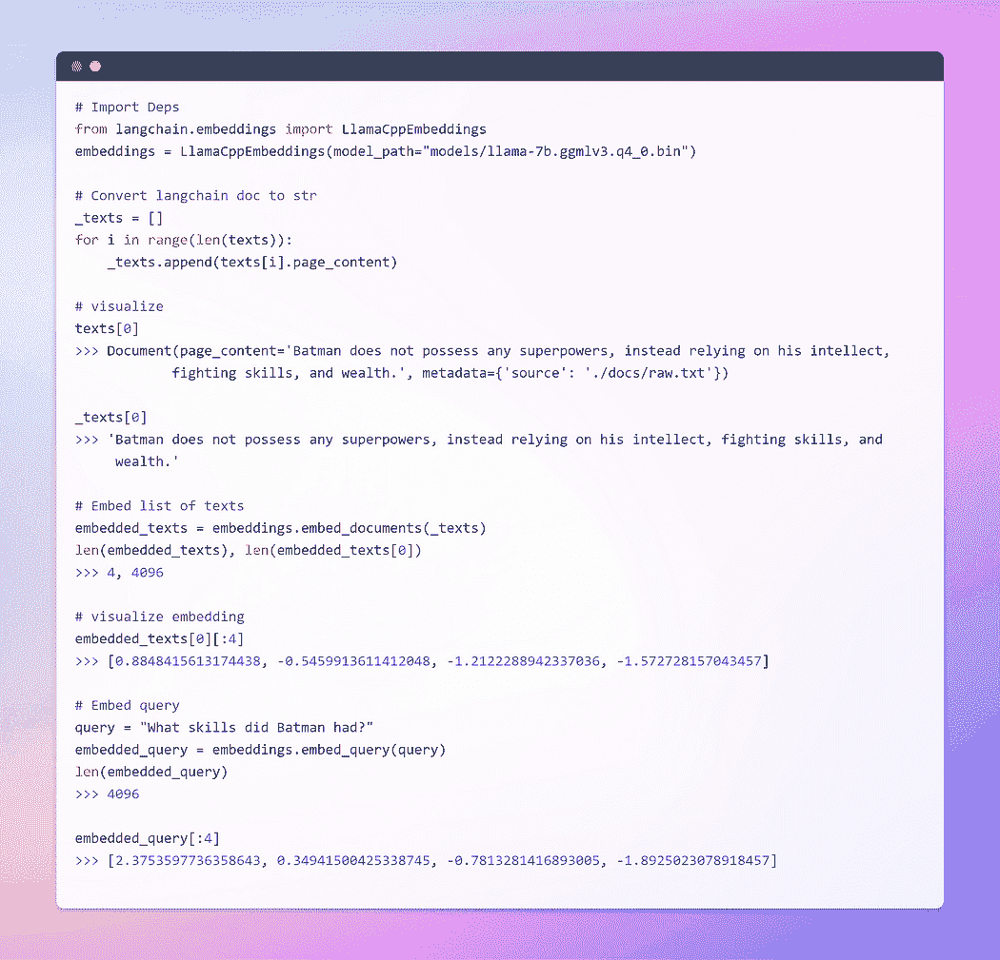

作者提供的图像：嵌入

为了全面理解嵌入，我强烈建议深入了解基础知识，因为它们构成了神经网络处理文本数据的核心。我在我的一篇博客中广泛讨论了这个主题，使用了 TensorFlow。这里是链接。

## 词嵌入——神经网络的文本表示

## 创建向量存储和检索文档

向量存储高效地管理嵌入数据的存储，并代表你执行向量搜索操作。嵌入和存储生成的嵌入向量是一种存储和搜索非结构化数据的常见方法。在查询时，非结构化查询也会被嵌入，并检索出与嵌入查询具有最高相似度的嵌入向量。这种方法能够有效地从向量存储中检索相关信息。

在这里，我们将使用 Chroma，一个专门为简化 AI 应用程序开发而设计的嵌入数据库和向量存储。它提供了一整套内置工具和功能来简化你的初始设置，所有这些都可以通过执行简单的`**pip install chromadb**`命令方便地安装在本地机器上。

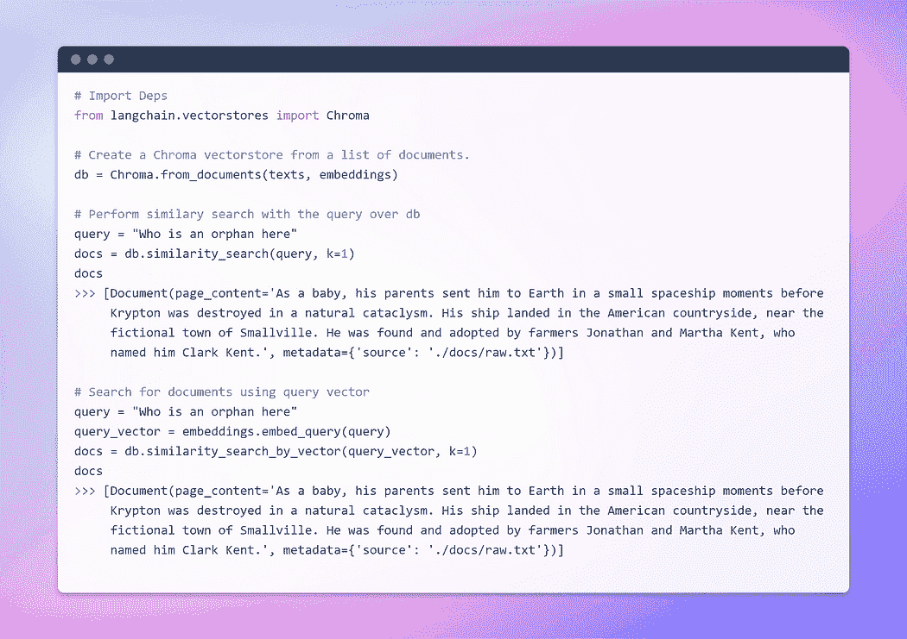

图片由作者提供：创建向量存储

到目前为止，我们已经见证了嵌入和向量存储在从大量文档集合中检索相关片段方面的显著能力。现在，时机已到，我们将把这个检索到的片段与查询一起作为上下文呈现给 LLM。挥动它的魔法棒，我们将请求 LLM 基于我们提供的信息生成答案。关键在于提示结构。

然而，必须强调结构良好的提示的重要性。通过制定精心设计的提示，我们可以减轻 LLM 在面对不确定性时可能出现的**幻觉**——即它可能发明事实。

在不再拖延的情况下，让我们进入最后阶段，看看我们的 LLM 是否能够生成引人注目的答案。时刻来临，见证我们的努力成果并揭示结果吧。我们出发了？

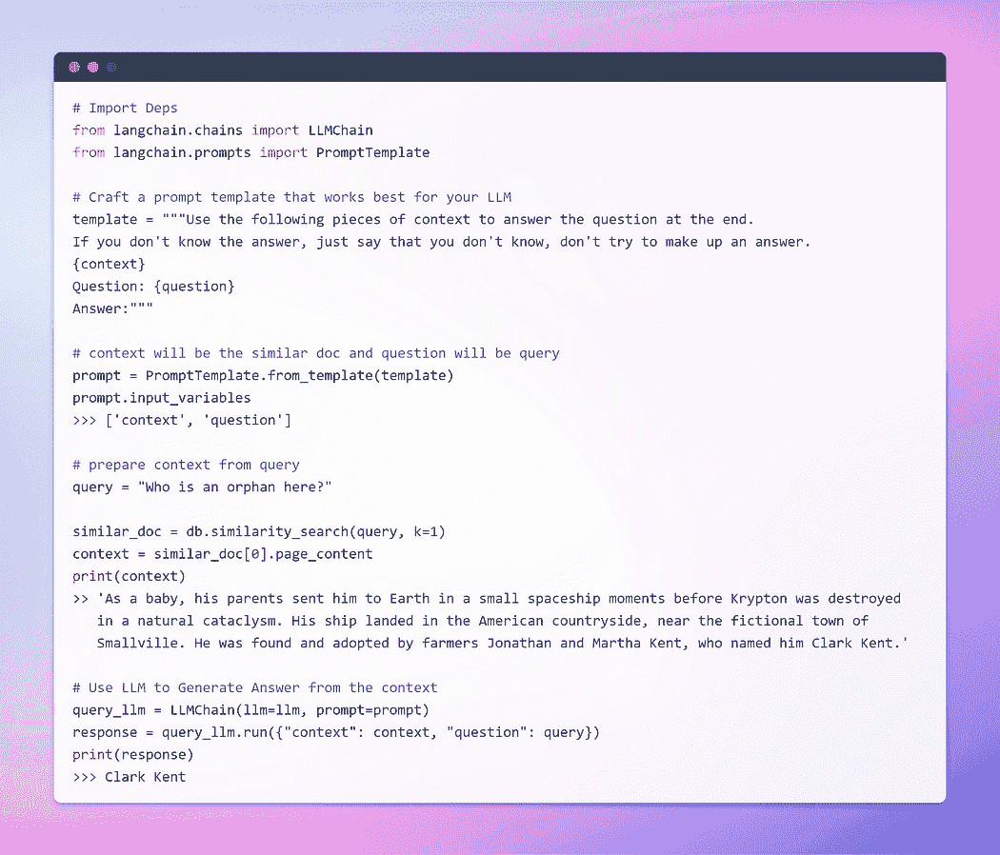

图片由作者提供：与文档的问答

这是我们一直期待的时刻！我们成功了！我们刚刚构建了我们自己的问答机器人，利用本地运行的 LLM。

# 第五部分：使用 Streamlit 链式操作

这一部分完全是可选的，因为它并不是 Streamlit 的全面指南。我不会深入探讨这一部分；相反，我会展示一个基本应用，允许用户上传任何文本文件。然后，他们可以通过文本输入提问。幕后功能将与我们在上一部分中讨论的保持一致。

然而，在 Streamlit 中处理文件上传时有一个警告。为了防止潜在的内存不足错误，特别是考虑到 LLM 的内存密集型特性，我将简单地读取文档并将其写入我们文件结构中的临时文件夹，命名为`**raw.txt.**`。这样，无论文档的原始名称是什么，Textloader 将在未来无缝处理它。

目前，该应用程序设计用于文本文件，但你可以将其适应于 PDF、CSV 或其他格式。基本概念保持不变，因为 LLM 主要用于文本输入和输出。此外，你可以尝试不同的由 Llama C++ 绑定支持的 LLM。

不再深入复杂的细节，我提供了应用程序的代码。随意自定义以适应你的特定用例。

这是 streamlit 应用程序的外观。

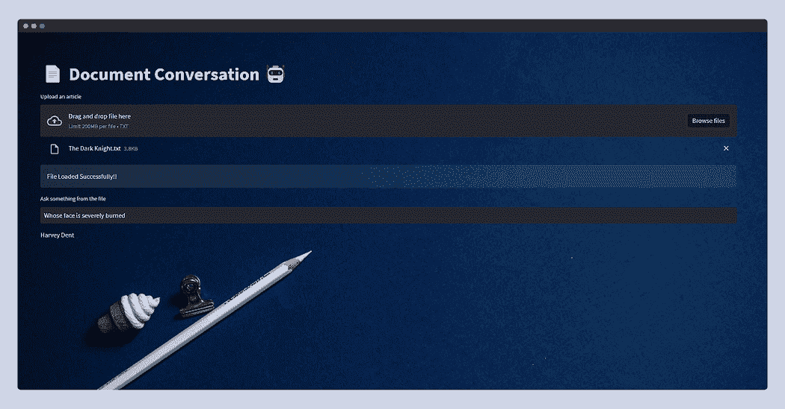

这次我提供了从 Wiki 复制的**《黑暗骑士》**的情节，并仅仅问了**“谁的脸被严重烧伤？”**，LLM 回复了——**哈维·丹特**。

好了，好了，好了！至此，我们博客的内容就结束了。

希望你喜欢这篇文章！并觉得它既有信息量又有趣。你可以**关注我**[Afaque Umer](https://medium.com/u/430bc504f9d9)以获得**更多**此类文章。

我将尝试引入更多**机器学习/数据科学概念**，并尝试将复杂的术语和概念拆解成更简单的形式。

**[Afaque Umer](https://www.linkedin.com/in/afaque-umer/)** 是一位充满激情的机器学习工程师。他喜欢利用最新技术解决新挑战，寻找高效的解决方案。让我们一起推动 AI 的边界！

[原文](https://ai.plainenglish.io/%EF%B8%8F-langchain-streamlit-llama-bringing-conversational-ai-to-your-local-machine-a1736252b172)。已获授权转载。

### 更多相关话题

+   [Llama, Llama, Llama：使用你的内容进行本地 RAG 的 3 个简单步骤](https://www.kdnuggets.com/3-simple-steps-to-local-rag-with-your-content)

+   [对话式 AI 开发中的 3 个关键挑战及如何避免](https://www.kdnuggets.com/3-crucial-challenges-in-conversational-ai-development-and-how-to-avoid-them)

+   [使用 Streamlit 的 DIY 自动化机器学习](https://www.kdnuggets.com/2021/11/diy-automated-machine-learning-app.html)

+   [Streamlit 机器学习备忘单](https://www.kdnuggets.com/2023/01/streamlit-machine-learning-cheat-sheet.html)

+   [使用 HuggingFace Pipelines 和 Streamlit 回答问题](https://www.kdnuggets.com/2021/10/simple-question-answering-web-app-hugging-face-pipelines.html)

+   [将 Streamlit WebApp 部署到 Heroku 使用 DAGsHub](https://www.kdnuggets.com/2022/02/deploying-streamlit-webapp-heroku-dagshub.html)
