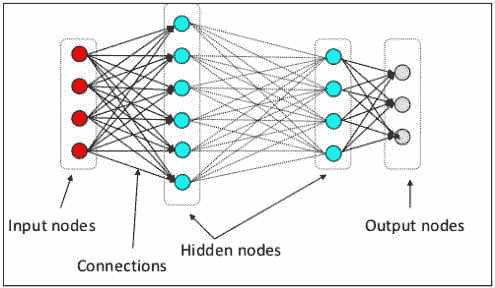
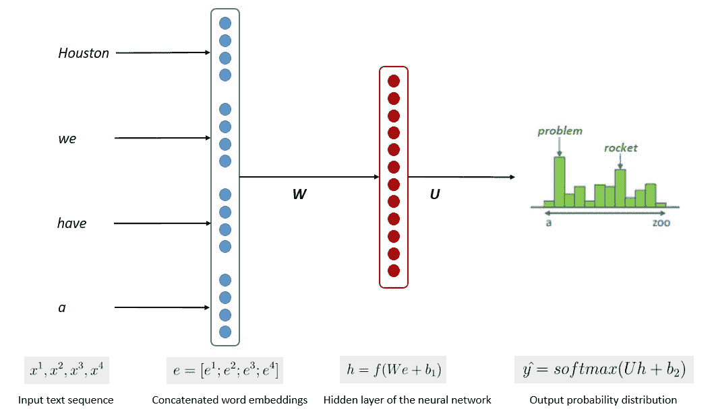
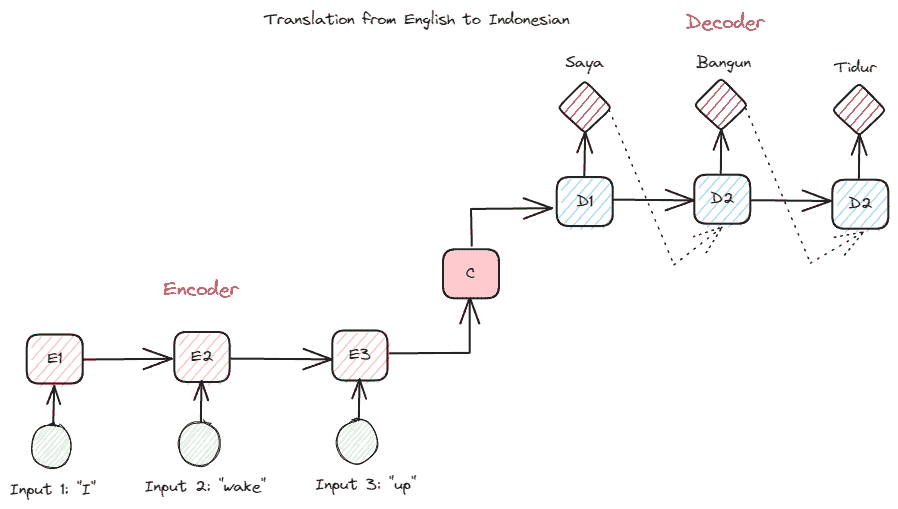
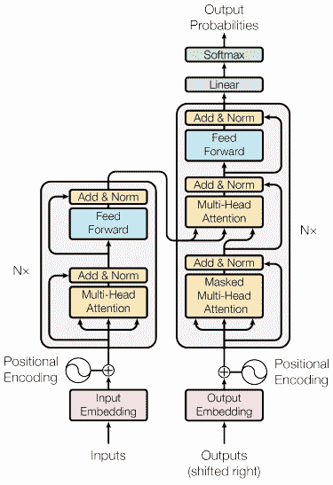
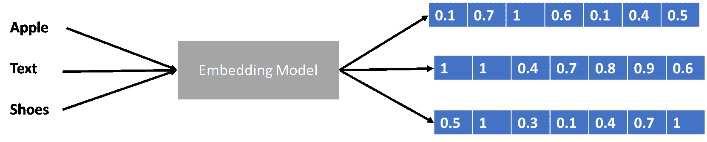

# 大型语言模型在三个难度级别中的解释

> 原文：[`www.kdnuggets.com/large-language-models-explained-in-3-levels-of-difficulty`](https://www.kdnuggets.com/large-language-models-explained-in-3-levels-of-difficulty)

我们生活在一个机器学习模型处于巅峰的时代。与几十年前相比，大多数人可能从未听说过 ChatGPT 或人工智能。然而，这些正是人们不断讨论的话题。为什么？因为它们所带来的价值与投入的努力相比是如此显著。

近年来，人工智能的突破可以归因于许多因素，但其中之一就是大型语言模型（LLM）。许多文本生成 AI 都依赖于 LLM 模型；例如，ChatGPT 使用的是他们的 GPT 模型。由于 LLM 是一个重要的话题，我们应该了解它。

* * *

## 我们的前三大课程推荐

 1\. [谷歌网络安全证书](https://www.kdnuggets.com/google-cybersecurity) - 快速进入网络安全职业生涯。

 2\. [谷歌数据分析专业证书](https://www.kdnuggets.com/google-data-analytics) - 提升你的数据分析技能

 3\. [谷歌 IT 支持专业证书](https://www.kdnuggets.com/google-itsupport) - 支持你的组织 IT

* * *

本文将讨论大型语言模型（LLM）的三个难度级别，但我们只会触及 LLM 的一些方面。我们将以一种使每位读者都能理解 LLM 是什么的方式进行讨论。考虑到这一点，我们开始吧。

# 第 1 级：LLM 初学者级别

在第一个级别，我们假设读者对 LLM 不了解，并可能对数据科学/机器学习领域有所了解。因此，我将简要介绍人工智能和机器学习，然后再转到 LLM。

[人工智能](https://en.wikipedia.org/wiki/Artificial_intelligence)是开发智能计算机程序的科学。它旨在使程序能够执行人类可以做的智能任务，但不受人类生物需求的限制。[机器学习](https://en.wikipedia.org/wiki/Machine_learning)是人工智能的一个领域，专注于利用统计算法进行数据泛化研究。从某种意义上说，机器学习通过数据研究来实现人工智能，使程序能够在没有指令的情况下执行智能任务。

历史上，计算机科学和语言学交叉的领域称为自然[语言处理](https://en.wikipedia.org/wiki/Natural_language_processing)领域。该领域主要涉及机器对人类文本（如文本文件）的处理活动。之前，该领域仅限于基于规则的系统，但随着先进的半监督和无监督算法的引入，该领域得到了扩展，使模型能够在没有任何指导的情况下学习。其中一个先进模型是语言模型。

语言[模型](https://en.wikipedia.org/wiki/Language_model)是一个概率性 NLP 模型，用于执行许多类似翻译、语法纠正和文本生成的人类任务。旧形式的语言模型使用纯统计方法，如 n-gram 方法，其中假设下一个词的概率仅依赖于前一个词的固定大小数据。

然而，[神经网络](https://en.wikipedia.org/wiki/Artificial_neural_network)的引入已经取代了以前的方法。人工神经网络，或称 NN，是一种模拟人脑神经结构的计算机程序。神经网络方法之所以好用，是因为它可以处理复杂的模式识别和文本数据的序列数据。这就是为什么当前的语言模型通常基于 NN。

[大型语言模型](https://en.wikipedia.org/wiki/Large_language_model)，或 LLMs，是通过从大量数据文档中学习来执行通用语言生成的机器学习模型。它们仍然是语言模型，但 NN 学到的大量参数使它们被认为是大型的。通俗来说，该模型通过从给定的输入词预测下一个词来非常好地模拟人类的写作方式。

LLM 任务的例子包括语言翻译、机器聊天机器人、问答等。从任何数据输入序列中，模型可以识别单词之间的关系，并生成符合指令的输出。

几乎所有声称使用文本生成的生成式 AI 产品都由 LLMs 驱动。像 ChatGPT、Google 的 Bard 等大型产品都以 LLMs 为基础。

# 第二级：LLM 中级水平

读者具有数据科学知识，但需要在此级别上进一步了解 LLM。至少，读者能够理解数据领域中使用的术语。在这个层面上，我们将更深入地探讨基础架构。

如前所述，LLM 是一个在大量文本数据上训练的神经网络模型。要进一步理解这一概念，了解神经网络和深度学习的工作原理将是有益的。

在前一层中，我们解释了神经元是模仿人脑神经结构的模型。神经网络的主要元素是神经元，通常称为节点。为了更好地解释这一概念，请参见下面图像中的典型神经网络架构。

神经网络架构（图片来源：KDnuggets）

如上图所示，神经网络由三层组成：

1.  输入层接收信息并将其传输到下一层的其他节点。

1.  隐藏节点层是所有计算发生的地方。

1.  输出节点层是计算结果所在的地方。

当我们用两个或更多隐藏层训练神经网络模型时，这称为深度学习。之所以叫深度，是因为它使用了许多层。深度学习模型的优势在于它们能够自动学习和提取数据中的特征，而传统的机器学习模型则无法做到这一点。

在大语言模型中，深度学习非常重要，因为该模型建立在深度神经网络架构之上。那么，为什么它叫 LLM 呢？因为数十亿层在大量文本数据上进行训练。这些层会产生模型参数，帮助模型学习语言中的复杂模式，包括语法、写作风格等等。

模型训练的简化过程如下面的图像所示。

图片来源：Kumar Chandrakant（来源：[Baeldung.com](https://www.baeldung.com/cs/large-language-models)）

过程显示模型可以根据输入数据中每个单词或句子的可能性生成相关文本。在 LLM 中，先进的方法使用 [自监督学习](https://en.wikipedia.org/wiki/Self-supervised_learning) 和 [半监督学习](https://en.wikipedia.org/wiki/Weak_supervision) 来实现通用能力。

自监督学习是一种技术，其中我们没有标签，而是训练数据提供了训练反馈。它在 LLM 训练过程中被使用，因为数据通常缺乏标签。在 LLM 中，可以利用周围的上下文作为线索来预测下一个单词。相比之下，半监督学习将监督学习和无监督学习概念结合起来，使用少量标记数据为大量未标记数据生成新标签。半监督学习通常用于具有特定上下文或领域需求的 LLM。

# 第 3 层：LLM 高级

在第三层，我们将更深入地讨论 LLM，特别是探讨 LLM 结构以及它如何实现类似人类的生成能力。

我们已经讨论了 LLM 基于深度学习技术的神经网络模型。近年来，LLM 通常基于 [变压器](https://en.wikipedia.org/wiki/Transformer_(machine_learning_model)) 架构构建。变压器基于 [Vaswani *et al.* (2017)](https://arxiv.org/pdf/1706.03762.pdf) 引入的多头注意力机制，并已被许多 LLM 使用。

变压器是一种模型架构，旨在解决 RNN 和 LSTM 之前遇到的序列任务。语言模型的旧方法是使用 RNN 和 LSTM 顺序处理数据，模型会使用每个词输出并将其回环，以免遗忘。然而，一旦引入变压器，这些方法在长序列数据上会出现问题。

在深入了解变压器之前，我想介绍一下以前在 RNN 中使用的编码器-解码器概念。编码器-解码器结构允许输入和输出文本长度不同。一个示例用例是语言翻译，它通常具有不同的序列大小。

该结构可以分为两部分。第一部分称为编码器，它接收数据序列并基于它创建新的表示。该表示将在模型的第二部分，即解码器中使用。

图片由作者提供

RNN 的问题在于，即使在上述编码器-解码器结构下，模型可能仍难以记住较长的序列。这时，注意力机制可以帮助解决这个问题，它是一种能够解决长输入问题的层。注意力机制在 [Bahdanau *et al*. (2014)](https://arxiv.org/abs/1409.0473) 的论文中被引入，用于通过关注模型输入的重要部分来解决编码器-解码器类型的 RNN 问题，同时进行输出预测。

变压器的结构受编码器-解码器类型的启发，并采用注意力机制技术构建，因此无需按顺序处理数据。整体变压器模型的结构如下面的图像所示。

变压器架构（[Vaswani *et al.* (2017)](https://arxiv.org/pdf/1706.03762.pdf)）

在上述结构中，变压器将数据向量序列编码为词嵌入，同时使用解码将数据转换为原始形式。编码可以利用注意力机制为输入分配一定的重要性。

我们稍微谈了一下变换器如何编码数据向量，但什么是数据向量呢？让我们来讨论一下。在机器学习模型中，我们不能将原始自然语言数据输入模型，因此我们需要将其转化为数字形式。这一转换过程称为词嵌入，其中每个输入单词都通过词嵌入模型处理以获取数据向量。我们可以使用许多初始词嵌入，如 [Word2vec](https://en.wikipedia.org/wiki/Word2vec) 或 [GloVe](https://nlp.stanford.edu/projects/glove/)，但许多高级用户尝试使用他们自己的词汇来精细调整它们。在基本形式下，词嵌入过程可以在下图中展示。

作者提供的图片

变换器可以接受输入，并通过以数字形式呈现单词来提供更相关的上下文，如上面的数据向量。在大语言模型（LLMs）中，词嵌入通常是依赖上下文的，通常会根据使用案例和预期输出进行精细调整。

# 结论

我们以三个难度级别讨论了大型语言模型，从初学者到高级用户。从 LLM 的一般使用到其结构，你可以找到更详细解释这个概念的说明。

****[Cornellius Yudha Wijaya](https://www.linkedin.com/in/cornellius-yudha-wijaya/)**** 是一名数据科学助理经理和数据撰稿人。在全职工作于 Allianz Indonesia 的同时，他喜欢通过社交媒体和写作媒体分享 Python 和数据技巧。Cornellius 撰写了各种人工智能和机器学习主题的文章。

### 更多相关话题

+   [估算机器学习碳足迹的难度](https://www.kdnuggets.com/2022/07/difficulty-estimating-carbon-footprint-machine-learning.html)

+   [顶级开源大型语言模型](https://www.kdnuggets.com/2022/09/john-snow-top-open-source-large-language-models.html)

+   [了解大型语言模型](https://www.kdnuggets.com/2023/03/learn-large-language-models.html)

+   [介绍来自 John Snow Labs 的医疗保健特定大型语言模型](https://www.kdnuggets.com/2023/04/john-snow-introducing-healthcare-specific-large-language-models-john-snow-labs.html)

+   [大型语言模型是什么？它们是如何工作的？](https://www.kdnuggets.com/2023/05/large-language-models-work.html)

+   [人工智能：大型语言与视觉模型](https://www.kdnuggets.com/2023/06/ai-large-language-visual-models.html)
