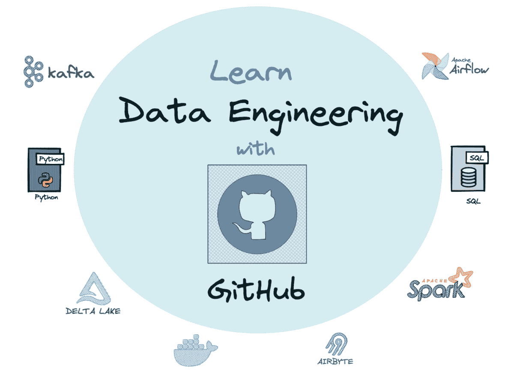

# 从这些 GitHub 仓库中学习数据工程

> 原文：[`www.kdnuggets.com/2023/02/learn-data-engineering-github-repositories.html`](https://www.kdnuggets.com/2023/02/learn-data-engineering-github-repositories.html)

作者提供的图片

如果你希望进入数据领域，特别是数据工程 - 那么这个博客可以为你的学习提供有价值的资源。首先，让我们简要区分数据科学家和数据工程师之间的区别。

* * *

## 我们的前三大课程推荐

 1\. [谷歌网络安全证书](https://www.kdnuggets.com/google-cybersecurity) - 快速进入网络安全职业生涯。

 2\. [谷歌数据分析专业证书](https://www.kdnuggets.com/google-data-analytics) - 提升你的数据分析技能

 3\. [谷歌 IT 支持专业证书](https://www.kdnuggets.com/google-itsupport) - 支持你的组织的 IT 需求

* * *

数据科学家的主要工作是探索数据、构建模型以及实施机器学习算法。数据工程师的主要工作是确保构建的算法在生产环境中有效运行，并创建数据管道。

数据工程师负责组织数据基础设施的所有相关工作。这些基础设施将存储业务的关键信息，从小型数据库到大规模系统。目标是确保数据的基础稳固且安全，以便进行关键分析和生成报告。

如果你仍然渴望学习数据工程，这里有一些有价值的 GitHub 仓库可以帮助你。

# DataTalks.Club - data-engineering-zoomcamp

仓库链接：[data-engineering-zoomcamp](https://github.com/DataTalksClub/data-engineering-zoomcamp)

正如名字所示，DataTalksClub 是一个全球数据爱好者的在线社区，讨论关于数据的所有话题。他们有一个 9 周的课程表来帮助你学习数据工程。每周的内容如下：

+   [第 1 周：介绍与前提条件](https://github.com/DataTalksClub/data-engineering-zoomcamp#week-1-introduction--prerequisites)

+   [第 2 周：数据摄取](https://github.com/DataTalksClub/data-engineering-zoomcamp#week-2-data-ingestion)

+   [第 3 周：数据仓库](https://github.com/DataTalksClub/data-engineering-zoomcamp#week-3-data-warehouse)

+   [第 4 周：分析工程](https://github.com/DataTalksClub/data-engineering-zoomcamp#week-4-analytics-engineering)

+   [第 5 周：批处理](https://github.com/DataTalksClub/data-engineering-zoomcamp#week-5-batch-processing)

+   [第 6 周：流数据处理](https://github.com/DataTalksClub/data-engineering-zoomcamp#week-6-streaming)

+   [第 7, 8 & 9 周：项目](https://github.com/DataTalksClub/data-engineering-zoomcamp#week-7-8--9-project)

你可以加入下一个班次，但你也可以在自己的时间内完成。所有课程材料都是免费的，DataTalks.Club 提供了一个逐周的建议大纲来帮助你。

# 食谱

仓库链接: [食谱](https://github.com/andkret/Cookbook)

《数据工程食谱》的作者安德雷亚斯·克雷茨在 GitHub 上发布了这本书。他的目标是为数据工程领域的新手提供一个起点，帮助你识别成为成功的数据工程师所需学习的重要主题。

这本书重点介绍了五种不同类型的内容，帮助你了解数据工程：作者发布的文章、他们播客节目的链接（视频和音频）、他推荐的 200 多个有用网站链接、数据工程面试问题和案例研究。

# 数据工程指南

仓库链接: [数据工程指南](https://github.com/adilkhash/Data-Engineering-HowTo)

如果你需要关于成为数据工程师所需学习的不同主题的指导，数据工程指南为你提供了一份不同资源的清单，让你可以获得有用的数据工程知识。

该仓库从数据工程的基本概念开始，例如需求层次、初学者指南等。还有关于讲座、算法与数据结构、SQL、编程、数据库、分布式系统、书籍、课程、博客、工具、云平台等的资源。

# 优秀的数据工程

仓库链接: [优秀的数据工程](https://github.com/igorbarinov/awesome-data-engineering)

如果你对数据工程的基础知识有良好的基础，或者需要更好地关注工具，这个 GitHub 仓库为你提供了一个精心策划的数据工程工具清单，涵盖了你可能遇到的工具类型。

要成为一名成功的数据工程师，你需要对工具有信心。这个仓库涵盖了所有类型的工具，包括：

1.  [数据库](https://github.com/igorbarinov/awesome-data-engineering#databases)

1.  [数据摄取](https://github.com/igorbarinov/awesome-data-engineering#data-ingestion)

1.  [文件系统](https://github.com/igorbarinov/awesome-data-engineering#file-system)

1.  [序列化格式](https://github.com/igorbarinov/awesome-data-engineering#serialization-format)

1.  [流处理](https://github.com/igorbarinov/awesome-data-engineering#stream-processing)

1.  [批处理](https://github.com/igorbarinov/awesome-data-engineering#batch-processing)

1.  [图表和仪表板](https://github.com/igorbarinov/awesome-data-engineering#charts-and-dashboards)

1.  [工作流](https://github.com/igorbarinov/awesome-data-engineering#workflow)

1.  [数据湖管理](https://github.com/igorbarinov/awesome-data-engineering#data-lake-management)

1.  [ELK Elastic Logstash Kibana](https://github.com/igorbarinov/awesome-data-engineering#elk-elastic-logstash-kibana)

1.  [Docker](https://github.com/igorbarinov/awesome-data-engineering#docker)

1.  [数据集](https://github.com/igorbarinov/awesome-data-engineering#datasets)

1.  [监控](https://github.com/igorbarinov/awesome-data-engineering#monitoring)

1.  [社区](https://github.com/igorbarinov/awesome-data-engineering#community)

# 数据工程师路线图

仓库链接: [data-engineer-roadmap](https://github.com/datastacktv/data-engineer-roadmap)

如果你是一个视觉型学习者，需要帮助来确定成为成功数据工程师的路线——这个库适合你。它提供了现代数据工程领域的完整可视化，并作为学习指南。

仓库的作者表示：

“初学者不必对这里列出的众多工具和框架感到不知所措。一个典型的数据工程师会在几年的时间内掌握这些工具的一个子集，这取决于他的公司和职业选择。”

总体而言，这个路线图可视化是一个有效的学习大纲，适用于有志于成为数据工程师的人。

# 开始数据工程

仓库链接: [Start Data Engineering](https://github.com/josephmachado)

如果你对自己的数据工程技能感到自信并希望开始测试它们。Joseph Machado 讲述了有关数据工程、数据建模、软件工程和系统设计的内容。

他为你提供了一步步的指南，帮助你开始项目，这对于你的数据工程学习以及作为你申请工作的作品集都是有用的。

# 数据工程项目

仓库链接: [Data-Engineering-Projects](https://github.com/alanchn31/Data-Engineering-Projects)

如果你在寻找更多应用于数据工程原则的项目，这个 GitHub 库提供了以下 7 种不同类型的项目：

1.  Postgres ETL

1.  Cassandra ETL

1.  使用 Scrapy 进行网页抓取，MongoDB ETL

1.  使用 AWS Redshift 进行数据仓库处理

1.  使用 Spark 和 AWS S3 的数据湖

1.  使用 Airflow 进行数据管道处理

1.  关键项目

# 数据工程面试问题

仓库链接: [data-engineering-interview-questions](https://github.com/OBenner/data-engineering-interview-questions)

假设你对自己的数据工程技能感到自信，已经进行过实践，现在准备申请你一直努力争取的工作。你需要为可能在面试中出现的问题做好准备。

这个 GitHub 库包含了 2000 多个问题，帮助你准备数据工程师面试。它们还提供了答案，让你了解你在数据工程中的强项和弱项。

# 结论

上述 GitHub 资源将帮助你迅速成为成功的数据工程师。如果你需要学习路线图，可以阅读 完整的数据工程学习路线图。它为你提供了一个主题、领域和资源的清单，帮助你在数据工程的旅程中前进。

**[Nisha Arya](https://www.linkedin.com/in/nisha-arya-ahmed/)** 是一名数据科学家和自由撰稿人。她特别关注提供数据科学职业建议或教程以及数据科学理论知识。她还希望探索人工智能如何有助于延长人类寿命。作为一个渴望学习的者，她希望拓宽技术知识和写作技能，同时帮助指导他人。

### 更多相关话题

+   [从这些 GitHub 仓库学习数据科学](https://www.kdnuggets.com/2022/12/learn-data-science-github-repositories.html)

+   [从这些 GitHub 仓库学习机器学习](https://www.kdnuggets.com/2023/01/learn-machine-learning-github-repositories.html)

+   [从这些 GitHub 仓库学习 MLOps](https://www.kdnuggets.com/2023/02/learn-mlops-github-repositories.html)

+   [掌握数据工程的 10 个 GitHub 仓库](https://www.kdnuggets.com/10-github-repositories-to-master-data-engineering)

+   [掌握数据科学的 10 个 GitHub 仓库](https://www.kdnuggets.com/10-github-repositories-to-master-data-science)

+   [掌握机器学习的 10 个 GitHub 仓库](https://www.kdnuggets.com/10-github-repositories-to-master-machine-learning)
