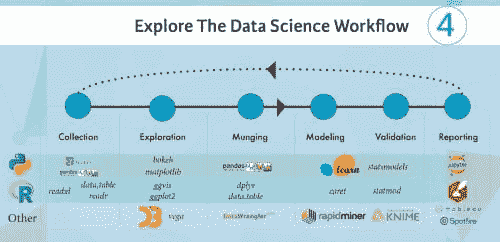

# 以 8 个（简单的）步骤学习数据科学

> 原文：[`www.kdnuggets.com/2016/10/learn-data-science-8-steps.html/2`](https://www.kdnuggets.com/2016/10/learn-data-science-8-steps.html/2)

**第 3 步\. 理解数据库**

当你开始学习数据科学时，你会发现很多教程专注于从平面文件中提取数据。然而，当你开始工作或接触到行业本身时，你会发现大部分工作是通过与一个或多个数据库的连接来完成的。

* * *

## 我们的三大课程推荐

 1\. [Google 网络安全证书](https://www.kdnuggets.com/google-cybersecurity) - 快速进入网络安全职业生涯。

 2\. [Google 数据分析专业证书](https://www.kdnuggets.com/google-data-analytics) - 提升你的数据分析技能

 3\. [Google IT 支持专业证书](https://www.kdnuggets.com/google-itsupport) - 支持你的组织进行 IT 工作

* * *

而且，市场上有很多数据库。公司可能会使用像 Oracle 这样的商业数据库，也可能会选择开源替代品。这里的关键是理解数据库的工作原理。了解数据库的原理和方法，之后你会掌握相关的内容。你应该掌握的概念包括关系数据库管理系统（RDBMS）和数据仓库。这意味着关系建模与维度建模应该不会对你造成困扰，SQL 或抽取-转换-加载过程（ETL）也不应让你感到意外。

如果你想学习如何理解数据库的工作原理，你应该查看 [Mongo DB 大学](https://university.mongodb.com/courses)、[斯坦福在线](http://online.stanford.edu/) 的 “[数据库简介](https://lagunita.stanford.edu/courses/Engineering/db/2014_1/about)” 课程以及 [DataStax](https://academy.datastax.com/) 和 [TutorialsPoint](https://www.tutorialspoint.com/database_tutorials.htm) 的教程。

**第 4 步\. 探索数据科学工作流程**

学习过程的下一阶段是探索数据科学工作流程。许多教程或课程仅关注其中的一两个方面，但失去了作为数据科学家或数据科学团队成员时需要经历的整体流程。至关重要的是不要忽视数据科学的迭代过程。

对于那些会编程的数据科学初学者来说，了解数据科学工作流程的最简单方法是通过练习你的编程技能：可以从 [R](https://www.r-project.org/) 或 [Python](https://www.python.org/) 开始你的学习之旅。这里有几个包和库，旨在让你的编码生活更轻松。请查看下面的信息图片段：

对于那些仍然觉得自己黑客技能不足的初学者来说，值得查看一些不需要你编写所有代码的开源替代方案。这些工具将允许你在数据科学工作流程中同时完成多个步骤。例如，[RapidMiner](https://rapidminer.com/)允许你导入或收集数据，对其进行一些操作以清理数据，建模和评估。请注意，了解如何使用这些工具很重要，但你仍然应该继续提高你的编码技能！

**步骤 5. 利用大数据提升水平**

许多学习者过于关注他们所谓的数据科学“基础”，以至于忽略了更大的图景。字面上讲。你在之前的章节中得到了一些关于这一点的提示，但存在差异。就像你在许多教程中使用的平面文件与行业中使用的数据库之间的差异一样，数据的速度、多样性和规模也是如此。这是一个你不能也不应错过的现实。

大数据可能曾经是一个炒作的话题，但它确实存在，理解其涵盖的内容是非常重要的。了解大数据的三件事是：

1.  了解为什么大数据需要不同的数据处理方法。最好的方法可能是查看大数据的实际应用案例。你可以在[这里](https://www-01.ibm.com/software/data/bigdata/use-cases.html)阅读一些。

1.  熟悉一下[Hadoop](http://hadoop.apache.org/)框架：它广泛用于分布式数据存储和处理。

1.  不要忘记[Spark](http://spark.apache.org/)。掌握结合 Python 或 Scala 使用 Spark 的方法是关键。而且，更好的是，你一举两得：你既能练习编码技能，又能拓宽对数据科学的视野。

**步骤 6. 成长、连接和学习**

*成长*。一旦你掌握了基础知识，就该开始成长了：通过参与数据科学挑战（比如在[Kaggle](https://www.kaggle.com/)或[DrivenData](https://www.drivendata.org/)上找到的那些）尽可能多地进行实践。它们将挑战你将理论付诸实践。此外，你还应该让你的直觉成长。

*连接*。作为数据科学学习者，你可能会陷入只关注自己的学习和其他学习者的学习的陷阱，但与那些在这个领域已有更多经验的人建立联系同样重要。这样，你可以建立一个可以在有问题、需要建议或提示时依靠的网络。这些人将激励你保持良好的学习状态，并挑战你更进一步。

*学习*。持续学习和数据科学几乎可以算是同义词。上述提到的[Kaggle](https://www.kaggle.com/)和[DrivenData](https://www.drivendata.org/)挑战将教会你一些关于数据科学实践的知识。除了这些相对较小的练习外，你还可以考虑启动一个个人项目，并更深入地探索一些内容。

**第 7 步：彻底沉浸自己**

就像语言沉浸一样，你需要一个数据科学的沉浸。根据你已经拥有的技能和知识，你可以考虑参加训练营、实习或找一份工作。训练营是启动或提升你数据科学学习的绝佳方式。作为额外的好处，你将遇到很多人，并有机会建立或扩展你的网络。如果你在寻找训练营时遇到困难，可以查看[Galvanize](http://www.galvanize.com/)和[Metis](http://www.thisismetis.com/)，但也不要忘记你的[Meetup](http://www.meetup.com/)小组可能也会为社区组织训练营和研讨会！

其次，当你已经掌握了数据科学的基础知识后，你应该考虑寻找一个实习机会。许多大公司如[Facebook](https://www.facebook.com/)、[Quora](https://www.quora.com/)和[Amazon](https://www.amazon.com/)之前都曾招募实习生，所以这是一个很好的开始寻找的地方。此外，你可以利用你的社交渠道或人脉网络来获取有关实习职位的第一手信息。最后，也可以关注初创公司：这些较小的公司愿意让你在工作中学习，只要你能快速学习。[AngelList](https://angel.co/jobs)值得查看以获取初创公司职位的信息。

最后的沉浸选项是大多数学习者经历瓶颈的地方，正如最近在“数据科学面试”中的搜索趋势所证实的那样。即使你可能对数据科学家的职位非常热情，但在寻找工作时必须牢记几点：

+   职位发布并不总是准确的。他们可能会发布一个“数据科学家”职位，但实际上他们可能在寻找数据工程师或业务分析师。查看 DataCamp 的[数据行业：谁做什么](https://www.datacamp.com/community/tutorials/data-science-industry-infographic)信息图，了解公司在发布职位时的要求。

+   调整你的期望：如果你没有真实的数据科学工作流程、数据库或端到端开发经验，那么直接从数据科学家或分析师职位入手是不现实的。确保在申请时你有相关的经验可供展示。

如果你不能立即找到工作，不要灰心。相反，尽量确保你保持忙碌，积累经验，并关注那些之前发布过数据科学职位的公司，比如[Google](https://www.google.com/)、[Microsoft](http://www.microsoft.com/)和[Twitter](https://www.twitter.com/)。

**第 8 步：与社区互动**

最后一步有时会被忽视。即使你在数据科学领域或者作为数据科学家有了工作，你仍然需要记住，数据科学等同于持续学习。时刻有新的进展，保持对周围发生的事情的关注和好奇是关键。因此，不要犹豫参与社交媒体讨论，订阅新闻通讯，关注数据科学行业的关键人物，收听播客……任何可以让你与社区互动的方式！

为了跟上最新的动态，你可以注册以下新闻通讯：双月刊 KD Nuggets 新闻通讯和[Data Elixir](http://www.dataelixir.com/)或[Data Science Weekly](http://www.datascienceweekly.org/)新闻通讯。接着，在[Twitter](https://www.twitter.com/)上关注一些数据科学行业的关键人物。这也会帮助你跟上最新动态。一些可能会引起你兴趣的人物包括[DJ Patil](https://twitter.com/DJ44)、[Andrew Ng](https://twitter.com/AndrewYNg)和[Ben Lorica](https://twitter.com/bigdata)。

加入一些在线社区。LinkedIn、Facebook、Reddit……这些平台都提供了与同行联系的机会。你应该抓住机会成为这些小组中的一员：

+   在[LinkedIn](http://www.linkedin.com/)上，务必查看“Big Data, Analytics, Business Intelligence”、“Big Data Analytics”、“Data Scientists”或“Data Mining, Statistics, Big Data, Data Visualization, and Data Science”这些小组。

+   在[Facebook](https://www.facebook.com/)上，"Beginning Data Science, Analytics, Machine Learning, Data Mining, R, Python"和"Learn Python"这些小组可能会引起你的兴趣。

+   你可以关注的[Subreddits](http://www.reddit.com/)包括“/r/datascience”、“/r/rstats”和“/r/python”，还有很多其他的！

这个列表只是一个指引，并不是详尽无遗的！如果你想查看更多资源的概述，可以[点击这里](https://www.datacamp.com/community/tutorials/learn-data-science-resources-for-python-r)。

最后，别忘了为你加入的社区做出贡献！

**在 DataCamp 上**

[DataCamp](https://www.datacamp.com/) 是一个在线互动教育平台，专注于为数据科学提供最佳学习体验。我们的课程涉及[R](https://www.datacamp.com/courses?learn=r_programming)、[Python](https://www.datacamp.com/courses?learn=python_programming) 和 [数据科学](https://www.datacamp.com/courses)等主题，结合视频讲解和浏览器内编程挑战，使你能够通过实践学习。[你可以随时随地免费开始每门课程](https://www.datacamp.com/courses)。

**简介：[Karlijn Willems](https://www.linkedin.com/in/karlijnwillems)** 是一名数据科学记者，专注于数据科学教育、最新新闻和热门趋势，并为[DataCamp 社区](https://www.datacamp.com/community/authors/karlijn-willems)撰写文章。她拥有文学与语言学及信息管理方面的学位。

**相关**:

+   团队的 4 个在线数据科学培训选项

+   数据分析与数据科学 Python 学习综合指南

+   最佳数据科学在线课程

### 相关主题

+   [使用 Python 构建 AI 应用程序的 10 个简单步骤](https://www.kdnuggets.com/build-an-ai-application-with-python-in-10-easy-steps)

+   [用 Python 构建命令行应用程序的 7 个简单步骤](https://www.kdnuggets.com/build-a-command-line-app-with-python-in-7-easy-steps)

+   [用 Docker 容器化 Python 应用程序的 5 个简单步骤](https://www.kdnuggets.com/containerize-python-apps-with-docker-in-5-easy-steps)

+   [Python 数据预处理简单指南](https://www.kdnuggets.com/2020/07/easy-guide-data-preprocessing-python.html)

+   [TensorFlow 计算机视觉 - 迁移学习轻松实现](https://www.kdnuggets.com/2022/01/tensorflow-computer-vision-transfer-learning-made-easy.html)

+   [选择合适的机器学习算法简单指南](https://www.kdnuggets.com/2020/05/guide-choose-right-machine-learning-algorithm.html)
