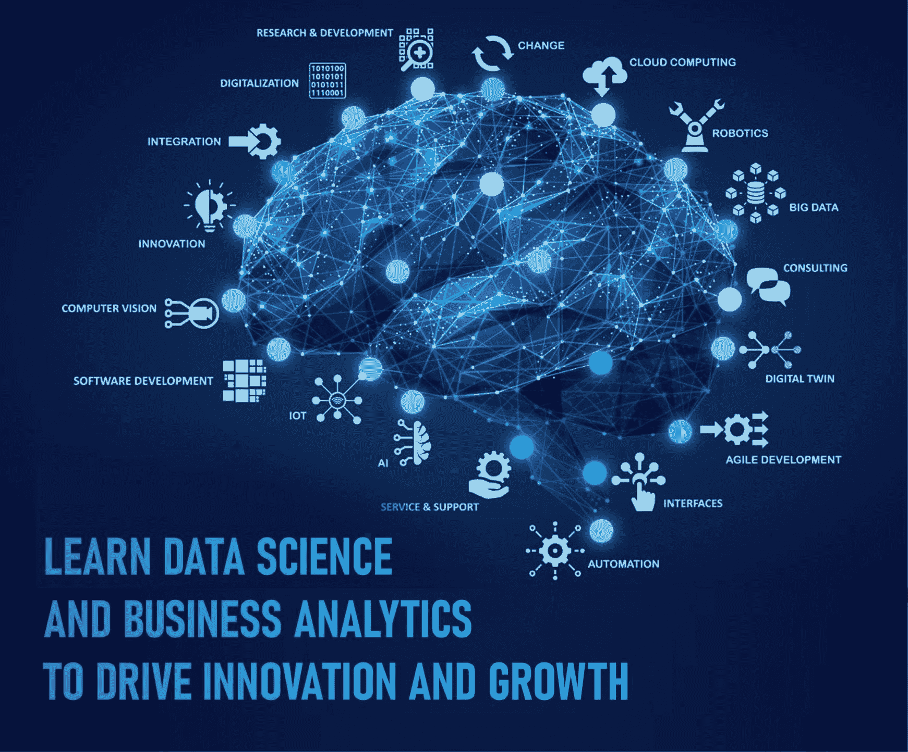
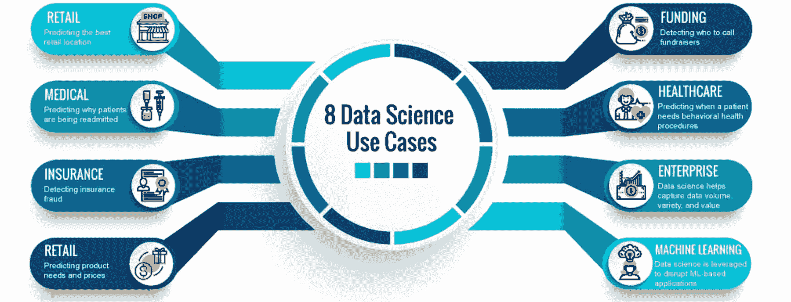
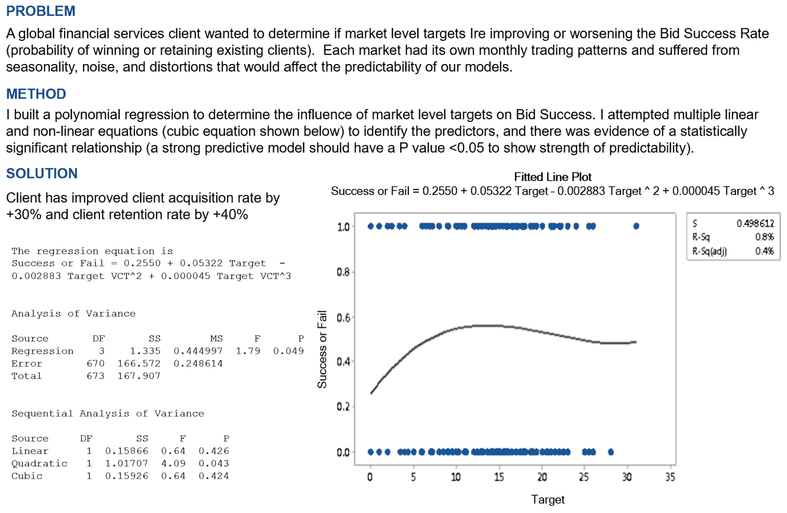
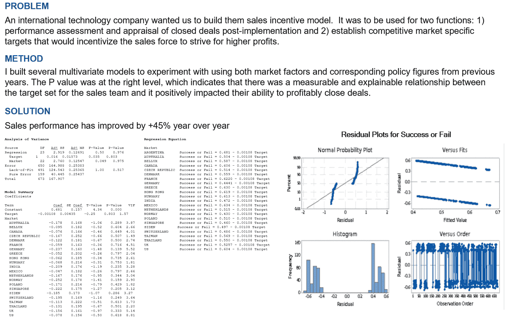

# 学习数据科学和商业分析以推动创新和增长

> 原文：[`www.kdnuggets.com/2023/08/learn-data-science-business-analytics-drive-innovation-growth.html`](https://www.kdnuggets.com/2023/08/learn-data-science-business-analytics-drive-innovation-growth.html)

你想知道任何企业如何能够长期生存吗？答案很简单——那就是增长。公司的增长对业务表现和利润至关重要。它还促进资产获取、投资融资和人才吸引。

* * *

## 我们的三大课程推荐

 1\. [谷歌网络安全证书](https://www.kdnuggets.com/google-cybersecurity) - 快速进入网络安全职业的快车道。

 2\. [谷歌数据分析专业证书](https://www.kdnuggets.com/google-data-analytics) - 提升你的数据分析技能

 3\. [谷歌 IT 支持专业证书](https://www.kdnuggets.com/google-itsupport) - 支持你的组织的 IT

* * *

商业分析和数据科学对推动创新和业务增长至关重要。数据科学可以被企业利用来缓解不利趋势。例如，零售和金融服务公司可以利用数据科学来应对如破产、裁员或即将关闭等挑战。通过应用数据驱动的洞察和分析，这些公司可以做出明智的决策，并采取主动措施来解决这些问题。

此外，数据可以引导你的公司走向成功，你只需正确使用它。换句话说，数据是你业务分析的基础，以及你可以用它做的事情。为了启动你的业务并装备自己，以在竞争激烈的环境中脱颖而出，探索像 Great Learning 提供的[最佳数据科学课程](https://www.mygreatlearning.com/data-science/courses)可能会带来终极变化。这些课程提供了全面和实践的数据分析、机器学习和人工智能培训，使你具备利用数据驱动洞察力的专业知识。

此外，在今天快速发展的商业环境中，投资于持续学习和技能提升变得至关重要。其他一些在线平台和教育机构也提供有价值的课程和资源，旨在提升业务增长和数据驱动决策。例如，[Coursera](https://www.coursera.org/)提供了来自知名大学和行业专家的各种数据科学和商业分析课程，使学习者能够跟上前沿的方法论。

此外，对于寻求更专业技能的从业人员，像[Udacity](https://www.udacity.com/)这样的平台提供数据科学、人工智能和高级分析的纳米学位项目。这些纳米学位项目提供基于项目的学习、指导和行业聚焦的课程，帮助个人获得实践经验并将其知识应用于现实世界的业务挑战。

# 什么是数据科学和商业分析？

使用机器学习算法，数据科学为你的业务增长创建预测模型。这些用于分析的信息对于你的业务非常关键。而且，这些信息来自广泛的来源。

商业界非常喜欢数据科学。他们将其与分析结合使用，以理解消费者行为并支持即时决策。

在商业分析中，数据分析、统计模型和其他定量技术被用于推动业务增长。

用于分析的信息用于决策制定。成功的商业分析依赖于高质量数据、对行业和相关技术有深入了解的能力强的分析师，以及坚定的承诺利用数据揭示有价值的洞察，以指导战略业务决策。

# 数据科学和商业分析的用途

数据科学允许从看似无序或无关的数据中提取有意义的洞察和预测。另一方面，商业分析使得分析所有可用的数据成为可能。通过利用商业分析，公司可以全面审视和解读他们的数据，获得宝贵的洞察，以推动明智的决策制定并优化业务流程。

科技公司收集的数据可以通过采用方法转化为有价值或盈利的信息。

数据科学也帮助了运输行业。使用自动驾驶车辆简化了减少碰撞次数的任务。

利用商业分析，你可以使用现代分析和统计方法揭示数据集中的隐藏模式。通过交互式仪表板和数据驱动的报告向利益相关者传达信息。根据新事实调整和维护决策。监控关键绩效指标（KPI），并迅速应对变化的模式。

如果你的公司希望实现一个或多个目标，分析就是一个好的选择。下一步是选择适合你公司需求的最佳商业分析解决方案。

让我们了解数据科学和商业分析在业务增长中的好处。

图片来源：[`blog.athenagt.com/wp-content/uploads/2018/09/Blog-info_1074698057-1.png`](https://blog.athenagt.com/wp-content/uploads/2018/09/Blog-info_1074698057-1.png)

## 考虑两个具有说服力的案例研究，这些研究反映了数据科学和商业分析对业务增长的影响。

+   在**案例研究 1**中，采用的策略是构建一个多项式回归模型，以确定市场水平目标对竞标成功的影响。通过使用线性和非线性方程，识别出显著影响赢得或保留现有客户概率的预测变量。这个模型证明了成功，因为它使客户获取率提高了 30%，客户保留率提高了 40%。

这种方法可以应用于各种行业或企业，调整因素和变量以满足具体需求。这意味着通过识别和正确利用关键市场指标或预测因素，企业可以显著提高其客户获取和保留率。

图片来源: https://www.baselismail.com/wp-content/uploads/2019/03/2019-03-05-16_12_23-Basel-Ismail-Case-Studies.pptx-PowerPoint-1536x1002.png

+   在**案例研究 2**中，创建了一个销售激励模型以提高销售业绩。这个模型是通过多变量模型构建的，输入包括市场因素和前几年对应的政策数据。研究发现，设定的销售团队目标与其盈利完成交易的能力之间存在正相关。这一模型使销售业绩实现了 45%的年增长。

该策略强调了适当地激励销售团队和设定具有竞争力的市场特定目标以提升销售业绩的重要性。通过正确理解激励结构与销售业绩之间的关系，公司可以更好地激励销售团队并优化销售结果。

图片来源: https://www.baselismail.com/wp-content/uploads/2019/03/2019-03-05-16_18_30-Basel-Ismail-Case-Studies.pptx-PowerPoint-1536x968.png

# 为什么选择数据科学和商业分析来服务业务？

数据科学在当前商业环境中的重要性已广为人知。这是因为企业必须基于数据做出决策，如果想要保持竞争力并继续扩展。由于它为公司提供了更有效使用数据的方法，近年来数据科学在商业领域越来越受到欢迎。今天，包括医院、银行和学院在内的企业都在利用数据科学来支持各种活动。

商业组织在不久的将来才会真正关注数据科学在商业中的重要性，因为数据几乎被应用于我们生活的每一个方面。如果他们成功了，他们有很大的机会在不失手的情况下击败竞争对手。因此，小型企业通过数据科学能够超越需要更多数据知识和经验的大型企业或更大规模的公司。

# 商业分析的好处

商业分析提供可操作的洞察。企业通过数据可视化对未来进行预测，这些见解支持未来的规划和决策。商业分析促进了增长并衡量了表现。了解了这些之后，现在是了解商业分析的时间，让我们看看它与商业智能的区别。

# 数据科学证书

要成为数据科学家，通常需要数据科学或计算机相关领域的学士学位，对于某些职位，可能还需要硕士学位。因此，在追求这一职业之前，验证所有的教育要求至关重要。

此外，各种认证，如项目模型认证、实习认证和资格证书等，对于提升你的资格和市场竞争力也很重要。如果你拥有其他学科的学位，你还可以在线攻读学位。你可以立即开始参加各种快速的在线数据科学课程。

# 商业分析证书

商业分析证书使你能够让雇主相信你具备使业务成功的技能。你可以说服他们你拥有推动战略决策以及收集和分析数据的必要技能。它赋予你作为商业分析师所需的能力，这些分析师利用数据来提升、扩展和优化企业流程。

# 数据科学能给你的业务带来什么？

智能策略始终是商业改善所需的。你可以通过以下方式在业务中使用数据科学：

+   **数据挖掘与分析：** 数据挖掘通过对大型数据集进行排序，揭示可以在数据分析中使用的模式和关系，以帮助解决商业问题。利用数据挖掘技术和方法，企业可以预测未来趋势，并做出更好的商业决策。

+   **最终决策选择：** 应从分析选项中挑选最佳和最有效的决策。企业的成功将取决于这一**终极**决策。

+   **信息管理：** 数据科学家通过实际选择有用数据，保持公司的数据银行准确和最新。公司在需要时使用这些数据银行。

# 商业分析和数据科学的范围

商业分析有许多不同的应用。对于那些希望在职业生涯中取得进步并获得良好薪水的人来说，商业分析在过去十年中已成为顶尖的就业选择之一。

对于拥有适当技能的人来说，印度广阔的数据科学领域提供了多个机会。通过正确的培训，企业可以从数据科学家的服务中受益，做出更好的决策，更好地了解消费者，并自动化任务。

# 结论

商业分析通过深入洞察帮助了许多企业实现增长。企业可以通过使用商业分析技术来个性化与客户的互动，这些技术可以通过[商业分析课程](https://www.mygreatlearning.com/pg-program-data-science-and-business-analytics-course)学习。它们甚至可以将客户反馈纳入开发更有利可图的产品中。在可预见的未来，数据将继续是任何公司运营不可或缺的部分。数据代表了可操作的知识，能显著影响公司成功与失败的差异。正如俗话所说，知识就是力量。

通过整合数据科学工具，企业现在可以利用数据的力量来预测未来增长，主动识别潜在问题，并制定有效的成功计划。拥抱数据驱动的方法使企业能够做出明智的决策，并在当今竞争激烈的环境中保持领先。

在可预见的未来，数据将继续是任何公司运营不可或缺的部分。数据代表了可操作的知识，能显著影响公司成功与失败的差异。正如俗话所说，知识就是力量。

**[Erika Balla](https://www.linkedin.com/in/erika-balla-56870a216/)** 是一位来自罗马尼亚的匈牙利内容写作专家，专注于 AI 和数据科学主题。她的目标是帮助企业简化复杂信息，让数据科学更广泛地为受众所用，凭借她在写作和先进技术知识方面的专长。

### 更多相关话题

+   [如何利用分析加速业务增长？](https://www.kdnuggets.com/2022/12/analytics-accelerate-business-growth.html)

+   [数据科学方法推动业务成功](https://www.kdnuggets.com/2023/10/nwu-data-science-methods-drive-business-success)

+   [如何更好地利用数据科学推动业务增长](https://www.kdnuggets.com/2022/08/better-leverage-data-science-business-growth.html)

+   [BigQuery 中的异常检测：揭示隐藏的洞察并推动行动](https://www.kdnuggets.com/anomaly-detection-in-bigquery-uncover-hidden-insights-and-drive-action)

+   [基于 LLM 的自主代理背后的增长](https://www.kdnuggets.com/the-growth-behind-llmbased-autonomous-agents)

+   [微软工程师的 AI 创新与领导力指南](https://www.kdnuggets.com/a-microsoft-engineer-guide-to-ai-innovation-and-leadership)
