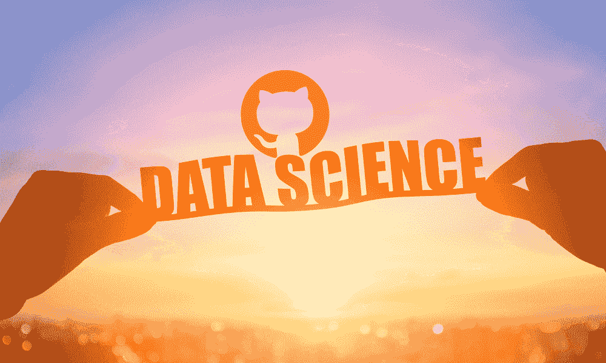

# 从这些 GitHub 仓库学习数据科学

> 原文：[`www.kdnuggets.com/2022/12/learn-data-science-github-repositories.html`](https://www.kdnuggets.com/2022/12/learn-data-science-github-repositories.html)

图片由编辑提供

如果你想开始数据科学的职业生涯，你可能会想知道应该选择哪条学习路径。你可能看到过数据科学的训练营、Udemy 课程、学位等。面对如此众多的选择，确实很难决定走哪条路。

* * *

## 我们的前三推荐课程

 1\. [Google 网络安全证书](https://www.kdnuggets.com/google-cybersecurity) - 快速进入网络安全职业生涯。

 2\. [Google 数据分析专业证书](https://www.kdnuggets.com/google-data-analytics) - 提升你的数据分析技能

 3\. [Google IT 支持专业证书](https://www.kdnuggets.com/google-itsupport) - 支持你的组织在 IT 方面

* * *

哪里学习比 GitHub 仓库更好呢？如果你不知道，GitHub 是一个用于版本控制和协作的代码托管平台。谁使用 GitHub？你会看到个体专业人士、公司、大学和训练营学生、教师等使用这个平台进行协作和代码跟踪。

虽然 GitHub 不是唯一的平台，但由于以下原因，它非常受欢迎：易于使用，支持公共和私人仓库，并且对于小规模项目是免费的。GitHub 还有一个[社区](https://github.com/community)，帮助支持所有在 GitHub 上的用户解答问题、解决问题以及他们的整体学习之旅。多年来，人们对 GitHub 的看法各异，有些人主要将其视为协作工具，而其他人则将其视为学习门户或获取灵感的地方。

现在我们对 GitHub 有了一些了解，接下来看看你如何通过 GitHub 仓库学习数据科学。

# freeCodeCamp

**仓库链接**：[freeCodeCamp](https://github.com/freeCodeCamp/freeCodeCamp)

如果你对学习数据科学的资源做过一些研究，你可能会遇到 freeCodeCamp。他们的资源非常受欢迎，最大吸引力是它们是免费的。凭借有[358k](https://github.com/freeCodeCamp/freeCodeCamp/stargazers)人关注这个仓库，你肯定需要成为这群人中的一员。

你还可以在以下课程中获得认证：

1.  [响应式网页设计认证](https://www.freecodecamp.org/learn/2022/responsive-web-design/)

1.  [JavaScript 算法与数据结构认证](https://www.freecodecamp.org/learn/javascript-algorithms-and-data-structures/)

1.  [前端库认证](https://www.freecodecamp.org/learn/front-end-development-libraries/)

1.  [数据可视化认证](https://www.freecodecamp.org/learn/data-visualization/)

1.  [API 和微服务认证](https://www.freecodecamp.org/learn/back-end-development-and-apis/)

1.  [质量保证认证](https://www.freecodecamp.org/learn/quality-assurance/)

1.  [Python 科学计算认证](https://www.freecodecamp.org/learn/scientific-computing-with-python/)

1.  [Python 数据分析认证](https://www.freecodecamp.org/learn/data-analysis-with-python/)

1.  [信息安全认证](https://www.freecodecamp.org/learn/information-security/)

1.  [Python 机器学习认证](https://www.freecodecamp.org/learn/machine-learning-with-python/)

# 数据科学入门

**资源库链接：** [数据科学入门](https://github.com/microsoft/Data-Science-For-Beginners)

这是我遇到的最好的 GitHub 仓库之一！这个由微软 Azure 云倡导者提供的仓库提供了一个为期 10 周、20 节课的课程，帮助你进入数据科学领域。课程包括一个前导课程，之后是一个课后测验，写有完成课程的说明、解决方案和作业。

这个课程涵盖了数据科学的基础，旨在帮助初学者。你将学习数据科学伦理、统计与概率介绍、关系可视化等方面的内容。

# 开源数据科学硕士课程

**资源库链接：** [开源数据科学硕士课程](https://github.com/datasciencemasters/go%5C)

这个 GitHub 仓库为你提供了一个课程大纲以及相关资源。大多数资源来自大学和在职数据科学家，专注于数据科学的理论以及实际应用技能。

许多资源是免费的，唯一的费用是如果你选择购买推荐的书籍。当你完成课程后，你将被鼓励选择一个项目或数据集来展示你所学到的知识。他们还提供了一份课外学习材料清单，可以提高你的知识基础和技能。

# 免费数据科学书籍

**资源库链接：** [免费数据科学书籍](https://github.com/chaconnewu/free-data-science-books)

如果你是一个书迷，学习的最佳方式是翻阅书页——这个 GitHub 仓库将拯救你。它不仅提供了一个按照课程安排的书单，而且是免费的！

这些书籍将标注其难度级别，包括初学者、中级或高级。涵盖的主题包括数据科学介绍、数据处理、数据分析、数据科学应用、数据可视化、未分类和关于数据科学的 MOOCs。

# 数据科学课程

**资源库链接：** [数据科学课程](https://github.com/ossu/data-science)

当你开始你的数据科学之路时，可能很难知道从哪里开始。这是我曾经面临的问题，也是很多我认识的人所遇到的问题。遵循课程可以帮助你有效管理时间，确保涵盖所有数据科学方面，并识别你的弱点，以便加以改进。

这个由开源社会大学提供的数据科学课程清单，列出了成为数据科学家所需的课程。虽然它们可能没有免费的材料，但拥有一个学习计划会让你的生活变得更加轻松。

# 超棒的数据科学

**资源链接：** [超棒的数据科学](https://github.com/academic/awesome-datascience)

类似于课程，这个超棒的数据科学 GitHub 涵盖了数据科学的各个方面。如果你需要了解成为数据科学家所需的主题，但又希望自己进行研究，那么这个 GitHub 仓库就是为你准备的。它是数据科学的工具箱。

它为你提供了有关数据科学的所有必要书籍、博客文章、网页等信息。它们还提供了关于免费课程、密集课程和可以启动你数据科学职业生涯的学院的更多信息。

# 数据科学全能备忘单

**资源链接：** [数据科学全能备忘单](https://github.com/yash42828/Data-Science--All-Cheat-Sheet)

备忘单是学习新知识的好方法。它们提供了基本信息，并允许你进一步研究。拥有者将这些备忘单汇集在一起，旨在帮助学生获得提供清晰内容的全面资料。

你可以找到广泛的领域提供备忘单，如统计学、Matlab、机器学习、数据仓库、深度学习等。

# 最佳的 ML 与 Python

**资源链接：** [最佳的 ML 与 Python](https://github.com/ml-tooling/best-of-ml-python)

成为成功的数据科学家的关键方面是确保你能应用你的技能，而唯一的方式就是通过做项目。招聘者希望看到你的代码、你的思路过程以及你如何得出最终结果。

这个最佳的 ML 与 Python GitHub 仓库提供了 910 个开源项目，分为 34 个类别。这些项目根据项目质量评分进行排名，因此你可以看到哪些项目受欢迎，并了解项目的描述。你可以找到数据加载与提取、模型解释性、医学数据等类别。

# 数据科学面试资源 - 面试问题

**资源链接：** [数据科学面试资源](https://github.com/rbhatia46/Data-Science-Interview-Resources)

一旦你掌握了作为数据科学家所需的所有知识并将其应用于项目中，下一步就是申请工作并为面试做好准备。这是最棘手的部分——但这就是你一直等待的时刻。

在数据科学面试中你将被问到的硬技能问题通常会分为两个类别：理论和技术。这些 GitHub 仓库涵盖了这两方面内容，并帮助你测试自己的知识，以便为面试做好准备。它们还提供了有关如何构建简历/CV 的技巧，这是赢得招聘官青睐的重要方面。

# 总结

学习数据科学不会容易，但在当今这个资源丰富的时代，它绝对是可以实现的。如果你知道其他能帮助他人的优秀 GitHub 仓库，请在下方评论中分享。

**[Nisha Arya](https://www.linkedin.com/in/nisha-arya-ahmed/)** 是一名数据科学家和自由撰稿人。她特别关注提供数据科学职业建议或教程以及数据科学的理论知识。她还希望探索人工智能如何能够/将如何促进人类生命的长久。作为一个热衷的学习者，她寻求拓宽技术知识和写作技能，同时帮助指导他人。

### 更多相关主题

+   [从这些 GitHub 仓库学习数据工程](https://www.kdnuggets.com/2023/02/learn-data-engineering-github-repositories.html)

+   [从这些 GitHub 仓库学习机器学习](https://www.kdnuggets.com/2023/01/learn-machine-learning-github-repositories.html)

+   [从这些 GitHub 仓库学习 MLOps](https://www.kdnuggets.com/2023/02/learn-mlops-github-repositories.html)

+   [掌握数据科学的 10 个 GitHub 仓库](https://www.kdnuggets.com/10-github-repositories-to-master-data-science)

+   [掌握计算机科学的 10 个 GitHub 仓库](https://www.kdnuggets.com/10-github-repositories-to-master-computer-science)

+   [掌握数据工程的 10 个 GitHub 仓库](https://www.kdnuggets.com/10-github-repositories-to-master-data-engineering)
