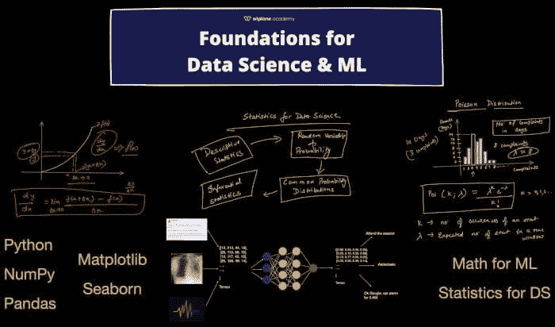
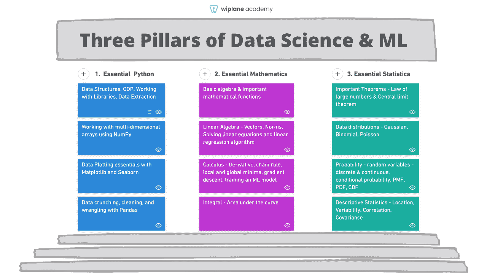
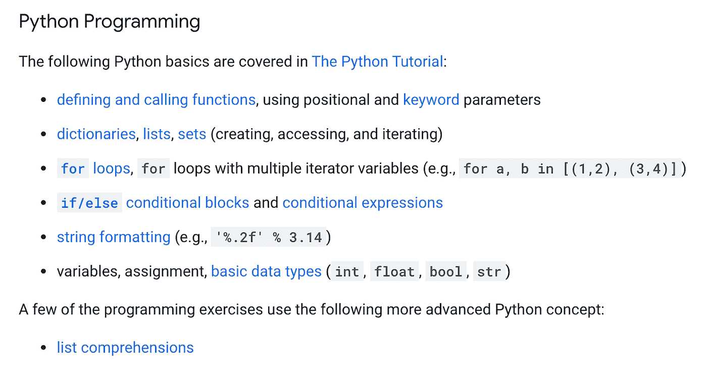
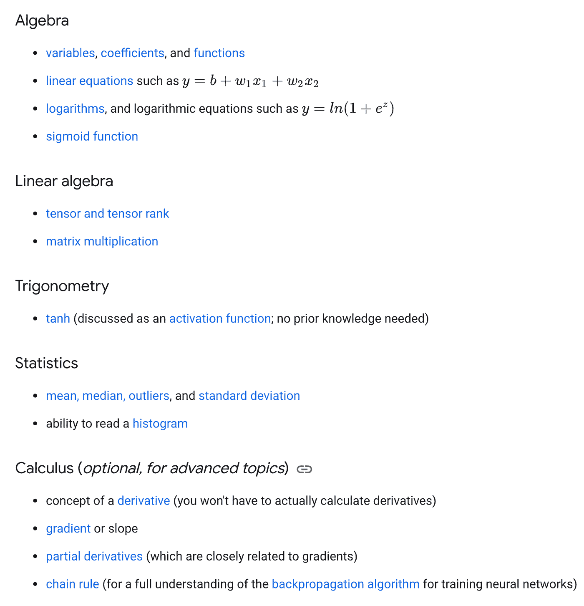
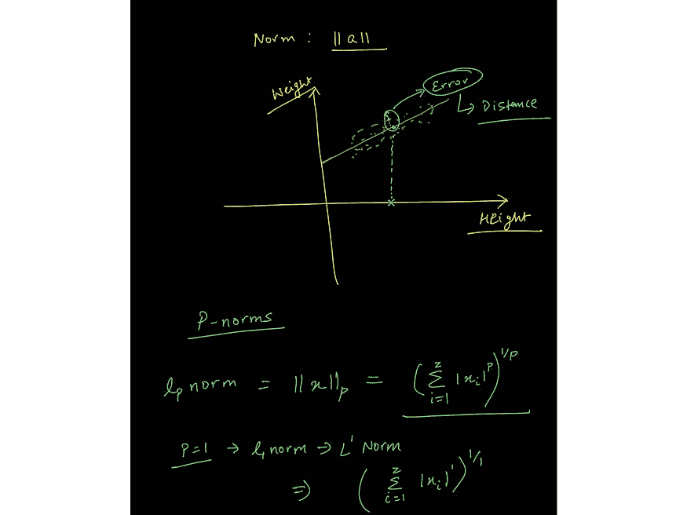
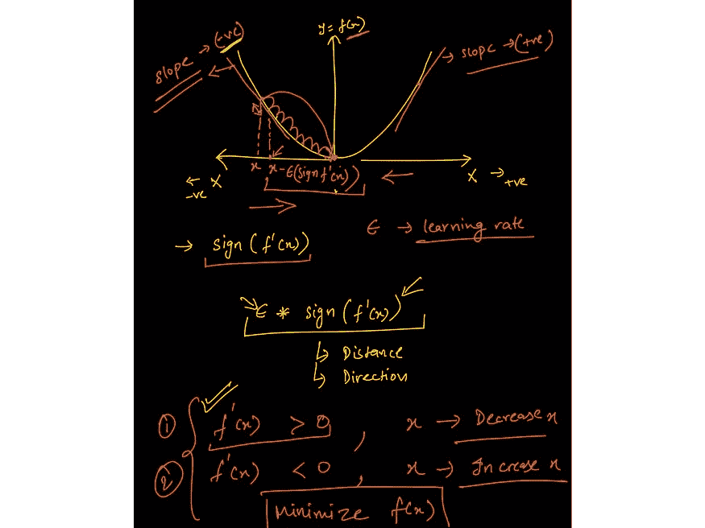
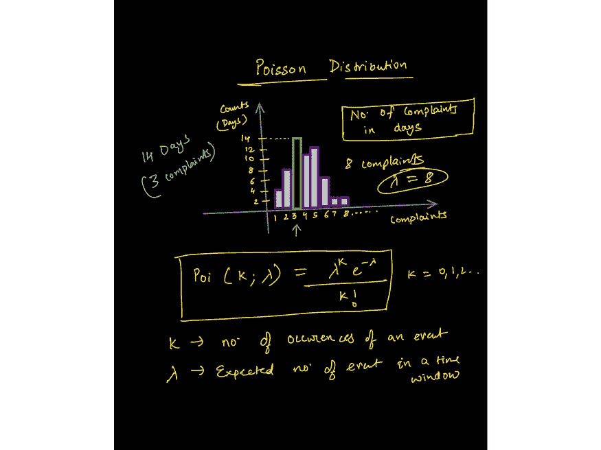
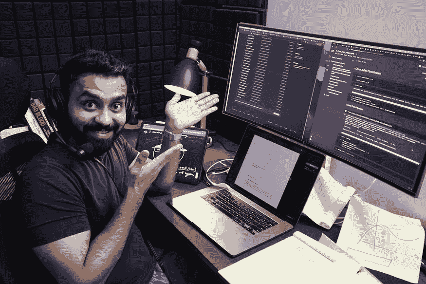

# 数据科学和机器学习的学习：路线图后的第一步

> 原文：[`www.kdnuggets.com/2021/08/learn-data-science-machine-learning.html`](https://www.kdnuggets.com/2021/08/learn-data-science-machine-learning.html)

评论

*来源: [`www.wiplane.com/p/foundations-for-data-science-ml`](https://www.wiplane.com/p/foundations-for-data-science-ml)*

* * *

## 我们的三大课程推荐

 1\. [谷歌网络安全证书](https://www.kdnuggets.com/google-cybersecurity) - 快速进入网络安全职业道路

 2\. [谷歌数据分析专业证书](https://www.kdnuggets.com/google-data-analytics) - 提升你的数据分析技能

 3\. [谷歌 IT 支持专业证书](https://www.kdnuggets.com/google-itsupport) - 支持你的组织的 IT 需求

* * *

在今年年初，我发布了一份关于[数据科学学习路线图（见下文）](https://www.kdnuggets.com/2021/02/data-science-learning-roadmap-2021.html)的思维导图。这份路线图得到了广泛认可，文章被翻译成了多种语言，许多人感谢我发布了这份图谱。

一切都很好，直到一些有抱负的学员指出，资源太多且许多资源很贵。Python 编程是唯一一个有许多非常好的课程的领域，但对于初学者来说，它仅止步于此。

一些关于基础数据科学的重要问题让我深思：

+   学会编程后应该做什么？是否有帮助你巩固数据科学基础的主题？

+   我讨厌数学，但有些教程要么非常基础，要么对我来说过于深入。你能推荐一个紧凑而全面的数学和统计学课程吗？

+   学习机器学习算法需要多少数学基础才够？

+   开始数据分析或数据科学时，有哪些关键的统计学主题？

很多这些问题的答案可以在[《深度学习》](https://www.deeplearningbook.org/)一书中找到，作者是 Ian Goodfellow 和 Yoshua Bengio。然而，对于许多人来说，这本书有点过于技术化和数学化。

这篇文章的精髓就是，学习数据科学或机器学习的第一步。

## 数据科学与机器学习的三大支柱

*来源: [`wiplane.com`](https://www.wiplane.com/p/foundations-for-data-science-ml)*

如果你查看任何机器学习/数据科学课程的前提条件或预习内容，你会发现它们通常结合了编程、数学和统计学。

先暂时不谈其他内容，这里是[谷歌推荐](https://developers.google.com/machine-learning/crash-course/prereqs-and-prework)的你在学习机器学习课程之前应该做的事：

*[`developers.google.com/machine-learning/crash-course/prereqs-and-prework`](https://developers.google.com/machine-learning/crash-course/prereqs-and-prework) (CC BY 4.0)*

### 1\. 基本编程

大多数数据职位都是以编程为基础的，除了像商业智能、市场分析、产品分析师等少数职位。

我将专注于那些需要至少掌握一种编程语言的技术数据工作。我个人更喜欢 Python，因为它的多功能性和易学性——无疑是开发端到端项目的好选择。

**必须掌握的数据科学主题/库的一瞥：**

+   常见的数据结构（数据类型、列表、字典、集合、元组）、编写函数、逻辑、控制流、搜索和排序算法、面向对象编程以及使用外部库。

+   编写 Python 脚本以提取、格式化和存储数据到文件或回到数据库。

+   使用 NumPy 处理多维数组、索引、切片、转置、广播和伪随机数生成。

+   使用科学计算库如 NumPy 执行矢量化操作。

+   使用 Pandas 操作数据——系列、数据框、数据框中的索引、比较操作符、合并数据框、映射和应用函数。

+   使用 Pandas 处理数据——检查空值、填补空值、分组数据、描述数据、进行探索性分析等。

+   使用 Matplotlib 进行数据可视化——API 层次结构、向图形添加样式、颜色和标记、了解各种图形及其使用时机、折线图、条形图、散点图、直方图、箱线图，以及 seaborn 进行更高级的绘图。

### 2\. 基本数学

有[实际原因说明数学为何重要](https://towardsdatascience.com/practical-reasons-to-learn-mathematics-for-data-science-1f6caec161ea) 对于那些想要从事机器学习实践者、数据科学家或深度学习工程师职业的人来说。

**#1 线性代数用于表示数据**

*来自课程中关于向量范数的讲座的图像： [`www.wiplane.com/p/foundations-for-data-science-ml`](https://www.wiplane.com/p/foundations-for-data-science-ml)*

机器学习本质上是数据驱动的，因为数据是机器学习的核心。我们可以将数据视为**向量——**一个遵循算术规则的对象。这使我们能够理解线性代数的规则如何作用于数据数组。

**#2 微积分用于训练机器学习模型**

*来自课程中关于梯度下降的讲座的图像： [`www.wiplane.com/p/foundations-for-data-science-ml`](https://www.wiplane.com/p/foundations-for-data-science-ml)*

如果你以为模型训练是“自动进行”的，那么你就错了。微积分是推动大多数机器学习（ML）和深度学习（DL）算法学习的核心。

最常用的优化算法之一——**梯度下降法**——是偏导数的应用。

模型是某些信念和假设的数学表示。它被认为是学习（近似）数据提供过程（线性、多项式等）的过程，然后基于这个学习到的过程进行预测。

**重要主题包括：**

+   基础代数 — 变量、系数、方程式以及线性、指数、对数函数等。

+   线性代数 — 标量、向量、张量、范数（L1 和 L2）、点积、矩阵类型、线性变换、矩阵表示线性方程、利用向量和矩阵解决线性回归问题。

+   微积分 — 导数和极限、导数规则、链式法则（用于反向传播算法）、偏导数（计算梯度）、函数的凸性、局部/全局极小值、回归模型背后的数学、从头开始训练模型的应用数学。

**#3 基本统计学**

现在的每个组织都在努力实现数据驱动。为了实现这一目标，分析师和科学家需要以不同的方式利用数据，以推动决策制定。

*描述数据 — 从数据到洞察*

数据总是原始且难看。初步探索告诉你缺少什么，数据如何分布，以及清理数据以实现最终目标的最佳方式是什么。

为了回答定义的问题，描述统计使你能够将数据中的每一个观察转化为有意义的洞察。

*量化不确定性*

此外，量化不确定性的能力是任何数据公司高度重视的最有价值的技能。了解任何实验/决策的成功几率对所有业务至关重要。

这里是一些统计学的主要基础，构成了最低要求：

*来自关于泊松分布讲座的图像 — [`www.wiplane.com/p/foundations-for-data-science-ml`](https://www.wiplane.com/p/foundations-for-data-science-ml)*

+   位置的估计 — 均值、中位数以及这些的其他变体。

+   变异性的估计

+   相关性和协方差

+   随机变量 — 离散和连续

+   数据分布 — PMF、PDF、CDF

+   条件概率 — 贝叶斯统计

+   常用的统计分布 — 高斯分布、二项分布、泊松分布、指数分布

+   重要定理 — 大数法则和中心极限定理。

*来自关于泊松分布讲座的图像 — [`www.wiplane.com/p/foundations-for-data-science-ml`](https://www.wiplane.com/p/foundations-for-data-science-ml)*

+   推断统计 **—** 一种更实际和高级的统计学分支，有助于设计假设检验实验，推动我们深入理解指标的含义，同时帮助我们量化结果的显著性。

+   重要的测试 **—** 学生 t 检验、卡方检验、ANOVA 检验等。

> **每个初学者级别的数据科学爱好者在深入任何核心数据科学或核心机器学习课程之前都应关注这三个支柱**

## 学习上述内容的资源 — 寻找一个紧凑、全面且价格实惠的课程

*[`www.freecodecamp.org/news/data-science-learning-roadmap/`](https://www.freecodecamp.org/news/data-science-learning-roadmap/)*

[我的学习路线图](https://www.kdnuggets.com/2021/02/data-science-learning-roadmap-2021.html)也告诉你该学习什么，并且也充满了可以注册的资源、课程和项目。

但推荐的资源和我制定的路线图中存在一些不一致之处。

### 数据科学或机器学习课程的问题

1.  我在这里列出的每个数据科学课程都要求学生对编程、数学或统计学有一定的理解。例如，[Andrew Ng 最著名的机器学习课程](https://www.youtube.com/watch?v=PPLop4L2eGk&list=PLLssT5z_DsK-h9vYZkQkYNWcItqhlRJLN)也严重依赖于对向量代数和微积分的理解。

1.  大多数涵盖数据科学的数学和统计学的课程，只是列出所需的概念清单，却没有解释这些概念如何应用及如何在机器中编程。

1.  有很多优秀的资源可以深入学习数学，但大多数人并不适合，而且学习数据科学并不需要成为金牌得主。

> **底线：**  缺乏一种只涵盖足够应用数学、统计学或编程基础以便入门数据科学或机器学习的资源。

### Wiplane Academy — wiplane.com

所以，我决定自己动手做所有的事情。我花了过去 3 个月的时间开发一个课程，以为你的职业生涯奠定坚实的基础……

+   数据分析师

+   数据科学家

+   或者一位机器学习从业者/工程师

在这里，我向你展示 [**数据科学或机器学习的基础**](https://www.wiplane.com/p/foundations-for-data-science-ml)** — **[**学习数据科学和机器学习的第一步**](https://www.wiplane.com/p/foundations-for-data-science-ml)

*这就是我决定启动时的样子！*

一个全面但紧凑且价格实惠的课程，不仅涵盖**所有的基本要素、前提条件和预备工作**，还解释了每个概念如何**在计算和编程中（Python）**使用。

而且这还不是全部。我会根据你的反馈每月更新课程内容。了解更多 [这里](https://www.wiplane.com/p/foundations-for-data-science-ml)。

***早鸟优惠！***

我很兴奋地宣布这门课程的预售，因为我目前正在录制和编辑 2-3 个模块的最终部分，这些模块也将在九月的第一周上线。

抓住早鸟优惠，优惠仅有效至 2021 年 8 月 30 日。

[原文](https://towardsdatascience.com/first-steps-to-learning-data-science-or-ml-after-the-roadmap-50d4b46b93e9)。经许可转载。

**简介：** [Harshit Tyagi](https://www.linkedin.com/in/tyagiharshit/) 是一位具有融合经验的工程师，擅长网页技术和数据科学（即全栈数据科学），曾指导过 1000 多名 AI/Web/数据科学志愿者，同时设计数据科学和机器学习工程学习路径。此前，Harshit 与耶鲁大学、麻省理工学院和加州大学洛杉矶分校的研究科学家一起开发数据处理算法。

**相关：**

+   [自然语言处理（NLP）的路线图](https://www.kdnuggets.com/2020/10/roadmap-natural-language-processing-nlp.html)

+   [成为全栈 AI 开发者、数据科学家、机器学习工程师等的路线图](https://www.kdnuggets.com/2020/12/roadmaps-ai-developer-data-scientist-machine-learning-engineer.html)

+   [专业人员的数据科学课程](https://www.kdnuggets.com/2021/03/data-science-curriculum-professionals.html)

### 更多相关主题

+   [停止学习数据科学以寻找目标，并通过寻找目标来…](https://www.kdnuggets.com/2021/12/stop-learning-data-science-find-purpose.html)

+   [学习数据科学统计学的顶级资源](https://www.kdnuggets.com/2021/12/springboard-top-resources-learn-data-science-statistics.html)

+   [成功的数据科学家的 5 个特征](https://www.kdnuggets.com/2021/12/5-characteristics-successful-data-scientist.html)

+   [每位数据科学家都应该知道的三个 R 库（即使你使用 Python）](https://www.kdnuggets.com/2021/12/three-r-libraries-every-data-scientist-know-even-python.html)

+   [一笔 90 亿美元的 AI 失败，解析](https://www.kdnuggets.com/2021/12/9b-ai-failure-examined.html)

+   [是什么让 Python 成为初创公司的理想编程语言](https://www.kdnuggets.com/2021/12/makes-python-ideal-programming-language-startups.html)
